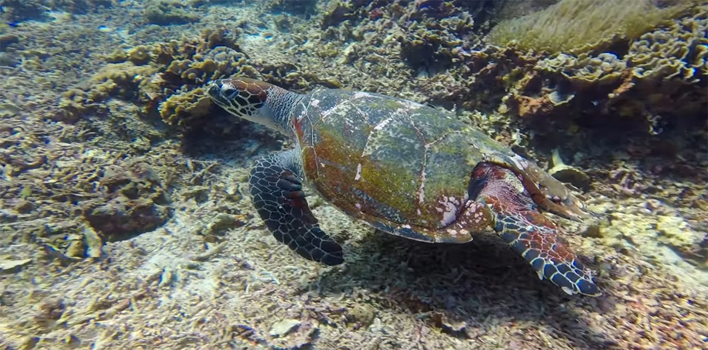

Suoritin ensimmäisen laitesukelluskurssin vuonna 2007. Sen jälkeen mielessä on pyörinyt toistuvasti ajatus Divemaster-kurssin suorittamisesta. Ongelmaksi on aina osoittautunut kurssin vaatima aika, mutta viime vuonna päätin selättää tämän haasteen.

<!--more-->

Laitesukelluksesta tietämätön saattaa tässä kohtaa kysyä: *"Mikä ihmeen Divemaster-kurssi?"*

Divemaster on laitesukelluksen ensimmäinen taso, joka mahdollistaa ammattimaisen sukeltamisen. Divemasterit toimivat sukelluskerhoilla sukellusoppaina sekä kurssien apukouluttajina. Käytännössä kaikki sukelluskerhot tarvitsevat henkilökuntaansa divemastereita juuri näistä syistä.

Minulla on jo ammatti ja vakaa työ, joten teen Divemaster-kurssin lähinnä omaksi iloksi ja parantaakseni taitojani. Kurssi mahdollistaa kuitenkin sen, että jos joku päivä kyllästyn ohjelmointihommiin, niin voin vaihtaa maisemaa ja toimia sukellusoppaana jossain ihan toisessa maassa. B-suunnitelma on aina hyvä olla olemassa.

Suoritan kurssin [Nusa Lembonganilla](https://www.openstreetmap.org/#map=15/-8.6793/115.4546), yhdestä Indonesian lukemattomista pikkusaarista. Paikka ja sukelluskerho ovat minulle tuttuja aikaisemmilta seikkailuilta. Kurssi kestää yleensä noin neljä viikkoa, mutta koska vastoinkäymiset ja sairastelut ovat aina mahdollisia, varasin reissuun kuusi viikkoa.

Viime kesän käytin teorioiden opiskeluun. Käytännössä teoriaopinnot olisi voinut tehdä myös kurssin aikana, mutta en halua tuhlata siellä aikaa teoriamateriaalien pänttäämiseen. Nykyään teorioiden tekeminen etukäteen onnistuukin helposti, koska kaiken voi tehdä netissä. Teorioiden lisäksi minun oli uusittava ensiapukortti ja käytävä lääkärintarkastuksessa.

Kurssin sisältö muistuttaa työharjoittelua. Siihen liittyy luonnollisesti myös harjoituksia ja testejä, mutta iso osa ajasta ollaan apuna kursseilla, veneellä ja sukelluksilla. Divemasterin rooli on hyvin sosiaalinen ja siihen liittyy paljon kanssakäymistä muiden sukeltajien kanssa. Tämä onkin se juttu, joka minua jännittää eniten. Toivottavasti introvertin akkua ei imetä tyhjiin, heh.

Lento Indonesiaan lähtee 3.1.2024 eli huomenna. Sen jälkeen seuraavat kuusi viikkoa arki koostuu merestä, koralliriutoista, hiekkarannoista sekä paistetuista nuudeleista. Innostusta rokottaa ainoastaan tieto siitä, että tämä reissu tuhoaa suoraan mahdollisuuteni pitää hiilijalanjälkini pienenä. Tiedon kanssa on nyt vaan elettävä ja pyrittävä parempaan jatkossa. Vaikka luulen, että lentomatkustamista tulee tehtyä varmasti välillä myös tulevaisuudessa, suunnitelmissa on korvata osa siitä uudenlaisilla seikkailuilla. Mutta se on kokonaan oma tarinansa, jonka kerron tulevaisuudessa.