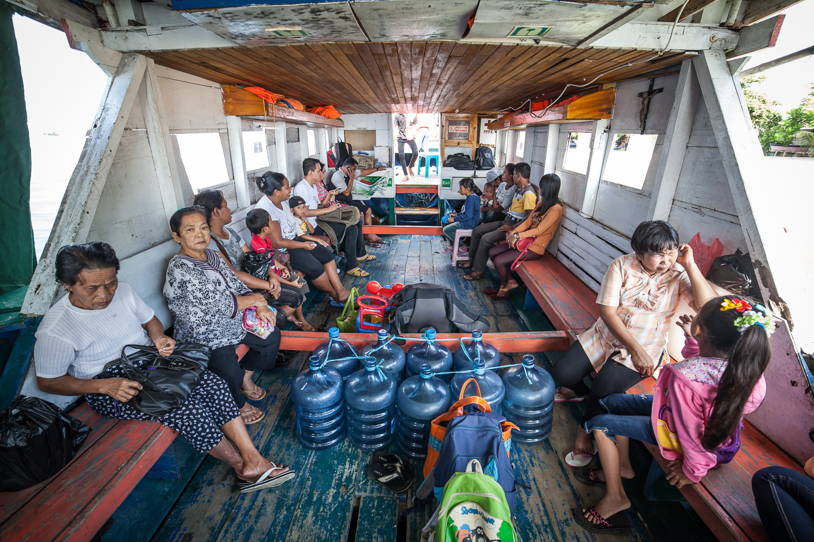
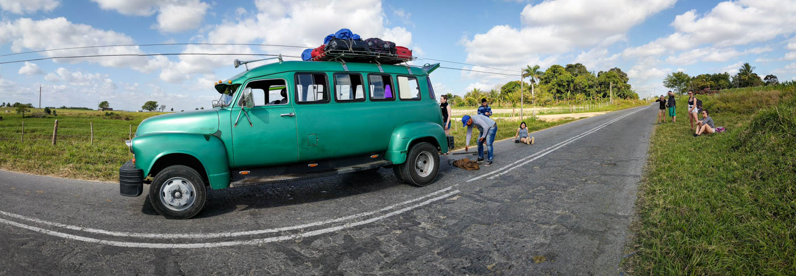

Monille matkustaminen ja lomailu on sitä, että paetaan raskasta arkea tai ankeaa työtä johonkin helppoon ympäristöön. Lomalla öllötetään resortissa tai hiekkarannalla kaksi viikkoa ja palataan takaisin arkeen enemmän tai vähemmän levänneenä. Tässä ei ole tietenkään mitään vikaa, jos se palvelee tarkoitustaan. Tällainen matkailu ei kuitenkaan ole ihan sitä, jota itse kaipaan. Kaipaan seikkailua.

<!--more-->

Tämä seikkailun tarve avautui minulle taannoin terapiassa. Juteltiin terapeutin kanssa huonoista hetkistä, jossa minulla on ollut hyvä olla. Juteltiin myös siitä, että mitä kaikkea kuuluu niihin perustarpeisiin, joiden päälle oma hyvinvointi rakentuu. Muistelin niitä hetkiä kun bussi on ollut myöhässä useita tuntia ja lopulta jättänyt minut 20 km päähän määränpäästä täysin minulle vieraaseen paikkaan keskellä yötä. Terapeutti kysyi, että mitä minä tuollaisissa tilanteissa yleensä teen. Vastasin, että pistän rinkan maahan ja istun perseelleni.

Mitä enemmän asiasta juteltiin, sitä selvemmäksi kävi, että pienet haasteet, riskit, yllätykset ja vastoinkäymiset ovat minulle voima, jolla on uskomattoman energisoiva ja eheyttävä vaikutus. Se on jotain sellaista, jota on hirvittävän vaikea kokea tutussa kotiympäristössä ja rutiinien täyttämässä arjessa.

Vaikka pohdinnat terapeutin kanssa konkretisoivatkin tuon ajatuksen, luulen tiedostaneeni sen alitajuntaisesti jo monta vuotta sitten. Heti ensimmäinen itse tehty matkani oli 1,5 kuukautta kestävä reppureissu ja sen jälkeen olen aina kaivannut näiden seikkailujen fiilistä ja sitä tunnetta, joka niiden jälkeen on. Vaikka etenkin pitkät reissut voivat olla yllättävän raskaita, sitä tuntee silti itsensä energiseksi niiden jälkeen. Kotiin on kiva palata - jos nyt ei levänneenä niin ainakin ladattuna. Jostain syystä olen aina kaivannut tällaisiin reissuihin enkä altaan reunalle makoilemaan.

Itselleni seikkailujen ytimessä ovat suunnitelmien puute ja paikkojen vaihtaminen. Usein minulla on jokin epämääräinen runko mietittynä ja mahdollisesti majapaikka pariksi ensimmäiseksi yöksi, mutta muuten reissu toteutuu lähinnä tien päällä tehtävien valintojen pohjalta. Siinä on vaan jotain ainutlaatuista, kun oppii uusista mielenkiintoisista paikoista paikallisilta ja voit mennä niihin rikkomatta suunnitelmiasi. Löytämisen riemu on vahvasti läsnä.

Suunnitelmien puuttuminen johtaa joskus yllättäviin tilanteisiin ja vastoinkäymisiin. Niistä syntyvät yleensä parhaat muistot ja tarinat. Haasteita on mukava ratkoa ja ne tekevät seikkailuista jännittäviä. Tämän kaiken on tietenkin tapahduttava turvallisesti. En voisi kuvitellakaan meneväni sota-alueelle sekoilemaan ihan vaan vastoinkäymisten toivossa. Kyse on enemmän turvallisesta pulaan joutumisesta.

Oma introvertti persoonallisuuteni tarjoaa ihan omanlaisia haasteita seikkailuissa. Ihmisten kanssa asioiminen on yllättävän kuormittavaa ja matkoilla sitä päätyy ja joutuu höpisemään paikallisten ja muiden matkaajien kanssa yllättävän paljon. Olen vuosia matkustanut yksin, joten onneksi minulla on ollut myös paljon omaa aikaa. Osittain tästä kuormittavuudesta johtuen luontokohteet vetävät minua puoleensa. Luonnossa on rauhallista ja siellä on helppo toimia olematta jatkuvasti kanssakäymisissä muiden ihmisten kanssa.

Viime vuosina olen matkustanut enemmän puolisoni kanssa ja vaikka joihinkin matkoihin liittyy pieni määrä seikkailua, hän on henkilö joka haluaa asioihin suunnitelmallisuutta ja varmuutta. Vaikka välillä onkin ihan kiva vaan perinteisesti lomailla, kaipaan sitä fiilistä, kun saa hypätä kunnolla tuntemattomaan. Tähän mennessä omat seikkailuni ovat suuntautuneet kaukomaihin, mutta lentomatkailun muuttuessa yhä ikävämmäksi ilmastoteoksi, sitä on joutunut miettimään asioita uudesta näkökulmasta.

Sen sijaan, että seikkailu syntyisi täysin itselle vieraasta kielestä, kulttuurista ja ympäristöstä, ehkä se voisikin syntyä vieraasta tavasta liikkua hyvin vähäisellä varustuksella. Mielessä onkin pyörinyt jonkinlainen maata pitkin tehtävä junareissu ympäri Eurooppaa. Olen nähnyt mannerta yllättävän vähän eikä junamatkailu siellä ole tuttua, joten se voisi olla juuri sellaista tuntematonta jota kaipaan. Rinkassa on usein kulkenut läjä elektroniikkaa ja kuvaustarvikkeita, mutta ehkä senkin voisi pudottaa ihan minimiin. Uusi haaste sekin.

Ehkä seikkailu ei lainkaan riippuvainen ulkoisista tekijöistä, vaikka juuri nyt se tuntuukin siltä. Ehkä seikkailu löytyykin sisältä?
