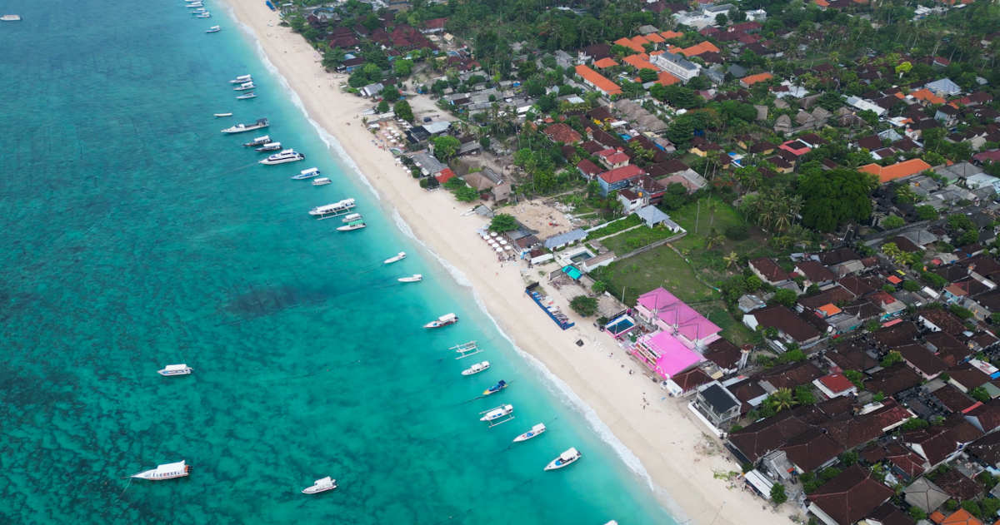
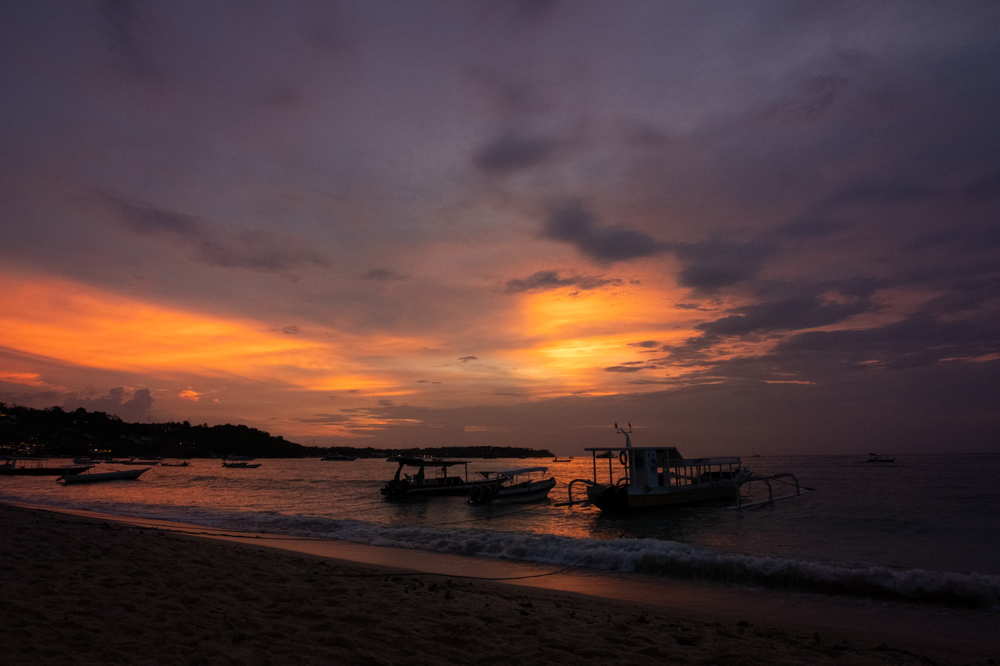

Melusaaste on siitä erikoinen saasteen muoto, että se vaikuttaa isoon osaan ihmisiä, lähes kaikki haluaisivat elää ilman sitä, mutta harva asettuu sitä vastaan - etenkään jos voi itse hyötyä meluamisen tuloksista. Jostain syystä melusaaste normalisoidaan todella nopeasti ja siihen koetetaan vaan tottua. Kuvitelkaa jos ilmansaasteisiin suhtauduttaisiin samalla tavalla. 

<!--more-->

Noh, paikoitellenhan niihin suhtaudutaankin, etenkin jos niiden aiheuttaja on sama kuin melusaasteen aiheuttaja...

Olen ollut muutaman päivän Nusa Lembonganilla. Tämä on pieni saari, joka on alun perin elänyt merilevän kasvatuksesta, mutta nykyisin turismi ottaa koko ajan suurempaa roolia. Mielenkiintoisen saaresta tekee se, ettei täällä ole juuri minkäänlaista tavallisen asutun ympäristön perusinfraa. Täällä ei ole tietääkseni palokuntaa, poliisia, kouluja eikä täällä valmisteta juuri mitään. Käytännössä kaikki mitä täällä tarvitaan, tuodaan veneellä muualta, lähinnä Balilta. Sama toimii myös toisin päin. Koska täällä ei ole jätteiden käsittelyä, jätteet kuljetetaan veneellä täältä pois.

Lähtökohdiltaan tämä saari voisi olla aistiherkän paratiisi, mutta todellisuudessa se ei ole sitä. Syy on sama kuin lähes aina: moottoriajoneuvot. Tänne on tuotu aivan järkyttävä määrä skoottereita sekä mopoja. Lisäksi täällä on jonkun verran autoja kulkemassa näitä kapeita, päällystämättömiä ja möykkyisiä teitä pitkin. Polttomoottorikulttuuriin liittyvä äänen voimakkuuden maksimointi on voimissaan myös täällä. Osa skoottereista on erikseen viritetty kovaäänisiksi erillisillä paukkuputkilla.

Teitä täällä on vähän mikä tarkoittaa sitä, että jokainen pärisevä vekotin kulkee samoja väyliä pitkin. Koska lähes kaikki majapaikat, ravintolat ja palvelut ovat teiden varsilla, melusaastetta on todella vaikea päästä arjessa karkuun. Saarella ei ole juuri minkäänlaista säätelyä sille mitä täällä saa tehdä. Skoottereiden vuokrauspalvelut ovat räjähtäneet käsiin. Niitä löytyy kirjaimellisesti kymmenien metrien välein ja katukuvasta näkee, että yhä suurempi osa melusaasteen aiheuttajista on nimenomaan turisteja. Sen lisäksi vaikuttaa siltä, että tänne on nousemassa kaksi uutta vuokratuotetta: vesiskootterit sekä ylisuurten, golf-kärryä muistuttavien autojen vuokraaminen.

Näistä ensimmäinen tarkoittaa tietenkin sitä, että melusaastetta tulee kohta myös mereltä, eikä edes rannoilla saa nauttia luonnon äänimaisemasta ilman melua. Jälkimmäinen taas tuo sen, minkä autot tuovat aina: ruuhkia, loukkaantumisia ja kuolemia. Jo nyt on havaittavissa, että jalankulkijat on siirretty alimman luokan kansalaiseksi ja he ovat velvollisia varomaan ja väistämään kaikkia moottoriajoneuvoja.

Koska kaikki rakentuu orgaanisesti ilman sääntelyä, kukaan ei ota selkeää vastuuta tieinfrasta. Sitä ole rakennettu tällaisille liikennemäärille eikä varsinkaan autoille, mutta siitä ei juurikaan välitetä. Raha otetaan sieltä mistä se on otettavissa ja julkisen tilan kunnioittaminen ei siinä touhussa juurikaan paina. Meno muistuttaa niiltä osin meille tuttuja alustatalousfirmoja kuten Uber, Wolt ja kaikki sähköskuuttifirmat.

Moottoriajoneuvot eivät ole tämän saaren ainut riesa, sillä lentokoneet kantavat oman kortensa kekoon melusaasteen tuottamisessa. Saarella ei ole lentokenttää, mutta lähin löytyy Denpasarista, Balilta. Suuressa viisaudessaan lentokenttä on rakennettu niin, että kiitotiet osoittavat suoraan näiden saarten suuntaan. Vaikka aavaa merta olisi ympärillä vaikka kuinka paljon, monet koneet ohjataan suoraan näiden asuttujen saarten päältä. Niinpä täälläkin saa herätä viiden-kuuden aikaan aamulla lentomeluun.

Nusa Lembongan on epäilemättä ollut jossain kohtaa perinteinen ja ehkä jopa kliseinen tropiikin paratiisisaari. Muistan itsekin tämän saaren viehätyksen kun kävin täällä ensimmäisen kerran vuosia sitten. Ikävä kyllä kaikki mitä tämän saaren luonto voisi tarjota, tuhotaan moottoriajoneuvoilla ja niiden aiheuttamalla melusaasteella. Se tuntu absurdilta etenkin siksi, että tämä saari on niin pieni, ettei täällä ole mitään tarvetta moottoriajoneuvoille. Ehkä autoille on paikkansa tavaran toimituksessa, mutta kun saarin on pisimmilläänkin 5 km pitkä, niin jopa se on kyseenalaista. Tarjolla olisi hiljaisempiakin vaihtoehtoja.

Mikä ihme siinä on, että jokainen paikka täytyy tuhota melulla ja nimenomaan moottoriajoneuvoilla? Miksei näitä luontokohteita voi pitää rauhallisena ja hiljaisena? Sellaisena, jossa äänimaisema tulee luonnosta. Sellaisena, jossa ihmisen on hyvä olla.
