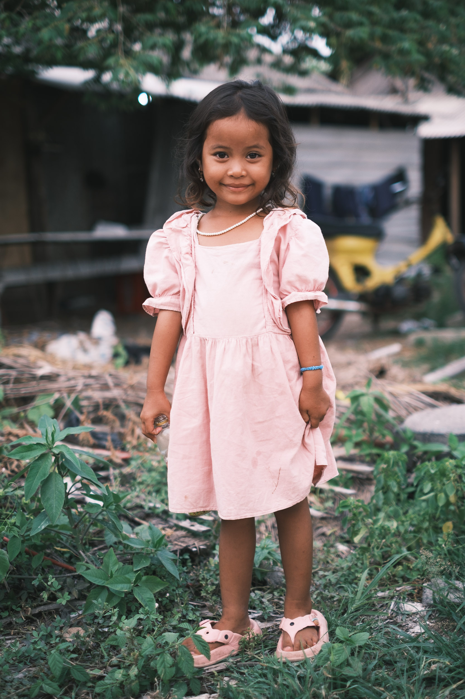
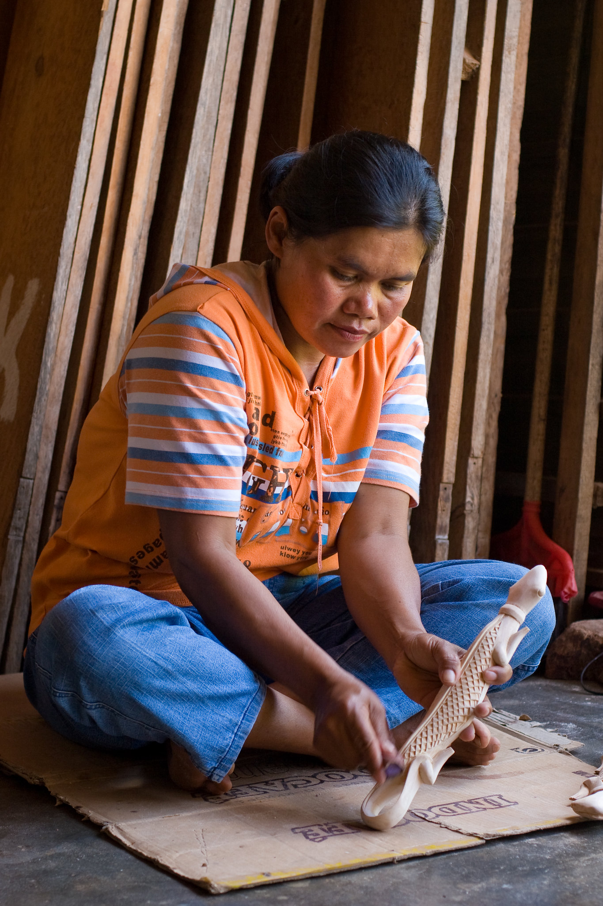
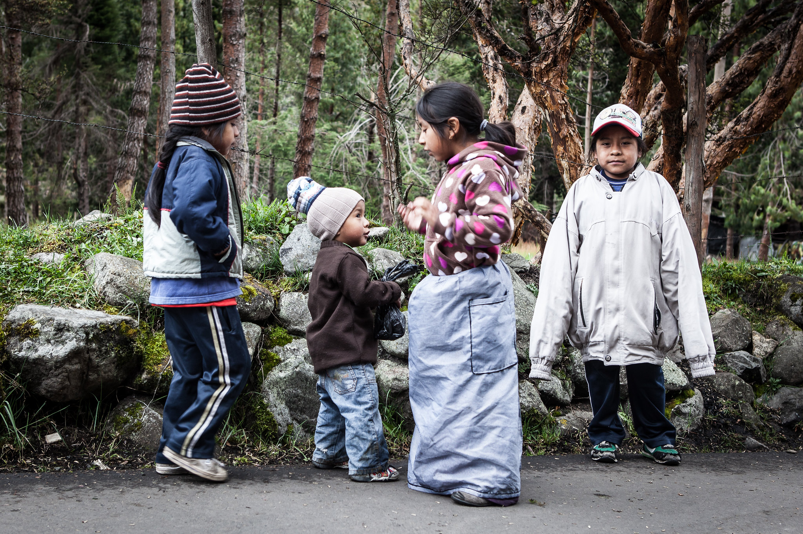
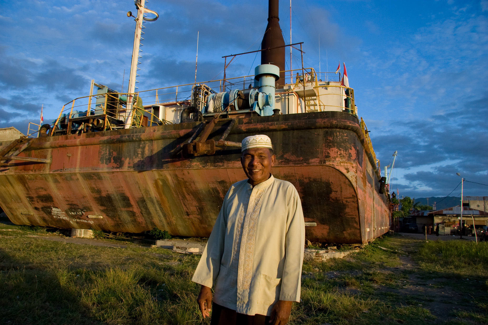

Ihmisten valokuvaaminen on aina ollut minulle vaikeaa. En voi tunnustaa olevani erityinen ihmisten ihminen eikä introvertti persoonallisuuskaan auta asiassa. Silti pakotin itseni siihen usean vuoden ajan. Olen lisäksi aina tykännyt katuvalokuvista sekä dokumentaarisista valokuvista - olivat ne sitten sodan dokumentointia tai muistoja matkoilta.

<!--more-->

Lähtökohtaisesti ihmisten valokuvaaminen on lähes aina sallittu julkisissa tiloissa. En ole lakiasioiden asiantuntija, mutta käsitykseni mukaan julkiset tilat ovat lähes kaikkialla maailmassa rajattu yksityisyyden suojen ulkopuolelle. Tämä sääntö on yksi journalistisen valokuvauksen perusedellytyksiä. Sama oikeus on kuitenkin kaikilla ihmisillä. Ympäristöä ja muita ihmisiä saa valokuvata ilman kuvassa näkyvien ihmisten erillistä lupaa.

Ihmisten valokuvaaminen aiheuttaa tästä yleisestä luvasta huolimatta ristiriitaisia tunteita. En itse tykkää olla kameran etupuolella. Tunnen oloni epämukavaksi jos tiedän, että joku ottaa minusta kuvan. Vaikka ihmiset ovatkin julkisessa tilassa, he voivat silti olla omissa oloissaan ja maailmoissaan. Tällaisten ihmisten valokuvaaminen tuntuu jollain tavalla henkilökohtaiseen tilaan tunkeutumiselta.

Toisaalta taas omissa maailmoissaan olevista ihmisistä otetut kuvat ovat usein niitä parhaimpia. Siksi katuvalokuvat ovat minun mieleen, koska niissä on ikuistettu hetki, johon ei liity keinotekoista keikistelyä tai valheellista hymyä. Jos henkilö esittää olevansa jotain, ainakaan hän ei tee sitä kuvaajalle.

Olen itse ihan surkea katuvalokuvaaja. Teen sitä joskus, mutta poden siitä niin kovaa syyllisyyttä, että kuvaaminen ei yleensä tunnu kovin kivalta. Olen liian tietoinen siitä, että kuvaan ihmisiä "salaa". Suomessa se tuntuu siltä kuin pääni päällä olisi valokeila ja tunkeudun toisten ihmisten elämään. Tuntuu, että kaikki näkevät minut ja minä en näe ketään. Ulkomailla minun on helpompi näytellä pseudo-ekstroverttia ja heittäytyä tyhmän turistin leimalla ympäristön kuvaajaksi. Helppoa se ei silti ole.

Juuri näistä syistä johtuen suurin osa ottamistani ihmiskuvista ei ole salaa kuvattuja. Ne ovat ihmisiä, joiden kanssa olen jutellut ja joilta olen kysynyt luvan kuvan ottamiseen. Välillä olen kysynyt luvan sanoilla, toisinaan taas eleillä. Lopputulos on kuitenkin se, että kuvattavat ovat olleet tietoisia siitä, että heitä kuvataan. Tämä antaa minulle mielenrauhan.

Jos kuvaaminen on ristiriitaista niin kuvien julkaiseminen on vielä konstikkaampaa. Kun itse julkaisen kuvia, niissä on aina hyvä tahto takana. Haluan näyttää ihmiset positiivisessa valossa. Kuvaamani ihmiset ovat aina minusta kauniita, komeita, kiinnostavia tai heihin liittyy jonkin hieno hetki tai tarina. Tarkoitukseni on hyvä, mutta se ei tietenkään tarkoita, että kuvan kohde jakaisi hyvät ajatukseni.

Vaikka olisinkin saanut kuvaamisen luvan, monet ihmiset eivät tule lupaa antaessaan ajatelleeksi, että mihin kaikkialle kuva voi päätyä. Vielä vähän aikaa sitten kauhisteltiin sitä, että harmiton pärstäkuva saattaa päätyä laksatiivilääkkeen mainokseen. Nykyään on myös muita uhkia, kuten se, että tekoälymalleja treenataan Internetissä olevilla kuvilla - lupia kysymättä.

Kokonaan oma ongelmansa ovat lapset ja heidän kuviensa julkaisu. Monet eivät halua, että heidän lastensa kuvia päätyy Internetiin. Onko ihmisillä kuitenkaan oikeutta kieltää sitä? Onko vanhemmilla oikeus kieltää lastensa kuvien julkaisu? Nämä ovat kysymyksiä, joihin minulla ei ole helppoja vastauksia. Voin vain kertoa oman tapani toimia.

Jos pystyn käsi sydämellä sanomaan, että kuvaan ei liity mitään pahansuopaisuutta ja aikomukseni on ollut vilpittömästi hyvä, julkaisen kuvan. Oli kuvassa sitten aikuinen tai lapsi. Koen, että valokuvat ihmisistä ovat oiva tapa kertoa ihmisten elämästä, kulttuureista ja erilaisuudesta. Valokuva kykenee välittämään tunteita sen kaikissa muodoissa. Ne kertovat tarinoita ja muistuttavat siitä, että ihmiset ovat ihmisiä erilaisista lähtökohdista huolimatta. Minulle nämä ovat arvokkaita syitä julkaista valokuvia ihmisistä.

Haluan kuitenkin alleviivata sitä, että kuvien on oltava otettu julkisessa tilassa jossa kuvaaminen on sallittua tai kuvaamiseen on oltava lupa. Ihmiset on esitettävä **positiivisessa** valossa, tai jos kuvan aiheena on tuskan ja kärsimyksen esittäminen, se on tehtävä hyvällä maulla eikä kohdetta halventaen. Ja jos käy niin, että kuvattava myöhemmin pyytää kuvan poistamista, teen sen hyvin matalalla kynnyksellä.

