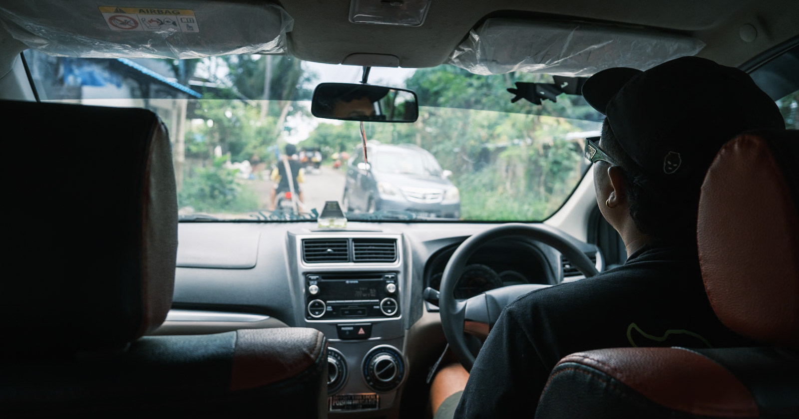
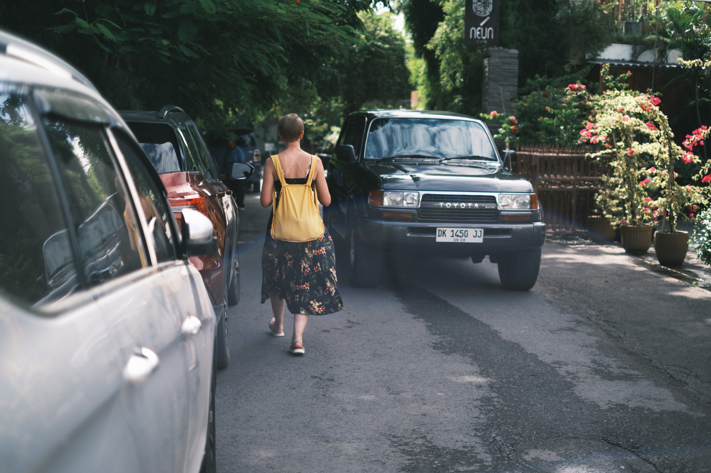
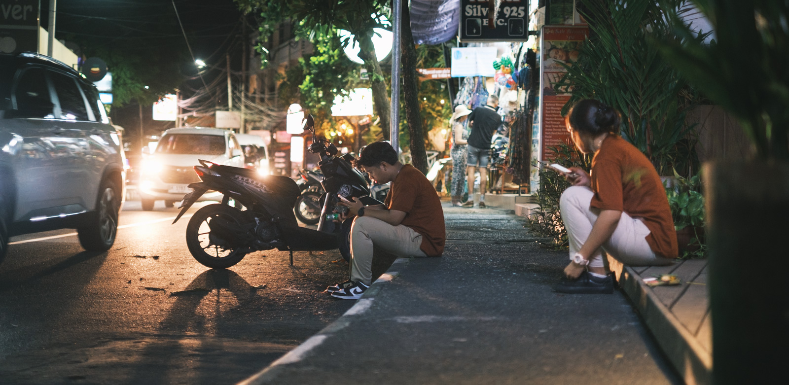

Vietin pari päivää autossa kierrellen pientä saarta, jonka infrastruktuuria ei ole rakennettu autoille. Monesti matkan aikana huomasin, etten nauti kyydistä lainkaan. Aloin pohtia, että miksi niin oli.

Kokemus sai miettimään, kuinka haitallinen vieraslaji autot ovat ja kuinka epäkäytännöllisiä ne loppujen lopuksi ovat, vaikka usein ihmiset näkevät ne jonkinlaisena vapauden ja näppäryyden symboolina.

<!--more-->

### Auto ilman infraa = 💩

Saaren tiet olivat kapeita, mutkaisia ja todella huonokuntoisia. Kaksi autoa mahtui juuri ja juuri ajamaan vastakkaisiin suuntiin, mutta jokainen kohtaamistilanne vaati vauhdin tuntuvan hiljentämisen, usein pysähtymisen. Auton kyydissä istuminen oli hyvin epämiellyttävä kokemus. Kuoppainen tie teki matkan teosta pomppivaa ja matkapahoinvoinnista kärsivä olisi ollut pulassa jatkuvan jarruttelun ja mutkaisen tien takia.

Jos kapeilla teillä kohtaamistilanteet olivat haastavia, pysäköidyt autot tekivät siitä mahdotonta. Erityisesti kyläalueilla, yksi pysäköity auto aiheutti sen, että liikenne kulki vain yhteen suuntaan ja kuljettajien oli neuvoteltava siitä, kummasta suunnasta tulevilla on etuajo-oikeus. Jokainen pysäköity auto tukki myös jalankulku-, pyöräily- ja mopoiluliikenteen. Jokainen tyhjä maapläntti tuntui automaattisesti olevan auton parkkipaikka.

Autossa istuessa huomasi, kuinka skootterit olivat huomattavasti autoja näppärämpi ja nopeampi tapa liikkua. Tai ne olisivat olleet sitä, elleivät edessä olleet autot halvaannuttaisi sitä nopeutta. Autot olivat epäkäytännöllisiä ja vaikeuttivat kaikkien elämää, mutta silti niitä oli lähes kaikkialla. Ne eivät kuuluneet ympäristöön, mutta silti niiden annettiin dominoida katukuvaa.

Yksi erityispiirre, jota opin matkalla vihaamaan oli autoilijoiden jatkuva tööttäily. Tähän olin kiinnittänyt jo aikaisemmin jalankulkijana. Koska autot eivät mahdu kulkemaan rinnakkain, autoilijat tööttäävät ennen jokaista vähänkin pimeämpää risteystä. Jalankulkijana liikkuminen ei ole kovin miellyttävää, kun koko vieressä tuotetaan tärykalvoja repivää melusaastetta.

Lueskelin huvikseni päiväkirjoja aikaisemmilta reissuilta. Halusin nähdä, että olinko tehnyt samanlaisia havaintoja aikaisemmin. Seitsemän vuotta sitten olin kirjoittanut näin:

> Ajelin tänään [mopolla] arviolta 70-80 kilometria ja oma havaintoni on, että autot eivät ole tuolla liikenteessä muuta kuin tien tukkona. Ne ovat hitaampia, kömpelömpiä, syövät hirveästi tilaa ja aiheuttavat käytännössä kaikki kaaokset sekä lukuisia vaaratilanteita. [...] monet pitkään seisoneet ruuhkat johtuivat siitä, että kaksi city-maasturia ei yksinkertaisesti meinannut mahtua kulkemaan rinnakkain.

> Mielenkiintoista nähdä millaiset ruuhkat ovat 10-20 vuoden päästä jos autojen määrä lisääntyy ja tieverkosto ei tuosta muuksi muutu. Liikenteen määrä täällä ei ole kummoinen, mutta jo nyt ruuhkat ovat aika huikeita!

Terveisiä menneisyyden minälle: ruuhkat ovat pahentuneet.

### Kätevyyden illuusio

Suomessa autojen näennäisestä kätevyydestä ja nopeudesta kuulee varsin usein. Meillä kuitenkin unohdetaan, että nämä ominaisuudet tulevat siitä, että ympäristö on rakennettu nimenomaan autoille ja niiden nopeutta optimoiden. Ilman autoille erityisesti rakennettua infrastruktuuria auto on hyvin epäkäytännöllinen kulkuväline.

Huomioimisen arvoista on myös se, että autojen vaatima infrastruktuuri ei usein ole yhteensopiva muiden kulkumuotojen kanssa. Autojen liikuttaminen ja seisottaminen vaatii hirvittävän määrän tilaa ja se tila on usein pois kaikilta muilta kulkumuodoilta. Autoille rakennettu infra on korvamerkitty vain niille sekä moottoripyörille. Kaikki muut kulkuväineet sysätään taistelemaan jäljelle jäävästä, kapeasta tilasta. Autokeskeinen suunnittelu ei ole pelkästään edistänyt autoilun kätevyyttä, vaan se on aktiivisesti tehnyt muiden kulkumuotojen käyttämisestä hankalampaa.

Pienellä saarella infrastruktuuria ei ole lähdetty erinäisistä syistä johtuen rakentamaan autoille, mutta autot pilaavat olemassa olevan ympäristön kaikesta huolimatta. Suomessa infran tilanne on ihan toinen. Meillä autolähtöistä suunnittelua on toteutettu aktiivisesti usean vuosikymmenen ajan. Käytännössä yhdestä kulkumuodosta on rakennettu koko ajan kätevämpää samalla kun vaihtoehtojen käyttämistä on vaikeutettu.

Näiden vuosikymmenten jälkeen olemme unohtaneet, ettei nykyinen autonormaali pudonnut taivaalta. Olemme tottuneet siihen, että kaikki muut kulkumuodot jäävät aina toiseksi. Autojen aiheuttamasta harmista on tullut normaali, jota emme osaa enää nähdä. Monet olettavat kätevyyden ja nopeuden olevan autoihin sisään rakennettu ominaisuus, mutta näin se ei tietenkään ole. Asian näkee heti kun hyppää autoon paikassa, jota ei ole erikseen rakennettu autoille. Ei se ole yllätys, että parin tuhannen kilon ylisuuri metallilaatikko ei ole se kaikista tehokkain tapa liikuttaa ihmisiä.

### Uusi syntipukki

Suomalaisten suosikki-inhokkit sähköskuutit palaavat taas tänäkin kesänä katukuvaan. Lehtien palstat, foorumit ja somet täyttyvät skuuttivihasta ja jokainen haluaa vuoron perään olla kieltämässä ja rajoittamassa niitä. Skuutteissa ja erityisesti niitä pyörittävien yritysten bisnesmallissa on omat ongelmansa, tiedän sen. Mutta moniko tulee ajatelleeksi, että iso osa skuuttien ongelmista ei johdu itse kulkuvälineestä? Iso osa konflikteista johtuu siitä, että skuuteille ole tilaa, koska kaikki tila on varattu autoille. Eikä tämä ole pelkästään skuuttien ongelma. Monessa paikassa sama koskee myös polkupyöriä, etenkin suurempia tavarapyöriä.

Yksinkertaistaen konfliktit syntyvät siitä, että eri kokoiset ja eri nopeudella liikkuvat kulkuvälineet kulkevat samalla väylällä. Tämän takia skuutit ja polkupyörät eivät kuulu jalkakäytäville, mutta skuutit ja pyörät kulkevat ongelmitta samoilla väylillä. Samasta syystä polkupyörät ja skuutit eivät useimmiten kuulu ajoradoille, vaikka laki tällaiseen välillä ohjaakin. Nopeus- ja kokoerot ajoneuvojen välillä ovat aivan liian suuret eikä se tee liikkumisesta mukavaa tai turvallista.

Skuuteille pitäisi antaa niiden vaatima tila. Käytännössä se tarkoittaisi hyvien ja riittävän leveiden pyöräväylien rakentamista. Pyöräväylät eivät ole vain pyörille, vaan niitä voivat käyttää skuutit sekä erilaiset apuvälineet kuten sähköpyörätuolit ja vanhusmopot. Pidänkin itse englanninkielisestä termistä "mobility lane", joka kattaa hienosti kaikki pyöräväylien käyttömahdollisuudet.

Kävelyn pitäisi olla erityisesti kaupungeissa se liikkumismuoto, joka priorisoidaan korkeimmalle. Sen pitäisi olla nopeaa, kätevää ja turvallista ympäri vuoden. Sen ei pitäisi olla kapeilla kaistaleilla taiteilua, liikennevaloissa seisomista, anelunappien painelua, lumikinoksissa tarpomissa tai nopeampien kulkupelien väistelyä. Yksityisautoilun kuuluisi olla se kulkumuoto, joka on niin vaikeaa, ettei juuri kukaan halua sitä tehdä.

Kun ensi kerralla kuljet kaupungissa, katso ympärillesi. Mitä näet? Kuinka katutila on jaettu? Mikä kulkumuoto vie eniten tilaa? Miksi pyöräily on vaikeaa? Mitkä väylät aurataan talvisin ensiksi? Kuinka paljon eri kulkuvälineille on parkkitilaa? Mistä kaupungin melu oikeasti syntyy?

Kun ensi kerralla kiroat skuutteja tai polkupyöriä, mieti miksi ne ovat jalkakäytävillä. Kun ensi kerralla ylistät autojen kätevyyttä, mieti mistä se johtuu.

---

Olin työstämässä tätä kirjoitusta kun [Not Just Bikes](https://www.youtube.com/@NotJustBikes) julkaisi YouTube-kanavallaan videon siitä, kuinka kaistojen lisääminen ei korjaa autojen aiheuttamia ruuhkia. Video käsittelee joitakin samoja asioita, joita minäkin pohdin saarella liikkuessa. Suosittelen katsomaan!


