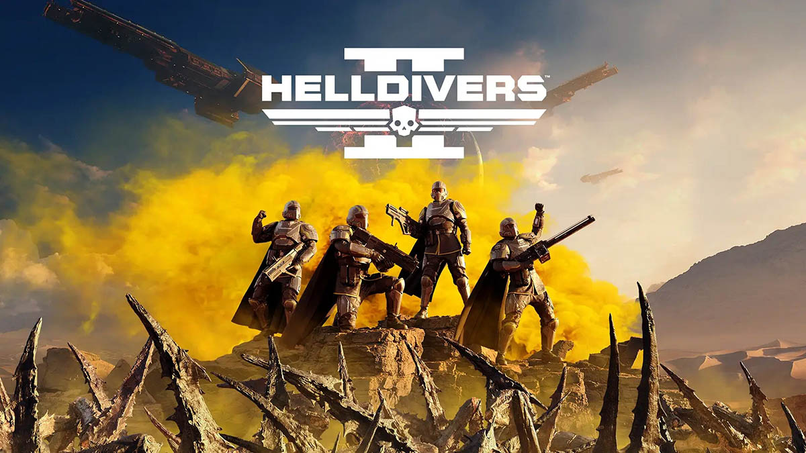

Helldivers 2 on jatkoa vuonna 2015 julkaistulle, suositulle co-op -pelille. Top-down -näkymä on muuttunut 3rd person -näkymäksi, mutta muuten pelin suosion rakentaneet elementit ovat yhä paikoillaan. Ongelmiakin on.

<!--more-->

Jos pidät [Starship Troopers](https://www.youtube.com/watch?v=zPYuV_jGk7M) -elokuvan tyylistä ja huumorista, pidät luultavasti myös Helldiversista. Tarinaa ei juuri ole. Helldiversit ovat Super Earthin sotilaita, jotka lähetetään vieraille planeetoille jakaamaan demokratiaa aseet laulaen. Jotta oman kodin rauha säilyisi, muille vieraslajeille on jaettava vapautta lyijyn muodossa. Kieli poskessa vedetty sotahulluus ja sen ympärille rakennettu huumori uppoaa ainakin itseeni.

En ole 3rd person -räiskintöjen ylin ystävä. Näin ennen julkaisua gameplay-videoita pelistä ja epäilin, että niinköhän ensimmäisen osan tunnelma ja hauskuus toimivat uudesta näkökulmasta. Epäilykseni olivat turhia. Monin tavoin 3rd person -näkymä toimii paremmin, koska nyt pääset keskelle taistelun kaaosta. Kehittäjät ovat tehneet todella hyvää työtä ja tehneet pelikokemuksesta mukaansa tempaavan.

Arvostan sitä, ettei pelitalo lähtenyt korjaamaan jotain mikä ei ole rikki. Pelimekaniikka on käytännössä identtinen ensimmäisen osan kanssa. Käytössäsi on kaksi asetta: pääase sekä sivuase. Lisäksi sinulla voi olla kolmas erikoisase. Jokainen pelaaja voi valita neljä taivaalta pudotettavaa *stratagemia*. Nämä voivat olla ison vihollisjoukon tuhoavia pommeja, automaattitykkejä, apuvälineitä tai aikaisemmin mainittuja erikoisaseita. Strategemeissä on cooldown-aika, joten niitä on käytettävä harkiten. Joissakin on myös määrärajoitus.

Pelin intensiivistä tunnelmaa korostaa ykkösestä tuttu pelimekaniikka, jossa jokaisen stratagemin kutsuminen, tehtävän suorittaminen sekä rähinässä kuolleiden kavereiden takaisin kutsuminen vaadii koodisarjan näpyttelyn. Yllättävän vaikeaa, kun yrität samaan aikaan pysyä hengissä loppumattomalta tuntuvan vihollisarmeijan keskellä. Helldivers 2 tarjoaa useita vaikeustasoja. Pelissä on helppo päästä alkuun, mutta oman kokemuksen mukaan hyppäys tasolta toiselle on yllättävän suuri.

Helldivers 2 on moninpeli ja suunniteltu sellaiseksi. Sitä voi pelata ilman kavereita, mutta henkilökohtaisesti koin sen tylsäksi. Tiimissä voi olla maksimissaan neljä pelaajaa. Yhteispeli on avain onnistumiseen.

Ykköstä pelanneet tietävät, että friendly fire on merkittävä osa pelin hauskuutta. Jokainen ase ja taivaalta putoava stratagem vahingoittaa tiimikavereita aivan yhtä paljon kuin vihollisia. Tästä syntyy hetkittäin uskomatonta kaaosta, kun jokainen koittaa pitää kiinni henkirievustaan, mutta samalla olla ampumatta saman ongelman parissa kamppailevaa tiimikaveriaan. Vahinkoja tapahtuu lähes jokaisessa matsissa, mutta usein ne ovat lähinnä hauskoja eivätkä ärsyttäviä.

Peliä on hauska pelata tuttujen kavereiden kanssa puheyhteyttä hyödyntäen, mutta ilokseni olen huomannut, että myös satunnaisten pelaajien kanssa pelaaminen on ollut todella hauskaa. En ole törmännyt vielä yhteenkään myrkylliseen pelaajaan ja pelin sisäiset kommunikointivälineet riittävät oikein hyvin tehtävien suorittamiseen. Pelissä on myös chat, mutta etenkin konsolipuolella sitä ei tunnu käyttävän juuri kukaan - hyvä niin.

Helldivers 2 ei ole kuitenkaan täysin ongelmaton. Aika usein kentät ovat todella pimeitä ja usvan peitossa. Etenkin yöaikaan suoritettavat tehtävät ovat ärsyttävää mössöä. Kun näkyvyys on vain muutaman metrin, pitkän kantaman aseet muuttuvat hyödyttömäksi. Ymmärrän mitä kehittäjät ovat halunneet tällä saavuttaa, mutta toteutuksessa mentiin ehkä hieman liian pitkälle.

Toinen ongelma tulee pelin hauskimmasta ominaisuudesta, friendly firesta. Peli ei palkitse tiimikavereiden tappamisesta, mutta ei se siitä myöskään rankaise. Kuolemat koituvat koko tiimin tappioksi, ei yksittäisen pelaajan riesaksi. Pelissä on muutama stratagem, joilla on helppo tuhota suuri määrä vihollisia ja saada itselleen hienot tilastot, mutta samalla kuolevat myös tiimikaverit. Harmillisesti näiden aseiden holtittomia käyttäjiä näkee pelissä liian usein. Tämä tekee kaikkien muiden pelistä tylsää, koska vihollisten lisäksi saat varoa myös oman tiimin tulta. Peli muuttuu demokratian jakamisesta odotteluksi ja kuoleman myötä kadotettujen aseiden etsimiseksi.

Peli julkaistiin varsin rikkinäisenä ja se kärsii bugeista edelleen. Kertoo jotain nykyisen peliteollisuuden nykytilasta, kun moninpeliksi suunniteltu pelin match making oli täysin rikki. Julkaisun yhteydessä moninpeli oli mahdollista vain omien kavereiden kanssa. Tätä ongelmaa on onnistuttu korjaamaan kuluneen viikon aikana, mutta ei se edelleenkään toimi kunnolla. Lisäksi pelin palvelimet ovat niin kuormittuneita, että kehittäjät löivät pelaajien määrälle globaalin rajan. Nyt pelaajia odottaa helposti "Servers at capacity, Please try again later" -virheilmoitus, eikä minkäänlaista jonotussysteemiä näyttäisi olevan. Ainakaan käyttöliittymä ei anna arviota mahdollisesta jonotusajasta.

Olen törmännyt lukuisiin ongelmiin myös pelin aikana: yksittäiset pelaajat alkavat lagaamaan ja liukuvat pitkin kenttää, viholliset jäävät jumimaan paikoilleen, tilatut stratagemit eivät putoa, pelihahmot jäävät jumiin maan sisään tai katoavat taivaaseen, tehtävistä saatavat palkinnot tai tilatut aseet katoavat tyhjyyteen, ruutu muuttuu blurriksi eikä uusia aseita ja stratagemeja pysty aina ostamaan. Peli ei selvästikään ole valmis ja se julkaistiin keskeneräisenä, mutta tässä ei taida olla enää mitään uutta ja ihmeellistä vuonna 2024. Bugien lisäksi PC-pelaajien riesana tuntuvat olevan huijarit. Onneksi crossplay-ominaisuuden voi kytkeä pois päältä niin konsolipelaajat pysyvät näiltä paremmin turvassa.

Yhteenvetona sanoisin, että bugien alla on todella viihdyttävä peli, jota on hupaisaa pelata erityisesti kavereiden kanssa. Peli ei yritä miellyttää kaikkia ja kehittäjät ovat selvästi pyrkineet rakentamaan pelin, joka keskittyyn yhteen asiaan ja pyrkii tekemään sen hyvin. Aivottoman räiskinnän ja co-oppin ystäville tämä saa minulta lämpimän suosituksen - kunhan bugit on korjattu.