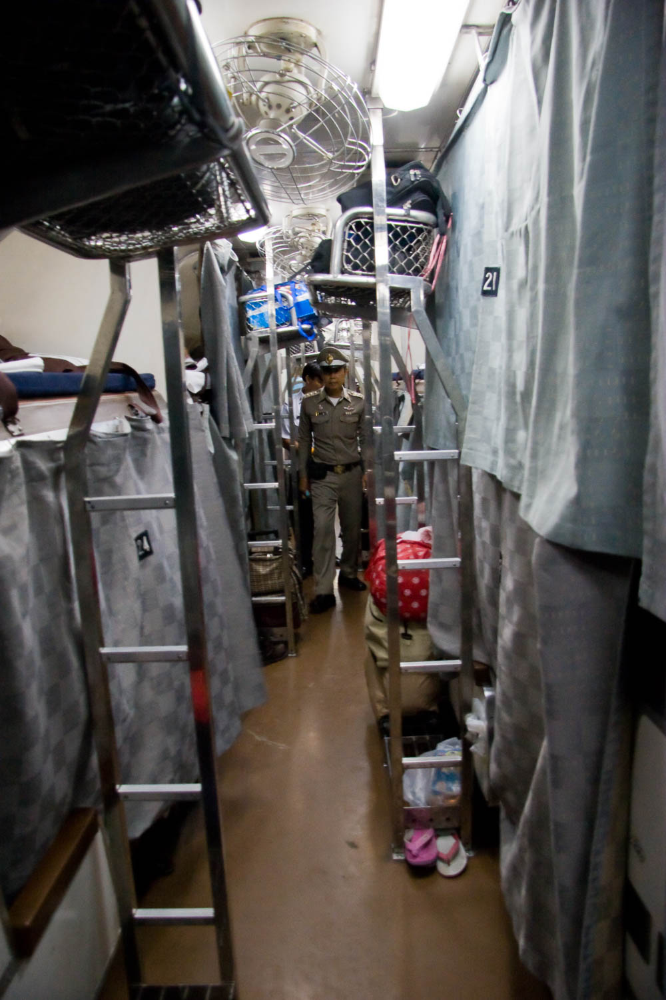

Olen ehtinyt olla reilun viikon Suomessa, mutta mielessä pyörivät uudet seikkailut. Tällä kertaa tarkoitus olisi matkustaa aivan uudella tavalla, mutta muutos vaatii uuden opettelua ja asennemuutosta.
<!--more-->

### Lentäminen on myrkkyä
[Kirjoitin aikaisemmin]() siitä, kuinka suuri rooli matkailulla on ollut minun hyvinvoinnille. Olen tyytyväinen siihen, että arkinen hiilijalanjälkeni lähentelee vuoden 2030 tavoitetta: 2500 kg CO2. Tuskastelen kuitenkin sen kanssa, että tekemäni lentomatkat tuhoavat tämän hiilijalanjäljen täysin.

Sen lisäksi, että lentäminen on hiilijalanjäljen näkökulmasta äärimmäisen saastuttavaa, se tuottaa myös hirvittävän määrän melusaastetta. Lentomelualueella asuneena tiedän sen vaikutukset liian hyvin. Vuonna 2020 julkaistun [raportin](https://www.europarl.europa.eu/RegData/etudes/STUD/2020/650787/IPOL_STU(2020)650787_EN.pdf) mukaan Euroopan alueella asuu **3,2 miljoonaa** ihmistä, jotka altistuvat suurten lentokenttien aiheuttamalle lentomelulle. Näiden päälle ovat pienemmät lentokentät, lentokoneiden aiheuttama melu kauempana kentästä sekä koko Euroopan ulkopuolinen maailma.
 
Tämä aiheuttaa päässäni ristiriidan, sillä omat seikkailuni ovat usein kohdistuneet nimenomaan kaukana oleviin kohteisiin ja tropiikkiin. Niissä on kaikkea sitä mistä pidän ja tykkään aivan hirvittävästi etenkin Kaakkois-Aasian maiden kulttuurista, ruoasta, luonnosta ja ihmisistä. Lisäksi ne tarjoavat uskomattomia koralliriuttoja laitesukeltamiseen. 

Lentäminen on itselleni ollut "pakollinen" paha. Sen lisäksi, etten pidä lentämisen aiheuttamista saasteista, inhoan lentämistä ylipäätään. Kentillä odottelu, turvatarkastukset, passintarkastusjonot sekä ahtaassa peltipurkissa huutavien kersojen kanssa matkustaminen on jo pitkään ollut matkojen ärsyttävin osuus. Silti olen nähnyt sen ainoana tapana matkustaa. Vanhoista tavoista ja ajatusmalleista luopuminen ei tapahdu ihan itsestään.

### Raiteiden ihanuus
Päätin jo ennen Indonesian matkaa, että seuraavan seikkailun teen maata pitkin. Lentämisen lisäksi inhoan myös autoilua - isolta osin samoista syistä. Siksi halusin keskittyä nimenomaan junamatkailuun.

Olen aina tykännyt liikkua julkisilla, etenkin junilla. Kaakkois-Aasiassa siihen tarjoutuu varsin vähän mahdollisuuksia, mutta muistelen edelleen lämmöllä yöjunalla taitettuja matkoja Bangkokista Chiang Maihin. Useimmiten matkustaminen on tapahtunut kuitenkin (mini)busseilla. Niiden laadussa ja matkustusmukavuudessa on ollut melko suuria vaihteluja.

Olipa alla bussi tai juna, pidän niistä siksi, ettei minun tarvitse keskittyä ohjaamiseen. Voin keskittyä matkustamiseen, maisemien katseluun, musiikin kuunteluun, lukemiseen tai vaikka ohjelmointiin. Matkan eteneminen ei ole riippuvainen minusta. Se on rentouttavaa ja paikasta toiseen siirtymisestä tulee osa matkaa. Autolla ajaminen ei sitä tarjoa, koska ajaessa pitää keskittyä liikenteeseen.

### Seikkailu alkaa kotiovelta
Vaikka aikaisemmissa kohteissa liikkuminen onkin tapahtunut julkisilla, matka sinne on kuitenkin ollut aina jonkinlaista suorittamista ja tehokkuuden optimointia. Päädyn helposti ajattelemaan, että miksi istuisin 10 tuntia junassa, jos voin lentää sinne tunnissa - usein vieläpä samaan hintaan tai halvemmalla, missä ei ole mitään järkeä. Tämä on ajattelutapa, josta minun on opeteltava eroon. Seikkailun ei tarvitse alkaa kohdemaan lentokentältä. Se voi alkaa kotiovelta.

Olen kiinnittänyt huomiota myös toiseen epäloogisuuteen omassa ajattelussa. Jostain syystä 10 tunnin junamatka tuntuu ajan haaskaamiselta, mutta samaan aikaan olen tehnyt useita road trippejä autolla. Netissä on läjäpäin tarinoita road tripeistä ja se tuntuu olevan osa Amerikkalaista kulttuuria. Miksi autossa istuminen on osa matkailun riemua, mutta junassa istuminen ajan haaskaamista? Siinä ei ole mitään järkeä!
 
Tykkään matkustaa ilman tarkkoja suunnitelmia, mutta junamatkailu vaatii ainakin karkean suunnitelman, etenkin jos aikoo hyödyntää [Interrail](https://www.interrail.eu/)-lippua. Tämä ei onneksi vaadi itseltä ajattelutavan muutosta, koska minulla on ollut runko ja aikataulu myös niillä matkoilla, joita en ole tarkemmin suunnitellut. Ilman tällaista runkoa olisin missannut puolet paikoista ja pahimmillaan paluulentoni. Pieni suunnitelmallisuus on ihan hyvästä. Valitsemalla itselleen sopivan Interrail-lipun suunnitelmia on mahdollista muuttaa myös kesken matkan.

On ollut positiivista huomata, että junamatkailuun on tullut aikataulu- ja reittipalveluita, joiden avulla voi suunnitella usean maan halki kulkevia reittejä. Google Maps on tietenkin yksi vaihtoehto, mutta pidin erityisesti [DB](https://int.bahn.de/en):n ja [OBB](https://fahrplan.oebb.at/webapp/?language=en_GB):n palveluista. Ikävä kyllä lippujen ostaminen taitaa olla edelleen useiden eri toimijoiden takana ja tämä on asia, joka pitäisi tuoda kätevyydessä lentolippujen tasolle. Miksi junalippujen ostaminen ei onnistu yhdestä paikasta, jos se on mahdollista lentoyhtiöiden sekamelskassa?

### Herkkyyden vaatimat muutokset
Viimeiset vuodet sekä edellinen matka korostivat itselleni sitä, että joudun muuttamaan matkustustottumuksiani myös toisesta syystä. Ääniherkkyys aiheuttaa sen, etten pysty nauttimaan sellaisista paikoista, joista ehkä vielä joskus pystyin. Jatkuvasti lisääntyvä melusaaste tekee myös nukkumisesta vaikeaa. Monet paikat ovat muuttuneet ihmisten paikoista moottoriajoneuvokeskittymiksi ja meteli on sen mukainen. Niissä vierailu tarkoittaa minulle jatkuvassa stressitilassa olemista ja huonoja yöunia. Ei erityisen hyvä lähtökohta lomalle.

Suurkaupungit ja erilaiset autohelvetit saavat tulevaisuudessa väistyä pienempien, hiljaisempien ja inhimillisempien kohteiden tieltä. Luotokohteet ovat aina olleet tärkeä osa seikkailujani ja niistä pidän riemulla kiinni. Yleisen aistiherkkyyden takia en todennäköisesti pysty yhtä mukavasti tekemään tuntikausien täriseviä ja mutkittelevia bussimatkoja, joten senkin puolesta raidematkailuun panostaminen tuntuu oikealta vaihtoehdolta.



Rehellisyyden nimissä on kuitenkin todettava, että vaikka pyrinkin vähentämään lentämistä tuntuvasti, se ei varmasti katoa elämästäni täysin. Ei ainakaan ihan vielä. Minulla on edelleen joitakin kohteita, kuten Japani, joissa haluaisin käydä. En halua myöskään täysin sivuuttaa sitä tosiasiaa, että matkailulla on iso positiivinen vaikutus hyvinvointiin. Joudun tasapainottelemaan näiden asioiden kanssa ja koitan hyväksyä sen, että iso muutos on parempi kuin ei muutosta ollenkaan.

Minun ei tarvitse onnistua täydellisesti. Iso osa ihmisistä vähät välittää näistä asioista.
