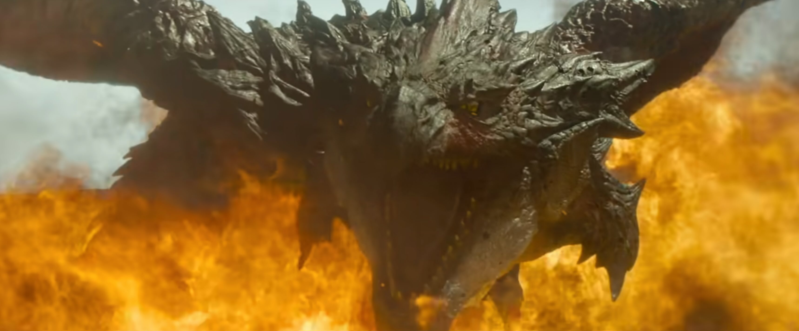

Näin Borderlands-elokuvan trailerin ja mietin, ettei elokuvalla tunnu olevan juuri mitään tekemistä sen pelisarjan kanssa, joihin olen käyttänyt 15 vuotta elämästäni. Se sai miettimään, että miksi Hollywood haluaa kerta toisensa jälkeen tuhota faneille tärkeät maailmat.

<!--more-->

Olen kasvanut pelien parissa. Peleissä, kuten kirjoissa, on se hieno puoli, että niiden parissa tulee vietettyä todella pitkiä aikoja. Maailmat ja hahmot tulevat todella tutuksi. Monet henkilöhahmot tuntuvat oikeilta ihmisiltä (tai otuksilta) ja parhailta kavereilta. Niiden kuolemat satuttavat. Pelisarjat, kuten **Borderlands**, ovat olleet osa elämääni pidempään kuin monet tuntemani ihmiset. Tällaisten pelien hahmoihin syntyy ihan aito tunneside, aivan kuten kirjoihin ja niiden hahmoihin. 

Vahva tunneside on omiaan synnyttämään intohimoisia faneja. Fanit ovat usein ihmisiä, jotka ovat viettäneet satoja tai jopa tuhansia tunteja maailmoissa, joita pelien tekijät ovat rakentaneet. Kun pelistä julkaistaan jatko-osa, on ihan luonnollista, että fanit odottavat uuden pelin istuvan siihen maailmaan. Se maailma on heille tärkeä. He eivät ole sitä luoneet, mutta he ovat eläneet siinä. Se on heidän maailmansa! Jatko-osa saa laajentaa sitä ja tuoda siihen jotain uutta, mutta se ei saa rikkoa jotain minkä pelaajat tuntevat kodikseen.



Joistain peleistä on vaikea tehdä elokuvaa, koska peli ei yksinkertaisesti tarjoa sellaista maailmaa, jonka päälle voisi luontevasti kirjoittaa tarinan. Niiden pelien suosio ei pohjaudu hyvään tarinaan. 32 vuoden ikäinen **Mortal Kombat** -pelisarja on hyvä esimerkki tällaisesta.

Se ei kuitenkaan tarkoita, ettei ohuesta pelimaailmasta voisi syntyä kelvollinen elokuva osaavissa käsissä. Tuorein **Super Mario** -leffa on mielestäni hieno esimerkki tällaisesta. Eihän se mikään mestariteos ole, mutta se kertoi rohkeasti oman harmittoman tarinansa, jonka parissa viihtyi. Kaikesta huolimatta se näytti ja tuntui Super Mariolta. Olen viettänyt Mario-maailman parissa 36 vuotta ja tunsin olevani kotonani.

Itseäni suututavat eniten huonot pelielokuvat, jotka pohjautuvat peleihin, joissa on kaikki ainekset mahtavaan tarinaan. Borderlands on juuri tällainen peli. Se ei ole tarinaton tasohyppely- tai tappelupeli, vaan rikas maailma, jossa on omat säännöt ja lainalaisuudet. Se on täynnä kiinnostavia hahmoja, joilla kaikilla on oma historiansa. Vaikka elokuvasta on julkaistu vasta traileri, jo pelkästään sen perusteella koin, ettei elokuvalla taida olla muuta tekemistä pelin kanssa kuin nimi ja visuaalinen tyyli. Hahmoilla on tutut nimet, mutta ne eivät tunnu itseltään. Pelin räävitön ja nokkela huumori on vaihtunut pissi-kakka -vitseihin. Itselleni tulee olo, ettei elokuvan tekijät tunne kohdeyleisöön tai välitä siitä.

**Monster Hunter** -pelisarjan historia alkaa vuodesta 2004. Sarjan suosio ei pohjaudu tarinaan tai erityisen kiinnostaviin henkilöhahmoihin. Se on peli, jonka pääosassa ovat huikea maailma ja siellä elävät hirviöt. Upea maailma on pelaajan leikkikenttä ja peli toteuttaa sen hyvin.

Koska peli itsessään ei nojaudu vahvaan tarinaan, rikkaan maailman avulla voisi kertoa ihan millaisia tarinoita tahansa. Pelin nimeä kantavalla elokuvalla ei kuitenkaan ole tämän maailman kanssa juuri mitään tekemistä. Sen sijaan, että päähenkilöt olisivat luonnollinen osa maailmaa, tarinaan päätettiin tuoda geneerisiä sotilaita ulottuvuuspelleilyn kautta. Pelimaailmasta poimittiin yksi ase ja pari hirviötä, jotka nekin päätyivät olemaan mitättömässä sivuosassa omassa elokuvassaan.

Tekijät eivät selvästikään ymmärtäneet, miksi pelaajat pitäävät pelistä. Eivätkä he olleet hyviä tarinan kertojia.

Kun **Lord of the Rings** -elokuvat julkaistiin, jotkut fanit olivat tyytymättömiä, koska elokuva ei heidän mielestään vastannut kirjoja. Valittavista faneista puhuttiin, että he olisivat olleet tyytyväisiä vain, jos valkokankaalla olisi luettu alkuperäisiä kirjoja. En ole kirjoja lukenut, mutta ymmärsin silti, Jacksonin Lord of the Rings oli todella uskollinen alkuperäisille teoksille. Joskus fanikulttuuri voi mennä liian pitkälle. Kaikki eivät ymmärrä, että pelit, kirjat ja elokuvat ovat eri medioita. Kun 150 tunnin pelitarina tungetaan 2 tunnin elokuvaan, se vaatii työtä ja mielikuvitusta. Paljon on jätettävä pois. Se ei kuitenkaan ole tekosyy olla kunnioittamatta alkuperäistä lähdemateriaalia tai faneja.

Itseäni tökkii eniten Hollywoodin tapa suhtautua fanikulttuuriin ja uskollisiin pelaajiin välinpitämättömästi. Usein tuntuu, ettei elokuvien tekijöillä ole mitään todellista kokemusta itse peleistä. Studiot haluavat maksimoida kohdeyleisönsä ja lopputuloksena on yleensä elokuva, joka pettää uskolliset fanit eikä miellytä ketään muutakaan. Pahimmillaan elokuvalla ei ole pelin kanssa muuta yhteistä kuin nimi. Se suututtaa pelien ystävät, koska joku on häpäissyt jonkin heille rakkaan asian. Kun fanit sitten nousevat barrikaadeille ja lyttäävät elokuvan, elokuvien tekijät syyttävät faneja myrkyllisestä ilmapiiristä. 

Pelimaailmat ja -hahmot tuntuvat merkityksellisiltä. Pidän niistä ja haluan suojella niitä. Olen innoissani kun joku tuo taidokkaasti fiktiivisiin maailmoihin jotain uutta ja laajentaa niitä. Maailmat saavat elää. Niiden kuuluu elää. Minulle on silti tärkeää, että maailma tuntuu siltä maailmalta jossa olen elänyt.

Kun hahmot tuodaan valkokankaalle, haluan niiden tuntuvan tutuilta. Kohtaamisen pitäisi olla iloinen jälleennäkeminen, josta paistaa läpi ne sadat tunnit, joita vietimme yhdessä.

Haluaisin kovasti, että minulle tärkeitä asioita, joihin olen käyttänyt satoja tai tuhansia tunteja, kohdeltaisiin kunnioituksella. Usein Hollywood ei näin tee.


