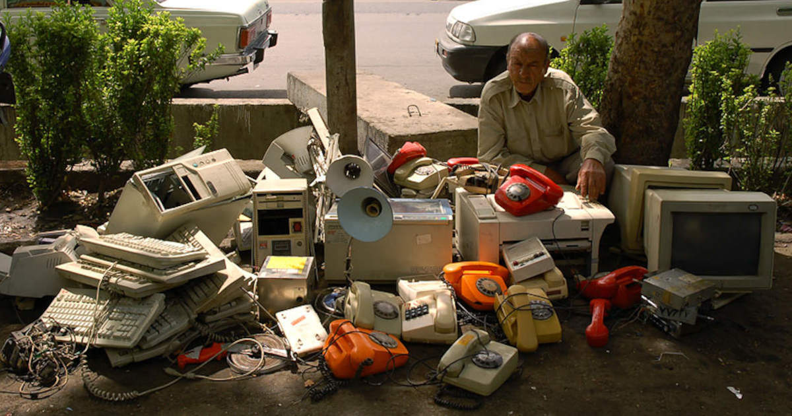

Olen ammatiltani ohjelmoija ja silti olen alkanut inhota teknologiaa. Pysähdyin miettimään, että missä kohtaa nörtistä tuli tällainen ja mitkä tätä muutosta selittävät.

<!--more-->

### Alku

Teknologia ja erityisesti tietokoneet ovat kiinnostaneet minua pienestä pitäen. Ensimmäiset koodirivit kirjoitin muksuna Commodore 64:llä, mutta vakavampi ohjelmointikärpänen puri 90-luvun loppupuolella. Kiinnostus ohjelmointiin kumpusi itsekkäistä syistä. Halusin ratkaista koodilla oman elämän ongelmia. Jossain kohtaa löysin [demoskenen](https://fi.wikipedia.org/wiki/Demoskene). Vaikka en itse koskaan päässyt siihen sisään, olen ehtinyt juosta demoscene-tapahtumissa 90-luvulta lähtien.

Koodaamisen lisäksi olen nuorempana viettänyt paljon aikaa servereitä rakennellen. Vaikka olenkin rakentanut itse kaikki tietokoneeni, rautapuoli ei ole minua suuresti kiinnostanut. Tekemisen riemu on silti pitänyt minut kiinni erilaisissa härveleissä. Kotini on välillä muistuttanut kaatopaikkaa päällekkäin pinottujen tietokoneraatojen ja kuvaputkimonitorien valloittamana.

### Ratkaisuja olemattomiin ongelmiin

Kiinnostus ongelmien ratkaisuun on motivoinut minua läpi työhistorian. Minulla on ollut sikäli onnea, että monet työhistoriani aikana tehdyistä projekteista ovat liittyneet todellisen maailman ongelmien ratkaisemiseen. Ongelmat tekivät työstä kiinnostavan, sillä usein minä en tiennyt niiden ratkaisuja. Minun osaaminen oli ohjelmoinnissa, mutta varsinaiset ratkaisut halusin kuulla käyttäjiltä. Koodi oli vain väline päästä haluttuun ratkaisuun. Olen pyrkinyt pitämään käyttäjät osana kehitystyötä silloin kun se on ollut mahdollista. Palautteen saaminen oikeilta käyttäjiltä on ollut opettavaista, kehittävää ja mukavaa. Usein myös käyttäjät ovat tykänneet siitä tavasta toimia.

Monesti olen kuitenkin tuntenut olevani poikkeus. Muut ohjelmoijat ratkaisevat ongelmat itse. Osa jopa väittää tietävänsä ratkaisut käyttäjiä paremmin. Joillakin heistä on toki usean vuoden kokemus tietyn aihealueen ongelmanratkaisuista ja se varmasti auttaa. Tästä huolimatta he ovat vain ohjelmoijia eikä heillä ole kovinkaan usein sitä kokemusta, jota tuotteen käyttäjillä on. Minusta se oli omituista, mutta varsinkaan alkuvaiheessa työuraa koetin olla ajattelematta asiaa.

Uran aikana olen ollut mukana joissakin kokeellisissa projekteissa. Aluksi olin innoissani. Tuote, jota rakensimme, tuntui todella siistiltä ja mietin, että siitä voi tulla jotain todella suurta. Ei varmasti yllätä, että tuote kuopattiin parin vuoden sisällä.

Kehitystyön aikana törmäsin lukuisiin muutoksiin. Muutosten taustalla olivat ensisijaisesti projektipäälliköiden ailahteleva mieli sekä ylempi johto, joka ei tuntunut tietävän mitä halusi. Aloin miettiä, että mikä on se ongelma, joka sovelluksella on tarkoitus ratkaista. En keksinyt. Usein puhuttiin vain siitä, että tuote tekee yritykselle ja osakkeenomistajille rahaa. Se on toki tarpeellista, mutta useamman projektin kohdalla on tuntunut, ettei se tämän lisäksi ratkaise mitään oikeaa ongelmaa. Päinvastoin, monesta sovelluksesta olisi helposti voinut tulla uusi ongelma. Joistakin tuli.

Näiden myötä yksi suosikkikysymyksiäni työelämässä on *"mitä ongelmaa yritämme ratkaista?"*

### Epäeettistä pöhinää

Etenkin kuluttajapuolen sovelluksissa iso osa tuotteen olemassaolosta oli lähinnä pöhinää. Yritykset koettivat rakentaa keinotekoisia ongelmia, joihin tarjottiin ratkaisu. Käyttäjät haluttiin riippuvaiseksi näistä tuotteista.

Monet ohjelmoijat jaksoivat intoilla erilaisista ohjelmointikielistä ja tekniikoista, mutta minulle ne olivat edelleen vain työkaluja. En koskaan päässyt siihen mielentilaan, jossa jokin sovellus koetaan tärkeäksi siksi, että se on tehty ohjelmointikielellä X tai koska se on toteutettu tietynlaisella arkkitehtuurilla. Silti juuri näihin asioihin tunnuttiin käyttävän eniten aikaa. Harvoin pysähdyttiin miettimään, että ratkaiseeko meidän tekeminen mitään ja onko siinä järkeä. Pelottavan usein tulin lopputulokseen, että tekemisessämme ei ole mitään järkeä.

Osa projekteista paljasti todellisen luonteensa vasta myöhemmin. Yksi tällaisista oli sovellus, jonka ainut tarkoitus oli saada ihmiset tuhlaamaan enemmän rahaa. Se ei ratkaissut mitään ongelmaa eikä se kannustanut ihmisiä ostamaan tuotteita, joita he oikeasti tarvitsisivat. Se pyrki erilaisin psykologisin keinoin rakentamaan ympäristön, jossa ihmiset päätyisivät tuhlaamaan rahojaan hieman enemmän kuin normaalisti, kuluttamaan enemmän. Toteutuksessa hyödynnettiin käyttäjistä kerättyä tietoa ja sen tiedon avulla sopiva psykologinen kenttä voitiin räätälöidä jokaiselle henkilökohtaisesti. Projekti myytiin minulle personoinnilla. Kukapa ei haluaisi itselleen sopivaa ympäristöä. Aluksi kiinnostavalta tuntunut projekti alkoi tuntua hyvin nopeasti väärältä.

Sen projektin myötä aloin yleisesti kiinnittää huomiota siihen, kuinka sovellukset ja erilainen teknologia rohmuaa yksityistä tietoa ihmisistä. Tietoa, jonka keräämisestä ihmisillä ei ole aavistustakaan. Harva ymmärtää sitä, kuinka suuria profiileja mitättömistä datapisteistä voidaan rakentaa.

Juuri kukaan tuntemani ohjelmoija ei ole pahantahtoinen. Nämä ovat vaan asioita, joita ei ajatella teknopöhinässä. Kaikki nämä omakohtaiset havainnot herättivät minut siihen, että teknologia on pelottavan usein hyvin epäeettistä.

### Teknologiaa sen itsensä vuoksi

Olen ihminen, joka antaa joskus pikkuasioiden ärsyttää tarpeettoman paljon. Yksi tällainen asia oli aamukahvin keittäminen. Asuin yksin ja haaveilin siitä, kuinka mukava olisi herätä kahvin tuoksuun. Löysin ajastettavat ja etäohjattavat pistorasiat, joilla tämä onnistui. Tämän typerän pikkuasian myötä uppouduin kotiautomaation maailmaan. Olin löytänyt teknologian ja aloin miettiä, että mihin muuhun sitä voisi hyödyntää.

Lopulta lähes kaikki kotini pistorasiat olivat älypistorasioita. Jokainen valo oli älyvalo. TV-tason reunalla hyrräsi useampi erilainen hubi, joka kontrolloi kodin laitteita. Koska fyysiset käyttöliittymät ovat niin viime vuosituhatta, hommasin kotiini Google Home -kaiuttimia, jotta pystyin ohjaamaan kotiani puheella. Luonnollisesti niiden avulla sain myös tuikitärkeää tietoa, kuten sen milloin sauna on lämmin.

Aina välillä laitteet eivät toimineet, koska nettiin kytketty hubi menetti yhteyden valmistajan palvelimiin. Miksi kaikken laitteiden piti olle kytkettynä ja riippuvaisia internetistä? Se on kysymys, jota en pysähtynyt miettimään.

Sen sijaan mietin, että jos minun piti käyttää laitteita, eihän se ole silloin mitään automaatiota. Minun täytyi mennä vielä pidemmälle.

Rakensin [Home Assistantin](https://www.home-assistant.io/) päälle kokonaisen automaatiojärjestelmän ja täytin kotini ovi-, ikkuna- ja liikesensoreilla. Myös puhelin toimi sensorina, joka kertoi missä olen. Pyrin automatisoimaan mahdollisimman paljon ja lopulta poistin fyysiset valonkatkaisimet, jota satunnaiset vieraat eivät sotkisi minun hienoa automaatiota.

Tein vanhoista tableteista seinälle kiinnitettäviä dashboardeja, jotka kertoivat kotini tilan ja joiden kosketusnäytöillä pystyisin halutessani ohittamaan automaatiota. Pystyin laittamaan kotini erilaisiin tiloihin, joissa laitteet ja valot toimivat hieman eri tavalla.

Satunnaiset vieraat ihastelivat hienoa systeemiäni. Sitten tutustuin nykyiseen puolisooni ja pian kodissani oli pysyvämmin kaksi ihmistä.

Kun hän tuli käymään, koko järjestelmä meni sekaisin. Valot eivät palaneet siellä missä piti. Televisiota ei saanut päälle kun halusi. Edes vedenkeitintä ei pystynyt käyttämään ilman, että minä ohitin automaatiot. Koko touhu ärsytti häntä, enkä ihmettele. Olin rakentanut automaation, joka palveli vain minua, mutta ei ketään muuta. Järjestelmä pysyi kasassa ainoastaan omassa kuplassani - tai niin luulin.

Eräänä päivänä Home Assistant -järjestelmään ja sen lukuisiin komponentteihin tuli päivityksiä, jotka rikkoivat kaiken. En saanut yhtäkään laitetta päälle, valoista puhumattakaan, ja istuin pimeässä kodissa ratkomassa ongelmaa.

Se oli se hetki kun tajusin, että olin pilannut kotini teknologialla, jonka olin tuonut sinne pelkästään teknologian takia. Teknologia ei ratkaissut oikeita ongelmia. Katastrofi oli seurausta ajattelusta, jossa mietin härveleitä ja sen jälkeen sitä, että minne kaikkialle voisin niitä tunkea. Niistä tuli oikea ongelma.

Kului muutama viikko ja olin purkanut kaiken pois. Kokemus muistutti, että mekaaninen, naksahtava valonkatkaisija on itse asiassa pirun hyvä keksintö. Sen käyttökokemus on loistava!

### Kadonnut yksityisyys

Tämän päivän sana on kohdennettu mainonta. Se taas ei onnistu, ellei käyttäjistä kerätä mahdollisimman paljon tietoa. Ehdin työskennellä some-markkinoinnin puolella pienen hetken. Sen merkittävin vaikutus oli, etten halunnut olla osa yhtäkään sosiaalisen median palvelua. Tiedon kerääminen, mitä näin työurani alkupuolella, oli pientä näpertelyä siihen verrattuna mitä Internetissä nykyään harrastetaan. Kaikki laitteet halutaan nettiin, jotta ihmisistä voidaan kerätä tietoa 24/7.

Töistä oppineena asensin kotiini [Pi-holen](https://pi-hole.net/), joka estää mainoksia sisäverkon kaikilla laitteilla. Sen lisäksi se paljastaa sen, kuinka paljon eri laitteet huutelevat valmistajien tai heidän yhteistyökumppaneiden palvelimille. Oli aivan järkyttävää huomata, kuinka paljon laitteet lähettävät dataa kodin ulkopuolelle eikä meillä ole siitä mitään tietoa.

Nykyään tätä tietojen jatkuvaa keräämistä on lähes mahdotonta paeta. Data brokerit yhdistävät sinusta kerättyä tietoa sadoista tai jopa tuhansista eri lähteistä. Jos vielä joskus sinulla oli jonkinlainen kontrolli siihen mitä tietoa sinusta kerättiin, nyt peli on isolta osin menetetty. 

EU:ssa haluttiin suitsia tätä toimintaa, mutta sen näkyvin seuraus tuntui olevan loppumattomat nettisivuilla pomppaavat cookie-bannerit: *"Me ja 972 kumppania välitämme yksityisyydestäsi."*

Kyllä, välitätte, koska se on rahanarvoinen myyntituote. Joitakin suurempia oikeudenkäyntejä on tullut vastaan, mutta saadut sanktiot ovat mitättömiä yritysten tahkoaman rahan rinnalla, joten meno jatkuu isolta osin entiseen malliin. Siitä tehtiin vain ehkä hieman salonkikelpoisempaa.

Nykyään on vaikea löytää mobiili- tai web-sovellusta, joka ei keräisi sinusta tietoa tai esittäisi mainoksia. Usein ne tekevät molempia.

### Todellisen maailman ongelmat

Vaikka kaikki edellä kertomani asiat ovat nakertaneet suhtautumistani teknologiaan, mikään ei ole tehnyt sitä vauhdikkaammin kuin teknologia, joka on tulee ja konkreettisesti pilaa ympäröivää maailmaa. 

Amazonin ja AliExpressin kaltaiset globaalit verkkokaupat ovat räjäyttäneet kulutushysterian ihan uudelle tasolle. Taivaat ovat täynnä ilmansaasteita tuottavia lentokoneita, jotka toimittavat ihmisille roinaa, josta iso osa päätyy jätteeksi.

Näiden jättimäisten kauppojen järjestelmiä kehittävät tuhannet devaajat, jotka eivät anna pienintäkään ajatusta sille, mikä vaikutus heidän työllään on ympäristölle. Näin sen ihan itse työskennellessäni tällaisessa yrityksessä. Tällaiset asiat eivät näy työpaikoilla tai työarjessa juuri mitenkään. Paitsi ehkä niiden kaikista matalammin palkattujen varastotyöntekijöiden tai bangladeshilaisten lapsityöläisten elämässä, joita yritykset tykkäävät polkea.

Sitten on tietenkin oma suosikki-inhokkini *alustatalous*, joka on digitaalisten online-ratkaisujen myötä saanut aivan hillitöntä nostetta.

Uber ja sen kilpailijoiden piti vähentää ruuhkia ja mullistaa taksien käyttäminen. Päinvastoin, ne ovat lisänneet niitä ruuhkia monissa kaupungeissa ja mullistaminen näkyi lähinnä maiden taksijärjestelmien luotettavuuden tuhoamisena. Siinä sivussa he kohtelivat työntekijöitä huonosti.

Airbnb myytiin ihmisille harmaiden ja yksitoikkoisten hotellipalveluiden vastapainoksi. Sen saavutus oli useiden kaupunkien asuntomarkkinoiden sotkeminen ja asuntopulan kasvattaminen. Siinä sivussa he kohtelivat työntekijöitä huonosti.

Woltin ja muiden kuljetusfirmojen piti tuoda ravintolabisnes uudelle tasolle. Nyt tiedämme, että kuljetusfirmat lähinnä köyhdyttävät ravintolakulttuuria. Samalla säännöistä vähät välittävät kuskit tukkivat pihamaat, jalkakäytävät ja pyörätiet autoillaan. Siinä sivussa yritykset kohtelivat sekä työntekijöitään että ravintoloita huonosti. 

Kukapa ei olisi kironnut skuuttifirmoja, jotka päättivät valjastaa kaiken julkisen tilan oman yritystoimintansa pyörittämiseen. Ilman minkäänlaisia säännöstelyä yritykset kantoivat romunsa kadulle ja jättivät ne sinne. Lopputuloksena jalankulkijoiden ja pyöräilijöiden tila, joka oli ennestään ahtaalla, muuttui lähes mahdotomaksi kulkea. Kaupungeista tuli entistä epäsiisteimpiä ja päivystykset täyttyivät loukkaantuneista. Siinä sivussa yritykset kohtelivat työntekijöitään huonosti.

Kryptovaluutat räjäyttivät potin joitakin vuosia sitten. Yhtäkkiä koko IT-bisnes oli täynnä niitä sekä blockchainia. [NFT](https://fi.wikipedia.org/wiki/NFT) (*Non-Fungible Token*) yritettiin tunkea joka paikkaan. Huumaa tuntuivat ajavan lähinnä teknologiaintoilijat, huijarit ja äkkirikastumisesta haaveilevat. Nyt olemme tilanteessa, missä Bitcoinin louhiminen syö vuodessa [137 TWh sähköä](https://www.bitstamp.net/learn/crypto-101/bitcoin-energy/). Se on enemmän kuin koko [Suomen sähkönkulutus](https://www.stat.fi/tup/suoluk/suoluk_energia.html#sahko) vuonna 2022! Ja mikä on kryptovaluuttojen ja NFT:n hyöty normaalien ihmisten elämässä? Ei mikään.

Viimeisimpänä teknohuumana on tekoäly, joka muistuttaa pelottavan paljon NFT-sekoilua. Nyt kryptolouhimisen rinnalle ovat tulleet massiiviset datakeskukset, jotka syövät sähköä entistä enemmän. Pahimmillaan niin paljon, että se [ajaa kaupungin muun teollisuuden pois](https://www.helsinki.fi/en/researchgroups/reimagining-public-values-in-algorithmic-futures/whats-new/dismantling-public-values-one-data-center-at-the-time) tai estää paremmin työllistävää teollisuutta syntymästä.

Sen lisäksi tekoäly on hyvää vauhtia tuhoamassa luovan alan, hakutulokset, asiakaspalvelun, käyttöjärjestelmät, sovellukset ja ylipäätään kaiken sisällön, mitä ihmiset ovat nettiin vuosien aikana tuottaneet. Se synnyttää järkyttävän määrän epätasa-arvoa ja erilaisia eettisiä ongelmia, kun mustia laatikoita tungetaan paikkoihin joihin ne eivät todellakaan kuulu. Tavallisilla ihmisillä ei ole mitään kontrollia asiaan. Se ei ole heidän käsissään. Se pakotetaan heidän elämäänsä teknohärvääjien ja it-miljonäärien toimesta.

Eikä pidä tietenkään unohtaa tapaa, jolla mobiililaitteet ja niiden tarjoaman sisällön tuottajat ovat onnistuneet tekemään keskittymisen puutteesta globaalin pandemian. Se ei ole ainut syy, mutta se on yksi syistä. Tällaisia teknologian aiheuttamia laajoja ongelmia on lukuisia, eikä niiden listaaminen tarvitse ihan hirveästi miettimistä.

Kaikkea tätä yhdistää teknologia- ja it-alan kyvyttömyys nähdä oman työnsä todellisia vaikutuksia. Kyvyttömyys katsoa pitkälle eteenpäin, huuman ohi. Teknologia on kuin huume, jota nautitaan, valmistetaan ja levitetään miettimättä lainkaan sen vaikutuksia yhteiskuntaan. Kunhan raha virtaa, usein harvoille ja valituille.

Toiminta on niin monella eri tapaa epäeettistä, että minun on vaikea olla siinä mukana ja vielä vaikeampi innostua siitä. Korostan vielä, että iso osa softakehittäjistä ei ole pahantahtoisia. Todellisen maailman ongelmien miettiminen ei vaan kuulu heidän työhönsä tai arkeensa. He vaan tekevät työtään, jotta saisivat elätettyä itsensä ja perheensä.

### Uusi tuleminen?

Tästä historian kuormasta huolimatta olen silti edelleen nörtti ja ylpeä siitä. Olen myös edelleen ohjelmoija ja nautin työstäni. Nykyään olen paljon tarkempi siitä, kenelle suostun työtä tekemään ja millaisissa projekteissa suostun olemaan mukana. Olen tarkempi siitä, kuinka paljon ja minkälaista teknologiaa lasken elämääni. Pidän edelleen teknologiasta kun se palvelee minua oikealla tavalla, mutta samalla olen oppinut, että elämäni on usein paljon parempaa ilman teknologiaa. Voin paremmin, osaan keskittyä paremmin ja nautin elämyksistä paljon enemmän. En ryntää teknologian perään vain siksi, että se on teknologiaa.

Olen kovin ilahtunut siitä, että Internetin syövereissä tuntuisi kytevän sen uusi tuleminen. Enshittification, eli [paskeentuminen](https://fi.wikipedia.org/wiki/Verkkoalustojen_huonontuminen), tuntuu ajavan ihmisiä koko ajan kauemmaksi suurista, kaupallisista toimijoista. Ihmiset ovat hiljalleen kyllästyneet siihen, että heitä kustaan toistuvasti silmään ja että he päätyvät olemaan myytävä tuote 

Minulla on välillä sellainen fiilis, että Internet tekee pientä paluuta harmittomaan 90- ja 2000-luvun taitteeseen. Yksityisyyttä kunnioittavat vaihtoehdot, avoin lähdekoodi, self-hosting sekä avoimiin standardeihin pohjautuvat kokonaisuudet kuten [Fediverse](https://en.wikipedia.org/wiki/Fediverse) tuntuvat koko ajan saavan suurempaa suosiota. Erityisen riemuissani olen blogien ja RSS-syötteiden uudesta tulemisesta! Usein tuntuu, kaupallinen Internet syö paskeentumisella omaa jalkaansa, mutta samaan aikaan toista nilkkaa järsii pieni, mutta sisukas inhimillisempi Internet.

Tuleeko se koskaan syrjäyttämään kaupallista puolta? En tiedä, mutta koitan pitää itseäni mahdollisimman pitkälle sillä inhimillisellä puolella. Se voi olla pieni saareke Internetin valtameressä, mutta siellä saarella on paljon hauskempaa!
