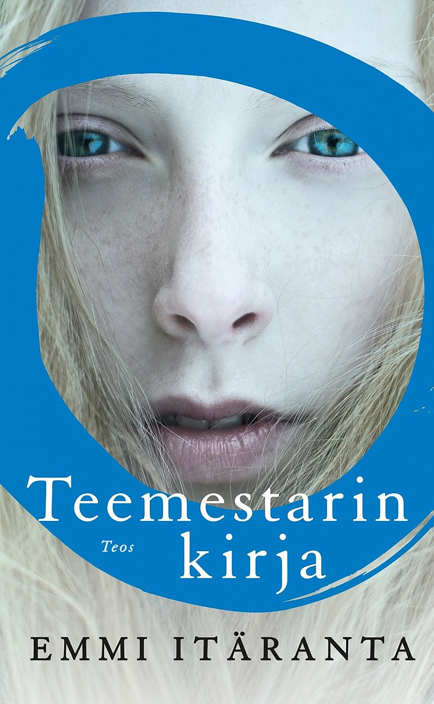

Tämän vuoden ensimmäiseksi oikeasti suomalaiseksi kirjaksi valikoitui Mastodon-suositusten perusteella Emmi Itärannan kirjoittama Teemestarin kirja.

<!--more-->

Kirjan tarina tapahtuu kaukana tulevaisuudessa. Meille tuttua maapalloa ei enää ole, sillä ilmastokatastrofin seurauksena merenpinta nousi ja piirsi mantereet uusiksi. Suomi on osa Uuden Qianin Skandinavian Unionia. Se on kuuma ja kuiva maa, jossa lumisateita ei ole saatu useaan sukupolveen ja vesisateetkin ovat harvinaisuutta. Tilalla ovat mustat hyönteisparvet sekä paarmat, joilta on suojauduttava aina ulkona.

Puhtaasta vedestä on jatkuva pula. Historiasta kertovia kirjoja ei juurikaan ole, mutta perimätieto kertoo muinaisista vesisodista, jotka tuhosivat yhteiskunnan ja synnyttivät kokonaan uuden. Siitä maailmasta, jonka me tunnemme, on jäljellä lähinnä muovihautoihin kasautunut roska. Se, mikä joskus tunnettiin vapaana maana, on nyt diktaattorimaisen armeijan vallan alla. Armeija hallitsee, valvoo ja säännöstelee vettä. Rangaistus vesirikoksesta on ankara.

Teestä ja sen juonnista on tullut luksusta. Perinnettä ylläpitävät korkeassa arvossa pidetyt teemestarit. 17-vuotias **Noria** kuuluu teemestareiden sukuun ja pian on hänen aikansa ottaa teemestarin arvo vastaan. Samalla hän oppii, että perinteiden tuomien velvollisuuksien lisäksi teemestareilla on myös tarkkaan vaiettu salaisuus. Armeijan valvova silmäkään ei jätä arvokasta vettä käyttäviä teemestareita rauhaan.

Noria on kiinnostunut entisaikojen maailmasta ja haaveilee usein, millaista elämä silloin oli. Tämä uteliaisuus saa uutta energiaa, kun hän löytää lapsuuden ystävänsä **Sanjan** kanssa muovihaudoista laatikon. Laatikon sisältö vihjailee, etteivät asiat ehkä olekaan niin kuin perimätieto on opettanut tai kuten armeija on sanellut. Suvun teemestareiden kirjoittamista päiväkirjoista paljastuu asioita, joka yhdessä löydön kanssa saavat Norian ja Sanjan kyseenalaistamaan heidän tuntemansa maailman ja sen historian. Samaan aikaan armeija tiukentaa otettaan ja uusi häijy upseeri kohdistaa katseensa tuoreen teemestaritytön touhuihin.

Viihdyin kirjan parissa todella hyvin. Itäranta on onnistunut rakentamaan tarinan, jossa tapahtumista ja juonenkäänteistä ei ole pulaa. Teen keittely ei herätä itsessäni suuria intohimoja ja kirja olisi saattanut pelkän esittelytekstin perusteella jäädä hyllyyn. Ei kuitenkaan kannata antaa vaisulta kuulostavan kuvauksen hämätä, sillä tarina on kaikkea muuta kuin tylsä.

Itäranta käyttää suomenkieltä taitavasti. Hän osaa leikitellä sanoilla ja maalailee tavalla, johon en tiennyt äidinkieleni pystyvän. Kirja ei tästä huolimatta ole vaikealukuinen tai turhan maalaileva taidepläjäys. Teksti on mielenkiintoinen yhdistelmä tapahtumia sekä Norian näkökulmasta tehtyä ympäröivän maailman havainnointia.

Koen itseni usein huonon mielikuvituksen omaavaksi lukijaksi. Kadehdin ihmisiä, jotka onnistuvat pelkän tekstin perusteella luomaan mielessään värikkäitä, kokonaisia maailmoja. Ehkä olen lukenut vääriä kirjoja, sillä Teemestarin kirja onnistui tekemään sen myös minun päässäni.

Emmi Itäranta luo kirjassaan tulevaisuuden maapallon, joka on helppo kuvitella. Yli kymmenen vuotta sitten julkaistu kirja on kuin kuvaus siitä, johon päädymme jos ihmiskunnan nykymeno ei muutu. Se saa dystooppisen tieteiskirjan tuntumaan hetkittäin tietokirjalta. Vaikka Noria onkin tapahtumien keskiössä, ympäröivä maailma tuntui usein kirjan päähenkilöltä.

Henkilöhahmot ovat taitavasti kirjoitettuja ja tuntuivat uskottavilta. Niihin oli helppo samaistua ja lukiessa minulle ei koskaan tullut olo, etten olisi ymmärtänyt miksi henkilöt toimivat niin kuin toimivat. Jokaisella on oma sisäinen motivaationsa, jota ympäröivän synkän maailman vaikutus ravistelee.

Pidin siitä, kuinka kirja keskittyy vahvasti Noriaan ja Sanjaan, eikä sitä ollut kyllästetty liian suurella hahmokatraalla. Jokainen sivuhahmo on hyvin kirjoitettu, heillä on tärkeä rooli tarinassa, mutta yksikään ei varasta huomiota Norialta ja Sanjalta, tai heidän väliseltä suhteelta.

Kaksikko on kirjoitettu mukavan erilaiseksi. Noria on rauhallinen, ajattelevainen ja perinteitä vaaliva haaveilija. Sanja puolestaan on suorasukainen tee-se-itse -mimmi, joka hoitaa ajattelemisen käsillään. Vaikka he ovat lapsuuden ystäviä, heidän perheensä ja arkensa ovat hyvin erilaiset. Pitkästä yhteisestä historiasta huolimatta kummallakin on asioita, joista on vaikea puhua. Tapa, jolla ystävysten suhde elää ja muuttuu, on todella kaunista luettavaa.

En pitänyt tavasta jolla kirja loppuu. Tuntuu kuin kirjailija olisi kyllästynyt kesken prosessin ja halunnut päättää kirjan nopeasti. Se on sääli, sillä taitavasti rakennetut tapahtumat eivät saa mielestäni ansaitsemaansa päätöstä. Tarina herättää matkan aikana monia kysymyksiä, joihin ei koskaan vastata. Se rakentaa mysteereitä, joita ei koskaan paljasteta. Ehkä tämä on tarkoituksellista ja Itäranta on halunnut saada lukijan ajattelemaan asioita itse. Itse kuitenkin koin lopun pieneksi pettymykseksi. Se tuntui kuin moderni Hollywood-elokuva, jossa lopputekstit ilmestyvät kesken tarinan jatko-osan tai trilogian toivossa.

Lopusta huolimatta Teemestarin kirja päätyi olemaan yksi suosikkikirjojani ja voin suositella sitä lämpimästi kaikille. Se käsittelee kauniin rujolla tavalla universaaleja teemoja kuten ystävyys, perhe, luottamus, uskollisuus ja perinteiden vaaliminen. Se pistää lukijan kiinnostavien moraalikysymysten äärelle. Kysymysten, joissa ei ole selkeää oikeaa ja väärää vastausta. Vaikka Teemestarin kirja ei ehkä kokonaisuudessaan ole mikään hyvän mielen tarina, se pitää synkkyydestä ja epätoivoista huolimatta sisällään paljon kauniita asioita ja hetkiä.

Kirjan pohjalta julkaistiin vuonna 2022 elokuva **Veden vartija**, joka on katsottavissa [Yle Areenasta](https://areena.yle.fi/1-50570186) 21.10.2024 asti.