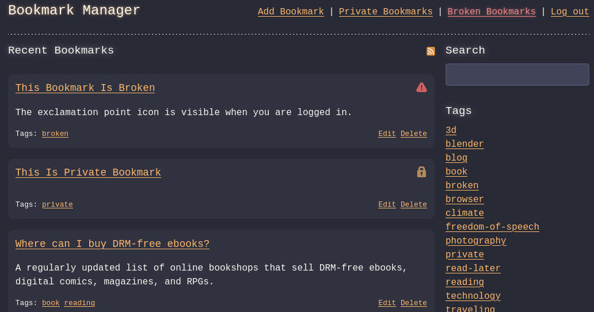

En pidä kauheasti siitä, että kirjanmerkit on sidottu yksittäiseen selaimeen tai selainvalmistajan tarjoamaan pilvipalveluun. Testasin joitakin itse hostattavia ratkaisuja, mutta kun mikään niistä ei puhutellut, päätin tehdä oman. Samalla tuli hyvä tilaisuus tutustua ruudunlukijoihin ja esteettömyyteen.

<!--more-->

### Sosiaaliset kirjanmerkit

2000-luvun alkupuolella Internetin syövereissä syntyi ajatus sosiaalisista kirjanmerkeistä. Itse tutustuin ajatukseen vuonna 2003 perustetun [Delicious](https://en.wikipedia.org/wiki/Delicious_(website))-palvelun myötä. En kuitenkaan erityisemmin pitänyt palvelun käyttöliittymästä. Hieman myöhemmin syntyi [Magnolia](https://en.wikipedia.org/wiki/Gnolia), joka teki käytännössä saman kuin Delicious, mutta itseäni miellyttävämmällä tavalla.

Sivuhuomautuksena täytyy mainita, että Delicious-palvelun osoite oli alunperin del.icio.us ja Magnolian ma.gnolia.com. Osattiin sitä kikkailla domain-nimillä ennenkin! 

Ikävä kyllä Magnolian tarina päättyi vuonna 2009, kun palvelun tietokanta korruptoitui eikä käyttäjien luomaa sisältöä saatu koskaan palautettua. Delicious puolestaan siirtyi yritykseltä toiselle, kunnes Pinboard osti sen ja päätti ensitöikseen kuopata palvelun. Domainin takaa löytyy nykyään AI-roskaa generoiva palvelu - kuinka yllättävää.

En juurikaan käyttänyt palveluiden sosiaalisia ominaisuuksia, mutta niiden kautta löysi mielenkiintoista sisältöä. Etenkin alkuvaiheessa palvelua käyttivät nörtit, joten sisältökin oli sen mukaista. Siellä suosituimmat linkit eivät johtaneet poliittisiin aiheisiin. Ikävöin sitä aikaa.

Itselleni palveluiden suurin hyöty oli se, että pääsin linkkikokoelmaani käsiksi mistä tahansa. Pystyin käyttämään mitä tahansa selainta ja linkit olivat saavutettavissa vaikka nettikahvilasta - silloin kun niitä vielä oli. Palveluissa piili kuitenkin yksi iso ongelma: kirjanmerkit olivat käytännössä yhden yrityksen omaisuutta ja heidän hallinnassaan. Kuten historia osoitti, sinne katosi käyttäjien tuottama data ja minunkin kirjanmerkit.

Silloin en tuollaisia asioita tullut ajatelleeksi, mutta nykyään olen asian suhteen paljon viisaampi. Siksi pyrin itse pyörittämään palvelut joita tarvitsen. Haluan, että minä omistan oman datani.

Testasin muutamien päivien aikana joitain itse hostattavia bookmark managereja. Joukossa oli sellaisia kuten [Linkding](https://github.com/sissbruecker/linkding), [Shiori](https://github.com/go-shiori/shiori) ja [LinkAce](https://www.linkace.org/), joista viimeisin oli lähimpänä sitä mitä kaipasin. Sekään ei kuitenkaan puhutellut minua ja tuntui tarpeettoman monimutkaiselta.

Keräsin tarpeeni ylös, poimin kivat ideat muiden ratkaisuista ja päätin tehdä oman. Tuloksena syntyi mielikuvituksellisesti nimetty [Bookmark Manager](https://github.com/saaste/bookmark-manager).

### Tein itse ja säästin

Kaikessa yksinkertaisuudessaan Bookmark Manageriin voi tallentaa linkkejä, joille voi antaa otsikon, kuvauksen sekä läjän tageja. Lähtökohtaisesti kirjanmerkit ovat julkisia, mutta voit merkitä ne myös yksityiseksi, jolloin ne eivät näy kirjautumattomille käyttäjille. Tämä on itselleni tarpeen, koska osa omista kirjanmerkeistä osoittaa sisäverkossa pyöriviin palveluihin ja osa töihin liittyvistä linkeistä on sellasia, etten välitä niitä laittaa julkisesti näkyviin.

Halusin pitää käyttöliittymän hyvin minimalistisena. Monet kutsuisivat sitä tylsäksi. En halunnut täyttää sitä kuvilla, koska en kokenut niiden tuovan mitään lisäarvoa. Pidän jotenkin terminaalisovellusten estetiikasta ja ne toimivat tämänkin ulkoasun inspiraationa.

Oletuksena sivulla on näkyvissä viimeisimmät kirjanmerkit. Tagia klikkaamalla näkee kyseisen tagin kirjanmerkit. Sovelluksessa on haku, joka kohdistuu nimeen sekä kuvaukseen. Kirjanmerkit voi tilata myös RSS-syötteenä. Nämä ovat ne yksinkertaiset palaset joita kaipasin ja lopputulos on nähtävissä [omalta linkkisivultani](https://links.saaste.net).

Ylläpitonäkymät ovat yksinkertaisia muutaman kentän lomakkeita. Tein kuitenkin pari käyttöä helpottavaa toiminnallisuutta. Sovellus osaa hakea osoitteen perusteella sivun nimen sekä kuvauksen, jos ne vaan ovat tarjolla. Lisäksi tagien lisäämisessä auttaa ominaisuus, joka osaa ehdottaa aikaisemmin käytettyjä tageja ja vähentää näin kirjoittamisen tarvetta.

Minua on aina ärsyttänyt se, että kirjanmerkkikokoelmat alkavat hiljalleen täyttyä toimimattomista ja vanhentuneista linkeistä. Niinpä Bookmark Managerissa saa päälle taustaprosessin, joka käy säännöllisin väliajoin läpi kaikki linkit ja tarkastaa, että ne toimivat. Toimimattomat linkit saa listattua erillisessä näkymässä, josta ne on helppo tarkastaa, korjata tai poistaa.

Rikkinäisistä linkeistä on mahdollista saada ilmoitus. Koska halusin tässäkin tukea avoimen lähdekoodin itse hostattavia ratkaisuja, päätin toteuttaa ilmoitukset [Gotifyllä](https://gotify.net/), joka on itsellänikin käytössä. Hetken aikaa harkitsin myös sähköposti-ilmoitusten tukemista, mutta sähköpostipalvelinten monimutkaisuus sai minut luopumaan ajatuksesta. Enkä oikeastaan pidä sähköpostista, heh.

### Harjoitus esteettömyyteen

Mietin projektia aloittaessa, että yksinkertaisen luonteen takia, se olisi hyvä tilaisuus tutustua näkövammaisten käyttämiin ruudunlukijoihin ja esteettömyyteen ihan yleisesti. Asentelin koneelle [NVDA-ruudunlukijan](https://www.nvaccess.org/download/), joka on harmillisesti tarjolla vain Windowsille. Uusille käyttäjille suosittelen Sami Määtän kirjoittamaa [ruudunlukijan käyttöohjetta](https://samimaatta.fi/kirjoitukset/ruudunlukijan-kaytto-nakevalle/). Käytän ensisijaisesti Linuxia ja kokemus osoitti, että sillä puolella on aika paljon parannettavaa tällä saralla. Gnomen mukana tulee kyllä [Orca-ruudunlukija](https://help.gnome.org/users/orca/stable/), mutta ainakin omalla koneella se ei suostunut lukemaan Firefoxista yhtään mitään. Ainoastaan käyttöjärjestelmän omat valikot saivat siihen eloa.

Minulle oli yllätys, että web-sivun rakentaminen ruudunlukijalle ei ollutkaan tekninen haaste, vaikka olin näin kuvitellut. Suurin haaste tuli minusta itsestäni. Minä en osannut käyttää ruudunlukijaa. Minun oli todella vaikea ymmärtää sanoja monotonisesta robottiäänestä. Vaikka hidastin puheen tahtia todella paljon, minun oli silti vaikea hahmottaa missä yksi sana alkoi ja toinen päättyi. Äänen kuunteleminen oli myös todella raskasta, mutta siihen suurin syy saattaa olla minun oma herkkyys.

Teknisesti yksi tärkeimmistä lähtökohdista on se, että sivun rakenne on se, jossa haluat käyttäjien käyvän sitä läpi. Sen lisäksi on hyvä käyttää HTML-standarissa olevia semanttisia tageja, koska ruudunlukijat ymmärtävät niiden merkityksen ja osaavat kertoa sen myös käyttäjälle. Älä siis käytä `div`-tagia, jos voit käyttää `nav`, `section` tai `article` tageja. Luulin, että ruudunlukijat vaatisivat läjäpäin [ARIA-attribuuttien](https://www.w3.org/TR/html-aria/) käyttöä, mutta niitä tarvitaankin lähinnä erikoistilanteissa, joissa HTML-standardin rajallisuus tulee vastaan. Internet on pullollaan ohjeita käytettävyydestä, mutta itse koin erityisesti [W3C:n käytettävyysoppaan](https://www.w3.org/WAI/tutorials/) hyväksi.

Toinen yllätys oli se, kuinka vieras konsepti näkövammaisten käytettävyys on itselle. Näkevänä tiedän, että ihminen pystyy nopeasti silmäilemään ruudulla näkyviä asioita. Se mahdollistaa tietynlaisen tavan suunnitella käyttöliittymät ja siksi useimmat sivut noudattavatkin hyväksi havaittuja periaatteita.

Ruudunlukijaa käyttävillä tätä mahdollisuutta ei ole, joten heidän on käytävä asiat läpi järjestyksessä. Mutta mikä on sopiva järjestys? Kuinka ruudunlukijaa käyttävä voi helposti hyppiä sivun osista toiseen? Sitä on tottunut tiettyihin suunnitteluperiaatteisiin näkevänä, mutta minulla ei ole hajuakaan millaiset asiat tekevät näkövammaisten käytettävyydestä parempaa.

Kokemus osoitti hyvin oman vajavaisuuteni ja muistutti myös siitä, että ruudunlukijan käyttö ei ole jotain mihin voi vaan hypätä. Sen käyttäminen on taito, joka on opeteltava.

Läheskään kaikki näkövammaiset eivät käytä ruudunlukijaa. Olen ymmärtänyt, että heille tärkeää ovat riittävän suuri kontrasti, oikeanlaiset värit sekä käyttöliittymän kyky skaalautua. Näkövammaiset voivat joutua zoomaamaan tai käyttämään hyvin suurta fonttia, joten käyttöliittymän on taivuttava näihin käyttötapoihin. Toivottavasti onnistuin. Jos koet, että käyttöliittymässä on edelleen esteettömyysongelmia niin luo ihmeessä [GitHub-issue](https://github.com/saaste/bookmark-manager/issues) tai laita minulle viestiä [Mastodonissa](https://mementomori.social/@saaste).

Sovellus on minulle tyypilliseen tapaan aina vaiheessa. Se on ainakin tällä hetkellä suunniteltu ensisijaisesti minulle ja sen jälkeen lähinnä tekniikasta ymmärtäville nörteille, joten käyttöönotto vaatii jonkin verran osaamista.
