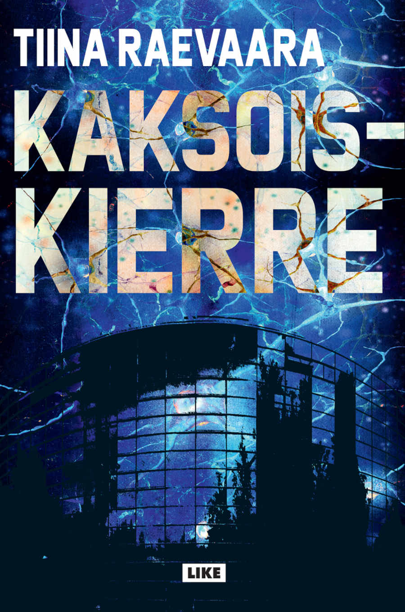

Lukemisen suomiteema jatkuu. Vuoden toinen suomalainen kirja on Tiina Raevaaran jännäri Kaksoiskierre. Tämäkin kirja päätyi luettavaksi Mastodon-suositusten kautta.

<!--more-->

Tarina sijoittuu Helsinkiin ja Viikin kampukselle. Aikaisemmin geenitutkimuksen parissa työskennellyt **Eerika** asuu vanhassa puutalossa tyttärensä **Tuulikin** sekä taitelijan ja lapsuudenystävänsä **Kristiinan** kanssa. On joulukuu. Helsingin Sanomat uutisoi Kristiinan entisestä pomosta ja väitöskirjaohjaasta **Pajusuosta**. Hän on palannut Yhdysvalloista Suomeen ja ylistää, kuinka hänen alkava tutkimusprojektinsa tulisi pelastamaan elinsiirtojonoihin kuolevat lapset.
 
Kristiina olisi halunnut unohtaa Pajusuon. Hän on ihminen, jota Kristiina ei halua elämäänsä. Hän vihaa Pajusuota, mutta todellinen syy hänen välttelemiseen on heidän aikaisempaan työprojektiin liittyvä salaisuus. Eerika on varjellut salaisuutta vuosien ajan, eikä sitä tiedä hänen lisäksi kukaan muu. Paljastuessaan se voisi tuhota Eerikan ja hänen perheensä elämän - tai aiheuttaa jotain vieläkin pahempaa.
 
Seuraavana päivänä puhelin soi. Soittaja on Pajusuo. Hän pyytää Eerikaa mukaan uuteen projektiin, jossa tarvitaan juuri hänen osaamistaan. Eerika haluaisi kieltäytyä, mutta ei pysty. Pajusuo sanoo tietävänsä Eerikan salaisuuden ja uhkaa julkaista todisteet, mikäli Eerika ei suostu mukaan.
 
Tästä käynnistyy tapahtumien sarja, joka edetessään paljastaa jatkuvasti uusia salaisuuksia ja tekee Eerikan elämästä koko ajan vaikeampaa. Kaiken lisäksi valkoinen auto on alkanut seurata Tuulikkia koulumatkalla. Kuka häntä seuraa? Mitä hän haluaa? Kehenkään ei voi luottaa, eikä kukaan tunnu olevan ihan sitä miltä näyttää.
 
Kaksoiskierre vie lukijan geeniteknologian ja eettisten kysymysten äärelle. Se on ensisijaisesti jännäri, mutta geeniteknologian kiemurat antavat sille scifimäisen kuorrutuksen. Raevaaran kokemus tiedekolumnien kirjoittajana näkyy. Hän ei tuhlaa sivuja maailman rakenteluun, vaan tarina käynnistyy heti ensimmäiseltä sivulta. Tarpeetonta täytettä ei juurikaan ole. Pidin todella kovasti siitä, kuinka kirja tempaisee lukijansa välittömästi toiminnan keskelle ja pitää siellä viimeisille sivuille asti.
 
Raevaara onnistuu loistavalla tavalla yhdistämään Eerikan päänsisäistä dialogia ulkoisiin tapahtumiin. Lukija tietää aina yhtä paljon kuin päähenkilö. Eerikan ajatukset ja muistot ovat se tapa, jolla kirja rakentaa tapahtumia ympäröivän maailman. Ja tekee sen vieläpä hyvin.
 
Tarinan keskeiset henkilöt ovat loistavasti kirjoitettuja eikä niitä ole liian montaa. Osa sivuhahmoista jää hieman etäisemmäksi, mutta tämä lienee ihan tarkoituksellista ja istuu kirjan kerrontaan, sillä hahmot ovat etäisiä myös Eerikalle.

Erityisesti Eerika ja Kristiina ovat todella mielenkiintoisia hahmoja. Kumpikaan ei ole perinteinen hyvä sankarihahmo. He ovat varsin tavallisia ihmisiä, mutta molemmista paljastuu piirteitä, jotka saavat lukijan miettimään, että kuka oikeastaan on hyvä tai paha. Missä raja kulkee? Sama pätee lähes kaikkiin hahmoihin. Jokaisen hyvyys ja pahuus riippuu paljon siitä, mistä näkökulmasta asioita katsoo.
 
Jos kirjasta pitäisi jotain negatiivista sanoa, niin tarinassa on pari kohtaa, jossa päähenkilön ajattelun ja toiminnan logiikka tuntuivat hieman epäuskottavalta. Nämä olivat kuitenkin niin mitättömiä epäkohtia, etteivät ne vaikuttaneet omaan lukukokemukseen juuri lainkaan.
 
Kristiinan tyttö Tuulikki jäi itselleni harmillisen etäiseksi hahmoksi. Vaikka hänellä on tarinassa selkeä rooli, minun oli jotenkin vaikea kiinnostua siitä mitä hänelle tapahtuu. Olisin kaivannut tyttöön lisää persoonallisuutta. En ole itse erityisen lapsi-ihminen, joten vaikeus samaistua hahmoo saattoi johtua myös tästä.
 
Itse koin kirjan aivan pirun jännittäväksi. Päivä kerrallaan etenevä tarina kiristää otettaan jatkuvasti ja minun oli todella vaikea laskea kirjaa käsistäni. Mikä parasta, Raevaara onnistuu päättämään kirjan tyydyttävällä tavalla. Se jättää osan asioista lukijan mielikuvituksen varaan, mutta tekee sen hyvällä tavalla. Kaksoiskierre pistää käyttäjän pohtimaan myös tiedettä ja taidetta sekä sitä, mitä niiden nimissä on hyväksyttävää tehdä.
 
Aivan timanttinen lukukokemus ja saa ehdottomasti minun suosituksen!