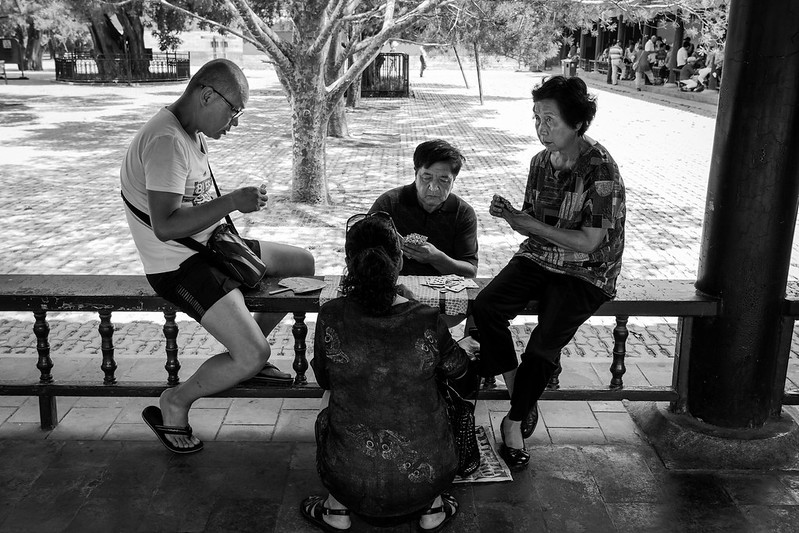

Ole reipas. Ole ahkera. Ole tuottava. Käytä kalenteria ja suunnittele. Näillä ohjeilla koetin joskus epätoivoisesti elää. Näitähän yhteiskunta usein peräänkuuluttaa. Yhdessä kohtaa sain kuitenkin tarpeekseni ja päätin muuttaa tapaani elää. Se oli hyvä päätös, sillä voin nykyään paljon paremmin.

<!--more-->

### Kalenterin orja
Länsimaissa on vahva suorittamisen kulttuuri. Kapitalistisessa, jatkuvaan kasvuun perustuvassa yhteiskunnassa jokaisen pitäisi olla tuottava. Meillä täällä Suomessa etenkin vanhempi sukupolvi on kasvanut siihen, että oma hautapaikka lunastetaan kovalla työllä.

Kaikki pyritään muuttamaan mitattaviksi suureiksi, eikä vapaa-aikamme ole siltä vapaa. Kännykkä mittaa softiin käytettyä aikaa, urheilukellot askelia ja sormukset unta. Monet ihmiset elävät täysin kalenterin varassa, jossa päivän jokainen hetki on suunniteltu ja optimoitu. Kännykkä muistuttaa piippauksella kaikesta.

Töissä käydään kehityskeskusteluja, koska aina pitää pyrkiä olemaan vähän parempi. Jos sinulla ei ole halua olla parempi, sinussa on oltava jotain vikaa. Eihän terve ihminen voi olla tyytyväinen itseensä, eihän?

Olin itse osa tätä järjestelmää 90-luvulla ja 2000-luvun alkupuolella. Kaiken piti olla aikataulutettua, suunniteltua ja kalenteriin merkittyä. Mielessä oli pidettävä ajatus jatkuvasta kehittymisestä, koska muuten jäisi jälkeen. Jälkeen missä? En tiedä, mutta ei silloin tällaisia mietittyä.

Ahdistuin jos elämääni tuli jotain kalenterin ulkopuolelta. Yllätykset sotkivat tarkat suunnitelmat. Näin jälkeenpäin katsottuna tuntuu vitsikkäältä, että elämän optimointi ei tuottanut käytännössä mitään hyvää, mutta synnytti paljon tarpeetonta ahdistusta. Joskus 2000-luvun alkupuolella elämässäni tapahtui sarja vastoinkäymisiä, ja niiden seurauksena mietin arvojani uudelleen. Suorittaminen ja aikatauluttaminen sai jäädä.

Nykyään en jaksa suorittaa. En edes halua suorittaa. Voin paljon paremmin, kun suurin osa päivistä on tyhjiä ja vapaana elämälle ja sen tarjoamille mahdollisuuksille. Jos elämä ei tuo mitään yllättävää, lähes jokainen päivä on tarkoitettu rentoiluun. Se ei tarkoita toimettomuutta vaan sitä, että voin tehdä mitä haluan.

Olen kiitollinen siitä, että olen tehnyt elämässäni valintoja, jotka mahdollistavat suorittamisesta vapaan arjen. Minusta on kiva olla se kaveripiirin tyyppi, jolla on aina aikaa ja jonka kanssa asioiden suunnitteleminen on helppoa.

### Jatkuva kehittyminen

Pelkän välttelemisen sijaan olen alkanut inhota suorittamista ja tehokkuusajattelua. En pidä siitä omassa elämässäni enkä ympäröivässä maailmassa.

Jos jossain olen saanut toistuvasti kokea tehokkuusajattelua, se on töissä. Yritykset pyrkivät jatkuvaan kasvuun, mutta tämä sama ajatus tuntuu periytyvän myös työntekijöihin ja siihen mitä heiltä odotetaan. Pitäisi kasvaa, kehittyä ja olla koko ajan parempi. Jostain syystä enää ei riitä, että suoriutuu töistään hyvin. Pitäisi kehittyä niin, että päätyy olemaan ylipätevä nykyiseen tehtävään ja voisi siirtyä seuraavalle portaalle - mitä ikinä se tarkoittaakaan.

Vuosi toisensa jälkeen sain istua kehityskeskusteluissa kuuntelemassa samaa viestiä: minun pitäisi olla parempi. Mielestäni olin, mutta silti se ei riittänyt. Vastasin silti aina, että ei kiinnosta. Minusta on mukavaa olla rivityöntekijä ja olen siinä hyvä. Vuosien saatossa työkalupakkini on lukuisten erilaisten projektien myötä kasvanut valtavaksi. Ei minun tarvinnut suorittaa ollakseni parempi. Minun piti vaan keskittyä töiden tekemiseen. Onneksi nykyinen työnantajani osaa arvostaa sitä, eikä minun tarvitsee elää jatkuvassa kehitystarpeessa.

Uuden opettelussa ei ole kuitenkaan mitään vikaa. Se vaatii joskus aikaa, vaivaa ja työtä. Se on kuitenkin suoritus, joka on väliaikainen eikä pysyvä tila. Odotus jatkuvalle kehittymiselle on minusta lähinnä masentavaa. Se ohjaa herkästi siihen, ettet koe koskaan olevasi riittävä.

### Tehokas ympäristö

Koska inhoan suorittamista ja tehokkuusajattelua, katseeni kohdistuu niihin helposti.

En ole oikein koskaan tajunnut ihmisiä, jotka lähtevät lomamatkalle, suunnittelevat jokaisen päivän valmiiksi, juoksevat hirveällä kiireellä kaikki turistinähtävyydet ja tulevat sen jälkeen kotiin streessaantuneena ja väsyneenä. En ymmärrä, miksi työn lisäksi myös lomat pitää suorittaa. Meneekö loma hukkaan, jos kaikki ei suju kellontarkasti?

Tällaiseenn ihmisten tekemään suorittamiseen törmää aika-ajoin, mutta se on harmitonta. Se voi vaikuttaa heihin, mutta harvemmin minuun. Sen sijaan ympäristöllä on hyvin suuri vaikutus myös omaan elämääni.

Kaupunkisuunnittelu on kiinnostanut minua pitkään. Tehokkuuden rakentama ympäristö on asia, joka saa minut toistuvasti huonolle tuulelle. Yleensä se kiteytyy siihen yksinkertaiseen ajatukseen, että ihmisten pitäisi päästä paikasta toiseen mahdollisimman nopeasti. Tärkein mitattava asia tuntuu olevan matkaan käytetty aika.

Kaupungit ovat paikkoja, joiden pitäisi olla viihtyisiä. Kävely ja pyöräily ovat molemmat liikkumismuotoja, jossa matka itsessään voisivat iso elämys. Tämä on helppo huomata silloin kun viettää aikaa sellaisessa paikassa, joka on suunniteltu oleskeluun ja viihtymiseen. Ikävä kyllä monet paikat on suunniteltu oikoreitiksi, joiden ohi pitää päästä mahdollisimman nopeasti.

Tämä tehokkuusajattelu selittää osaltaan sitä, miksi todella monet paikat ovat tylsiä, ankeita ja epämiellyttäviä. Niiden suunnittelussa ei ole huomioitu viihtymistä eikä niitä ole rakennettu sellaiseksi, että ihmiset haluaisivat pysähtyä, nauttia ja viipyillä. Siksi joka paikka on täynnä autoja ja niiden parkkipaikkoja. Siksi kaikkialla on niin meluisaa. Joka paikka rakennetaan liikenne edellä, koska on kiire ja elämä ei odota. Viihtyvyys saa järjestelmällisesti väistyä tehokkuuden tieltä.

Ympäristö saa minutkin välillä suorittamaan. Kiroan sitä, kuinka raitiovaunu meni nenän edestä ja nyt joudun odottamaan viisi minuuttia seuraavaa. Viisi minuuttia. Naurettavaa. Onneksi usein havahdun ajatuksieni järjettömyyteen, pysähdyn ja käytän ajan rentoiluun. Keskityn nauttimaan ympäristöstä, jos se vaan on mahdollista.

Ehkä tämä selittää sitä, miksi luonnossa on niin helppo olla kiireetön ja suorittamatta. Luonto ei kiirehdi. Se tarjoaa elämyksiä kaikille aisteille ja houkuttelee pysähtymään ja ottamaan rennosti.

### Ei ole pakko suorittaa

Rento ja aikatauluton elämä ei tarkoita saamattomuutta, laiskuutta tai sitä, ettei koskaan oppisi mitään. Opettelen koko ajan jotain. Minulla on aina jokin pieni projekti meneillään. Minä en kuitenkaan suorita tai aikatauluta niitä. Minun ei tarvitse. Pidän mieluummin kalenterin tyhjänä.

Ajattelen, että aikatauluttomuus ja tehokkuusajattelun vältteleminen on keskittymistä elämään. Siitä nauttimista. Se mahdollistaa tässä hetkessä elämisen, kun tulevaisuuden tehtävälista ei huohota niskassa.

En halua olla enää oravanpyörässä, jossa joka päivä paahdetaan suunnitelman mukaan, kello tikittää ja pienetkin yllätykset pilaavat päivän. Illalla mennään nukkumaan ja sama alkaa aamulla alusta. Yritetään olla taas vähän parempi. Vähän tehokkaampi.

Ehkä se sopii joillekin, mutta itse voin paremmin ilman sitä. Minun ei ole pakko suorittaa tai olla tehokas. Eikä tarvitse sinunkaan jos et halua.

