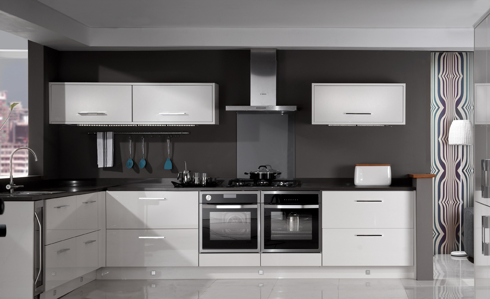

Minimalismi synnyttää helposti negatiivisia mielikuvia. Eikä ihan turhaan. Internetistä löytää mitä kummallisimpia otteita asiaan, eivätkä kaikki niistä ole järkeviä tai kestäviä.

Itse aloin miettiä tavaramäärän vähentämistä vuosia sitten. Silloin syynä oli muutto ja ajatusta ruokki yksi kirja.

<!--more-->

### Jos en käytä, en tarvitse
Tutustuin tuolloin [Pareton periaatteeseen](https://fi.wikipedia.org/wiki/Pareton_periaate), joka tunnetaan myös 80/20 -sääntönä. Periaatteen voi yksinkertaistaa näin: 80 % seurauksista johtuu 20 %:sta syistä.

Minusta oli kiehtovaa, kuinka yksinkertainen periaate toteutuu elämässä ja ympäröivässä maailmassa. Sain käsiini Richard Kochin kirjan **Living the 80/20 Way**. Vaikka en allekirjoita kirjan suoritus- ja tehokkuuskeskeisestä sisältöä, se muistutti minua siitä, etten käytä suurinta osaa tavaroistani. Arvioin, että **95 %** ajasta käytän vain **5 %** tavaroistani. Silti se käyttämätön roina täytti asuntoani ja varastoani.

Olen muuttanut elämäni aikana lähemmäksi 20 kertaa ja inhonnut sitä aina. Samat tavarat kulkeutuivat muutosta toiseen ja joka kerta se on ärsyttänyt. Tämän muuton kohdalla päätin, että se tulisi olemaan erilainen.

Aloin käydä tavaroitani läpi ja aloitin sieltä mistä se oli helpointa: varastosta. Jokaisen tavaran kohdalla minulla oli kaksi sääntöä, joiden perusteella aloin heittää tavaraa pois:
1) Jos minun pitää miettiä, että tarvitsenko esinettä, se lähtee
2) Jos en ole tarvinnut tavaraa vuoteen, se lähtee

Halusin tehdä päätöksenteosta yksinkertaista, mutta helppoa se ei käytännössä ollut. Minulla oli taipumus ladata esineisiin muistoja ja tunnearvoa. Romun pois heittäminen tuntui monen esineen kohdalla todella pahalta. Etenkin jos olin saanut esineet ihmisiltä lahjaksi. Ajattelin, että pettäisin heidät. Entä jos unohdan heidät ja kaikki ne asiat, joista esineet muistuttivat?

Vaikka en ole ollut erityinen omaisuuden haalija, pois heitettävän tavaran määrä tuntui aivan järkyttävältä. Möin isoimmat ja arvokkaimmat esineet, lahjoitin pienempiä käyttöesineitä, mutta suurin osa päätyi taloyhtiön kierrätyslaatikoihin.

Siitä tuli yksi elämäni helpoimmista muutoista. En ole koskaan kaivannut esineitä, joita heitin pois. En totta puhuen edes muista, mistä kaikesta luovuin.

Sen muuton jälkeen en ole halunnut kerryttää samanlaista roskaläjää. Tästä huolimatta tavaraa kertyy kuin huomaamatta. Minun on tehtävä sama inventaario toistuvasti, jotta saan pidettyä elämäni vapaana turhasta roinasta. Nykyään sen on vaan paljon helpompaa ja nopeampaa.

### Ostan tarpeeseen
Tavaroiden pois heittäminen on oireiden lääkitsemistä. Se ei korjaa varsinaista ongelmaa eli sitä, että ihminen hankkii elämäänsä turhaa roinaa.

Ylivoimaisesti suurin osa turhista tavaroista oli minun itseni ostamia. Teki mieli syyttää muita, mutta lahjaksi saatujen tavaroiden määrä oli ihan olematon. Minulta kesti useampi vuosi tajuta, että minun pitäisi muuttaa omia kulutustottumuksiani.

En ollut shoppailija, mutta tein helposti ostoksia hetken mielijohteesta. Kun kuvittelin mielessäni jonkun asian tarpeelliseksi, ostin sen. Iso osa tästä kuvitellusta tarpeesta oli nimenomaan sitä - kuvitelmaa. Todellinen syy oli se, että minä nyt vain halusin jotain. Saatoin käyttää sitä viikon, ehkä kuukauden, joskus jopa vuoden. Lopulta se kuitenkin päätyi kaapin tai varaston täytteeksi.

Nykyään pyrin ostamaan mahdollisimman monikäyttöisiä, kestäviä ja oikeasti tarpeellisia asioita. Tarve on tietenkin venyvä käsite ja osaan edelleen ostaa asioita, joita vain haluan. Sallin sen pienessä määrin. Jos ostan laitteita tai tekniikkaa, käytän yleensä tarpeettoman pitkän ajan sopivan laitteen etsimiseen. Monesti siinä käy niin, että unohdan koko tarpeen enkä osta mitään.

Harva tarve on välitön. Joskus kirjoitan tarpeen itselleni ylös ja palaan siihen seuraavassa kuussa. Yleensä seuraus on se, kuukauden päästä olen unohtanut koko jutun ja säästän nekin rahat.

Vaatteiden kohdalla pyrin siihen, että kaikki vaatteet toimivat keskenään enkä tarvitse miljoonaan käyttökohteeseen eri rytkyjä. Käytän samoja vaatteita kesällä ja tavalla. Talven pakkasista selviän kerrospukeutumisella.

En juurikaan harrasta koriste-esineitä. Minulla on muutamia, mutta isolta osin kotia koristavat viherkasvit. Kaikki tällaiset pienet päätökset ovat johtaneet siihen, että minun ei yksinkertaisesti tarvitse hankkia tavaraa kuin harvoin.

Silloin jos jotain pitää hankkia, pyrin yleensä luopumaan yhdestä tai kahdesta vastaavasta esineestä, jotta roinan kokonaismäärä pienenee tai pysyy samassa. Jos siis haluan ostaa uuden hupparin, minun on luovuttava vähintään yhdestä hupparista. Jos en raaski luopua, en minä silloin myöskään tarvitse uutta hupparia. Yksinkertaista.

### Roina syyllistää
Vuosien saatossa omaisuuden määrä on koko ajan pienentynyt. Huomasin silti, että osalla jäljellä olevasta oli hämmentävä negatiivinen vaikutus. Ne syyllistivät minua. "Miksi et käytä minua?!"

Kun otin kaapista lautasen, se oli aina samasta sarjasta. En käyttänyt muiden sarjojen lautasia, vaikka ne olivat ihan käyttökelpoisia ja ehjiä. Tällaisia havaintoja alkoi tulla vastaan toistuvasti ja huomasin, että ne aiheuttivat negatiivisia tunteita. Minulle tuli jotenkin syyllinen olo siitä, etten käyttänyt esineitä. Ikään kuin olisin ollut niille jotain velkaa.

Saatoin joskus pistää päälleni paidan, joka oli kutistunut pesussa epämukavaksi. Se ärsytti. Käytin sitä yhden päivän, pistin pyykkikoriin ja pesun kautta se päätyi takaisin kaappiin. Juurihan minä sitä käytin ja paita oli ehjä sekä siisti, joten miksi heittäisin sen pois? Hiljalleen kaappiin alkoi luikerrella vaatteita, jotka tuottivat ärsytystä - negatiivisia fiiliksiä.

Päätin, että haluan kotiini vain sellaisia esineitä, jotka tuottavat positiivisuutta. Oli aika tehdä lisää karsintaa. Nyt se oli paljon helpompaa, sillä useimmille tavaroille löytyi koti ja käyttäjä jostain muualta. Minua ei kiinnostanut saada tavarasta rahaa. Osan möin jos se oli helppoa, loput lahjoitin. Tärkeintä oli, että pääsin niistä eroon.

Olemme sanoneet sukulaisille ja tuttaville, että meille ei tarvitse ostaa lahjoja. Meillä on kaikkea mitä tarvitsemme ja usein muiden antamat lahjat päätyvät tuottamaan negatiivisuutta. Vaikka niissä on hyvä ajatus, emme tarvitse niitä. Jos joku ihan välttämättä haluaa jotain hankkia, se voi olla elämys tai vaikkapa lahjakortti kauppaan, jota hyödynnämme harrastuksissamme[^1].

### Muistoja saa olla
En ole täysin päässyt eroon taipumuksesta ladata esineisiin tunnearvoa. Minulla on varastossa laatikko, joka on tarkoitettu muistoesineille.

Sieltä löytyy vanhoja kirjeitä, kortteja, valokuvia, juoksukilpailujen palkintoja ja sen sellaista. Ne eivät ole esineitä joita käytän. Saatan palata niihin kerran kymmenessä vuodessa. Tärkeintä on, että olen rajannut muistot yhteen laatikkoon eivätkä ne ole käyttöesineiden seassa.

Olen tajunnut, että monesti esineistä koettava tunnearvo ei liity itse esineeseen, vaan ajatukseen siitä. Jos esineet ovat pieniä, laitan ne muistolaatikkoon. Isoimmille esineille kehitin toisenlaisen ratkaisun: aloin valokuvata niitä.

Digitaaliset valokuvat eivät vaadi fyysistä säilytystilaa, mutta ne vievät minut samoihin muistoihin kuin fyysinen esine.

### Esineet ovat häiriötekijöitä
Viimeisin havaintoni on ollut se, että esineet ovat usein häiriötekijöitä. Ehkä osa siitä on minun yleistä aistiherkkyyttä, mutta minun on paljon kivempi olla ja helpompi ajatella kodissa, joka ei ole kyllästetty tavaralla. Asioita on myös paljon helpompi säilöä, kun kaapit eivät pursuile tavaraa. Ne pysyvät järjestyksessä melkein itsestään.

Minun ei tarvitse arjessa tehdä valintoja, kun käyttötarkoituksiin on yksi vaihtoehto. Muutimme joulukuussa pienempään asuntoon ja olen nauttinut suuresti uudesta avokeittiöstä, jossa on hyvin niukasti kaappitilaa. Sitä on todella kätevä käyttää, kun kaikki löytyy läheltä. Meillä oli monta kattilaa ja kauhaa josta valita. Ei ole enää. Vähäisempi säilytystila ohjaa siihen, ettemme osta samoja tavaroita useita kappaleita, koska niille ei ole tilaa.

Englanninkielen *clutter* kuvastaa hyvin sitä kokonaisuutta, josta haluan eroon. En tiedä miten sen voisi kääntää suomeksi. Olen huomannut, että voin henkisesti paljon paremmin kun kotini ei ole täynnä turhaa tavaraa, *clutteria*. Kodista tulee paljon levollisempi, se on helpompi sisustaa viihtyisäksi viherkasveilla, ja kaikki siellä olevat asiat tuottavat positiivisia tunteita.

Tykkään meidän nykyisestä kodista, sillä se on juuri tällainen. Asun puolisoni kanssa, joten luonnollisesti täällä on myös hänen tavaroitaan. Hän ei ole aivan yhtä innokas minimalismista, mutta hänkin on oppinut nauttimaan pienemmästä tavaramäärästä.

Pienistä eroista huolimatta olemme onnistuneet luomaan kodistamme ympäristön, joka on vapaa turhasta tavarasta ja jossa on hyvä olla. Esineet eivät synnytä ikäviä tunteita vaan niistä tulee hyvä mieli. Koti ei ole kuitenkaan askeettinen tai tylsä. Koetamme olla minimalisteja kohtuudella. On kiva kuulla, kun vieraat kehuvat kotiamme viihtyisäksi ja siistiksi.

Minimalismia voi harrasta muutenkin kuin kodin tavaroilla, mutta ehkä kirjoitan siitä joskus toiste.

[^1]: Useamman vuoden ajan joulun turvalliset lahjat ovat olleet lahjakortit Playstation Storeen ja lankakauppaan. Ensimmäinen minulle, jälkimmäinen puolisolle.
