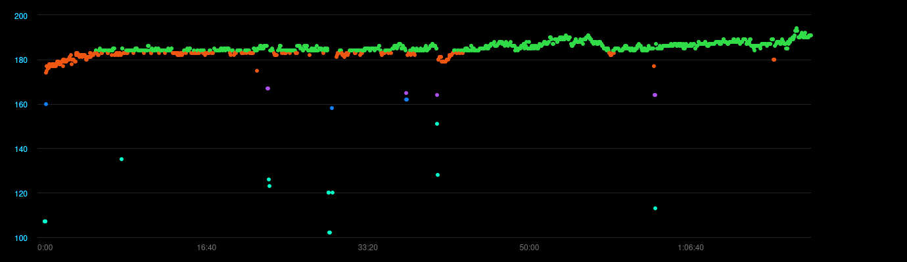

Aikaisemmassa [juoksukirjoituksessa]() kerroin, kuinka onnistuin muutamaan itseni polvikipuisesta juoksijasta ultrajuoksijaksi. En kuitenkaan kertonut, että kuinka se käytännössä tapahtui. Yritän korjata virheen.

<!--more-->



Heti alkuun on muistutettava, etten ole juoksuvalmentaja, fysioterapeutti tai muu juoksemisen, terveyden tai hyvinvoinnin ammattilainen. Minä olen vain juoksija, joka juoksee omaksi iloksi.

Olen kerännyt omat tietoni kirjoista ja muilta juoksijoilta. Osan asioista olen oppinut itse yrityksen ja erehdyksen kautta. Vaikka vinkit istuvat monelle, ne eivät välttämättä sovi kaikille.

**Kuuntele aina omaa kehoasi ja sen ehdoilla!**

### Juoksukengät vaihtoon
Emme ole eläinmaailman nopeimpia, mutta mitä tulee pitkien matkojen juoksemiseen kuumassa ilmastossa, meitä parempia ei ole[^1]. Olemme eläinkunnan parhaita hikoilijoita, mutta sen lisäksi ihmisen jaloista on ajan saatossa kehittynyt uskomaton iskunvaimennin.

Juokseminen on kautta aikojen nähty vahvuuden ja hyvinvoinnin symbolina. Vasta 60-70 -luvun tienoilla se alettiin yhdistää särkyyn ja polvikipuihin. Samoihin aikoihin alkoi myös kaupallisten juoksukenkien myynti. Sattumaako?

Monien juoksukenkien suurimpia ongelmia ovat pehmusteet ja tuet. Silti myyjien puheet kääntyvät helposti nimenomaan niihin. Aina kun menin ostamaan uutta paria, myyjä testasi jalkani, kertoi millaisia tukia sekä pehmusteita tarvitsin, ja möi minulle sopivalla tavalla topatut kengät. Yksikään näistä kengistä ei poistanut polvikipuja.

Pehmusteet ovat ongelmalliset, koska ne opettavat vääränlaiseen askellukseen. Useimpien kohdalla se tarkoittaa kanta-astumista. Kun astut kantapäällä, ohitat täysin jalkojen oman iskunvaimentimen. Huomaat sen varsin helposti, kun hyppäät asfaltilla tai parketilla ja laskeudut suorilla jaloilla kantapäät edellä maahan. Se sattuu, vaikka tekisit aivan pienen hypyn. Kun laskeudut päkiöillä, ongelmaa ei ole.

Toppausten ansiosta kipua ei juuri tunne, mutta iskun aiheuttama energia kohdistuu silti polviin ja lonkkaan. Lisäksi kanta-astuminen vaatii, että sinun on astuttava kehon etupuolelle, mikä voi lisätä polviin kohdistuvaa rasitusta. Monissa juoksukengissä kantaosa on huomattavasti muuta pohjaa korkeammalla, mikä korostaa ongelmia entisestään. Monet juoksukengät ohjaavat kantapäillä tömistelyyn.

Paljasjalkakengissä pehmusteet ja tuet on isolta osin poistettu. Niillä on mahdonta kanta-astua, koska se yksinkertaisesti sattuu liikaa. Käytän arjessa ja lyhyillä juoksumatkoilla paljasjalkakenkiä, mutta en suosittele niitä kaikille. Vaikka jalkamme on luotu juoksemaan, niitä ei ole luotu kovalle asfaltille.

Suosittelen kokeilemaan kenkiä, jossa kantapää olisi mahdollisimman vähän muuta pohjaa korkeammalla - puhutaan myös *dropista*. Urheiluliikkeissä myyjät vaahtosivat usein pronaatiosta, mutta yksikään nykyisistä kengistäni ei sisällä minkäänlaista pronaatiotukea. En tarvitse niitä myyjien puheista ja testeistä huolimatta. Joudut arvioimaan itse, onko pronaatiotuelle todellista tarvetta, vai onko se vain joutavaa myyntipuhetta.

Suosittelen testaamaan kenkää, jossa on:
- Mahdollisimman pieni droppi
- Ohuehko pohja. Asfaltilla paksumpi, pehmeillä poluilla ohuempi.
- Riittävästi tilaa jalkapöydälle ja varpaille
- Ei turhia tukia (oman kropan mukaan)

Omassa käytössä pidemmillä matkoilla ovat **Adidas Adizero Boston 8** -kengät. Olen kuluttanut niitä jo useamman parin. Ne eivät ole paljasjalkakengät, vaan ihan tavalliset juoksukengät joissa ei ole turhia kikkailuja. Droppi on 10 mm.

Arjessa sekä lyhyemmillä juoksulenkeillä käytän **Merrell Vapor Glove 4** -paljasjalkakenkiä, joiden pohja on käytännössä pelkkä kumi, joka suojaa jalkapohjaa haavoilta. Jos juoksen asfaltilla, rajoitan matkat yleensä noin 10 kilometriin. Pehmeämmillä poluilla voin juosta paljon pidempiä matkoja, mutta poluille minulla on myös **Merrell Trail Glove 5** -paljasjalkakengät. Niissä on paksumpi ja kovempi kumipohja sekä parempi pito, joten ne sopivat hyvin juuria täynnä oleville poluille ja teräville kallioille.

Jos kuitenkin päätät testata paljasjalkakenkiä, aloita varovasti. Kun jalat ovat vuosikausia tottuneet topattuihin kenkiin, etenkin jalan takaosan jänteet ja lihakset ovat kutistuneet ja surkastuneet. Liian nopea siirtymä paljasjalkakenkiin voi olla kivuliasta ja aiheuttaa pitkäkestoisia vaurioita. Älä missään tapauksessa lähde tekemään 10 km lenkkejä, vaikka pystyisitkin siihen tavallisilla juoksukengillä. Jotta jalka tottuisi uuteen kävely- ja juoksutekniikkaan, se voi vaatia kuukausia tai vuosia.

Kun olet löytänyt jalkaasi juoksukengät, joilla voi juosta *oikein*, voit siirtyä juoksutekniikkaan.

### Juoksutekniikka kuntoon
Usein kanta-astumisen kaverina kulkevat sellaiset ongelmat, kuten eteenpäin suuntautuva askellus, hidas askeltiheys sekä turha pomppiminen. Näistä etenkin ensimmäinen on todella yleistä ja voi olla myös yksi syy [penikkatautiin](https://www.terveyskirjasto.fi/dlk00317).

Jotta jalat voisivat työntää sinua menosuuntaan, niiden pitäisi olla sinun alapuolella tai takana. Jalkojen päätyminen kehon etupuolelle on turhaa ja usein seurausta kanta-astumisesta. Tämä oli myös minun suurin ongelma ja samalla merkittävin syy, joka aiheutti polvikipuja.

")

Itseäni auttoi, kun aloin miettiä juoksemista jatkuvana kaatumisena. Jos seisot jalat vierekkäin ja lähdet kaatumaan eteenpäin, sinun on laitettava toinen jalka painopisteen alapuolelle tai löydät itsesi kärsällään maasta. Kun tuot jalan eteenpäin, huomaat liikkuneesi puoli metriä. Maan vetovoima hoitaa liikuttamisen, sinun energiasi menee kaatumisen estämiseen. Juostessa tämä kaatuminen tapahtuu yli 150 kertaa minuutissa.

Käytännössä juokseminen ei tietenkään ole pelkkää kaatumista ja joudut käyttämään lihaksia myös eteenpäin menemiseen. Tärkeintä on kuitenkin sisäistää, että jalat pysyvät suunnilleen kropan alapuolella tai sen takana. Älä silti liioittele. Varpaat ja päkiät voivat käydä aavistuksen kropan etupuolella ja kyse on silti ihan normaalista ja tehokkaasta juoksutekniikasta.

Jos kantapäällä ei pitäisi astua, millä sitten pitäisi? Juoksijat tuntuvat jakautuvan kahteen koulukuntaan: osa astuu vahvasti päkiöillä ja osa jalan keskiosalla. Nähdäkseni molemmissa tapauksessa päkiä on se osa jalasta, joka koskettaa ensimmäisenä maapallon pintaa. Erona on lähinnä jalan asento sekä se, kuinka nopeasti muu jalkapohja tulee perässä.

Vahva päkiäastuminen ei sovi itselleni ja tekee pohkeet kipeäksi, joten olen enemmän tasa-astuja. Käytä sitä tapaa, joka on sinulle sopiva, mutta hyödynnä aina koko jalkapohja. Mikäli sipsuttelet koko ajan päkiöiden varassa, eikä kantapää koskaan laskeudu maahan, pohjelihakset ovat jatkuvassa jännityksessä ja seurauksena on helposti kipuja tai loukkaantumisia.

Eteenpäin suuntautuva askel ja kanta-astuminen johtavat herkästi löntystelevään juoksuun, jossa askeleet ovat liian pitkiä ja askeltiheys liian harva. Yleisesti suositeltu askeltiheys eli *kadenssi* on noin **160-180** askelta minuutissa. Jos olet tottunut harppomaan, se voi tuntua aluksi todella nopealta tikuttamiselta.

Juoksuvauhtiin vaikuttaa kaksi asiaa: kadenssi ja askelpituus. Mikäli haluat juosta vähän kovempaa, sinun ei tarvitse sipottaa nopeampaa. Voit pidentää askelta. Muista, että askel pitenee kehon taakse, ei eteen.

Itse harjoittelin tiheämpää askellusta kuuntelemalla juostessa tanssimusiikkia, jossa basso hakkaa 170-180 kertaa minuutissa. Energistä ja tehokasta. Samalla opettelin juoksemaan samalla tahdilla olosuhteista huolimatta. Jos vastassa oli jyrkkä ylämäki, pidin saman askeltiheyden, mutta lyhensin askeltani. Nykyään luonnollinen askeltiheyteni on noin 180-190 ja se muuttuu oikeastaan vain todella nopeissa sprinteissä. 

Viimeisenä on pomppiva askel. Juostessa sinun on tarkoitus päästä eteenpäin, ei ylöspäin. Myös tässä auttaa ajatus siitä, että juokseminen on kaatumista. Anna jalkojen ottaa sinut vastaan ja viedä eteenpäin, mutta älä pompi turhaan, sillä se on vain hukkaan heitettyä energiaa. 

Tähän minulla ei ole antaa mitään erityistä suositusta. Monet urheilukellot kykenevät näyttämään *vertical ration*, joka on askelpituuden ja pystysuuntaisen liikkeen välinen suhde. Mitä pienempi vertical ratio on, sitä isompi osa energiasta menee eteenpäin liikkumiseen. Vaihtoehtoisesti voit pyytää kaveriasi kuvaamaan hidastetun videon juoksustasi ja analysomaan ongelmakohtia siitä.

Suosittelen katsomaan alta Richard Diazin kolmen minuutin videon, joka näyttää paitsi hyvän juoksutekniikan, myös askelpituuden vaikutuksen juoksunopeuteen.



### Harjoittelu, varusteet ja tavoitteet
Kun kengät ja juoksutekniikka ovat kunnossa, on aika asettaa tavoitteet omalle juoksemiselle ja harjoitella oikein.

Minun ongelma on aina ollut liiallinen innostuminen. Se toteutui myös juoksemisessa ja näkyi siinä, että juoksin liian usein, liian kovaa ja liian paljon. Seuraus oli kipeä kroppa ja lopulta loukkaantumiset, jotka vain hidastivat kehittymistä. Älä ole niin kuin minä.

Treenasitpa nopeutta tai matkaa, kehittyminen on prosessi, jota ei kannata kiirehtiä. Vaikka treenaaminen on tärkeää, lepo on monesti sitäkin tärkeämpää, koska silloin lihakset korjaavat vaurioita ja vahvistuvat. Älä aliarvioi levon tärkeyttä vaan suhtaudu siihen harjoittelun osana.

Minun on helpointa seurata juoksemista viikkotasolla. Kun harjoittelen pidempiin matkoihin, tyypillinen viikkotavoite on noin 40-50 km. Käytännössä juoksen muutaman 8-15 kilometrin reitin, joka tarkoittaa vauhdista riippuen noin tunnin lenkkejä. Vaihtoehtoisesti juoksen arkena 2-3 lyhyempää juoksua ja viikonloppuna yhden pidemmän. Mikäli nostan viikkomatkoja nopeasti tuota pidemmäksi, ongelmia alkaa helposti tulla. Viikkomatkaa pystyy kasvattamaan, mutta se on tehtävä hitaasti.

Jos tavoitteenasi on parantaa yleiskuntoa ja henkistä hyvinvointia, juokseminen ei vaadi muuta kuin sopivat juoksukengät. Suosittelen silti monille sykkeen näyttävää kelloa. Syke on usein hyvä indikaattori kehittävästä treenistä ja urheilukelloissa on monia muitakin hyödyllisiä ominaisuuksia.

Sopiva sykealue on yksilöllistä ja riippuu myös iästä ja harjoituksen luonteesta, mutta useimmille hyvä harjoitusalue on 130-160 bpm. Ilman kelloa sopivan sykealueen voi päätellä hengityksestä. Sinun kuuluisi hengästyä, mutta ei niin paljoa, ettet pysty keskustelemaan. Jos et ole epäsosiaalinen erakko niin kuin minä, lenkille kannattaa lähteä kaverin kanssa.

Monipuolisuus on monessa harjoittelussa eduksi, eikä juokseminen ole poikkeus. Perusjuoksuja voi piristää vaihtelemalla matkaa ja nopeutta. Yhdistele polkuja ja asfalttia. Välillä voit lisätä lenkkeihin intervalleja, joissa pingot 100-200 metrin pyrähdyksiä todella lujaa. Voit myös tehdä pidempiä pyrähdyksiä, jossa juokset esimerkiksi 800 metriä 60-80 % teholla ja sitten hölkkäät kevyesti 400 metriä ja annat hengityksen tasaantua.

Tällaisilla satunnaisilla tehotreeneillä on ollut uskomaton vaikutus ainakin oman juoksukunnon parantumiseen.

#### Kymppi
Kaverini ovat joskus kyselleet tavoitematkoista ja -vauhdeista. Heille olen sanonut, että 10 km on loistava ensimmäinen tavoite, koska se on matka johon moni ei kylmiltään pysty. Samalla se on kuitenkin suoritus, joka ei vie kauheasti aikaa, onnistuu ilman erillistä nesteytystä ja energiaa, eikä ole kropalle hirvittävä koettelemus. Iso osa terveistä ihmisistä pystyy siihen leppoisalla, mutta säännöllisellä harjoittelulla.

Aikatavoitteisiin olen vastannut, että uskon monien pystyvän juoksemaan 10 km matkan tunnissa. Silloin jokainen kilometri on juostava kuudessa minuutissa. Se on vauhti, joka ei vaadi pinkomista, mutta ei juurikaan salli kävelyä tai kevyttä hölkkää. Todella moni perusterve pystyy siihen yllättävän vähäisellä harjoittelulla.

Moni pystyy myös 50 minuutin tavoiteaikaan. 5:00/min tahdissa ei voi enää lönniä, vaan siinä pitää ihan oikeasti juosta. Hiki lentää, mutta henkensä edestä ei silti tarvitse repiä.

#### Puolimaraton
21 kilometriä, eli puolimaraton, on kympin jälkeen hyvä seuraava tavoite. Se on matka, joka vaatii selkeää sitkeyttä, koska se tarkoittaa vauhdista riippuen 2-4 tunnin suoritusta. Matkalle kannattaa varata nestettä. Lisäenergiakin voi olla hyväksi, mutta se ei ole välttämättömyys.

Puolimaraton on hyvä ensimmäinen pitkä matka, koska sen voi tehdä omatoimisesti pienellä vaivalla. Harjoitteleminen ei vaadi hurjan pitkiä juoksulenkkejä, mutta ennen varsinaista yritystä on hyvä haastaa itseään ainakin kerran esimerkiksi 15 kilometrin juoksulla.

Koska pitkällä suorituksella neste voi olla tarpeen, suosittelen juoksurepun tai -liivin hankintaa. Itselläni on käytössä **Salomon Advanced Skin 12**, mutta kevyemmälläkin pärjää mainiosti. Vaihtoehtoisesti voit kantaa pientä vesipulloa mukana.

Ensimmäiselle puolimaratonille en asettaisi aikatavoitteita. Omin jaloin maaliin on hyvä ensimmäinen tavoite!

#### Maraton
Juoksemisen klassikkomatka on tietenkin reilun 42 kilometrin mittainen maraton. Monille matka tuntuu mahdottomalta, vaikka iso osa perusterveistä ihmisistä on siihen kykeneväinen. Vauhdista riippuen siinä puhutaan useimpien kohdalla 4-7 tunnin suorituksesta.

Maraton eroaa puolikkaasta erityisesti siinä, että maratonilla useimmilta tyhjenevät kehon hiilihydraattivarastot ennen maaliviivaa. Sitä on vaikea estää, mutta sitä voi hidastaa juoksun aikana nautittavalla lisäenergialla. Pelkillä rasvoilla juokseminen on ikävää tervassa tarpomista. Monissa tapahtumissa reitin varrella on huoltopisteitä, joista saa urheilujuomaa ja pientä syömistä, kuten sipsiä ja suolakurkkuja.

Pitkillä juoksuilla joillakin ihmisillä, kuten minulla, kehon verenkierron prioriteetit siirtyvät sisäelimistä jalkoihin. Tästä voi seurata ruoansulatuksen hyytyminen. Nautittu neste ja ruoka jää hölskymään mahaan ja voi aiheuttaa huonon olon. Siksi onkin tärkeää, että harjoitellessa testailee erilaisia juomia ja energiageelejä, jotta tietää mikä sopii itselle parhaiten. Itse suosin **Noshit vauhtikarkkeja**, jotka ovat ainut lisäenergia, joita pystyn käyttämään - eivätkä nekään aina toimi.

Pitkällä suorituksilla kaikki kropan lihakset alkavat väsyä ja se johtaa helposti juoksutekniikan hajoamiseen. Jatkuva tamppaaminen alkaa tuntua, paikkoja särkee ja monesti kovin taistelu alkaak viimeisellä kymmenellä kilometrillä. Vaikka kipu on kropassa, taistelu käydään pään sisällä. Siksi suosittelen sisällyttämään arjen juoksuharjoitteisiin pienen annoksen henkisiä haasteita. Juokse vaikka hyvin lyhyttä matkaa edestakaisin ja päihitä tylsyys ja turhautuminen. Lähde juoksemaan, kun ulkona on kauhea sadekeli. Opettele sietämään epämukavuutta.

Viimeistään maratonille suosittelen juoksuliivin hankkimista. Välttämätöntä se ei ole, etenkin jos juokset juoksutapahtumassa, jossa nestettä on helposti tarjolla.

Vaikka tavoitematka kasvaa, arkisten juoksulenkkien ei tarvitse olla pitkiä. Itselläni useimmat arkijuoksut ovat noin tunnin mittaisia.

Ennen ensimmäistä maratonia voi olla hyvä tehdä yksi 30 kilometrin koematka. Monille se tarjoaa maistiaisen hiilarivarastojen tyhjentymisestä. Samalla pitkä juoksu on hyvä hetki testata juomia sekä lisäenergioita. Pakollista tämä ei kuitenkaan ole, mutta harjoituksiin kannattaa silti sisällyttää joitakin pidempiä juoksuja. Älä tee kuitenkaan pitkää juoksua lähellä maratonia, jotta ehdit palautua!

Maratonia edeltävä viikko kannattaa käyttää aktiiviseen palautteluun. Juoksemisen sijaan voit kävellä tai jos juokset, pidä lenkit lyhyinä ja hyvin kevyinä. Paria päivää ennen voit vaan levätä ja syödä hyvin. Posketon hiilihydraattien tankkaaminen ei ole kuitenkaan tarpeen. Lähtöaamuna kannattaa syödä omaa kehoa kuunnellen. Älä syö liikaa, koska siitä voi juostessa tulla huono olo. Muista käydä vessassa!

Ensimmäiselle maratonilla en suosittele aikatavoitetta. Yritä päästä maaliin omin jaloin. Jos sinun on välillä käveltävä, kävele. Älä kuitenkaan pysähdy, sillä lihakset menevät nopeasti tukkoon. Useimmilla meistä kroppa selviää kyllä matkasta. Se on pää, joka haluaa luovuttaa. Älä kuuntele sitä. Opettele kuitenkin tunnistamaan huono kipu hyvästä ja keskeytä, mikäli paikat hajoavat. Voit aina yrittää uudelleen.

#### Ultramaraton
Olen aloittelija mitä tulee ultramaratoneihin, joten minulla on niihin hyvin vähän annettavaa.

Ultramaraton on käytännössä mikä tahansa maratonia pidempi matka, mutta ensimmäinen yleinen matka on 50 kilometriä. Sen jälkeen tulevat 50 mailia (80 km), 100 km sekä 100 mailia (161 km). Ylärajaa ei ole. Osa kilpailuista kestää niin pitkään kuin jäljellä on vain yksi juoksija. Maailman pisin virallinen juoksukilpailu on New Yorkissa järjestettävä **3100 mailia (4989 km)** pitkä [Sri Chinmoy Self-Transcendence](https://3100.srichinmoyraces.org/). Siinä juostaan yhtä korttelia ympäri 5649 kertaa.

Monet ultramatkat juostaan luonnossa, jossa korkeusvaihtelut voivat olla hyvin suuria ja maasto vaihtelevaa. Pelkän fyysisen rasittavuuden lisäksi kuvioon tulee myös unen puute sekä vaikeassa maastossa navigointi. Luonnollisesti energiatasapainosta huolehtiminen vaatii paljon tarkempaa suunnittelua. Kaikki tämä on otettava huomioon harjoittelussa.

Normaalilla maraton-treenillä pääsee hyvin lyhyemmille ultramatkoille, mutta pidemmät vaativat säännöllistä määrätietoista harjoittelua useamman vuoden ajan. Tuttavissani on joitakin ultrajuoksijoita. Suurin osa heidän harjoittelustaan koostuu edelleen 10-15 kilometrin matkoista, vaikka he läpäisevätkin yli 100 km tapahtumia.

Mikäli haluat inspiraatiota ultramaratoniin tai juoksemiseen yleensä, suosittelen tutustumaan Courtney Dauwalteriin ja katsomaan hänestä kertovan lyhytdokumentin.



### Pysy terveenä ja nauti
Toivottavasti kirjoituksesta oli jotain hyötyä ja iloa. Muista, että nämä ovat asioita, jotka ovat olleet minulle sopivia. Sinun keho voi vaatia jotain muuta. Pidä aina huoli siitä, että kuuntelet omaa kehoasi, pysyt terveenä etkä loukkaa itseäsi. Älä tee jääräpäisesti asioita vain siksi, että joku muu tekee niin.

Jos et ole aikaisemmin juossut, ensimmäisten harjoitusten jälkeen joka paikkaa kolottaa. Hyvän kivun erottaminen huonosta voi olla vaikeaa. Se on kuitenkin ensiarvoisen tärkeä taito. Jos tunnet, että paikat alkavat hajota, keskeytä. Voit yrittää aina uudelleen. Hiljalleen opit erottamaan hyvän kivun huonosta. Etenkin pidemmillä matkoilla hyvästä kivusta voi tulla ystävä. Se on juuri se kipu, joka ei tapa vaan vahvistaa.

Muista juosta oikeista syistä. Monet lähtevät juoksemaan aikatavoite mielessään. Ehkä se on täydellinen syy juuri sinulle. Ehkä sinua motivoi terveyden ylläpitäminen. Itse löysin aidon juoksemisen riemun vasta sitten, kun luovuin kellon tuijottamisesta ja aloin keskittyä itse juoksemiseen. Siihen, kun voi taittaa matkaa omin jaloin ja nauttia ympäröivästä maailmasta. Keskity matkaan, älä määränpäähän.

[^1]: Lainaus Christopher McDougallilta hänen loistavasta TED-esityksestään [Are we born to run?](https://www.youtube.com/watch?v=b-iGZPtWXzE)
