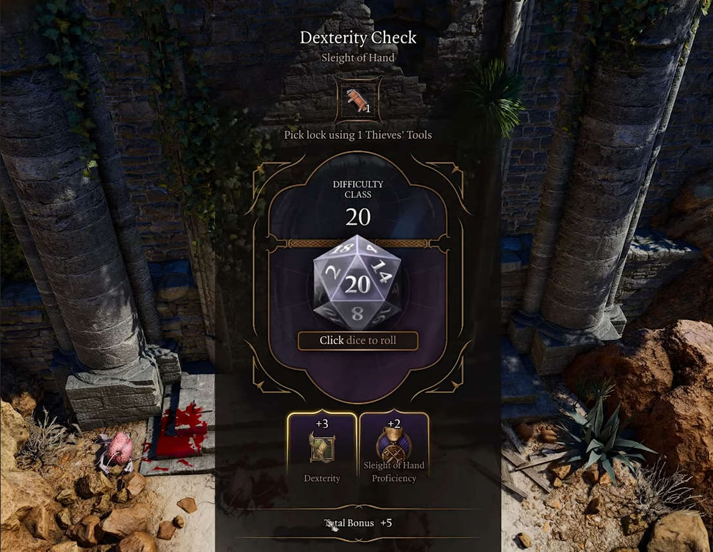
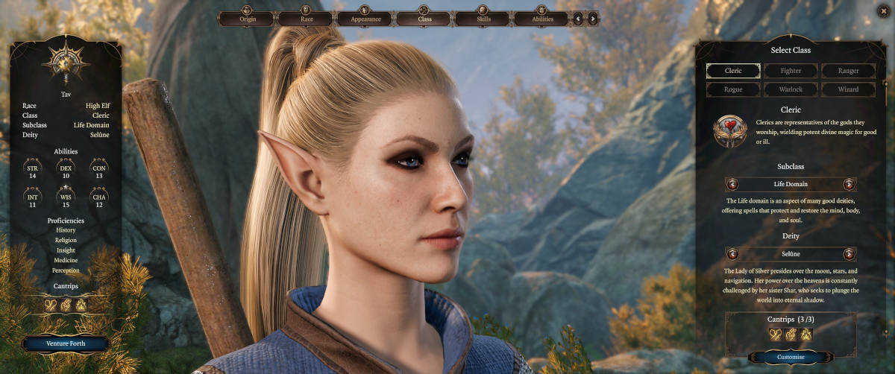

Olen pelannut kohta 100 tuntia [Baldur's Gate 3](https://baldursgate3.game/):sta. En ole pelannut aikaisempia osia ja hankin pelin ensisijaisesti siksi, että kuulin siitä niin paljon hyvää.

Ostaessa en tiennyt mihin olisin ryhtymässä enkä aavistanut, mitä peli minulle opettaisi. Pelin aikana opin, etten ole oikein koskaan osannut pelata roolipelejä.

<!--more-->

### Baldur's Gate 3

Baldur's Gate 3 on videopeli, joka pohjautuu [Dungeons & Dragons](https://dnd.wizards.com/) pöytäroolipeliin. Pohjautuminen ei tässä tapauksessa tarkoita vain sitä, että peli ammentaisi siitä inspiraatiota tarinaan tai hahmoihin. Koko pelimekaniikka noudattaa pöytäroolipelin lainalaisuuksia.

Hahmot rakentuvat samoista palasista, maailmassa toimitaan samoilla säännöillä ja erilaiset kykyjä vaativat toimet sekä taistelu hoidetaan heittämällä noppia. Aina ne eivät näy ruudulla, mutta pelimekaniikka pohjautuu silti nopan heittämiseen.

Olen pelannut vuosien saatossa erilaisia roolipelejä tietokoneella ja konsolilla. Baldur's Gate 3 painii silti aivan omassa sarjassa. Kun tutustuin peliin ennen ostamista, kiinnitin huomiota siihen, että ihmiset suosittelivat pelin **roolipelaamista**. Luulin tietäväni mitä se tarkoittaa pöytä- tai live-roolipeleissä, mutta en ymmärtänyt miten se toteutuu videopeleissä.

Mitä syvemmälle olen päässyt pelin maailmaan, sitä paremmin olen alkanut ymmärtää, mitä roolipelaamisella tarkoitetaan. Samalla olen tajunnut, etten oikeastaan ole koskaan osannut pelata roolipelejä. Toisaalta, yllättävän harva roolipeli antaa siihen hyvät mahdollisuudet. Baldur's Gate 3 onnistuu siinä ja tekee sen hyvin.

### Minmaxing

Vaikka viihdyn videopelien parissa niiden tuoman elämyksen takia, usein pelaamisen taustalla on halu läpäistä peli. Vaihtoehtoisesti se voi olla jonkinlaisen ennätyksen rikkominen. Pidän pitkistä, tarinavetoisista peleistä, mutta silti siellä taustalla on aina jonkinlaisen lopputuloksen tavoittelu.

Siinä ei ole tietenkään mitään väärää ja loppuun pääseminen on usein todella palkitsevaa. Se voi kuitenkin herkästi johtaa tehokkuuden optimointiin. Tällaisessa *minmaxing*-pelaamisessa pelaaja pyrkii minimoimaan heikkoudet ja maksimoimaan vahvuudet. Se pyrkii pelaamiseen, jossa pelin läpäisy tapahtuu mahdollisimman tehokkaasti. Miksi olisit huonompi, jos voit olla parempi?

Kun aloitin oman Baldur's Gate 3 -seikkailuni, en päässyt hahmon luontia pidemmälle, kun meinasin hukkua uuteen informaatioon. Päädyin katsomaan YouTubesta joitakin opasvideoita, jotta pääsisin järkevästi alkuun.

Ei kuitenkaan mennyt pitkään, kun silmieni edessä pyöri videoita, jotka laittoivat eri hahmoluokkia paremmuusjärjestykseen ja kertoivat, kuinka taisteluista selviää mahdollisimman tehokkaasti. Niinpä aloitin pelin samanlaisella optimointiajatuksella. Se oli virhe.

Baldur's Gate 3 olisi pitänyt aloittaa roolipelaamalla, mutta mitä se oikeastaan videopeleissä tarkoittaa?

### Roolipelaaminen

Itse yksinkertaistan roolipelaamisen siihen, että teet pelissä päätöksiä sen mukaan mitä **hahmosi** tekisi, et sen mukaan mitä tekisit itse. Pelaat peliä **hahmosi** näkökulmasta ja elät pelin tarjoamaa maailmaa **hahmon** silmien kautta.

Jos hahmosi on manipuloiva varas, joka on kasvanut varjoissa hiippailemalla ja rikoksilla, sinun kuuluisi tehdä valinnat näihin lähtökohtiin pohjautuen. Tällainen hahmo voi olla reilu, mutta sen moraalinen kompassi osaa olla hyvinkin häilyvä. Hahmo voi pärjätä muiden ihmisten kanssa, mutta pärjääminen voi pohjautua manipulointiin ja uhkailuun. Tällaisen hahmon ei kuulu olla taisteluissa suuren kirveen kanssa heiluva lihaskimppu, vaan pimeydestä iskevä salamurhaaja.

Yksinkertainen määritelmän myötä tajusin, että olen suhtautunut välinpitämättömästi Baldur's Gate 3:n siihen puoleen, joka tekee siitä ainutlaatuisen: mahdollisuus kunnolliseen roolipelaamiseen. Tunsin itse hölmöksi, sillä peli tekee kaikkensa, jotta tämä mahdollisuus olisi näkyvästi esillä.

Peli alkaa monimutkaisella hahmon luonnilla. Siihen saa helposti käytettyä tunnin tai useamman. Monimutkaisuuteen on hyvä syy: peli haluaa sinun keskittyvän hahmon yksityiskohtiin, koska se on roolipelaamisen ytimessä ja tekee siitä mielenkiintoista. Hahmon eri piirteet ohjaavat sitä, kuinka se käyttäytyy eri tilanteissa ja reagoi ympäröivään maailmaan.

Sen sijaan, että peli kertoisi sinulle, kuinka peliä kuuluu peliä, se kysyy sitä sinulta, kuinka haluat sitä pelata. Hahmon luonnissa ei ole kysymys tehokkuudesta. Siinä valitaan tapa, jolla tarina halutaan kertoa ja kokea.

Tarinan edetessä peli tarjoaa toistuvasti mahdollisuuksia nojata luodun hahmon yksilöllisiin piirteisiin. Olipa kyseessä arkinen kohtaaminen tai taistelu, peli palkitsee siitä, että pelaat tavalla, joka aidosti hyödyntää luotua hahmoa. Se palkitsee myös siitä, että huomioit ryhmäsi muiden jäsenten persoonallisuudet. Harva roolipeliksi itsensä luokitteleva videopeli onnistuu tässä kovin hyvin.

Ne saattavat antaa yksinkertaisia vaihtoehtoja toimimiselle, mutta usein tehty valinta johtaa kuitenkin isolta osin samaan lopputulokseen. Joissain peleissä pystyt valitsemaan hyvän tai pahan roolin välillä, mutta sekin ohjaa enemmän hahmon kehittymistä, eikä välttämättä johda kovin erilaiseen tarinaan. Peleissä voi olla muutama erilainen loppu, mutta kokemus ei silti tunnu vapaudelta.

Monen roolipelin ongelmana on se, että ne keskittyvät tarinan päätökseen eivätkä tarinan kerrontaan. Tarina päätyy olemaan putki, johon pelaaja pakotetaan. Putkessa voi olla muutama haara, mutta niitä ei ole montaa ja vapaus on enemmän illuusio. Monesti tehdyt valinnat tuntuvat yhdentekeviltä, etenkin jälkikäteen.

Monet pelit kannustavat hyviin valintoihin. Vaikka jotkut pelit antavatkin mahdollisuuden pahiksena pelaamiseen, usein pelikokemus jää köyhemmäksi kuin hyviksenä pelatessa. Tässä mielessä Baldur's Gate 3 asettaa riman ainakin oman pelihistoriani pohjalta uudelle tasolle. Baldur's Gate 3:ssa pahiksena pelaaminen on aivan yhtä kiinnostava ja värikäs vaihtoehto, kuin mikä tahansa muukin pelityyli.

### Pöytäroolipelit

Vaikka olen pelannut paljon lautapelejä, pöytäroolipelit ovat aina tähän asti olleet minulle täysi mysteeri. En ole ymmärtänyt kuinka ne toimivat. Niissä on ollut aina jotain luotaantyöntävää. Sellaista huonoa nörttienergiaa, josta en pidä, vaikka olen itse iso pelinörtti. Baldur's Gate 3 sai minut kuitenkin kiinnostumaan niistä, erityisesti Dungeons & Dragonsista.

Opin, että pöytäroolipelit ovat enemmän interaktiivista tarinankerrontaa, kuin tiettyyn lopputulokseen tähtääviä pelejä. Niissä voi olla loppu, mutta tarkoituksena on nauttia tarinasta ja pelikokemuksesta. Jotkut pelit voivat kestää vuosia juuri siksi, ettei niissä ole selkeää loppua. Tarina voi aina saada jatkoa, koska pelaajat rakentavat sen itse.

YouTube-videot voivat kuitenkin antaa hyvin virheellisen kuvan siitä, millaista pelaaminen on. Oma negatiivinen näkemys kumpusi siitä, että olen nähnyt aivan liikaa pelejä, jossa pelaajat ovat näyttelijöitä, jotka eläytyvät pelihahmoon äänellään, puhetyylillään ja kehonkielellään. He ovat kokeneita tarinankertojia, jotka osaavat nopeasti improvisoida värikkäitä kuvauksia tilanteista ja tapahtumista. He kykenevät luomaan tilanteisiin sopivaa dialogia muiden hahmojen kanssa.

Suurin osa ihmisistä ei kykene samaan. Olen aina kokenut, että tällainen eläytyminen on minulle liikaa. Se on vaivaannuttavaa, ellei sitä tee hyvin. Ennen kaikkea olen miettinyt, että minusta ei ole siihen. En osaa näytellä, enkä edes halua osata. Oma mielikuvitukseni ei riitä sellaiseen improvisointiin. Juuri tämä pelko on pitänyt minua kaukana pöytäroolipeleistä.

Mikään näistä ei kuitenkaan ole välttämätöntä. Pelejä voi pelata aivan hyvin myös niin, että pelaaja yksinkertaisesti kertoo, mitä hänen hahmonsa aikoo tehdä. Se ei vaadi suurta eläytymistä tai improvisointia. Peliä vuosia pelanneet kertoivat minulle, että iso osa peleistä on juuri tällaisia.

Tärkeintä on, että pelaajat noudattavat pelimaailman sääntöjä. On tietenkin hyvä lisä, jos pelin johtaja, *dungeon master*, omaa jonkinlaiset kyvyt toimia pelimaailman rakentajana, mutta loppujen lopuksi tarina ja maailma syntyvät kaikkien pelaajien toiminnasta. Pelin ei tarvitse olla eeppinen, suurta näytelmää muistuttava kokemus, jos pelaajat eivät niin halua. Sitä voi pelata hyvin lautapelimäiseen tapaan.

Minulla ei ole edelleenkään ole minkäänlaista kokemusta pöytäroolipeleistä, mutta uuden tiedon valossa ne kuulostavat varsin hauskoilta! En tiedä kuinka hyvä olisin niissä, sillä ne vaativat aina tietyn määrän mielikuvitusta ja oikeanlaista mielentilaa. Oikeanlaisessa seurassa olisin kuitenkin valmis kokeilemaan.

Omien pelikavereiden kanssa suurin ongelmana on aina se, kuinka kaikkien aikataulut saadaan mätsäämään ja jengi saman pöydän ääreen. Asiaan perehtyessä opin, että pelaajien ei tarvitse nykyään olla samassa paikassa. [Roll20](https://roll20.net/):n kaltaiset alustat mahdollistavat sen, että roolipelejä voi pelata myös etänä verkon yli.

Tämän kirjoituksen piti alun perin olla Baldur's Gate 3:n arvostelu, mutta päätin, että teen sen vasta sitten, kun olen päässyt pelin tarinan läpi. Minulla ei ole aavistustakaan kuinka pitkään tarina vielä kestää, mutta en olisi yllättynyt, jos siinä menisi vielä toiset 100 tuntia. Arvostelu tulee siis joskus myöhemmin.
