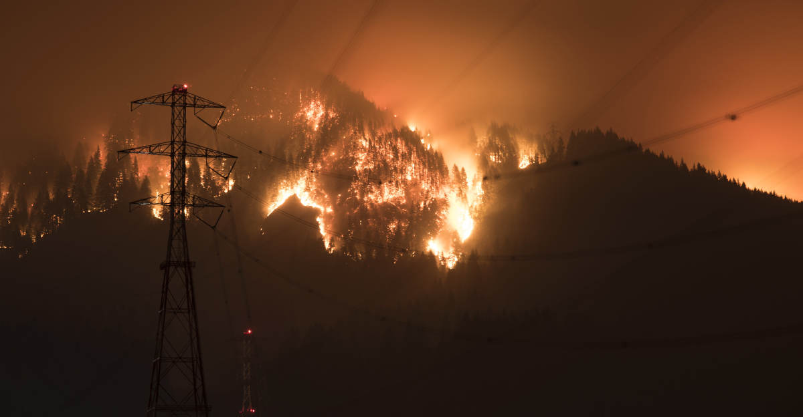

Olen löytänyt itseni viime viikkojen aikana miettimässä sitä, kuinka oma nuoruuteni erosi tämän päivän nuorten elämästä. Nuori minä pystyi haaveilemaan tulevaisuudesta tavalla, joka ei taida useimmille nykynuorille olla mahdollista.

<!--more-->

Edustan itse [X-sukupolvea](https://fi.wikipedia.org/wiki/X-sukupolvi) eli millenniaaleja. Kun mietin omaa nuoruuttani, ensimmäisenä mieleeni tulee huolettomuus. En tarkoita sellaista yleistä huolettomuutta, joka usein liitetään nuoruusvuosiin.

Tarkoitan sellaista, joka tulee siitä, kun tulevaisuus näyttää valoisalta. Mikään omassa nuoruudessani ei viitannut siihen, että tulevaisuus voisi olla synkkää tai vaikeaa. Se oli täynnä mahdollisuuksia ja minun piti vain valita suunta, johon haluaisin mennä. Tee koulut loppuun, hanki töitä ja kaikki siitä eteenpäin sujuu kuin itsestään.

Nuorempana minulla oli ajatus siitä, että maailma menee koko ajan parempaan suuntaan. Olen elänyt analogisen lapsuuden ja nähnyt Internetin tulemisen. Se kaikki loi minuun hurjan määrän uskoa ja loi kuvan siitä, että minä voin itsekin olla rakentamassa parempaa tulevaisuutta. Nuoruudessani puhuttiin otsonikadosta, mutta se taisi olla suurimpia ihmisten puheissa olevia uhkia, eikä silläkään ollut havaittavaa vaikutusta arkeen.

Olen kokenut lapsena laman, mutta nähnyt samalla sen, että siitäkin selviää. Suomi oli maailmalla tunnettu hyvästä koulujärjestelmästä, sosiaaliturvasta ja terveydenhuollosta. Olin ylpeä siitä. Ei maailma silloinkaan ollut täydellinen, mutta asiat näyttivät valoisilta ja toiveikkuus oli vahvana läsnä.

Tuntuu hurjalta ajatella, millaisessa maailmassa nykyiset nuoret elävät. Koulutus, sosiaaliturva ja terveydenhuolto tuntuvat kaikki hajoavan käsiin. Silloin niin lupaavalta tuntuneesta Internetistä ei ole jäljellä kuin muisto. Kaikesta on tullut kaupallista kilpailua, eikä yksityisyydestä ole enää tietoakaan. Jokaisen taskussa on laite, joka koittaa aivopestä sinua milloin mihinkin suuntaan. Ihmiset ovat etääntyneet toisistaan ja ympäristöistä rakennetaan jatkuvasti epäinhimillisempiä. Liikkumisen määrä vähenee jatkuvasti.

Toisin kuin minun nuoruudessa, nuorilla ei tunnu olevan mahdollisuutta oman asunnon hankintaan. Kuilu rikkaiden ja köyhien välillä on vaan jatkanut kasvamistaan. Eläkejärjestelmä on kantokykynsä rajoilla. Sodat ja pandemiat riepottelevat maailmaa. Koko nykyinen jatkuvaan kasvuun perustuva talousjärjestelmä alkaa natista liitoksistaan. Mikä pahinta, planeetta ympärillämme tuntuu palavan. Ilmastonmuutos ja kaikki sen lieveilmiöt ovat konkreettisena läsnä, eikä kukaan tunnu kykenevän tekemään sille mitään.

Olen lukenut useita kirjoituksia siitä, kuinka nuorten mielenterveysongelmat ovat räjähtäneet käsiin. En ole yllättynyt. Myös minulla itselläni on vaikeuksia katsoa maailman menoa ja olla toiveikas - tämä kirjoitus on hyvä osoitus siitä.

Minulla ja nuorilla on kuitenkin se ero, ettei minun tarvitse samalla tavalla olla toiveikas. Minä olen ehtinyt saada elämääni vuosien aikana vakautta ja turvaa, jota nuorilla ei kovinkaan usein ole. Minun ei tarvitse enää todistella kenellekään mitään. Minun elämä ei ole jatkuvaa kilpailua ja itsensä todistelemista. Pääsin positiivisessa mielessä oravanpyörään ja nyt tarvitsee vain juosta paikoillaan.

Jollain tasolla häpeän omaa sukupolveani. Tunnen monia ikätovereita, joista on tullut keski-ikäistymisen myötä samanlaisia juntteja, joita halveksimme itse nuorena. He eivät näe tai edes halua nähdä muuttunutta maailmaa eivätkä suostu tekemään muutoksia omaan elämäänsä. Monet tuhoavia päätöksiä tekevistä päättäjistä ovat millenniaaleja.

On jotenkin karua, kuinka nuorena piti omaa sukupolveaan jonkinlaisena edelläkävijänä, ja nyt se näyttäytyy lähinnä häpeällisenä. Saimme elää nuoruuttamme luotolla, jonka korot nykyiset nuoret saavat maksaa.

Onneksi kaikki millenniaalit eivät ole kuitenkaan pahoja ja toki minunkin sukupolvi on saanut paljon hyvää aikaiseksi. Jokainen sukupolvi on enemmän tai vähemmän oman aikakautensa tuote. Ihmiset ovat erilaisia eikä jokaista voi lokeroida samaan laatikkoon pelkän syntymävuotensa mukaan.

Jokaisella aikakaudella on ollut omat ongelmansa. Minusta tuntuu kuitenkin siltä, että maapalloa kohtaava muutos tulee päihittämään laajuudellaan ja vakavuudellaan kaikki aikaisemmat. Nuoret eivät aikuistu haaveillen valoisasta tulevaisuudesta. Heidän tulevaisuutensa voi koostua elämästä jatkuvasti pahenevien kriisien ja niistä seuraavien sotien keskellä.

Toivon, että tällaiset synkät tulevaisuudenkuvat ovat vain minun negatiivisen ajattelun luoma kuvitelma. Ehkä todellisuus onkin paljon valoisampi ja onnistumme muuttamaan suunnan, johon olemme menossa. Jos emme, en kadehdi tämän hetken nuoria ja lapsia. Jätämme heille melkoisen perinnön ja ehdimme siinä samalla kärsiä siitä itse.

