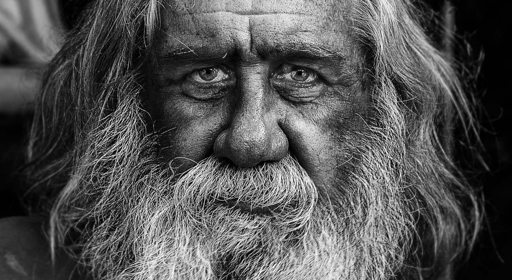

Kuuntelin eilen juoksulenkillä [Feel Better Live More](https://www.youtube.com/watch?v=QMdkgpCvZws) -podcastin jakson, jossa keskusteltiin Bronnie Waren kirjoittamasta [The Five Regrets of the Dying](https://bronnieware.com/regrets-of-the-dying/) -kirjasta. Jakso herätti paljon ajatuksia ja aloin miettiä, että mitä itse kadun elämässäni.

<!--more-->

Olen aina kokenut kuolevien ihmisten katumiset kiinnostavana aiheena. Niissä tuntuu piilevän perustavanlaatuinen opetus, johon nuorempien ja elämäänsä jatkavien ihmisten olisi syytä tarttua.

Aloin kuunnellessa miettiä, että jos saisin nyt kuulla kuolevani, mitä katuisin elämässäni? Minkälaisen elämänohjeen itse antaisin heille, jotka jatkavat elämäänsä?

### Ajatuksia kuolemasta

En ole oikein koskaan osannut pelätä kuolemaa. En tiedä miksi. En ole uskonnollinen tai henkinen ihminen. Minulle elämä ja kuolema tuntuvat lähinnä biologisilta prosesseilta. Meillä on aikamme ja kun se on ohi, kehomme ja siinä oleva energia päätyy takaisin kiertoon, joka on jatkunut miljoonia vuosia. Kuoleman jälkeinen aika tuntuu samalta kuin syntymää edeltänyt aika - yhdentekevältä.

Elin vuosia miettimättä kuolemaa sen enempää, mutta sairastuttuani masennukseen, aihe on käynyt useammin mielessä. En tarkoita tällä itsetuhoisuutta vaan yksinkertaista ajatusta siitä, että kun elämä tuntuu vaikealta ja raskaalta, kuolema näyttäytyy uudella tavalla. Se päättää kaiken hyvän, mutta myös kaiken pahan. Siinä on jotain lohdullista.

Olen välillä miettinyt, että jos nyt saisin kuulla kuolevani, olisin siihen aika paljon valmiimpi, kuin joskus nuorempana, ennen masennusta. Tämä on tietenkin vain arvailua. En voi tietää kuinka reagoisin siihen oikeasti. Silläkin olisi varmasti vaikutusta, että miten kuolisin. Jos niin kuitenkin kävisi, mitä katuisin?

### Tarvitseeko minun katua?

Olen miettinyt tätä eilisestä lähtien ja tullut toistavasti samaan lopputulokseen: en juuri mitään. Olen itse asiassa varsin tyytyväinen siihen, kuinka olen elämässäni toiminut.

En ole koskaan tehnyt mitään erityisen tyhmää. Minulla ei ole rikostaustaa. En ole uhrannut elämääni työlle. Olen isolta osin ollut oma itseni enkä miellyttänyt muita. Olen tehnyt asioita, joita olen halunnut tehdä. Koko elämäni on ollut pitkä oppimisprosessi, josta olen nauttinut.

Olen nähnyt maailmaa, kouluttautunut ja tehnyt sopivan määrän työtä, joka on antanut minulle turvaa elämään. En ole perustanut perhettä, vaikka maailma ja sukulaiset siihen patistivatkin. Minulla on ollut kavereita. Olen menettänyt niitä, mutta saanut uusia tilalle. En ole kuunnellut ihmisiä, jotka sanovat, etten pysty johonkin. Olen haastanut itseäni. Olen pitänyt itseni terveenä, liikkunut ja nauttinut siitä, että kehoni kuljettaa minua eteenpäin.

En vain löydä mitään sellaista, mitä minun pitäisi erityisesti katua.

Kaikesta tästä huolimatta elämäni on ollut täynnä surua ja murhetta. Paljon enemmän kuin olisin halunnut. Minua on käytetty erilaisin tavoin hyväksi ja lopulta se ajoi masennukseen, jonka kanssa saan elää luultavasti hautaan asti. Olen voinut todella huonosti aivan liian paljon. Jos voisin valita, valitsisin elämän, jossa näitä asioita ei olisi tapahtunut.

En voi kuitenkaan sanoa, että kadun noita asioita. Syynä on se, että ne eivät mielestäni johdu minusta. Ne johtuvat muista ihmisistä. Ehkä minä olisin voinut hankkiutua myrkyllisistä ihmisistä nopeammin eroon ja se olisi säästänyt minut pahimmalta. Voisin katua sitä, etten tehnyt niin, mutta samaan aikaan tiedän eläneeni omien arvojen mukaisesti. Minä olen antanut ihmisille mahdollisuuden olla parempi. Olen halunnut antaa aikaa. Olen ajatellut muita ja pistänyt heidät itseni edelle. En minä sitä kadu. Teen niin edelleen ja vaikka teenkin sitä ehkä liian paljon, se tuntuu silti oikealta.

### Ole iloinen ja leikkisä - jos pystyt

Podcastissa yksi viidestä katumuksesta kosketti minua muita enemmän. Se kuului näin: *"I wish I had let myself be happier"*. Happy-sanan voi kääntää iloisuudeksi tai onnellisuudeksi, mutta ymmärsin sen tarkoittavan iloisuutta, leikkisyyttä. Ihmiset katuvat, etteivät antaneet itsensä olla iloisempia.

Tietyllä tavalla kadun tuota asiaa jo nyt. Samaan aikaan kuitenkaan en. Haluaisin olla iloisempi, mutta en tiedä miten. Olen yrittänyt ja yritän edelleen, joten minun ei tarvitse katua ainakaan sitä. Samaan aikaan minua kuitenkin harmittaa se, etten osaa nykyään olla iloinen.

Kerroin taannoin terapeutille, että haluaisin olla iloisempi. Terapeutti kysyi osuvasti, että mitä se oikeastaan tarkoittaa? Miten se näkyy? Ne eivät olleet helppoja kysymyksiä ja pienen mietinnän jälkeen vastasin jotenkin tähän tyyliin: *"Huoletonta elämää. Sellaista, jossa ei joudu kamppailemaan oman päänsä kanssa voidakseen hyvin."*

Vastaus oli rehellinen ja aito, mutta näin jälkeenpäin mietin, että se ei ehkä ollut kokonainen vastaus. Kyllä minulla on hetkiä, kun koen olevani jollain tasolla iloinen. Kun pelaan hyvää videopeliä, kuulen hauskan tarinan tai juoksen upealla metsäpolulla. Osaan välillä jopa nauraa. Ennen kaikkea haluan saada muut nauramaan.

Iso osa siitä kaikesta muusta ajasta tuntuu kuitenkin siltä, että joudun kannattelemaan henkistä hyvinvointiani. Se tuntuu kivenmurikalta, jota raahaan selässäni. Jos en keskity siihen, jalat pettävät ja lyyhistyn kiven alle. Se ei ole sellaista neutraalia olemista, vaan aktiivista toimintaa, joka syö voimia.

Kun mietin elämääni ennen masennusta, tällaista ei ollut. Kun vastasin terapeutille, taisin tarkoittaa juuri tätä. Haluaisin, ettei minun tarvitsisi koko ajan kannatella hyvinvointiani. Se mahdollistaisi sen, että olisin iloinen ihminen, enkä pelkästään iloinen yksittäisissä hetkissä.

En kuitenkaan tiedä, miten pystyn siihen. Podcastissa puhuttiin anteeksi antamisesta. Jotta voisi olla iloinen, pitäisi pystyä antamaan anteeksi muille, mutta ennen kaikkea itselleen. Koen, että olen tehnyt niin. Olen sinut sen kanssa, millainen historiani on. En tiedä miten voisin antaa anteeksi vielä enemmän. Auttaisiko se edes?

Jaksossa puhutaan myös leikkisyydestä. Siitä, että antaa itsensä olla leikkisä ja leikkimielinen. Usein ilo on juuri leikkisyyden seuraus ja monet ihmiset eivät ole iloisia, koska uhraavat leikin muille asioille, kuten työ.

Koen onnistuneeni tässäkin. Minä pelaan, luen kirjoja, seikkailen ja pyrin käyttämään ison osan arjestani tällaisiin asioihin, leikkeihin. Arkeni ei ole täynnä suorittamista, velvollisuuksia tai työtä. Saan edelleen välillä kuulla, että minun pitäisi aikuistua. Aikuistumisella tietenkin tarkoitetaan tylsää, vastuuta täynnä olevaa arkea, jossa ei ole aikaa itselleen. Ei kiitos.

Siltikään en tunne olevani iloinen. Tuntuu, että kyky tuntea iloa katosi minulta masennuksen myötä. Ikään kuin olisin halvaantunut. Minulla on jalat, tiedän mitä käveleminen on, olen tehnyt sitä ennenkin, mutta en pysty siihen silti enää, vaikka kuinka yrittäisin ja haluaisin.

Kadunko sitä etten ole iloisempi? Ehkä vähän. Katumus ei kuitenkaan johdu yrittämisen puutteesta. Tällaisten asioiden miettiminen on kiinnostavaa, koska sitten kun tajuaa mitä voisi katua tulevaisuudessa, asiaa voi alkaa ehkäistä tässä hetkessä.