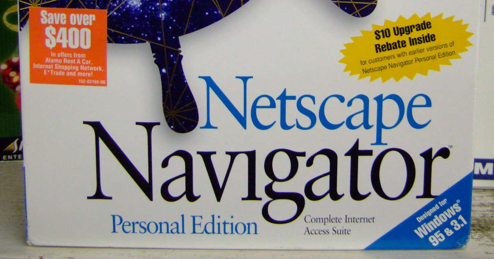

Tutustuin jokin aika sitten IndieWeb-termiin ja minulle tuli välittömästi siitä kotoisa oli. Se oli juuri sitä, mitä olin kaivannut modernin internetin rinnalle. Sen myötä päätin uusia myös kotisivut.

<!--more-->

### IndieWeb
IndieWeb on paluu 2000-luvun alkupuolelle aikaan ennen algoritmeja ja alustoja. Se on vastamyrkky yritysten kyllästämälle Internetille.

Käytännössä IndieWeb on vain [läjä periaatteita](https://indieweb.org/principles), mutta keskeisessä roolissa on se, että omistat oman datasi ja teet sillä mitä haluat. Yksinkertaisimmallaan se voi tarkoittaa vain sitä, että pistät pystyyn omat kotisivut tai blogin. Tuotat sisältöä **itsellesi** sen sijaan, että olisit suuren yrityksen myyntituote heidän suljetussa järjestelmässään.

Sen ei kuitenkaan tarvitse jäädä siihen, sillä elämmehän vuotta 2024. IndieWebin kaverina kulkee myös lyhenne POSSE: **P**ublish (on your) **O**wn **S**ite, **S**yndicate **E**lsewhere.

Ajatuksena on, että julkaiset tuottamasi sisällön omille sivuille ja jaat sen sieltä muualle. Käytännössä tämä voi tarkoittaa vaikkapa sitä, että kun julkaiset uuden blogikirjoituksen, siitä lähtee automaattisesti postaus Mastodoniin. Pysyt edelleen sisällön omistajana ja kontrolloit itse sitä, mihin sisältöä jaetaan.

Yksi helpoimmista tavoista tarjota sisältö omien kotisivujen ulkopuolelle on [RSS-syöte](https://fi.wikipedia.org/wiki/RSS). Näin seuraajiesi ei tarvitse aktiivisesti seurata sivujasi, vaan he voivat käyttää seuraamiseen itselle mieluisia palveluita ja sovelluksia.

Olen jo useamman vuoden ajan pyrkinyt pääsemään eroon yritysten suljetuista järjestelmistä ja korvaamaan ne vaihtoehdoilla, joita pystyn pyörittämään itse omilla palvelimilla. IndieWeb on loogista jatkoa sille. Olen läpensä kyllästynyt siihen, kuinka moderni Internet on yksi suuri mainosalusta, jonka käyttäjät ovat myyntituote ja kauppaa käydään yksityisyyden kustannuksella. Kyllästymistä ei vähennä yhtään tuore AI-crawlereiden armeija, jotka pyrkivät louhimaan kaiken mahdollisen avoimen sisällön, jotta pieni määrä rikkaita ihmisiä rikastuisivat entisestään palveluilla, joita kukaan ei pyytänyt ja joita kukaan ei tarvitse.

Oma palvelin ja siellä pyörivät sivut eivät tietenkään estä sitä kaikkea, mutta se antaa paremman kontrollin. Se varmistaa myös sen, ettei yritys keksi myydä vuosien aikana keräämäänsä dataa AI-hypen hurmoksessa. Voit luottaa myös siihen, että datasi ei katoa yrityskaupan tai konkurssin myötä. Sinun ei tarvitse myöskään murehtia siitä, että tietojasi pidetään panttivankina, kun ilmaisena tarjottu palvelu muuttuukin maksulliseksi.

IndieWebiin liittyy paljon muutakin kuin mitä tässä mainitsin. Suosittelen kiinnostuneita tutustumaan [IndieWeb](https://indieweb.org/)-sivustoon, joka antaa kattavan tietopaketin siitä mistä on kysymys. Sen jälkeen kannattaa hakea inspiraatiota [Rachel Kwonin](https://kwon.nyc/) kokoamasta artikkelilistasta [The internet used to be fun](https://projects.kwon.nyc/internet-is-fun/).

Mikäli sinulla ei ole teknisiä taitoja omien kotisivujen pystyttämiseen, voit aloittaa nostalgisesti nimetyllä [Neocities](https://neocities.org/)-palvelulla, joka ei maksa mitään. Jos koet olevasi epäkiinnostava surkimus, jolla ei ole mitään sanottavaa, vastalääkettä tarjoilee James Gallagherin kirjoitus [100 things you can do on your personal website](https://jamesg.blog/2024/02/19/personal-website-ideas/).

Mastodonissa kannattaa laittaa seurantaan [Robb Knight](https://social.lol/@robb) sekä [Cory Dransfeldt](https://social.lol/@cory).

### Uudet kotisivut
Olen viettänyt muutaman edellisen viikon tutustuen [Hugoon](https://hugo.io/) ja rakennellen uusia kotisivuja. Selailin hirvittävän määrän muiden ihmisten IndieWeb-hengessä tekemiä kotisivuja ja koitin poimia niistä elementtejä, joista itse pidän. Pyrin pitämään kohtalaisen matalaa online-profiilia, joten en jaa elämääni aivan yhtä avoimesti kuin moni muu, mutta vähän kuitenkin.

En ole edelleenkään UI-suunnittelija, joten lopputulos ei silmiä hivele, mutta ei se haittaa. Se on minun näköinen. Minulla on hirvittävä läjä ideoita, joita haluan toteuttaa, mutta johonkin oli vedettävä raja jotta saisin edes jotain näkyvää julkaistua. Nyt tarjolla on vain hyvin staattiset kotisivut. Erilaisten automaatioiden ja muiden kilkkeiden aika on joskus myöhemmin.