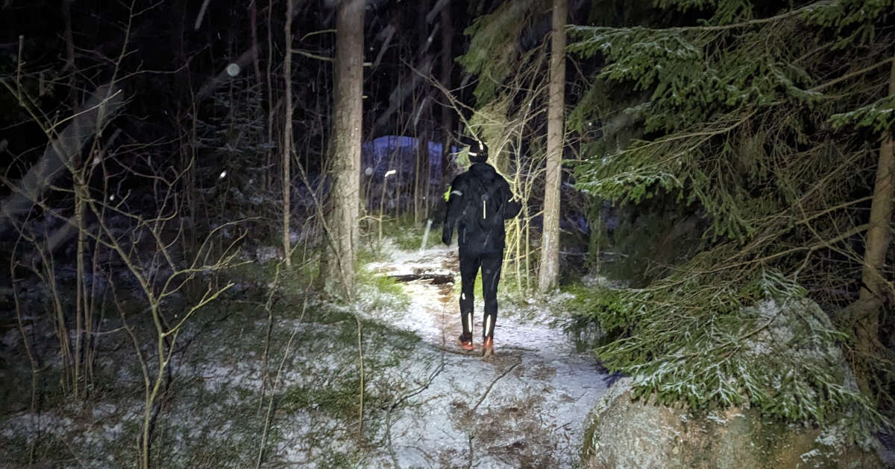
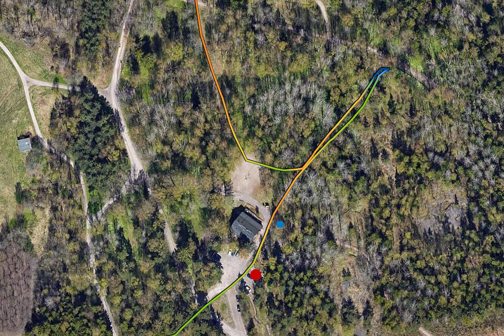
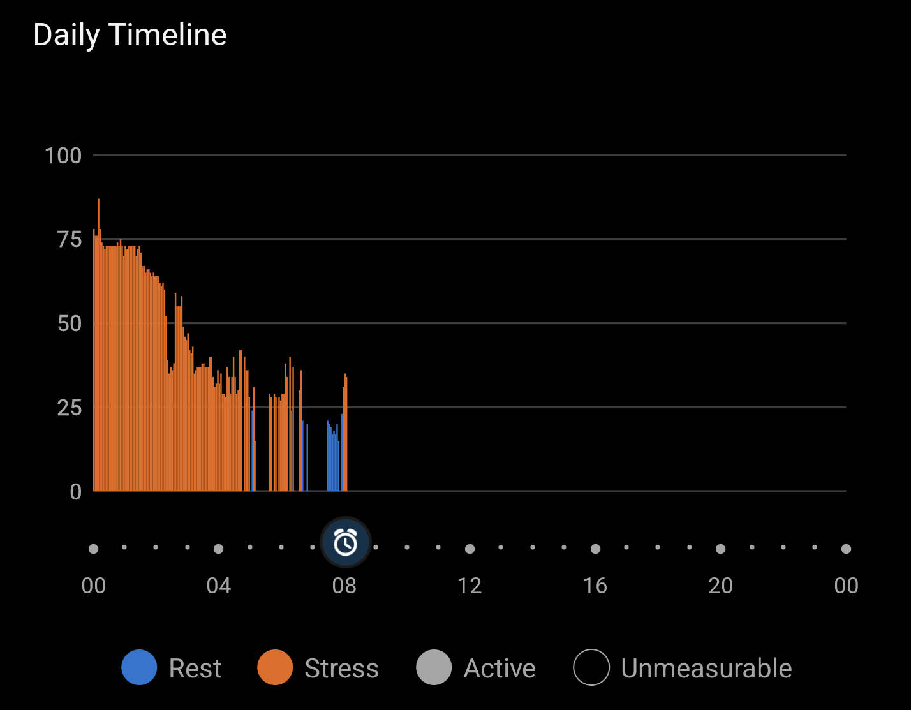

Aivan liian pitkän tauon jälkeen olen saanut mukavalla tavalla kiinni juoksemisesta. Eilen osallistuin vuoden ensimmäiseen juoksutapahtumaan, Helsinki Night Trailiin.

<!--more-->

[Helsinki Night Trail](https://www.helsinkinighttrail.fi/) on Helsingin keskuspuistossa juostava polkujuoksukisa. Reitti ei kulje puiston tyypillisiä ulkoilureittejä pitkin, vaan kiertelee metsässä kiemurtelevilla kinttupoluilla. Välillä polkut olivat niin olemattomia, että niitä oli vaikea erottaa. Reitti on 13 km pitkä, mutta perinteiseen asfaltin tamppaamiseen tottuuneelle se tuntuu paljon pidemmältä ja rankemmalta.

Kapeiden polkujen könyäminen tekee juoksemisesta varsin teknistä. Et voi rentoutua ja vaipua ajatuksiisi, sillä sinun on koko ajan katsottava mihin astut. Juurakot ja kalliot voivat olla todella liukkaita ja metsä on täynnä lätäköitä ja kaatuneita puita, joita juoksijoiden on väisteltävä. Samaan aikaan sinun on varottava, ettet lyö päätäsi puiden ylempiin oksiin. Reittiäkin pitäisi pystyä seuraamaan.

Helsinki Night Runissa kaikkea tätä hankaloittaa se, että se juostaan nimensä mukaisesti iltahämärässä. Jokainen osallistuja juoksi oman otsalamppunsa valossa. Reitti oli merkkitty heijastinnauhoilla.

Jotta touhu ei olisi ollut liian helppoa, luonto päätti tuoda oman haasteensa viskaamalla niskaan takatalven. Ennestään tarkkuutta reitti muuttui aivan painajaismaiseksi liukasteluksi, ja näinkin useamman juoksijan kaatuvan matkan aikana. Nilkat olivat tapahtumassa kovilla. Onneksi en nähnyt yhtään nyrjähtämistä, mutta ihmeenä pidän, jos ensiapuhenkilökunta ei olisi joutunut hoitamaan yhtäkään vääntynyttä nilkkaa. Jopa kokeneemmat polkujuoksijat puhuivat, että reitti oli varsin haastava.

Itse osallistuin tapahtumaan lähinnä siksi, etten ole koskaan juossut maastossa otsalampun valossa. Halusin saada sen kokemuksen. Pidemmät ultrajuoksukisat tapahtuvat lähes aina osittain yöaikaan. Valokeilassa juokseminen olikin mukavaa ja toimi hyvänä keskittymisharjoituksena, sillä polkuja navigoidessa ei todellakaan pystynyt keskittymään muuhun kuin seuraavaan askeleeseen. Pää oli aivan tyhjä ajatuksista.

Mitään aikatavoitetta minulla ei ollut. Koikkelehdin noin 13 kilometrin matkaa yhteensä tunnin ja 24 minuuttia, keskitahdin ollessa 6:41/km. Nousumetrejä kertyi 260.

Jonkin verran aikaa tuhlautui siinä, että eksyin yhdessä kohtaa reitistä. Enkä ollut ainut. Meitä oli noin 15 juoksijan joukko, jotka kaikki lähtivät risteyksestä väärään suuntaan. Syytän tästä reittiopastajaa, joka ei seisonut omalla paikallaan, vaan oli vaeltanut kauemmaksi risteyksestä, jossa hänen olisi pitänyt olla. Kun ohitimme hänet, hän viittoi vain eteenpäin ja huusi "Suoraan vaan!". Todellisuudessa meidän olisi pitänyt kääntyä vasemmalle. Tästä tuli ehkä 150 metrin ylimääräinen hortoilu.

Kisan jälkeen minun oli vielä poljettava lumisateessa kotiin reilu 7,5 kilometrin matka. Säässä ei muuten ollut mitään vikaa, mutta ajolasit olisivat olleet kiva lisä. En meinannut nähdä eteeni kun taivas oli täynnä jäätäviä neuloja. Onneksi olin ottanut mukaan vaihtovaatteet niin ei tarvinnut palella hikisissä juoksurytkyissä.

Kotona puoliso oli seurannut minun etenemistä ja laittanut saunan päälle heti kun pääsin maaliin. Niinpä pääsin suoraan löylyihin kun tulin kotiin. Sen jälkeen ei tarvinnutkaan unta juuri odotella.

Tapahtuma toimi hyvänä muistutuksena siitä, miksi en yleensä harrasta liikuntaa iltaisin. Urheilukellon stressikäppyrä huuti punaista, ja vaikka nukuinkin poikkeuksellisen hyvät yöunet, kehon stressitasot huitelivat pilvissä koko yön. Keho kyllä asettui ja oli normaalilla tasolla aamulla, mutta siihen meni koko yön. Kunnolliseen lepotilaan keho ei juurikaan päässyt.

Palautumisen kannalta tämä ei ole yleensä hyvä asia. Omalla kohdalla kierroksilla käyvä keho johtaa usein myös huonoihin yöuniin. Siksi pyrin tekemään omat liikuntasuoritukseni aina päiväaikaa, tunteja ennen nukkumaan menoa. Samaa suosittelen myös kaikille muille.

Vaikka en nilkkaani onnistunutkaan nyrjäyttämään, tasapainoilu kävi silti nilkan päälle sen verran, että taidan antaa sille lepoa ja pitää seuraavan viikon vapaana juoksemisesta. Voinpahan käydä vähän useammin vaikka kuntosalilla.

ps. Lisäsin kotisivuille erillisen [juoksusivun](), jonne listasin kaikki juoksemani puolimaratonit ja sitä pidemmät matkat.
