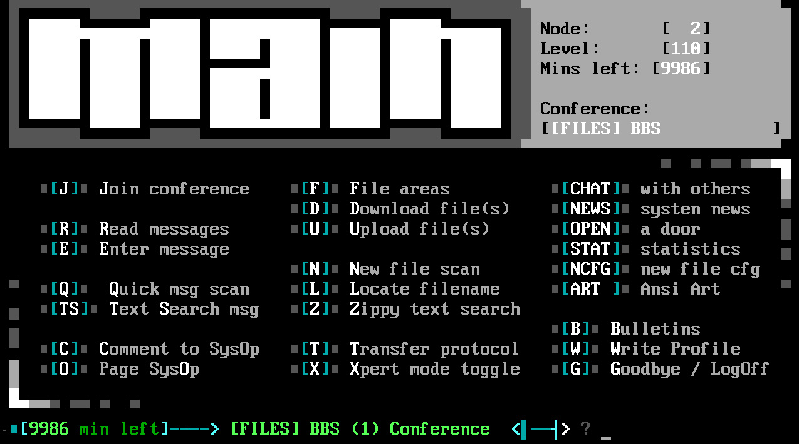

Kuuntelin [The OverAnalyzers -podcastin jakson](https://www.youtube.com/watch?v=EA9EnRN6PfM), joka käsitteli sosiaalisen median jakautumista. Jakson aikana tajusin, että itselläni on kaksi hyvin erilaista kuvaa ja kokemusta, ei pelkästään sosiaalisesta mediasta, vaan koko Internetistä.

<!--more-->

### Online-elämä ennen Internetiä

Kun sain ensikosketukseni online-elämään, Internet oli kyllä tekniikkana olemassa. Se ei kuitenkaan ollut kotikäyttäjien ulottuvilla, eikä kukaan puhunut siitä. Sitä ei käytännössä ollut olemassa keskivertoihmisen arjessa.

90-luvun alkupuolella kaverini oli onnistunut virittelemään kotikoneelleen [BBS](https://fi.wikipedia.org/wiki/BBS)-palvelun eli kotoisammin "*purkin*". Jostain syystä vanhempieni ostamassa tietokoneessa oli *2400 bps* modeemi, jonka tarkoitus ennen tätä hetkeä oli minulle mysteeri. Nyt pääsin sitä kuitenkin käyttämään.

Ensin kuului nopea piipitys, sitten hälytysääni, ja lopulta modeemi alkoi huutaa kuin riivattu. Sitten tuli hiljaista ja hetken päästä kuvaputkimonitorin mustalle ruudulle alkoi tulla tekstiä: "Toimiiko tämä?"

Olin niin innoissani, että kutsuin äitini katsomaan. Muistan, kuinka uskomatonta minusta oli nähdä kaverini tekstin ilmestyvän ruudulle. Keskustelua ei käyty viesti kerrallaan, vaan näin hänen jokaisen näppäimen painalluksen kirjoitusvirheineen ja korjauksineen. Se tuntui maagiselta!

Tästä alkoi oma BBS-harrastukseni. Käytin useita purkkeja, jaoimme kavereiden ja tuntemattomien kanssa tiedostoja ja pyöritin myös omaa purkkia. Mitään todellista tarvetta minulla ei koko touhulle ollut. Minusta se oli vain mukavaa. Pelkkä oman purkin rakentelu ja suunnittelu oli hauskaa puuhaa.

Se oli myös ensimmäisiä hetkiä kun pystyin pelaamaan muiden kanssa puhelinlinjojen yli. En edes tiedä kuinka monta tuntia olen viettänyt [Legend of the Red Dragonin](https://fi.wikipedia.org/wiki/Legend_of_the_Red_Dragon) parissa. Näin jälkeenpäin tarkasteltuna kyseessä saattoi olla minun ensimmäinen online-koukuttuminen.

Vaikka olinkin perheen nörtti, olin innoissani siitä, että äitini alkoi hoitaa laskunmaksuja silloisella "verkkopankilla", joka vastasi käytännössä purkkia. Se tuntui kun koko perhe olisi astunut tulevaisuuteen.

### Wanha Internet
Kun lopulta pääsin Internetiin, se tuntui lähinnä graafisesti komeammalta purkilta. Se ei ensialkuun tuntunut itsestäni erityisen mullistavalta.

Muistan kuinka puhuin aina "nettiin menemisestä". Internetiä käytettiin edelleen modeemilla, joten se vaati erillisen yhdistämisen ja jokaisesta minuutista piti maksaa. Rääkyvä modeemi piti huolen siitä, että koko muu perhe tiesi, kun joku yhdistää nettiin. Se oli hyvä asia, sillä kotona oli vain yksi puhelinlinja ja lankapuhelimen luurin nostaminen olisi katkaissut yhteyden.

Internetin käyttö muistutti paljon BBS:n käyttöä. Etenkin alkuvaiheessa sieltä oli todella vaikea löytää mitään. Tästä syystä pysyin yllättävän pitkään BBS-maailmassa Internetistä huolimatta. Löysin kuitenkin kaiken aikaa uusia asioita ja opin hirvittävällä vauhdilla Internetin mahdollisuuksista.

Ymmärsimme kavereiden kanssa varsin nopeasti, että Internet oli muutakin kuin www-sivut, ja aloimme jakaa tiedostoja **FTP**:llä. Viimeistään **IRC**:n myötä BBS alkoi jäädä unholaan. IRC olikin tällaiselle introvertille ehkä Internetin parhaimpia juttuja. Mukana kulkivat myös uutisryhmät ja hyvin varhaisessa vaiheessa aloin puuhastella omien kotisivujen parissa. Myöhemmin mukaan tulivat eri aihealueiden foorumit.

Voin puhua vain omasta kokemuksesta, mutta tässä kohtaa Internetin sisältö kumpusi lähes yksinomaan ihmisten omasta harrastuneisuudesta. Tietynlaisesta sisäisestä palosta jakaa asioita, jotka kokee itse tärkeäksi tai merkitykselliseksi. Kaupalliset tahot alkoivat toki rakennella sisältöä, mutta nekin olivat lähinnä yritysten kotisivuja, josta löytäisi heidän yhteystiedot.

Sitä fiilistä on vaikea pukea sanoiksi, mutta minusta tuntuu, että monia motivoi halu jättää oma jalanjälkensä Internetin pinnalle. Juuri kenelläkään ei ollut odotusta siitä, että tuhannet ihmiset löytäisivät juuri sinun kotisivut. Tai että heitä kiinnostaisi. Se oli vain siistiä, että pystyi tuottamaan jotain omaa verkkoon, jonka jakoi kaikkien muiden kanssa.

Kun ihmiset alkoivat tehdä näin, yhtä äkkiä Internetiin alkoi muodostua nurkkauksia mitä ihmeellisimmistä aihealueista. Ennen hakukoneita näitä nurkkauksia löytyi hakemistoista, lehdistä ja kavereiden keskusteluista. Eikä pidä tietenkään unohtaa sitä, että koko webbi on suunniteltu linkkien päälle. Kun löysi yhden tiedonmurusen, se vei sinut kymmeneen uuteen. Myöhemmin varhaiset hakukoneet [Altavista](https://fi.wikipedia.org/wiki/AltaVista) ja [Lycos](https://fi.wikipedia.org/wiki/Lycos) muuttivat tilannetta merkittävästi. 

Vaikka sisällön löytyminen parani, sitä leimasi silti tietynlainen harrastuneisuus ja ihmisten halu jakaa itselle tärkeitä juttuja. Se ohjasi samanmielisiä ja samoista aiheista kiinnostuneita ihmisiä yhteen ja sen seurauksena syntyi keskustelufoorumeita.

Itselläni on paljon (hyviä ja huonoja) muistoja frettinetin keskustelufoorumista, jossa nimensä mukaisesti höpistiin vain freteistä ja niiden hoitamisesta. Vielä tänäkin päivänä kehityksessä oleva avoin ja ilmaisen lähdekoodin [phpBB](https://www.phpbb.com/) oli de facto -foorumisovellus. Se mahdollisti foorumin pystyttämisen helposti, nopeasti ja halvalla, kunhan porukasta löytyi edes yksi tekniikasta jotain ymmärtävä.

Suomessa uutismediat, Yle ja Mikrobitin kaltaiset tahot tuottivat aktiivisesti sisältöä, mutta jopa kaupalliset tahot tekivät sitä ihmisiä varten. Jos yritys ei sitä halunnut tehdä, kukaan ei kritisoinut. Jos teki, huippua! Se tuntui olevan ajan henki. Monet yritykset tuntuivat näkevän nettiin tuotetun sisällön jonkinlaisena mainoksena. Se toi näkyvyyttä, eikä maksanut juuri mitään. Sisältö oli kaikille avoin ja ilmaista. Iso osa Internetistä oli sellaista.

Pitkän aikaa sisältö oli sekaisin ympäri nettiä. Juuri mikään ei ollut keskitettyä, ei ainakaan siinä mielessä kuin nykyään. Blogihuuman ollessa kuumimmillaan Internetin sisään syntyi "*blogosphere*", joka oli käytännössä eri puolilla sijaitsevien blogien verkosto. Tietyt blogipalvelut alkoivat saada suosiota, mutta etenkin alkuvaiheessa toiminta oli hyväntahtoista. Juuri kukaan ei kutsunut itseään sisällöntuottajaksi. Korkeintaan blogaajiksi, jos ilkesivät.

Tämä on ensimmäinen kahdesta Internet-kuvasta, joka minulla on. Minulle Internet edusti vuosikausien ajan avoimuutta, hajautusta ja inhimillisyyttä. Sisältö oli hyvin kotikutoista ja sitä ylläpiti ihmisten sisäinen palo ja innostus asioihin. Sisältö oli silti hyvin laadukasta, vaikka toki joukkoon mahtui iso määrä roskaakin. Pidin jo silloin Internetiä huikeana asiana ihmiskunnalle, mutta olin samalla toivoa täynnä. En osannut kuvitella, mitä kaikkea se voisikaan tuoda tulevaisuudessa.

Voisin kutsua tämän aikakauden nettiä ihmisten tai inhimillisyyden Internetiksi.

### Moderni Internet
Jossain kohtaa Internetin sisältö alkoi siirtyä keskitettyihin palveluihin. Palveluihin, joista vastasivat yritykset. Omasta historiasta mieleeni ovat jääneet [Geocities](https://fi.wikipedia.org/wiki/GeoCities), [MySpace](https://fi.wikipedia.org/wiki/Myspace) sekä suomalaiset [IRC-galleria](https://fi.wikipedia.org/wiki/IRC-Galleria), [Mikseri.net](https://fi.wikipedia.org/wiki/Mikseri.net) ja BBS-puolelta ponnistanut [MBNet](https://fi.wikipedia.org/wiki/MBnet). Eikä tietenkään pidä unohtaa [Bloggeria](https://en.wikipedia.org/wiki/Blogger_(service)), jonka Google myöhemmin osti.

Tullessaan nämä muutokset olivat tervetulleita, sillä ne toivat ihmisiä yhteen paikkaan. Heidät sekä heidän tekemänsä sisältö oli helpompi löytää, kun kaikki löytyi saman katon alta. Tässä kohtaa ei käynyt mielessäkään ajatella, mitä tämän muutoksen negatiiviset sivuvaikutukset tulisivat olemaan.

Nykyään tiedämme.

20 vuoden jälkeen Internetin sisällöt eivät juuri palvele ihmisiä. Ne palvelet yrityksiä, osakkeenomistajia, mainostajia ja yksittäisiä miljonäärejä. Jos joskus sisältö oli tarkoitettu ihmisille ja tuotettu ihmisten toimesta, nykyään ihmiset ovat Internetin sisältö. Sitä voi pitää hyvänä ohjenuorana, että jos tuote on ilmainen, sinä olet tuote.

Tiedon haalimisesta suljettujen ovien taakse on tullut suurta bisnestä. Applen, Microsoftin, Metan, Googlen ja Amazonin kaltaiset yritykset tekevät kaikkensa, jotta ihmiset laittaisivat koko elämänsä heidän alustoilleen. Niistä poistuminen on tehty mahdollisimman vaikeaksi. Mitä enemmän heidän palveluitaan käytät, sitä enemmän he voivat kerätä sinusta tietoja ja hyödyntää tuottamaasi sisältöä. Jokainen palvelu pyrkii olemaan The Palvelu, jonne kaikki keskitetään, ja joka on suurempi kuin kilpailijansa.

Kun EU-asetti ehdot ihmisten seurannalle, modernin Internetin todellinen luonne tuli näkyväksi. Sen jälkeen netissä on ollut lähes mahdotonta toimia törmäämättä popup-ilmoitukseen, jossa pyydetään lupaa seurata: "Me ja *1200* yhteistyökumppaniamme välitämme yksityisyydestäsi."

Nykyään puhutaan influensereista ja sisällöntuottajista. Nämä ihmiset eivät useimmiten tuota sisältöä ihmisille. He tuottavat sitä yrityksille sekä algoritmeille. Sisällöntuotannossa ei sinänsä ole mitään väärää, mutta näen itse, että sitä ohjaavat aivan eri voimat. Sisäisen motivaation, palon tai innostuksen sijaan sisältöä tuotetaan joko taloudellisten syiden tai maineen takia.

Mainokset, suositukset, järjestykset, syötteet ja iso osa kaikesta sisällöstä on nykyään algoritmien ohjaamaa. Algoritmeja ei ole optimoitu palvelemaan ihmisiä, Internetin käyttäjiä. Ne on optimoitu tahkoamaan rahaa ja koukuttamaan.

Kun Facebook taannoin siirtyi algoritmin ohjaamaan syötteeseen, sen käytti interaktioita jonkinlaisena mittarina. Tämä tuntuu nykyään vanhanaikaiselta, kun sitä vertaa Tiktokin kaltaisiin palveluihin.

Ne vähät välittävät seuraajista ja interaktioista. Heille tärkeää on tehdä ihmisistä loputtoman sisältövirran kuluttajia, sillä siellä liikkuu iso raha. Heille hyvä **kuluttaja** on sellainen, joka istuu tuntikausia pienen ruudun ääressä tuijottamassa aivottomia lyhytvideoita, jotka eivät vaadi ajattelua tai toimintaa.

Internetistä palveluista ja sisällöistä on tullut manipuloivia, ja sen käyttäjistä kuluttajia. Edes yleissivistyksen kulmakivi uutiset eivät ole säästyneet tältä. Klikkiotsikointi ja maksumuurit ovat nykyään arkipäivää. Kaikki laitteet halutaan nettiin, koska ne antavat uusia mahdollisuuksia kerätä käyttäjistä tietoja, ja sitouttaa heidät suljettuihin järjestelmiin.

Tuorein modernin Internetin vitsaus on tietenkin generoiva tekoäly ja LLM, eli suuret kielimallit. Näiden yli 20 vuoden aikana ihmiset ovat tuottaneet käsittämättömän määrän tietoa, joka on nyt valjastettu yritysten AI-mallien kouluttamiseen - lupaa kysymättä. [Napster](https://fi.wikipedia.org/wiki/Napster)-aikakaudella piratismista puhuttiin isoon ääneen, mutta nyt se on edellytys AI-yritysten toiminnalle.

Useat hakukoneet ovat menettäneet merkityksensä, tuotearvosteluihin ei voi luottaa, ja jopa tieteellinen tutkimus alkaa kärsiä generoidusta sisällöstä. LLM:llä luodaan uutisia, koodia, ja se korvaa kääntäjät ja asiakaspalvelijat. Ihmisten tuottama sisältö korvautuu hirvittävällä vauhdilla AI-roskalla. Sitähän se usein on: roskaa.

Tämä edustaa sitä toista puolta Internetistä. Se edustaa kaupallisuutta, yksityisyyden puutetta, suljettuja järjestelmiä, kuluttamista ja häikäilemätöntä manipulointia. Siinä on hyvin vähän sellaista, joka luo minkäänlaista toivoa tulevaan. Se on laadullisesti surkeaa enkä pysty edes kuvittelemaan, kuinka paljon huonompaan suuntaan se voi mennä.

Voisin kutsua tämän aikakauden nettiä yritysten ja epäinhimillisyyden Internetiksi.

### Toivon kipinä
Tätä lukiessa voi saada kuvan, että ajattelen kaiken olleen ennen paremmin ja kaikki uusi on roskaa. Se ei kuitenkaan se mitä haluan sanoa, vaikka myönnän, että minun on helppo yhtyä tuohon ajatukseen. Lukeehan se tätä kirjoittaessa kotisivuillanikin.

Muistan silti, että roskasisältö, pahantekijät ja erilaiset online-nahistelut olivat arkipäivää jo BBS-aikoina. Kaikki ei todellakaan ollut ruusuista. Internet oli monin tavoin puutteellinen ja viallinen.

Minä kuitenkin pidin siitä Internetistä sen heikkouksista huolimatta. Pidin siitä mitä se edusti. Ensimmäistä kertaa meillä oli jotain, joka pystyi aidosti yhdistämään lähes kaikki maailman ihmiset. Se tuntui minusta tärkeältä, toisin kuin moderni Internet, joka tuntuu lähinnä pakolliselta pahalta.

Kirjoitin aikaisemmin [IndieWebistä]() sekä siitä, kuinka [olen oppinut inhoamaan teknologiaa](). Kummassakin viittaan modernin Internetin sisältä löytyvään pieneen kuplaan, joka on kuin paluu 90- ja 2000-luvun Internetiin. Lataan paljon toiveita sen varaan. Se toimii turvasatamana ihmisille, jotka ovat minun tavoin kyllästyneet siihen, mitä Internet nykyään isolta osin edustaa.

Niitä riittää. Alati kasvava joukko ihmisiä alkaa kyllästyä moderniin Internetiin. Ihmiset alkavat väsyä algoritmien ja roskasisällön ohjaamana olemiseen. He ovat törmänneet *enshittification*-ilmiöön, jossa ennen mukavat palvelut ovat huonontuneet, kallistuneet ja samalla alkaneet riistää käyttäjiään. Joidenkin tuottama sisältö on jäänyt panttivangiksi suljetun järjestelmän sisään. Moni on havahtunut siihen, kuinka paljon jatkuva kännykän tuijottaminen ja aivottoman sisältövirran kuluttaminen huonontaa hyvinvointia.

Minulle nämä ovat hyviä merkkejä.

En tiedä millaiselta tulevaisuuden Internet näyttää, mutta nyt kun olen löytänyt tieni tähän pieneen kuplaan, koetan pysyä sen sisällä. Pidän puhelimen ilmoitukset poissa päältä, ylläpidän blogia, pyöritän itse tarvitsemiani palveluja, hyödynnän avoimen lähdekoodin ratkaisuja ja jaan omia tekeleitäni muiden käyttöön. Kun haluan olla osa sosiaalista mediaa, teen sen Fediversen kaltaisessa avoimessa ympäristössä. Suljetut ympäristöt ovat minulle isolta osin historiaa.

