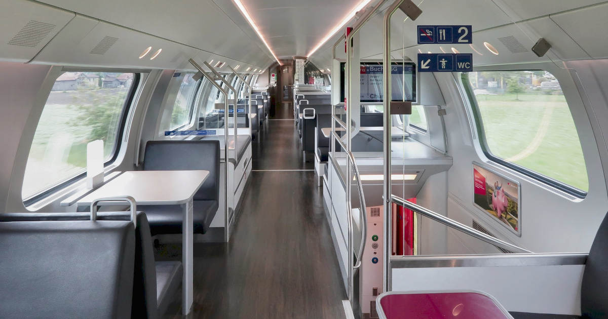

Olimme puolison kanssa odottaneet, että SJ, eli Ruotsin VR, toisi junaliput myyntiin matkamme ajankohdalle. Eilen se sitten tapahtui, joten pääsimme vihdoin tekemään tulevan interrail-matkan ensimmäisiä varauksia.

Samalla törmäsimme myös ensimmäisiin ongelmiin ja saimme muistutuksen siitä, että junamatkailussa on vielä paljon kehitettävää, jotta siitä tulisi houkutteleva vaihtoehto lentämiselle.

<!--more-->

### Lautta Tukholmaan
Suomesta ei ikävä kyllä pääse raiteita pitkin Keski-Eurooppaan. Kun matkaan lähtee Helsingistä, suositelluin vaihtoehto tuntui olevan lautamatka Tukholmaan. Sinne pääsee sekä Helsingistä että Turusta. Meidän matkaa ajatellen Turun yölautta vaikutti sujuvimmalta vaihtoehdolta.

Interrail-passilla saa tuntuvan alennuksen lauttalipuista, mutta niitä ostaessa törmäsimme ensimmäiseen ongelmaan: missään kohtaa Viking Linen varausprosessia ei voinut syöttää interrail-passin numeroa tai oikeastaan mitään muutakaan alennuskoodia.

Pienen hakemisen jälkeen onnistuimme kuitenkin löytämään [englanninkielisen sivun](https://www.sales.vikingline.com/find-trip/offers/rail/), jossa oli linkki [erilliselle varaussivulle](https://www.sales.vikingline.com/ferry/eng/en/market.vl?action=find-travel&travellingFrom=STO&membership=NONE&productCode=EURAIL). Nyt saimme näkyviin alennetut hinnat, mutta yölautan kohdalla näkyi ei-oota, vaikka suomenkielisellä varaussivustolla lähtö oli varattavissa. Miksi? Ei hajuakaan!

Päätimme hoitaa asian niin, että ostimme normaalihintaisen *Turku-Tukholma*-lipun menomatkalle ja aktivoisimme interrail-passimme vasta seuraavana aamuna Ruotsissa. Paluumatkalle valitsimme alennushintaisen *Tukholma-Helsinki*-lautan, jolla pääsisimme kotiin helpommin. Suora yhteys Helsinkiin tekee kotimatkasta helpomman eikä meidän enää siinä kohtaa tarvitse murehtia jatkoyhteyksistä.

Koska kyseessä oli kaksi eri järjestelmää, myös maksuvaihtoehdot olivat erilaiset. Suomalaisessa varausjärjestelmässä vaihtoehtoina olivat luottokorttien lisäksi verkkomaksut ja MobilePay, mutta ei esimerkiksi Paypalia. Vastaavasti kansainvälisessä järjestelmässä ei ollut luottokorttien lisäksi muuta kuin Paypal. Piti siis tehdä eri järjestelmässä kaksi eri tilausta ja maksaa ne eri tavoin.

### Juna Hampuriin
Olimme jo etukäteen katsoneet sopivia junayhteyksiä, joihin ehtisimme lautasta ilman suurta kiirettä. Nyt kun lauttaliput oli hoidettu, jäljellä oli vain paikkavarauksen tekeminen junaan. Tässä kohtaa törmäsimme seuraavaan ongelmaan.

[SJ:n varausjärjestelmä](https://www.sj.se/en) ei suostunut näyttämään alennettuja hintoja, vaikka olimme syöttäneet sinne interrail-lippujen tiedot[^1]. Lippujen hinnat olivat 5-7 kertaa niin kalliita kuin piti. Ne lähdöt, jossa hinta oli edes jotenkin säädyllinen, eivät noudattaneet etukäteen katsottua aikataulua. Yksikään junista ei ollut hinnaltaan sitä, mitä meille oli etukäteen lupailtu.

Testasimme varauksen tekoa ilman interrail-passien numeroita ja hinnat olivat vieläkin korkeammat. Hinnoissa oli siis alennus, mutta se oli ihan mitätön.

Tässä kohtaa mieleen hiipi ensimmäisen kerran ajatus siitä, että olikohan koko interrail-matka huono ajatus. Tällä menolla matkasta tulisi aivan hävyttömän hintainen, sillä olemme maksaneet useita satasia interrail-passista, jonka lupaamia alennuksia ei nyt näy missään. Jätimme varauksen siihen ja laitoin Mastodoniin kysymyksen asiasta. Tuntui, että teimme jotain väärin.

Vastauksia odotellessa yritimme tehdä varauksia myös DB:n, eli Saksan VR:n kautta, mutta sekään ei onnistunut. Siellä näkyi kyllä aikataulut, joita olimme etukäteen katsoneet, mutta järjestelmä kertoi, ettei varaaminen ole mahdollista johtuen SJ:n järjestelmämuutoksesta. Koetin kokeeksi Google Mapsin reittihakua ja se mätsäsi DB:n kanssa. Saimme siis oikeita reittejä kahdesta paikasta, mutta lippuja myyvä taho näytti jotain ihan muuta. Korkeat hinnat olivat täysi mysteeri.

### Apua kokeneemmilta

Lopulta [ruotsinkielistä interrail-blogia](https://interrailinfosvenska.wordpress.com/) ylläpitävä [Oskar](https://mementomori.social/@Torskmint@mastodon.nu) vastasi kysymykseeni ja tiesi kertoa, että meidän pitäisi etsiä reittejä, joissa on pelkästään SJ:n operoimia junia. Muussa tapauksessa heidän järjestelmänsä ei osaa laskea interrail-alennusta. Kun katsoimme reittejä uudelleen, huomasimme, että niitä todella operoi SJ:n lisäksi myös Öresundståg.

Ongelma oli siinä, ettei reittihaku mahdollista rajausta junayhtiön mukaan. Oskar suositteli, että yrittäisimme hakea *Tukholma-Malmö* -reittiä *Tukholma-Kööpenhamina* -reitin sijaan, sillä sen pitäisi olla täysin SJ:n operoima. Näin ei kuitenkaan ollut. Joukossa oli vain yksi lähtö, joka oli selvästi muita halvempi. Senkin hinta oli kaksi kertaa luvattua kalliimpi eivätkä aikataulut mätsänneet vieläkään. Kaikissa muissa toisena operaattorina oli Öresundståg. Pääsimme askeleen eteenpäin, mutta juuri mikään ei vastannut odotuksia ja lupauksia.

Viestittelyn jälkeen selvisi, että halvin junayhteys oli tuplahintainen siksi, että siinä oli vaihto. Koska junia oli kaksi, joutuisimme maksamaan paikkavarauksen molempiin juniin.

Tämä kävi jollain tasolla järkeen, mutta tässä kohtaa ymmärsin vihdoin kysyä, että miksi siellä on kaksi junaa. Tukholma-Kööpenhamina -junan pitäisi olla selvittelyjeni mukaan suora. Kysyinkin sitten, että onko Ruotsissa käynnissä ratatöitä, jotka voisivat aiheuttaa muutoksia reitteihin.

Bingo! Oskar sai jostain selville, että Ruotsissa tehdään ratatöitä **juuri sinä päivänä** kun me olemme liikenteessä. Ennen sitä ja sen jälkeen junat kulkevat normaalisti ja myös hinnat ovat normaalit. Melkoista tuuria!

Meille ei tietenkään missään kohtaa tullut mieleen tarkastaa muita päiviä, sillä aikataulumme oli jo sidottu anottuun lomaan sekä varattuun lauttamatkaan.

### Uusi yritys
Olemme siitä onnekkaassa asemassa, että pystymme varsin vapaasti pyörittelemään lomiamme. Niinpä päätimme, että aikaistamme lähtöä yhdellä päivällä ja saisimme varattua sopivat junaliput oikeaan hintaan.

Lauttalipuissa piti olla ilmainen muutosoikeus, joten suuntasin heti Viking Linen sivuille katsomaan, että onnistuisiko se suoraan netissä. Onnistuihan se, joten aikaistimme sekä meno- että paluupäivää yhtä aikaisemmaksi. Uudet lauttaliput olivat alkuperäisiä halvemmat, mutta en tässä kohtaa vaivautunut miettimään, että kuinka hyvitys tapahtuu.

Sen jälkeen buukkasimme junaliput aikaisemmalle päivälle, ja nyt saimme paikat *Tukholma-Kööpenhamina* -aamujunaan oikealla hinnalla ja aikataululla. Hienoa, mutta meidän pitäisi päästä Köpiksestä jatkamaan Hampuriin.

Suuntaisin selaimen [DB:n aikatauluhakuun](https://int.bahn.de/en/) ja pikainen *Kööpenhamina-Hampuri* -haku tuotti oikeita tuloksia. Nappasimme paikat (toivon mukaan) riittävällä vaihtoajalla ja saimme myös maksettua ne suoraan DB:n sivuilta. Vihdoinkin kaikki vaikutti olevan kunnossa.

Suunnitelmamme on siis seuraava:
- Helsingistä Turkuun VR:n junalla (ei vielä varattu)
- Viking Line -lautta Turusta Tukholmaan 20:55 - 06:30 (yö laivassa)
- SJ -juna Tukholmasta Kööpenhaminaan 08:20 - 13:33
- DB -juna Kööpenhaminasta Hampuriin 15:10 - 20:04

Hampurissa vietämme yön ja jatkamme sitten seuraavana päivänä Frankfurthiin ja sen ympäristössä oleville viinialueille.

### Sekavat järjestelmät
Tämä kokemus osoitti sen, kuinka sekavaa junalippujen varaaminen ja interrail-passin käyttäminen voi olla.

Lentolippujen varaamiseen on syntynyt useita varauspalveluita, josta voit ostaa lippuja lähes kaikkialle maailmaan. Sinun tarvitsee vain syöttää lähtö ja määränpää, palvelut hoitavat lopun. Saat jopa listan lippuja myyvistä palveluista, jotta voit halutessasi ostaa lipun sieltä mistä sen halvimmalla saa. Maksaminen tapahtuu yhteen paikkaan ja lippuja myyvä taho on vastuussa matkaan liittyvistä epäkohdista. Jopa eri lentoyhtiöiden kanta-asiakkuudet voi usein syöttää yhteen paikkaan. Kaikki tämä tekee lentomatkailusta äärimmäisen helppoa ja vaivatonta.

Junamatkailun todellisuus on hyvin erilainen. Joudut pelleilemään erilaisten järjestelmien kanssa ja miettimään, mistä saat ajantasaisimman ja luotettavimman tiedon. Jokainen järjestelmä tarjoaa hieman erilaiset maksuvaihtoehdot. Mikäli käytät interrail-passia, asiaa monimutkaistaa erilaiset alennusjärjestelmät sekä niiden käyttäminen. Oma esimerkkimme osoittaa myös sen, ettei todellisen maailman muutokset, kuten ratatyöt, näy järjestelmissä selkeästi.

Me olemme edelleen innoissamme tulevasta matkasta ja selviämme varmasti näistä vastoinkäymisistä. Etenkin minä pidän [seikkailuista](), joissa asioiden kanssa saa hieman painia eikä kaikki onnistu täydellisesti. Olemme kuitenkin poikkeus. Suurin osa ihmisistä ei jaksa temppuilla tällaisten asioiden kanssa.

Jotta junamatkailusta tulisi oikeasti houkutteleva ja varteenotettava vaihtoehto lentomatkailulle, paljon olisi muututtava. Varaus- ja aikataulujärjestelmien yhtenäistäminen olisi erinomainen alku. Jos lentoyhtiöt ovat kyenneet yhtenäistämään omat järjestelmänsä, ei ole mitään syytä, miksi sama ei onnistuisi junayhtiöiden välillä. Kyseessä on ongelma, joka on jo ratkaistu. Ratkaisu pitäisi vaan toteuttaa.

En ole raidenörtti enkä kokenut junamatkailija, mutta tiedän, että myös rataverkosto kaipaisi työtä. Adam Somethingin video [European International Rail Sucks](https://www.youtube.com/watch?v=Oxz4oY0T85Y) käy asiaa läpi nimenomaan kansainvälisen junaliikenteen näkökulmasta. Toivottavasti tähän aletaan puuttua EU:n tasolla.

Monesti myös junayhtiöt ovat jumiutuneet jonkinlaiseen haluttomuuteen kehittää junaliikenteen kilpailukykyä. Esimerkiksi Suomessa rataverkostoa ei ole arkimatkailun näkökulmasta kehitetty kovinkaan merkittävästi sitten 70-luvun, jolloin prioriteetit päätettiin kääntää yksityisautoilun suuntaan.

1970-luvulla Suomen rataverkon pituus oli 5804 km ja vuonna 2021 se oli 5918 km. 50 vuoden aikana olemme siis saaneet noin 100 km uutta rautatietä. Vertailun vuoksi 50- ja 70-luvun välissä Suomeen rakennettiin **1000 km** uusia raiteita. Tässä valossa höpinät typerästä tunnin junasta tuntuvat melkoiselta sekoilulta.

Raiteet eivät tietenkään yksin sanele junaliikenteen sujuvuutta, nopeutta ja houkuttelevuutta. Myös sillä on suuri merkitys, kuinka niitä käytetään ja operoidaan. Myös junien matkustusmukavuudella on suuri vaikutus.

Yksi interrail-matkamme pääkohteista on Sveitsi, joka on tunnettu vuoristojen lisäksi laajasta rataverkostostaan sekä loistavasti toimivasta junaliikenteestä. Onkin mielenkiintoista nähdä, millaista junamatkailu on silloin kun siihen on panostettu kunnolla.

[^1]: Tämäkään ei ollut suoraviivaista. Järjestelmään ei syötetä passin numeroa, vaan sen avulla on [generoitava erillinen koodi](https://www.interrail.eu/en/book-reservations#/generatePassCoverNumber), joka syötetään varsinaiseen varausjärjestelmään.
