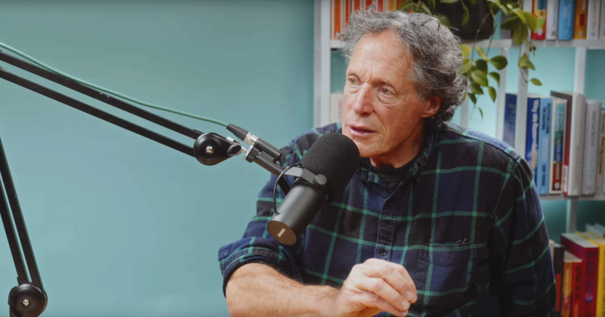

Aurinkoisen päivän kunniaksi kävin juoksemassa [puolimaratonin](). Sen aikana kuuntelin [Feel Better, Live More -podcastin jakson](https://drchatterjee.com/a-proven-prescription-for-health-and-happiness-why-being-able-to-forgive-improves-your-physical-mental-wellbeing-with-dr-fred-luskin/), jossa käsiteltiin sitä, kuinka kyky antaa anteeksi parantaa henkistä ja fyysistä hyvinvointia.

Huomasin jaksoa kuunnellessa, että olin samaa mieltä lähes kaikesta, mutta samalla monet ajatuksista törmäsivät yhden persoonallisuuteni piirteen kanssa: liialliseen haluun miellyttää muita.

<!--more-->

### Anteeksiantaminen luo pohjan hyvinvoinnille
Haastateltavana oleva tutkija [Fred Luskin](https://fredluskin.com/) kertoo jaksossa yli 30 vuoden kokemuksella, kuinka kyky antaa anteeksi on tietynlainen perusedellytys hyvinvoinnille.

Kun sinua kohdellaan elämässä kaltoin, viha, kiukku, pettymys ja paha olo ovat kaikki luonnollisia tunnetiloja. Pahantekijän syyllistäminen ja asian puiminen sisäisesti ja ystävien kanssa ovat osa paranemisprosessia - ne kuuluvat asiaan ja ovat lähes aina hyvästä. Tämä on kuitenkin totta vain rajallisen ajan.

Liian pitkään jatkunut märehtiminen ja vihanpito luo huonon tavan. Vaikka pahantekijä synnyttikin huonon olon, ihminen on itse vastuussa siitä, kuinka kauan kantaa tätä oloa mukanaan.

Mikäli menneiden ikävyydet jäävät roikkumaan elämään ja mieleen, niillä on taipumusta aiheuttaa katkeruutta ja estää uusien ihmissuhteiden syntymistä. Ne voivat tulla luottamuksen tielle. Tutkimukset osoittavat, että historian taakka voi konkreettisella tavalla heikentäää myös fyysistä hyvinvointia.

Irti päästäminen ei kuitenkaan tarkoita asioiden kieltämistä tai unohtamista. Se tarkoittaa sitä, että antaa itselleen luvan jatkaa eteenpäin. Se on sitä, että lakkaa toivomasta itselleen parempaa menneisyyttä. Sitä kun ei koskaan tule. Katseen voi suunnata tulevaan.

### Kuinka antaa anteeksi?
Ajatus on kaunis, mutta kuinka sen saisi toteutettua käytännössä? Niinkö se menee, että kun joku puukottaa puolisosi hengiltä, niin sinun kuuluu vaan hymyillä ja sanoa, että "Ei se mitään?"

Ei. Fred Luskin toteaa, että anteeksiantaminen on prosessi, joka kohdistuu ennen kaikkea sinuun itseesi. Annat itsellesi anteeksi menneet tapahtumat, kaiken pahan olon, ja jatkat elämääsi.

Usein voi olla hyödyllistä antaa anteeksi myös pahantekijälle. Se ei kuitenkaan tarkoita sitä, että hyväksyisit teon tai jatkaisit elämääsi näiden ihmisten kanssa. Se on enemmän irti päästämistä. Voit todeta toiselle, että tuhosit siivun elämästäni, mutta nyt voimme kävellä eri suuntiin. Voit jatkaa elämääsi ja voida paremmin. Olen ansainnut sen.

Jossain tapauksissa yhteinen elämä voi tietenkin jatkua. Jos olet ollut puolisosi kanssa yhdessä 20 vuotta ja hän tekee syrjähypyn, siinä kohdassa on itse arvioitava, että oletko kykeneväinen antamaan anteeksi, jotta voisitte jatkaa yhteistä elämää.

Me kaikki teemme virheitä. Siksi onkin syytä kysyä, että onko sinua kohdannut teko täysin anteeksiantamaton? Edelleen, se ei tarkoita, että hyväksyisit teon. Eikä sitä, että teko olisi oikein. Muutat vain tapaasi katsoa tilannetta.

Podcastissa puhutaan myös siitä, kuinka anteeksiantamista ei saa sitoa toiseen ihmiseen. Jos toinen tulee pyytämään anteeksi, suhtaudu siihen kuin lahjaan, mutta älä odota sitä. Et voi vaikuttaa toisen tekemisiin ja joissain tapauksissa pahantekijä ei ole enää edes elossa. Sinun on itse tehtävä päätös pahojen ajatuksen pudottamisesta, eikä odottaa aloitetta muilta. Kyse on **sinun** hyvinvoinnista.

Luskin kertoo, kuinka tällaisista asioista puhuttaessa ihmiset toteavat jotain sen suuntaista, että teoria on hieno, mutta sinä et tiedä minun elämästä ja kokemuksista mitään. Minun tapaukset ovat niin pahoja ja ainutlaatuisia, että niitä ei voi antaa anteeksi. Tunnistan tämän taipumuksen myös itsessäni.

Samaan aikaan kuitenkin allekirjoitan täysin sen, mitä Luskin sanoo. Minua kohdeltiin huonosti vuosien ajan, mutta en tyytynyt siihen, vaan päätin kantaa niitä tapahtumie vuosien ajan mukanani. Kukaan ei sitä minulta vaatinut. Minä itse valitsin tehdä niin ja se oli todella haitallista. Minä vain venytin sitä tuskaa.

Päätös elämän jatkamisesta on itsellä.

### Olen antanut anteeksi. Vai olenko?
Olen jo usean vuoden ajan ajatellut, että olen jättänyt menneet asiat taakseni. Olen antanut anteeksi. Jaksoa kuunnellessa aloin kuitenkin miettiä, että olenko oikeasti?

Aina kun mietin menneitä aikoja, ne synnyttävät minussa ikäviä tunteita: vihaa, kiukkua, pettymystä ja katkeruutta. Kun muistelen minua kaltoin kohdelleita ihmisiä, muistan heistä ainoastaan kaiken pahan, vaikka monien kanssa hyviä aikoja on paljon enemmän. Aina välillä näen painajaisia näistä hetkistä ja toivon edelleen, etten koskaan törmäisi niihin ihmisiin.

Ovatko nämä merkkejä siitä, etten ole antanut anteeksi ja jatkanut eteenpäin? Onhan se mahdollista, mutta mieleeni tuli myös toinen vaihtoehto, josta jaksossa ei puhuta.

### Entä jos anteeksianto on huono vaihtoehto?
Päädyin taannoisen masennuskauden alkuvaiheessa psykologin juttusille ja silloin minulla diagnosoitiin muutaman muun asian ohessa liiallinen halu miellyttää muita.

En mene tässä yksityiskohtiin, mutta tämä piirre kykenee selittämään monia minulle tapahtuneita asioita.

Taipumus ilmenee niin, että pyrin aina laittamaan muut ja heidän hyvinvoinnin itseni edelle. Pyrin myös välttelemään konflikteja viimeiseen asti. Teen kaikkeni, jotta muilla olisi parempi olla, vaikka se painaisi minua pohjaan. Minua saa kohdella ihan miten vaan ja koetan silti miettiä muiden parasta. Ajattelen, että jos vaan teen heidän mielikseen, kaikki muuttuu paremmaksi.

Kun katson historiaani, minun ongelmani ei ole se, etten olisi antanut anteeksi tai jatkanut eteenpäin. Minun ongelmani oli se, että tein niin. Olen antanut ihmisille mahdollisuuden lyödä uudestaan ja uudestaan. Kun he käyttivät minua hyväkseen, tarjosin heille mahdollisuuden tehdä sen vieläkin törkeämmin.

Podcastissa puhutaan anteeksiantamisen parantavasta voimasta, mutta se ohittaa sen vaihtoehdon, ettei tämä useimmille sopiva ohjenuora välttämättä ole oikea ratkaisu joka tilanteeseen. Eikä jokaiselle.

### Persoonallisuuden suojamuuri
"Ole vain oma itsesi" on joillekin ihmisille äärimmäisen huono ohje. Kun minua kuritettiin vuosikausien ajan eri ihmisten toimesta, ihmettelin, kuinka sama asia voi tapahtua aina minulle. Kaikkea tapahtunutta yhdistää tietenkin yksi asia: minä.

Sain turpaani, koska annoin anteeksi ja jatkoin elämääni. Koetin pitää huolen, ettei menneiden ihmisten teot vaikuttaisi tuleviin. Se tarjosi seuraavalle pahantekijälle hyvän pohjan toistaa kaikki uudelleen.

Podcastissa varoiteltiin siitä, että se ei ole hyvä asia, jos menneisyyden teot alkaisivat vaikuttaa tähän hetkeen ja tulevaisuuteen. Itse en kuitenkaan näe asiaa aivan näin mustavalkoisena.

Jos olet ollut parisuhteessa narsistin kanssa ja pääset hänestä eroon, oikea ratkaisu ei ole antaa anteeksi ja jatkaa elämää. Mielestäni oikea ratkaisu on analysoida tapahtuneet kunnolla, tunnistaa mitkä asiat johtivat tilanteeseen, missä teit väärin, ja sen jälkeen pitää huoli, ettet toista samoja virheitä uudelleen.

Mikäli olet samanlainen kuin minä, sinun on syytä analysoida ennen kaikkea itseäsi, sillä luontainen tapasi toimia voi olla sinulle erittäin haitallinen. Sinun **on muutettava** toimintaasi ja pidettävä huoli, etteivät uudet ihmiset saa samaa mahdollisuutta kuin vanhat. Ehkä tämän voi nähdä niin, että kantaa menneisyyden mörköjä mukanaan. Minä kutsun sitä oppimiseksi.

Mietinkin, että ehkä tämä tunne puoliksi jääneestä anteeksiannosta johtuukin siitä, että olen rakentanut itselleni suojamuurin. Sellaisen muurin, joka suojelee minua itseltäni. Voin seistä sen muurin takana ja varmistua siitä, ettei kukaan pääse enää hyödyntämään minun heikkouksia.

Ehkä olen antanut anteeksi ja jatkanut elämääni, mutta teen sen paremmin varustautuneena.

### Muurin yli kiipeäminen
On helppo nähdä, ettei tällainen muuri ole hyvä asia. Myönnän jopa itse, että monien kohdalla se ei sitä ole. Samaan aikaan näen, ettei se ole itsessään huono asia. Sen hyvyys ja huonous riippuu siitä, kuinka korkea se on ja kuinka sitä käytetään.

Jos muuri on niin korkea, ettei kukaan pääse koskaan kiipeämään sen yli, päädyt helposti olemaan yksin. Jos se on liian matala, se ei suojaa kunnolla. Muurin pitäisi olla sellainen, että se antaa sinulle aikaa tutustua ihmisiin. Jos he näkevät sen vaivan, että kiipeävät muurin päälle, heidät todennäköisesti kannattaa laskea sen toiselle puolelle.

Juttelin asiasta puolisoni kanssa. Hän muisteli, että alussa tilanne ei ollut kovin helppo. Hän joutui väistelemään kiviä, joita viskelin muurin takaa. Hän kärsi asioista, joita aikaisemmat ihmiset olivat tehneet. Kaikesta huolimatta hän ei luovuttanut vaan jatkoi kiipeämistä. Olen aika varma, että hän pääsi muurin päälle ja nyt olemme samalla puolella.

Kun kerroin näistä ajatuksista ja siitä, etten osaa nähdä menneissä ihmisissä mitään positiivista, hän korjasi minua: "Olethan sinä kertonut vaikka kuinka usein teidän matkoista."

Hän oli oikeassa. Vaikka alussa kirjoitin, etten koskaan osaa ajatella pahantekijöistä mitään hyvää, se ei oikeasti pidä paikkaansa. Negatiiviset ajatukset vetävät minua puoleensa, mutta kyllä minä muistan kaikki hyvätkin hetket. En ehkä yksin ollessani ajattele niitä, mutta ne tulevat ainakin välillä näkyviin kun kerron hyvistä hetkistä muille.

Rajoittaako tämä suojamuuri elämääni? Tietenkin. Nykyään en luota ihmisiin kuten ennen. En laske ihmisiä lähelleni samalla tavalla. En useimmiten halua edes tutustua ihmisiin. Joskus saatan hakeutua muurin juurelle turvaan silloinkin ei pitäisi, mutta ne hetket ovat nykyään harvassa.

En ajattele, että jokainen uusi ihminen on samanlainen paska kuin menneisyyden ihmiset. Annan heille aina mahdollisuuden osoittaa olevansa jotain muuta. Pidän kuitenkin ihmiset sopivan matkan päässä. Olen tähän kaikkeen ihan tyytyväinen.

Tunnen, että olen jättänyt menneet taakseni ja antanut itselleni luvan voida hyvin. Tunnen sen suuren ero, joka on nykyisen minän ja vuosien takaisin minän ajattelussa. En ole sama ihminen, mutta se on hyvä asia. Ehkä en ole jatkanut elämääni täydellisesti, mutta annan senkin itselleni anteeksi.