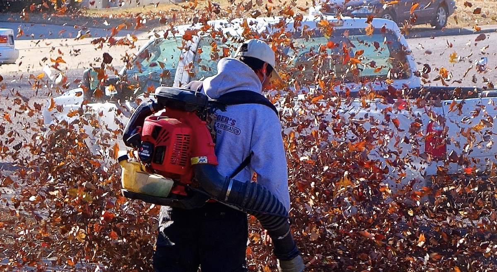

Olen useaan otteeseen yrittänyt kirjoittaa kokemuksiani ääniherkkyyden pahenemisesta sekä melusaasteesta, mutta jostain syystä niiden muuttaminen sanoiksi on osoittautunut todella vaikeaksi. Tämä on jälleen yksi uusi yritys.

Toivoin, että muutto uuteen kotiin olisi korjannut aikaisemman melusaasteen aiheuttaman tuhon. Viime päivien kokemukset ovat kuitenkin osoittaneet, ettei muutos tapahdu näin nopeasti. Onko kaiken tuhon korjaaminen edes mahdollista?

<!--more-->

### Ääniherkkyys
Elämää ääniherkkyyden kanssa on vaikea kuvailla. Kuvaukset tuntuvat usein joko liian mitättömiltä tai tarpeettoman abstrakteilta. Yhden asian osaan kuitenkin sanoa: ääniherkkyys ei ole sama asia kuin se, että kovat äänet ärsyttävät.

Jos naapurisi huudattaa lehtipuhallinta ja se ärsyttää sinua, kysymys on täysin normaalista tunteesta. Voin puhua vain omasta puolestani, mutta ääniherkkyys on jotain ihan muuta.

Sitä voisi kuvata eräänlaisena säiliönä. Mitä enemmän *ylimääräistä* ääntä ympäristössä on, sitä nopeammin se tyhjentää tankkia. Kun tankki on tyhjä, lähes kaikista äänistä tulee kuormittavaa.

Kuormitus on jotain ihan muuta, kuin ärsytys. Omalla kohdalla se tarkoittaa, että kropassa syntyy [taistele tai pakene](https://www.mielenterveystalo.fi/fi/trauma-kriisi/miten-keho-reagoi-kriisiin) -reaktio. Koko keho menee stressitilaan ja yleistä olotilaa kuvaa parhaiten sana **ahdistus**. Rintaa puristaa, syke nousee, hengittäminen on vaikeaa ja tuntuu, että sydän räjähtää. Se muistuttaa paniikkikohtausta.

Mikäli melusta ei pääse eroon, huono olotila syvenee ja koko kuuloaistimus alkaa muuttua kivuksi. Sen jälkeen haasteina eivät ole vain ylimääräiset äänet, vaan kaikki äänet. Et pysty keskittymään mihinkään, nukkuminen muuttuu lähes mahdottomaksi ja keho huutaa pakenemaan. 

On tylsää, kun ihmiset toteavat vähättelevästi, että "sinun pitää vain tottua". Vaikka ääniyliherkkyyttä voidaankin hoitaa siedätyshoidolla, sen toteuttaminen arjessa on lähes mahdotonta. Ainakin omalla kohdalla keho reagoi ääniin paljon ennen kuin ehdin itse ajatella niitä. Tällaiset heitot tuntuvat siltä, kuin pyytäisi migreenistä kärsivää tottumaan kipuun. Ikään kuin kipu katoisi ihan vain ajatuksen voimalla.

### Paluu ahdistukseen
Kun muutimme joulukuussa nykyiseen asuntoon, elämäni mullistui. Pääsin pois auto- ja lentomelusta, jotka olivat ensisijainen syy olotilani huononemiseen.

Yhtäkkiä pystyin taas hengittämään. Minun ei tarvinnut elää jatkuvassa melusaasteessa, joten tankkini ei päässyt tyhjenemään. Jos se vajui, kodin hiljaisuus ja nukuttu yö täytti sen. Sen seurauksena satunnaiset kovat äänet eivät laukaisseet kehon stressitilaa. Jo pari viikkoa muutosta huomasin, että voin kokonaisuudessaan todella paljon paremmin.

Viimeisen parin viikon aikana aloimme ihmetellä puolisoni kanssa jatkuvaa lentomelua. Ilmojen lämmetessä halusimme nauttia terassista. Ovien auki pitäminen sekä ulkona oleminen korosti ongelmaa. Parina aamuna heräsin yli lentävään lentokoneeseen, mutta selvisin vielä siitäkin.

Viikonloppuna jokin muuttui. Heräsin lentokoneen meteliin, mutta silmät aukaistessa olin välittömässä paniikkitilassa. Sydän hakkasi ja olo oli kuin olisin herännyt hirvittävästä painajaisesta.

Olen nauttinut suuresti alkaneesta keväästä, lintujen laulusta ja siitä, että voin ylipäätään kuulla sitä - asia, josta pystyin vain haaveilemaan edellisessä kodissa. Nyt sen tilalla oli kuitenkin meteli, jota jonossa nousevat lentokoneet aiheuttivat. Koetin kovasti keskittyä heräävään luontoon ja lintuihin, mutta se ei auttanut. Ahdistus hyökkäsi niskaan kamppailustani huolimatta.

Selvisi, että Helsinki-Vantaalla on käynnissä toisen pääkiitotien [kunnostustyö](https://www.finavia.fi/fi/uutishuone/2024/helsinki-vantaan-kiitotie-3-suljetaan-kunnostustoiden-ajaksi-154-126) ja sen seurauksena nousevat koneet ohjataan toiselta kiitotieltä suoraan meidän kodin yli. Työ on väliaikainen, mutta se jatkuu kesäkuun puoliväliin asti. Meteliä on siis pahimmillaan tiedossa seuraavat 5-6 viikkoa.

Kevät ja alkukesä voivat mennä omalta kohdaltani täysin ohi ja tämä saattaa myös rampauttaa uudelleen alkaneen juoksuharrastuksen, mikäli ulkona oleminen lisää ahdistusta eikä vähennä sitä.

### Ylimääräinen ääni
Kirjoitin aikaisemmin, että ääniherkkyyttä aiheuttaa nimenomaan *ylimääräinen* ääni, mutta mitä se oikeastaan tarkoittaa? Tätäkin on vaikea pukea sanoiksi, mutta yritän.

Yksi selkein tekijä on äänten luonnollisuus. Kun kuljet metsässä, se on täynnä ääniä: lintujen laulua, lehtien kahinaa, pörriäisten surinaa, veden liplatusta ja ehkä jossain tikka nakuttaa puun runkoon. Tutkimukset osoittavat, että tällaiset luonnon äänet koetaan rentouttavina. Lienee evoluution seurausta, että näin on, mutta sen lisäksi ne äänet ovat luontainen osa sitä ympäristöä.

Tämä sama pätee myös ihmisiin. Laumaeläimenä olemme kehittyneet kuuntelemaan toisten ihmisten puhetta ja heidän touhuistaan lähtevää ääntä. Siksi puheensorina, nauru tai lasten leikki ovat useimmiten rauhoittavaa. Ympäristössä saattaa kuulua askelia tai pientä astioiden kilinää, mutta nekin kuuluvat ympäristöön, jossa on ihmisiä. Ne ovat ihmisen näköisiä ja kokoisia ääniä, jotka kertova elämästä ja luovat siksi turvaa.

Toisessa äärilaidassa ovat mekaaniset äänet. Tällaisia ääniä ei luonnossa juuri esiinny, vaan ne syntyvät nimenomaan ihmisen aiheuttamassa toiminnasta ja ovat ympäristöön kuulumattomia. Hyviä esimerkkejä tästä ovat rakennustyömaiden pauke, katuporat, autot sekä lentokoneet.

Juuri kukaan ei halua näitä ääniä kotiinsa. Me tiedämme sisäisesti, etteivät ne kuulu sinne ja tiedämme myös, mitä ne aiheuttavat meissä. Jos vaihtoehtona on nauttia ateria terassilla linnunlaulua ja kevyttä lehtien havinaa kuunnellen, tai vilkkaan moottoritien vieressä, jokainen meistä valitsee ensimmäisen. Meidän ei tarvitse edes miettiä asiaa.

Tilanne muuttuu hankalaksi, kun nämä kaksi asiaa yhdistyvät. Tarkoitan siis ihmisiä, jotka tuottavat aktiivisesti melua normaalia toimintaa enemmän. Tämä voi olla esimerkiksi musiikin kuuntelua tai vaikkapa tarpeettoman kovaäänistä puhelinkeskustelua[^1]. Autojen ja moottoripyörien meteli on mekaanista, epäinhimillistä saastetta, vaikka kulkuvälineitä liikuttaakin ihminen.

Hieman vaikeampi kategoria ovat äänet, jotka tuntuvat ylimääräisiltä omaan mielentilaan nähden. Saatat esimerkiksi nauttia musiikin kuuntelusta, mutta jos musiikki on vääränlaista, se muuttuukin kuormittavaksi. Musiikki itsessään ei kuitenkaan ole sitä.

Sama pätee puheeseen. Vaikka puhe itsessään ei kovinkaan usein ole kuormittavaa, se voi nopeasti muuttua sellaiseksi, jos yrität keskittyä johonkin tai yrität nukkua. Nämä ovat kuitenkin enemmän subjektiivisia ja varsinkin ulkopuolelta vaikeita tulkita.

Myös ympäristö voi vaikuttaa. Jos istuskelet kaupunkiterassilla, vähän matkan päässä soitteleva katumuusikko saattaa istua ympäristöön hyvin, mutta jos sama muusikko ilmestyisi kirjaston hiljaisuuteen, siitä tulisi kuormittavaa.

### Melu on saastetta

Joskus puhutaan melusta, toisinaan melusaasteesta. Olen koko ajan enemmän sitä mieltä, että ne ovat sama asia. Melu saattaa ehkä kuulua tehtaisiin, jossa ihmisten melualtistumista pidetään kontrollissa, mutta se ei koskaan kuulu asuttuun ympäristöön. Se kuuluu sinne yhtä vähän kuin ilmansaasteet.

Melu on saastetta.

Omista kokemuksista johtuen olen alkanut ihmetellä sitä, kuinka melu on monien laitteiden suunniteltu ominaisuus. Tuntuu järjenvastaiselta, että joku kehitti lehtipuhaltimen ja mietti vakavissaan, että tämä laite sopii loistavasti asutuilla alueilla käytettäväksi. Tai kaikki moottoripyörät, jotka nimenomaan suunnitellaan järkyttävän kovaäänisiksi - ja sitten niistä viritetään vieläkin kovaäänisempiä. Jossain ovat myös kaikki ne suunnittelijat, joiden mielestä lentokenttien rakentaminen kaupunkien kylkeen oli hyvä idea, samoin kuin läpiajoteiden rakentaminen asuinalueiden halki.

Miksi ja miten melusaasteen tuottamisesta ja meluavista laitteista on tullut niin arkipäivää? Miksi kaikista kovaäänisimmät laitteet ja ihmiset saavat dominoida ympäristöä siitäkin huolimatta, että melun haittavaikutukset ihmisille ja ympäristölle on tiedetty vuosikymmenten ajan?

Kaupunkialueilla lähes 100 % melusaasteesta syntyy autoista. On kuvaavaa, että autojen äänieristystä on parannettu vuosikymmenten aikana. Sekä valmistajat, että käyttäjät tietävät autojen tuottaman melusaasteen. Tämän kehityksen myötä olemme kuitenkin tilanteessa, jossa autoilijoiden ei tarvitse itse kuunnella melua, jonka aiheuttavat kaikille auton ulkopuolella oleville.

Tämä samanlainen asetelma toteutuu monessa muussakin asiassa. Kun työntekijä rikkoo asfalttia katuporalla, hänellä on kuulonsuojaimet korvissa. Tai kun naapurit käynnistävät lehtipuhaltimen, ruohonleikkurin tai moottorisahan, he heittävät useimmiten Peltorit korville. Vaikka tälle on tietenkin hyvä syy, keskittyminen on usein yksinomaan melun tuottajan suojaamisessa, ei ulkopuolisissa.

Kuvittele, että sinun pitäisi kulkea kaasunaamari tai hengityssuojain kasvoilla aina kun poistut kotoa. Kadut olisivat täynnä savuttajia ja myrkyllisiä kaasuja tuottavia ihmisiä sekä laitteita. Se kuulostaa dystopiaelokuvan maailmalta.

Tästä huolimatta on arkipäivää, että ihmiset kävelevät kaupungeissa vastamelukuulokkeet päässä. Meille on syntynyt kokonainen tuoteryhmä, jonka ainut tarkoitus on mitätöidä melusaaste, jonka itse aiheutamme. Siitä on tullut normaalia, että melusaasteelta pitää suojautua.

Mitä järkeä tässä oikein on?

Kuluneiden päivien oireet muistuttivat minua siitä, että melusaaste voi kirjaimellisesti rikkoa mielen ja kehon. Se ei ole vain pieni ärsytys, vaan aiheuttaa konkreettista tuhoa, jonka korjaaminen voi viedä kuukausia tai vuosia.

Enkä ole enää yhtään varma, että voiko kaikkea aiheutettua tuhoa koskaan korjata.

[^1]: Se on minulle täysi mysteeri, miksi joidenkin ihmisten pitää huutaa puhelimessa puhuessaan