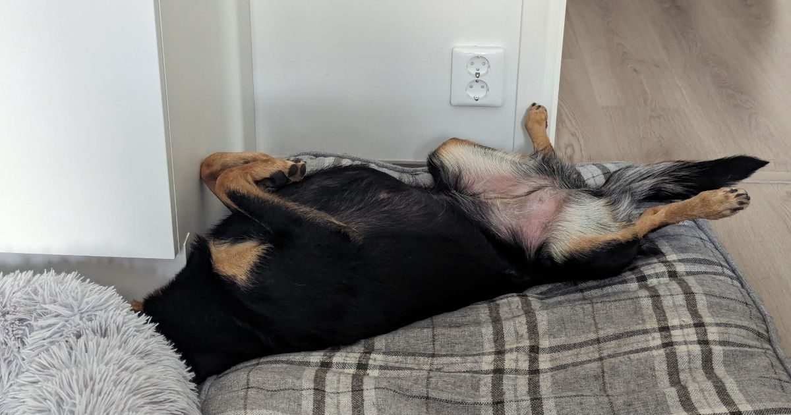
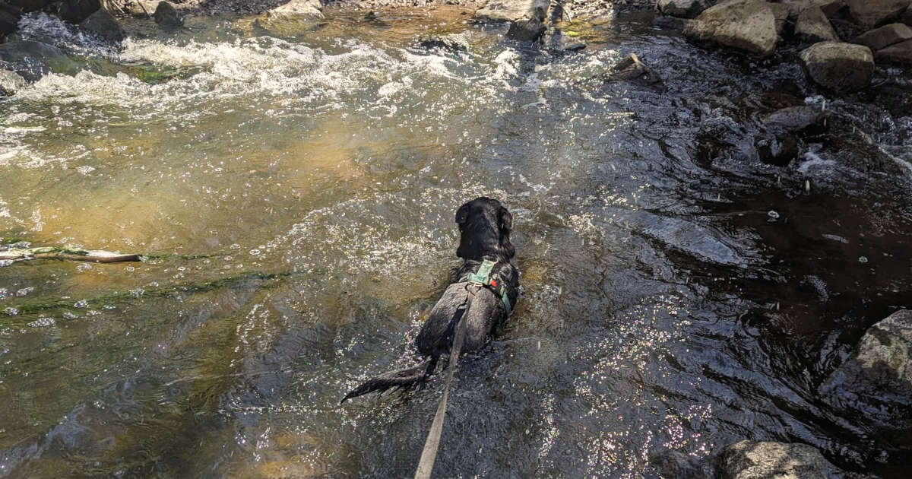
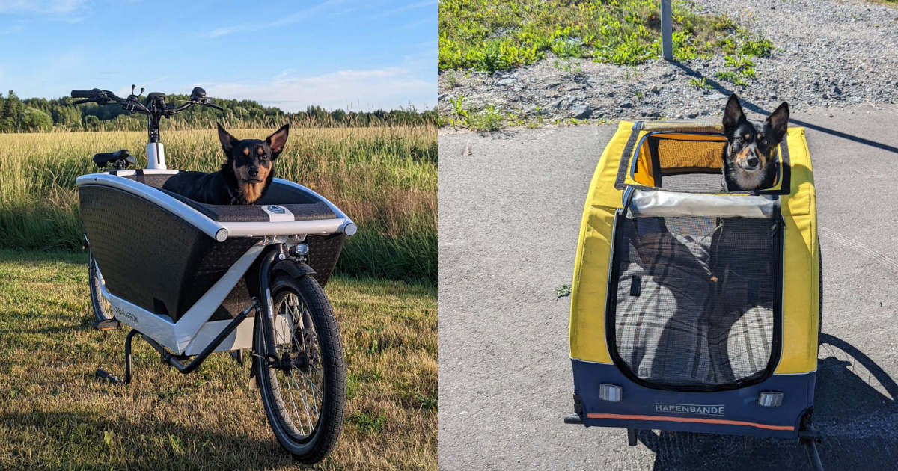

Olen äärimmäisen eläinrakas ihminen. Erityisesti koirat ovat lähellä sydäntäni. Perheessäni on aina ollut koira, mutta minulla ei koskaan ole ollut omaa. Koiran kokoiseen aukkoon löytyi kuitenkin netistä ratkaisu.

<!--more-->

### Ihmisen paras ystävä

Koiran hankinta on käynyt usein mielessä, mutta se on jäänyt pelkäksi ajatukseksi kahdesta syystä: oma elämäntilanteeni tai kotini ei ole ollut sopia, ja sen lisäksi olen ylihuolehtivainen. Ensimmäinen on ratkaistavissa, mutta jälkimmäinen onkin aika paljon vaikeampaa.

Koiran sijaan minulla oli [fretti](https://fi.wikipedia.org/wiki/Fretti) eli kesyhilleri. Leikkisä veijari toi paljon iloa elämääni, mutta samalla se toi myös paljon huolta. Huoli ei lähes koskaan ollut todellinen, vaan kumpusi minusta. Reagoin todella herkästi mitättömiin muutoksiin ja aloin heti miettiä, että lemmikilläni ei ole kaikki kunnossa. Tilanne oli vielä ikävämpi silloin, kun jotain oli oikeasti vialla. Se oli minulle aina hankalaa, kun en ymmärtänyt eläimen huolta, eikä se osannut sitä minulle kertoa.

Lemmikkien menettäminen on ollut itselleni pienestä asti aivan kauheaa. Usein tuntuu, että niiden menettäminen sattuu enemmän kuin ihmisten menettäminen. Tämä lapsena usean otteeseen koettu, sydäntä repivä menettämisen tuska tuntuu vain kasvaneen iän myötä.

Nyt se on niin suuri, että pelkään sitä. Pelkkään ottaa lemmikkiä, koska tiedän, että menetän sen. Miksi ohittaa yli 10 vuoden ilo vain siksi, että menettäminen sattuu hetken? Tiedän, että ajatus ei ole järkevä. Kun saisinkin tunteeni kuriin.

### Lemmikkikummit

Elämässäni oli kuitenkin koiran mentävä aukko. Olin usein miettinyt, että ehkä voisin käydä lenkittämässä eläinsuojeluyhdistyksen koiria, mutta harmillisesti yhdistykset eivät sitä mahdollista. Syynä on nähtävästi sekä ihmisten, että koirien turvallisuus. Harkitsin sitäkin, että kävisin välillä viettämässä aikaa arkojen ja ihmisiin tottumattomien kissojen kanssa. Vaikka pidän kissoista ja toiminta olisi ollut hyödyksi myös niille, kaipasin silti koiraseuraa.

Sitten Facebookista löytyi [Lemmikkikummit-ryhmä](https://www.facebook.com/groups/lemmikkikummit/). Ryhmän ajatuksena on saattaa yhteen uutta ihmisseuraa kaipaavat lemmikit sekä lemmikkiseuraa kaipaavat ihmiset. Ikävä kyllä etenkin lemmikkien omistajien puolella kaikki eivät tätä ymmärtäneet. Osa tuntui etsivän lähinnä ilmaista hoitajaa omien menojen mukaan. Tämä ei ole ryhmän idea.

Olin yhteydessä kolmeen eri omistajaan. Ensimmäinen oli outo hiippari, jonka kanssa en onnistunut järjestämään tapaamista useasta yrityksestä huolimatta. Hänellä tuntui aina olevan kiire. Toisen kanssa se onnistui ja koirakin vaikutti varsin hauskalta. Kolmas päätyi olemaan oikea lottopotti, sillä omistajat asuivat naapuritalossa!

Pienen hetken elämässäni oli kaksi koiraa. Varsin pian minulle alkoi kuitenkin valjeta, että ensimmäisen koiran perheessä kaikki ei ollut kunnossa. Merkit viittasivat siihen, että koira ei olisi perheeseen haluttu ja omistajat yrittävät hivuttaa eläintä jonkun toisen hoidettavaksi. Tiedostin, etten voi ottaa sellaista harteilleni, vaikka olisin tietenkin halunnut. Se ei olisi ollut kestävää. Päätös oli oikea, mutta tilanne teki minut aivan hirvittävän surulliseksi.

Jatkoimme ainoastaan naapureiden kanssa ja aloimme rakentaa uutta koirakummisuhdetta uuteen ystäväämme, reilun vuoden ikäiseen [australiankelpieen](https://fi.wikipedia.org/wiki/Australiankelpie). Näistä hetkistä on nyt useampi vuosi. Matkan varrella on sattunut kaikenlaista, mutta ehkä suurin muutos on ollut se, että meidän kummikoira sai riesakseen "pikkusiskon". Nyt kummikoiria on siis kaksi!

Koirakummeilun alkupuolella saatoin käydä useita kertoja viikossa koirien kanssa lenkillä. Välillä pyysin ne myös kylään ihan vaan illaksi. Ikävä kyllä elämä kulkee omia polkujaan. Sekä me että koirien omistajat muutetimme, emmekä ole enää naapureita. Näemme koiria nyt harvemmin eikä spontaaneja visiittejä voi niin helposti järjestää. Yhteys on silti pysynyt ja koirat ovat kaikesta huolimatta pyöräiltävän matkan päässä.

### Koiraviikko

Viime sunnuntaina meillä alkoi pitkästä aikaa kunnollinen koiraterapia, sillä koirat ovat meillä lähes viikon! Tällaiset pidemmät jaksot ovat mukavia, koska niissä koiratkin ehtivät rauhoittua ja rentoutua. Me olemme niille tietenkin vanhoja tuttuja, mutta aina se vähän jännittää kun omistajat ovat poissa.



Viikko onkin sujunut hyvin arkisissa merkeissä. Minun tyypilliset aamukahvit koneen ääressä on korvannut puolen tunnin aamulenkit. Sitten syödään porukalla aamupalaa ja hypätään töihin. Koirien tehtävänä on aiheuttaa kateutta nukkumalla samalla kun minä teen töitä.

Välittömästi töiden jälkeen pistetäänkin taas ulkoiluvaatteet päälle ja käydään tekemässä 1,5 tunnin lenkki, jotta jokainen meistä saa purkaa ylimääräiset energiat ja patoutumat. Toinen koirista tykkää hurjana uimisesta, joten vedessäkin on pitänyt läträtä. Nähtävästi vesi ei ollut liian kylmää, vaikka uskallan olla asiasta eri mieltä.

Normaalisti puuhastelen iltaisin omia juttujani pöytäkoneen ääressä, mutta tällä viikolla nörttäilyt on tehty sohvalla läppärin voimin - molemmat koirat vieressä. Välillä saatetaan käyttää nenää ja puuhastella etsintäleikkejä. Toisinaan taas käydä läheisessä koirapuistossa sekoilemassa ja heittelemässä frisbeetä. Iltaisin rauhoitutaan, mutta päivä on aina hyvä päättää nopeaan iltapissilenkkiin.

Harmillisesti viikko on ollut viileä. Olisin mielelläni tehdyt koirien kanssa pyöräretkiä. Yksi hauskimmista projekteista ransujen kanssa olikin niiden opettaminen pyörämatkailuun.

Aluksi käytössämme oli pelkästään pyöräkärry, joten koulutus aloitettiin sillä. Koirien ehdolla tehty koulutus tuottikin tulosta nopeasti ja nykyään kumpikin kaveri matkustaa pyörän kyydissä oikein mielellään. Myöhemmin hommasimme tavarapyörän, mutta tässä kohtaa koirat olivat niin tottuneita pyörämatkaajia, ettei se vaatinut erillistä opettelua.

Vanhempi koirista viihtyy silti paremmin pyöräkärryssä, sillä siellä voi pötköttää ja näkee silti maisemia. Nuorempi taas viihtyy tavarapyörän keulalla, koska sieltä on parempi tähystää ja nuuskia hajuja - ja ehkä vähän pullistella ohi meneville koirille.

Nämä koiraviikot antavat itselleni todella paljon. Koirat tuovat käsittämättömän määrän hyvää mieltä, positiivista energiaa ja tietenkin liikuntaa. Samalla ne muistuttavat siitä, etten välttämättä ole valmis oman koiran hankintaan. Huomaan edelleen, etten osaa joka hetki itse rentoutua, koska pidän jatkuvasti huolta koirien hyvinvoinnista. Eikä tämä kerrostaloasuminenkaan ole aivan sitä, mitä haluaisin oman koiraystävän elämään tarjota.

Mielen haasteista huolimatta nämä hetket ovat erittäin tervetulleita. Koiraterapia, paras terapia!
