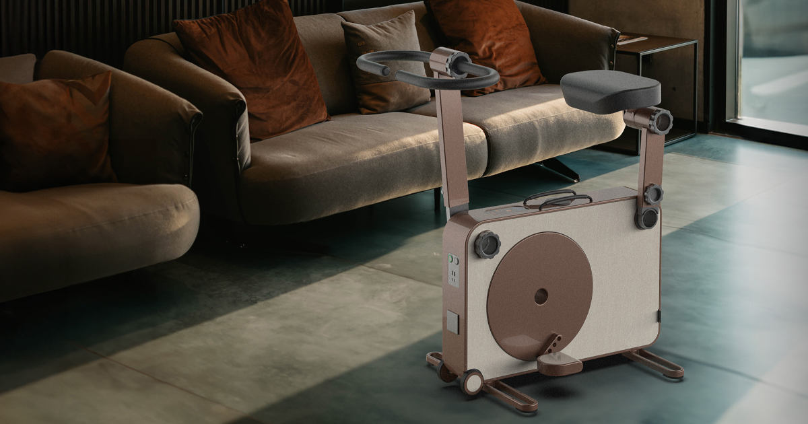

Olen oppinut työelämässä kysymään, että mikä on se todellinen ongelma, jota yritämme ratkaista. Usein tuntuu, että etenkin teknologiapuolella tätä kysymystä ei osata tai haluta kysyä. Eilen vastaan tuli hyvä esimerkki tällaisesta.

<!--more-->

[TukasEV](https://www.tukasev.com/en/) on kuntopyörä, joka muuttaa liike-energian sähköenergiaksi ja säilöö sen akkuun. Ei varsinaisesti mikään uusi idea. Myyntipuheena käytetään sitä, että hikoilusi vapauttama energia ei mene hukkaan, vaan voit käyttää sen itse myöhemmin. Luonnollisesti tuotetta myydään jonkinlaisena ekoratkaisuna, joka "tuottaa" puhdasta, uusiutuvaa energiaa.

Haluan ajatella, että tällä liettualaisella yrityksellä on ainakin jossain kohtaa ollut ihan jalo ajatus taustalla. Tästä huolimatta mieleen tulee, että yrityksessä ei ole missään kohtaa pysähdytty kysymään sitä todellinen ongelma, jota se yrittää ratkaista.

Laitteessa on useita ongelmia, mutta ehkä suurin on kuitenkin se, että ihmiskeho on aivan surkea tuottamaan liike-energiaa. Polkupyörä valjastaa tämän energian loistavasti, mutta perinteisillä dynamoilla ajaneet tietävät, kuinka onnettomaan valoon energia riittää. LED-valot tietenkin paransivat tilannetta, mutta iso osa niistäkin toimii paristoilla ihan syystä.

Ihmisen surkeus energian tuottajana näkyy hyvin [videossa](https://www.youtube.com/watch?v=S4O5voOCqAQ), jossa olympiatason ratapyöräilijä [Robert Förstemann](https://en.wikipedia.org/wiki/Robert_F%C3%B6rstemann) yrittää pyörittää 700 watin leivänpaahdinta polkupyörällä. Sarjakuvien supersankarin reisilihaksilla varustettu huippu-urheilija onnistuu siinä rimaa hipoen, ja polttaa samalla itsensä aivan loppuun. Suurin osa meistä ei kykene ylläpitämään tuollaisia tehoja kuin ehkä muutaman sekunnin, jos sitäkään.

Robert tuotti suorituksen aikana **0,021 kWh**. Tässä kohtaa on hyvä huomioida, että TukasEV mainostaa polkupyöriään **2 kWh** akuilla. Akkujen lataaminen lihasvoimin on käytännössä aivan järjetöntä hommaa.

Laitteen toinen ilmeinen ongelma on se, että sen valmistaminen vaatii energiaa sekä raaka-aineita. Kun lasketaan yhteen materiaalien louhimisen, tuottamisen, jalostamisen sekä kuljettamisen vaatima energia ja lisätään päälle tuotteen valmistuksen vaatima energia, niin luulen, että laitteen käyttäjät eivät tule koskaan tuottamaan pyörillä sitä energiaa, joka yksittäisen pyörän tekemiseen on mennyt. Sen päälle voidaan tietenkin lisätä tuotekehityksen ja testaamisen aikana käytetty energia. Kun muistetaan, että iso osa uudenvuoden lupausten huumassa ostetuista kuntopyöristä päätyy lähinnä vaatenaulakoksi, niin herää kysymys, että mikä tästä vekottimesta tekee erityisen vihreän?

Kauneus on katsojan silmissä, mutta ainakin omaan silmään TukasEV on ruma. En todellakaan haluaisi tuollaista möhkälettä olohuonetta koristamaan. Sen lisäksi se näyttää äärimäisen epäergonomiselta. Siitä puuttuu kaikki tyypillisen kilpapyörän ominaisuudet, jotka mahdollistavat optimaalisen energiatuotannon. Laitteeseen ei ainakaan tätä kirjoittaessa ole saatavilla edes lukkopolkimia, joiden kuvittelisi olevan päivänselvyys tällaisessa härvelissä.

TukasEV:n halvin paketti maksaa **2557 €**. Sähkölaskun pienentämistä haaveileva saa pyöräillä tunnin jos toisenkin ennen kuin laite maksaa itsensä takaisin. Juuri tällä hetkellä pörssisähkön 28 vuorokauden keskihinta on 0,0751 €/kWh. Pyörällä pitäisi tuottaa vaatimattomat **34 048 kWh** ennen kuin se olisi maksanut itsensä takaisin.

Muistattehan olympiapyöräilijä Robertin, joka tuotti megalihaksillaan 0,021 kWh?

TukasEV:n kustannuksella on helppo naureskella, mutta se ei millään tavalla ole ainutlaatuinen yritys. Samanlaisia yrityksiä on maapallo pullollaan ja usein niiden taustalta löytyy joko miljonäärejä tai muita teknohörhöjä, jotka ovat kiinnostuneempia tekemään teknisiä ratkaisuja, kuin miettimään todellisia ongelmia. Kun itse keksittyjä ja olemattomia ongelmia yritetään ratkaista teknisillä vempaimilla, usein lopputuloksena on vain enemmän ongelmia.

Pidän tekniikasta, mutta vain silloin kun se ratkaisee oikeita ongelmia ja tuottaa todellista hyötyä.