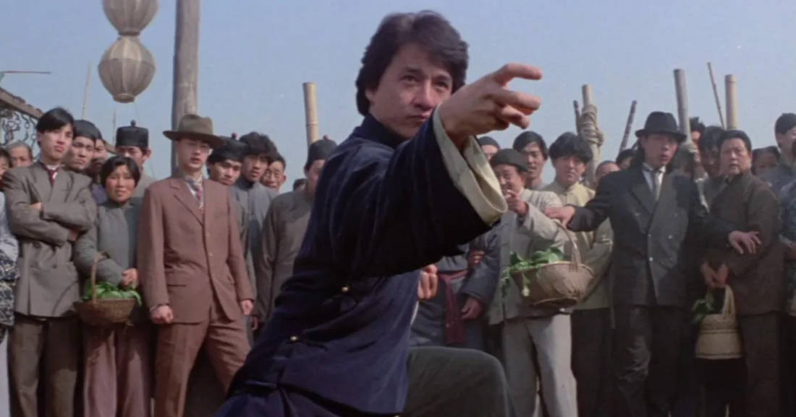

Havahduin siihen, etten muista, milloin olisin viimeksi katsonut elokuvan. Katson elokuvia todella harvoin ja vielä harvemmin odotan niitä. Tämä on vähän erikoista kun ottaa huomioon, että olen ollut ison osan elämästäni elokuvaharrastaja. Mitä tapahtui?

<!--more-->

### Olin elokuvaharrastaja
Oma elokuvaharrastukseni taisi alkaa siitä, kun aloin nauhoittaa televisiossa pyörineitä elokuvia VHS-kasetille. Olin korkeintaan 10-vuotias. Hieman myöhemmin kodissamme alkoi näkyä satelliittikanavat. Se oli unelmien täyttymys, sillä minulle aukesi [FilmNetin](https://fi.wikipedia.org/wiki/Filmnet) elokuvatarjonta. Pääsin näkemään [Back the the Future II](https://www.themoviedb.org/movie/165-back-to-the-future-part-ii):n!

Teini-iässä aloin käydä elokuvateattereissa. Kävin lähes joka viikko katsomassa jonkun elokuvan - silloin se oli vielä kohtuullisen hintaista. Keräilin teatterin pääsylippuja oman koulupöytäni yläpuolelle ja niitä kertyikin melkoinen määrä. Noihin aikoihin tulin katsoneeksi myös ensimmäisen elokuvan, joka meinasi räjäyttää tajuntani. Elokuva oli Jodie Fosterin ja Matthew McConaugheyn tähdittämä [Contact](https://www.themoviedb.org/movie/686-contact).



Elokuvaharrastukseni jatkui, mutta harmillisesti Suomessa esitettävä valikoima oli hyvin rajallinen. Onneksi 2000-luvulla Internet tuli avuksi ja yhtä äkkiä pääsin käsiksi myös aasialaisiin elokuviin. Silloin tuli tutuksi myös [Oldboy](https://www.themoviedb.org/movie/670) - se alkuperäinen.

Vaikka muksuna tykkäsin keräillä VHS-kasetteja, en koskaan tehnyt samaa DVD-levyjen kanssa. Kyllä niitä minulla oli, mutta päädyin rippaamaan levyt tietokoneelle, jotta minun ei tarvinnut pelleillä fyysisten levyjen kanssa, joilla on taipumus naarmuuntua.

Vaikka oma elokuvaharrastukseni keskittyi katsomiseen, päädyin lopulta opiskelemaan visuaalista viestintää ja erikoistuin nimenomaan tv- ja elokuvatuotantoon. Siinä sivussa opiskelin myös käsikirjoittamista. Luonnollisesti opiskelujen aikaan tuli katseltua aivan hirvittävä määrä elokuvia. Joukkoon mahtui myös hieman artsumpaa tavaraa. Tykkäsin kirjoitella pöytälaatikkoon käsikirjoituksia ja opintojen aikana teimme myös joitakin lyhytelokuvia.

Valmistumisen jälkeen olin edelleen innostunut elokuvista, mutta jossain kohtaa huomasin, että aloin menettää kiinnostukseni.

### Kiinnostus alkoi kadota
Minun on vaikea sanoa mitään tiettyä kohtaa, jossa kiinnostukseni alkoi hiipua. Se tapahtui vähitellen.

Muistan kuitenkin elokuvan, jonka kohdalla huomasin ensimmäisen särön. Elokuva oli Peter Jacksonin ohjaama [The Lord of the Rings](https://www.themoviedb.org/movie/120-the-lord-of-the-rings-the-fellowship-of-the-ring). Se oli ensimmäinen elokuva, joka tuntui loppuvan kesken ilman minkäänlaista tyydyttävää loppua. Lopputekstit ilmestyivät silmien eteen kesken tarinan ja sitten piti odotella vuosi, jotta seuraava osa, [Two Towers](https://www.themoviedb.org/movie/121-the-lord-of-the-rings-the-two-towers), julkaistaisiin. Se teki saman tempun ja tarina päättyi vasta viimeisessä [The Return of the King](https://www.themoviedb.org/movie/122-the-lord-of-the-rings-the-return-of-the-king) -elokuvassa.

Olin kovin ihmeissäni siitä, miten on mahdollista julkaista elokuva, jolla ei ole ehjää tarinaa ja loppua. Temppu tuntui halvalta. En myöskään tajunnut tuntikausia kestäviä Director's Cut -versioita. Olin oppinut siihen, että elokuvakerronta on verrattain tiivistä, etenkin hyvä sellainen.

Vaikka elokuvasarjoja on ollut lähes yhtä pitkään kuin elokuvia on tehty, 2000-luvulla niiden tuotanto tuntui lähtevän lapasesta. Ensimmäinen [Matrix](https://www.themoviedb.org/movie/603-the-matrix) (1999), [X-Men](https://www.themoviedb.org/movie/36657-x-men) (2000), [The Fast and the Furious](https://www.themoviedb.org/movie/9799-the-fast-and-the-furious) (2001), [Harry Potter](https://www.themoviedb.org/movie/671-harry-potter-and-the-philosopher-s-stone) (2001), [Pirates of the Caribbean](https://www.themoviedb.org/movie/22-pirates-of-the-caribbean-the-curse-of-the-black-pearl) (2003) ja niin edelleen. Joka vuosi tuntui täyttyvän jatko-osista: [Terminator III](https://www.themoviedb.org/movie/296-terminator-3-rise-of-the-machines) (2003), [The Bourne Supremacy](https://www.themoviedb.org/movie/2502-the-bourne-supremacy) (2004), [Star Wars: Episode III](https://www.themoviedb.org/movie/1895-star-wars-episode-iii-revenge-of-the-sith) (2005) ja lista vaan jatkuu.

Elokuvien lisäksi olen aina tykännyt supersankaritarinoista ja sarjakuvista. 2010-luvulla niistä ei sitten ollutkaan pulaa. [Dark Knight](https://www.themoviedb.org/movie/272-batman-begins) -triologian, sekä [Spiderman](https://www.themoviedb.org/movie/557-spider-man) ja [Iron Man](https://www.themoviedb.org/movie/1726-iron-man) -elokuvien aloittama supersankarisekoilu tuntuu jatkuvan edelleen. Jaksoin olla niistä jonkin aikaa innoissani, mutta aika nopeasti koko touhusta alkoi mennä maku.

Alettiin puhua Marvel- ja DC-universumeista, jossa kaikki elokuvat sitoutuvat jotenkin toisiinsa. Elokuvat olivat sarjatuotannolla tuotettua roskaa, joita suunniteltiin vuosiksi eteenpäin. Käsikirjoittamisen ja sisällön puutteita yritettiin piilottaa efektisekoilun alle. Älä ajattele vaan keskity katsomaan! Katso, säihkyvä!

Huomasin, että olin menettänyt kiinnostukseni sekä supersankarielokuviin, että elokuviin ylipäätään.

### Hollywoodin muutos
Jos minun pitäisi nimetä 2000-luvun suurin pettymys, se on ehdottomasti **Disney**. Oma lapsuuteni rakentuu Disneyn klassikkotarinoiden ympärille, mutta modernilla Disneyllä ei tunnu olevan sen kanssa enää mitään tekemistä.

Disney on aikaisemmin mainittujen Marvel-elokuvien taustalla, mutta lisäksi se on ostanut pois kilpailijoita, ja saanut siinä sivulla oikeudet sellaisiin klassikoihin kuin Star Wars, Indiana Jones. Siitä on tullut aivan jättimäinen yritys, joka syö sisäänsä kaiken muun.

Modernin Disneyn vahvuus ei ole ole enää aikoihin ollut tarinoiden kertominen. Se tuntuu ratsastavan lähinnä nostalgialla, jota se ei tee hyväntahtoisesti. Heidän tavoitteenaan tuntuu olevan ihmisille tuttujen maailmojen tuhoaminen ja rakastettujen hahmojen häpäiseminen. Kun fanit nousevat barrikadeille, Disney lähtee innolla sotajalalle heitä vastaan. Heidän mielestään vika on aina faneissa.

Helppo ratkaisu hyytyneeseen tarinankerrontakoneeseen on tietenkin myydä vanhat ideat uudelleen. Tuloksena on syntynyt "modernisoituja" versioita Disneyn omista klassikoista - elokuvia, joita kukaan ei oikeastaan pyytänyt. Vai mietitkö usein, että tehtäisiinpä Lion Kingistä joskus CGI-versio?

Disney on iso osallinen muutoksessa, mutta ei suinkaan ainut.

Hollywood muistuttaa koko ajan enemmän propagandakoneistoa, jonka tehtävänä on survoa ihmisten kurkuista alas mitä moninaisinta agendaa ja arvoa. Jos minulta kysytään, Hollywoodin ensisijainen tehtävä pitäisi olla ihmisten viihdyttäminen. Se ei itse tunnu ajattelevan näin tai sitten se on unohtanut sen.

Eivät kaikki tietenkään toimi näin, mutta Hollywoodin yleiskuva on muuttunut. Ainakin minun silmissä.

### Arjesta irtaantumista
Minulle elokuvat ovat aina olleet arjesta irtautumista. Sitä, että voin hypätä toiseen maailmaan ja tuntea oloni viihdytetyksi. Se ei tietenkään tarkoita, etteikö elokuvassa voisi olla sanoma - monessa on. Elokuvan ensisijaisen tehtävän pitäisi kuitenkin olla hyvän tarinan kertominen ja viihdyttäminen.

Viihdettä on tietenkin monenlaista. Pidän surullisista ja koskettavista elokuvista. Pidän elokuvista, joissa on synkkä loppu. Vaikka niiden katsominen sattuu, se ei haittaa, koska kipu ei tule oikeasta elämästä vaan tarinasta. Välillä on hyvä tuntea itsensä surkeaksi syistä, jotka eivät kosketa itseä tai ole oikeita.

Aina hyvä ja tunteita herättävä tarinakaan ei ole niin tarpeen. Minulla on pehmeä kohta sydämessäni [Jackie Chanin](https://www.themoviedb.org/person/18897-jackie-chan) vanhemmille elokuville, jotka yhdistelivät komediaa ja toimintaa. Niiden tarinat ovat hölmöjä, mutta ne eivät yritä olla mitään muuta. Tämä on piirre, joka leimaa monia 90-luvun toimintaelokuvia. Ne voisi luokitella aivottomaksi viihteeksi, mutta useimman alta löytyy silti kaikki hyvän tarinankerronnan peruspilarit. Ne keskittyvät viihdyttämään ja tarjoamaan pakopaikkoja, jonne arki ei löydä.

Joissain elokuvissa ei tarvita tarinaa lainkaan. Eikä edes päähenkilöä tai dialogia. Yksi mieleenpainuvimmista tällaisista kokemuksista oli vuonna 1992 ilmestynyt [Baraka](https://www.themoviedb.org/movie/14002-baraka).

Olen ehtinyt katsoa elämäni aikana lukuisia poliittisia elokuvia. Minua ei ole koskaan häirinnyt se, että elokuva valitsee puolensa ja haluaa välittää selkeän sanoman. Tärkeää on kuitenkin se, että se keskittyy **kertomaan tarinan** ja tekee sen **samaistuttavien hahmojen** kautta. Jos se onnistuu samalla synnyttämään ajatuksia tai muuttamaan mielipiteitä, hienoa! Modernit elokuvat tuntuvat toimivan päinvastoin.

Niiden olemassa olon syy vaikuttaa usein olevan poliittisen sanoman tuputtaminen. Tarina ja henkilöhahmot ovat lähinnä öljy, jonka avulla viesti saadaan tungettua katsojan kurkusta alas. Tuloksena syntyy sota-ajan naurettavia propagandaelokuvia muistuttavaa roskaa, jolle vielä joitakin vuosia sitten naureskeltiin hyväntahtoisesti, mutta nyt se on osa tätä päivää.

Surullista on, että näillä elokuvilla on tapana jakaa myös ihmiset kahdelle puolelle todella leveää kuilua.

Olipa kyse elokuvista tai peleistä, minulle tarinoiden kantava voima ovat mielenkiintoiset, samaistuttavat hahmot. Hyvin kirjoitetut hahmot voivat pelastaa huonosti kirjoitetun tarinan. Minulle hyvän hahmon vaatimuksiin kuuluu aina jonkinlainen konflikti ja se, että päähenkilön on kasvettava konfliktin seurauksena. Tätä näkee nykyään hämmentävän harvoin.

Liian usein päähenkilö on elokuvan alussa kaikkivoipa, jolla ei ole mitään heikkoutta, eikä mikään ole hänelle todellinen haaste. Hän kulkee läpi elokuvan näyttämässä kaikille olevansa jokaista parempi ja on elokuvan lopussa samanlainen kuin sen alussa.

Lisäksi uskomattoman moni on kirjoitettu muistuttamaan kusipäistä, pilalle hemmoteltua kakaraa, joka ei osaa olla kiitollinen mistään ja katselee kaikkia muita nenänvarttaan pitkin. Kaikki hänen elämässään on hänen itsensä ansiota eikä hän tarvitse muita.

Ehkä tämä vetoaa johonkin ihmisryhmään. Itseeni ei.

Kiinnostavien hahmojen lisäksi pidän myös perinteisistä teemoista, kuten ystävyys, kunnioitus, luottamus, perhe ja sinnikkyys. Vaikka tarinat ovat vuosisatojen aikana muuttuneet, tietyt teemat tuntuvat olevan ikuisia ja globaaleja - ehkä ihan syystä.

### Valitsen mieluummin pelin

Jos minun pitää valita, että käytänkö vapaa-aikani elokuvan vai pelin ääressä, valitsen lähes aina pelin. Pelimaailmasta tuntuu löytyvän huomattavasti suuremmalla todennäköisyydellä upeita maailmoja, kiinnostavia tarinoita ja samaistuttavia henkilöitä.

Lähes kaikki viime vuosien ikimuistoisimmat tarinat ja hahmot ovat tulleet peleistä. Ne myös jäävät paremmin mieleen, sillä niiden kanssa viettää pidemmän ajan.

Pelibisnes ei ole immuuni Hollywoodin ilmiöille ja kärsii jo nyt monista samoista ongelmista. Siellä tuntuisi kuitenkin riittävän enemmän tekijöitä, jotka tekevät sitä intohimosta tarinoihin ja viihtymiseen. He muistavat, kenelle he pelejä tekevät.

Ehkä näin on elokuvateollisuudessakin, mutta todelliset tekijät eivät saa enää ääntään samalla tavalla kuuluviin.

Tarinoiden kertominen, jakaminen ja kuunteleminen on alkukantainen osa ihmistä. Me olemme tarinankertojia. Siksi onkin vähän surullista, että siitä on tullut kaupallista ripulia tai se on muutettu omien ristiretkien hyökkäysaseeksi.

Nämä ajatukset syntyivät siitä, etten muistanut edellistä katsomaani elokuvaa, mutta kirjoittaessa se tuli mieleen. Se oli [Teemestarin kirjan]() pohjalta tehty suomalainen elokuva [Vedenvartija](https://www.themoviedb.org/movie/608236-veden-vartija).

Vaikka olenkin menettänyt mielenkiintoni elokuviin, katson niitä silti aina välillä. En kuitenkaan osaa enää odottaa elokuvia tai intoilla niistä etukäteen.

Kaikesta huolimatta kuluneiden vuosien aikana vastaan on tullut jokunen mukava poikkeuskin, joten ehkä päätän tämän kirjoituksen niihin:

- [The Batman](https://www.themoviedb.org/movie/414906-the-batman)
- [The Creator](https://www.themoviedb.org/movie/670292-the-creator)
- [Don't Look Up](https://www.themoviedb.org/movie/646380-don-t-look-up)
- [Everything Everywhere All at Once](https://www.themoviedb.org/movie/545611-everything-everywhere-all-at-once)
- [Ghostbusters: Afterlife](https://www.themoviedb.org/movie/425909-ghostbusters-afterlife)
- [Godzilla Minus One](https://www.themoviedb.org/movie/940721-1-0)
- [Nobody](https://www.themoviedb.org/movie/615457-nobody)
- [Nope](https://www.themoviedb.org/movie/762504-nope)
- [Oppenheimer](https://www.themoviedb.org/movie/872585-oppenheimer)
- [The Super Mario Bros Movie](https://www.themoviedb.org/movie/502356-the-super-mario-bros-movie)
- [Top Gun: Maverick](https://www.themoviedb.org/movie/361743-top-gun-maverick)
- [The Whale](https://www.themoviedb.org/movie/785084-the-whale)

