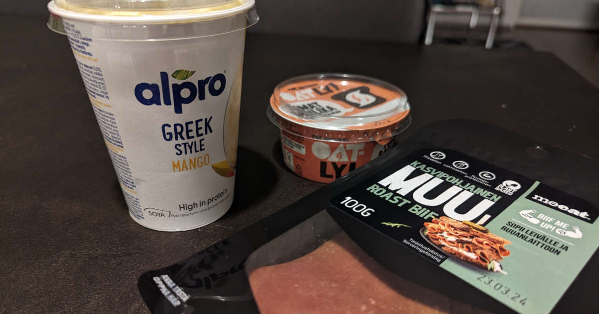

Vuosien aikana eläinperäisten tuotteiden osuus ruokavaliossani on pienentynyt lähes itsestään omien vatsaongelmien takia. Vatsaongelmissa ei ollut ilmeisesi tarpeeksi riesaa, sillä viime vuonna labratulosten saavuttua sain lääkäriltä jämäkän käskyn lisätä kasvisruokaa ja vähentää maitopohjaisia tuotteita entisestään.

<!--more-->

### Sairaudet ohjaavat syömistä

Ruokavaliokeskustelut ovat itselleni haastavia. Minulla syömistä ohjaa ensisijaisesti oma terveys. Terveydellä tarkoitan sitä trapetsitaiteilua, jota joudun arjessani käymään vatsa-, suolisto-ongelmien takia.

Olen sanonut, että punainen liha ei ole kuulunut ruokavaliooni moneen vuoteen. Käytännössä tarkoitan kuitenkin sitä, että en itse valmista punaisesta lihasta kotona juuri mitään. Välillä kuitenkin puolisoni toivoo jauhelihaa ja silloin teen ruokaa jauhelihasta. En suhtaudu asiaan niin suurella vakaumuksella, että alkaisin asiasta hänen kanssaan tapella. Hän joutuu muutenkin elämään minun rajoitusten mukaan, joten sallin hänelle ne satunnaiset poikkeukset. 

Lopputulos on joka tapauksessa se, että lihan määrä meidän kummankin ruokavaliosta on minun haasteiden takia pudonnut lähes olemattomiin.

Kropan haasteista johtuen syön lähes yksinomaan kotiruokaa, jonka valmistan itse. Kotona ruokakaapeista löytyy vain sellaisia tarvikkeita, jotka sopivat minulle. Se on ainut tapa varmistaa, että pystyn elämään arkea ilman jatkuvia kipuja. Lisäksi se mahdollistaa sen, ettei minun tarvitse koko ajan miettiä ja tarkkailla syömistäni.

Itselläni ensisijainen proteiininlähde oli vuosien ajan kana. Valmistin lähes kaiken ruoan kanasta ja leivän päällä olen käyttänyt kalkkunaleikkeitä. Kuten mainitsin, punaista lihaa en syö, mutta sen lisäksi en syö myöskään kalaa tai mereneläviä. Muita eläinperäisiä tuotteita ovat olleet lähinnä maitotuotteet, joita voin syödä pieniä määriä kunhan ne ovat laktoosittomia.

Tästä syystä olikin tylsää kuulla, että lääkäri suositteli vieläkin vahvempaa kasvisruokavalioon siirtymistä ja maitotuotteiden poistamista. En varsinaisesti hyppinyt riemusta, mutta eihän se auttanut kuin kääriä hihat.

### Kanan ja maitotuotteiden korvaaminen

Olen testannut erilaisia lihankorvikkeita ennenkin, mutta ongelmaksi muodostui aina se, että parin päivän syömisen jälkeen kärvistelin seuraavat päivät hirvittävässä vatsakivussa. Iso osa niistä ei yksinkertaisesti sovi minulle. Ne voivat toimia päivän tai kaksi, mutta toistuvasti syötynä ongelmia alkaa tulla.

Nyt piti siis alkaa metsästää vaihtoehtoja, jotka sopisivat minulle ja toimisivat myös proteiinin lähteenä.

Koska kana oli niin keskeinen osa ruokavaliotani, aloitin ensimmäisenä etsimään sen korvaajaa. Vaihtoehtoja oli aika nihkeästi, eivätkä ne saaneet meidän taloudessa kovin suurta suosiota. Luonnollisesti minun oli huomioitava myös puolisoni mielipiteet, koska en halunnut, että meidän pitäisi alkaa valmistaa molemmille omia ruokia.

Etsintä tuotti kuitenkin tulosta! [Hälsans Kökin fileesuikaleet](https://www.halsanskok.fi/tuote/filet-pieces) osoittautuivat aivan timanttiseksi vaihtoehdoksi kanalle. Ne ovat vegaanisia ja valmistettu soijaproteiinista. Ne eivät sellaisenaan maistu juuri miltään (kuten ei kanakaan), joten niitä voi maustaa mielensä mukaan. Niiden koostumus ei vastaa kanaa ihan täysin, mutta se on erittäin lähellä. Mikä parasta, nämä ovat pakastetavaraa, joten ne säilyvät pitkään. Proteiinia suikaleissa on 23 g / 100 g, joten niiltä osin ne ovat jopa parempia kuin kana.

Hälsans Kökilta löytyy myös muita aivan mahtavia ruoka-aineita. Tähän mennessä olen ehtinyt testata [kasvisfileitä](https://www.halsanskok.fi/tuote/ovo-vegetarian-fillet), [nugetteja](https://www.halsanskok.fi/tuote/vegan-nuggets) sekä [pyöryköitä](https://www.halsanskok.fi/tuote/plant-based-balls). Muitakin on, mutta en ole ehtinyt niitä vielä testata.

Kun pääsin testailuissa vauhtiin, testailin myös jauhelihan korvikkeita. Ajattelin, että ne voisivat hyvällä säkällä laajentaa ruokavaliotani.

Vaihtoehtoja oli enemmän, mutta ikävä kyllä suurin osa niistä ei sopinut minulle. Pettymyksistä huolimatta joukosta löytyi poikkeus: [MUU Jauhis](https://meeat.co/tuotteet/muu-jauhis/). Ainakin toistaiseksi se on sopinut minulle hyvin ja olenkin tehnyt siitä useita pastakastikkeita.

Jauhista voi käyttää jauhelihan tavoin ja koostumus on lähes sama. Proteiinia löytyy 12 g / 100 g, joten aivan jauhelihan tasolle ei päästä, mutta omassa käytössä tämä laajensi mukavasti ruokavaliota.

Maito janojuomana jäi ruokavaliosta pois jo teini-ikäisenä, kun minulla todettiin laktoosi-intoleranssi - tästä kaikki vatsaongelmat alkoivat. Maitoa olen käyttänyt lähinnä kahvissa ja sen korvaaminen oli minulle helppoa. Melkein mikä tahansa kauramaito sopii tarkoitukseen, mutta itse olen tykästynyt edulliseen [Rainbow Kaurajuomaan](https://www.sydanmerkki.fi/tuotteet/rainbow-kaurajuoma-1-l/). Satunnaisesti käytettynä kaurajuoma on toiminut myös ruoanlaitossa eikä ongelmia ole tullut.

En juurikaan syö makeita herkkuja arjessa, mutta proteiinirahkat ovat olleet oma "paheeni". Erityisesti kerrosproteiinirahkat, joiden pohjalla on hilloa. Tähän mennessä paras löytö on ollut [Alpron proteiinivälipala](https://www.alpro.com/fi/tuotteemme/proteiinituotteet/plant-protein/plant-protein-yellow-fruits). Se ei ole aivan yhtä raikas kuin maitopohjaiset kilpailijat, mutta istuu omaan suuhun oikein mukavasti. Yhdessä annoksessa on 15 grammaa proteiinia.

Samalta valmistajalta löytyy myös korvike [kreikkalaiselle jugurtille](https://www.alpro.com/fi/tuotteemme/kasvipohjainen-vaihtoehto-rahkalle/greek-style/greek-style-no-sugars). Tästä tuli itselleni uusi vakioherkku, jota käytän osana marjasmoothieta. Om nom!

Leivän päällä ja ruoanlaitossa käytettävän voin korvasin [Flora Plant B+tterillä](https://www.flora.com/fi-fi/flora/tuotteet/plant-bttter). Sen lisäksi, että tuote on kasvipohjainen, se on myös palmuöljystä vapaa. Kiva bonus!

Koska omassa lähikaupassa vegaaniset tuotteet on niin selkeästi merkitty, testailun aikana ostoskoriin on tarttunut kaikenlaista satunnaista. Löysin muun muassa Boltsin [chili-tomaatti-maustetut kaura-siemenpyörykät](https://boltsi.fi/tuote/boltsi-chili-tomaatti/) - aivan hurjan hyviä ja voin vetää näitä naamariin vaikka kylmiltään. Toinen hyvä löytö on ollut [MUU Roast Biif](https://meeat.co/tuotteet/muu-roast-biif-100g/), joka toimii leivän päällä tosin hyvin. Harmillisesti tuote on vaan aika suolaisen hintainen ja paketti aika pieni.

Vielä kun löytäisin hyvän korvikkeen juustolle! Vaihtoehtoja on vähän, tuotteet ovat hävyttömän hintaisia ja paketit onnettoman pieniä.

### Kasvisvaihtoehtojen runsaus

Ennen viimeistä ruokavaliomuutosta en ollut tajunnut, kuinka laaja kasvisvaihtoehtojen tarjonta nykyään on. Sen lisäksi, että vaihtoehtoja on runsaasti, ne ovat myös erittäin hyviä ja laadukkaita.

Ajatus siitä, että kasvisruokailu on mauttoman heinän järsimistä, on ihan naurettava. En ole häävi kokki, mutta jopa minä saan tarjolla olevista kasvisraaka-aineista maistuvaa ruokaa aikaiseksi.

Kun olen joutunut muuttamaan ruokavaliotani, minun on pitänyt muistuttaa itselleni, ettei tuotteen korvaaminen toisella ole aina se ainut vaihtoehto. Tuotteita ja ruoka-aineita voi myös jättää pois. Tilalle voi ottaa jotain ihan uutta, joka ei ole samaa kuin vanha, mutta jotain yhtä hyvää - tai parempaa.

Välillä sapettaa, että osa tämänkin testailun aikana kokeilluista tuotteista oli tosi maistuvia. Harmillisesti kroppa ei vaan niitä hyväksynyt.

Mukavaa on kuitenkin se, että nyt kun iso osa ruoasta on vatsalle sopivaa, se ei kiukustu niin pahasti pienistä poikkeuksista. Tämä on mahdollistanut muun muassa sen, että voimme käydä satunnaisesti ravintolassa, eikä minun tarvitse kauheasti miettiä mitä suuhuni laitan.

Saatan saada pieniä vatsakipuja, mutta se on hinta, jonka olen valmis maksamaan hyvästä ruoasta. Erityisen mielissäni olen ollut kodin lähelle auenneesta nepalilaisesta ravintolasta, josta saa aivan taivaalliseen hyvää ruokaa, eikä kasvisvaihtoehdoista ei ole puutetta.