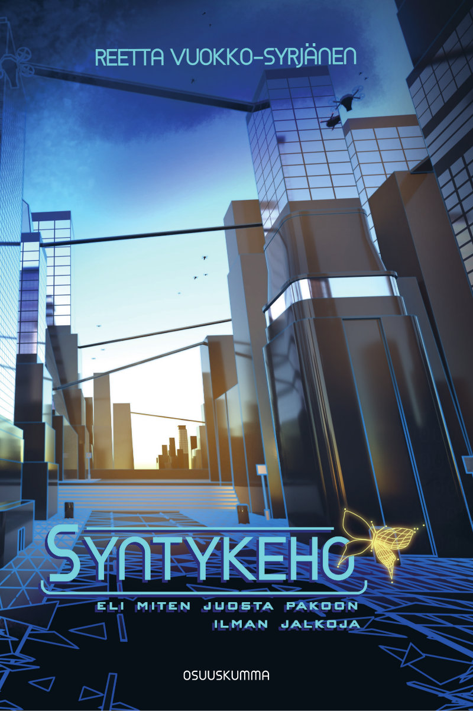

Luin eilen loppuun Reetta Vuokko-Syrjäsen esikoisromaanin Syntykeho. Takakansiteksti imaisi minut heti mukaansa ja sen perusteella kirja oli kuin luotu minulle. Käytännössä kokemus oli kuitenkin jotain ihan muuta. Kirja oli erikoinen lukukokemus, joka muistutti minua elementeistä, jotka ovat itselleni tärkeitä tarinankerronnassa.

<!--more-->

### Tarina

Tapahtumat sijoittuvat vuoteen 2466. Paikka voisi olla Suomi, mutta tässä kohtaa tulevaisuutta sillä ei ole juuri merkitystä. Maapallo ja ihmiskunta on muuttunut radikaalisti liikakansoittumisen myötä. Ratkaisuksi päätyi lopulta tekniikka, jolla ihmisten persoonallisuus, muistot ja koko olemus voidaan irrottaa kehosta ja siirtää servereille.

Suuri osan ihmisistä elääkin nykyään sosiaaliserverillä ja saa kehoaikaa hyvin rajallisen määrän, jos sitäkään. Fyysisistä kehoista on tullut lähinnä rikkaiden ja parempiosaisten hupia. Jos joskus ongelma oli liikakansoittuminen, nyt yhteiskunta taistelee sen kanssa, ettei lisääntymiskykyisiä ihmisiä meinaa enää riittää. Ihmisten kyky tuntea fyysistä ja seksuaalista vetovoimaa on kadonnut.

Kehojen käyttämistä valvoo Dorofy Oyj, globaali suuryritys, joka on saanut eräänlaisen yksinoikeuden säädellä kehopolitiikkaa. He toimivat myös ankarana poliisivoimana, joka valvoo, että kansalaiset noudattavat heidän sanelemaansa politiikkaa. Rangaistus kehorikoksesta on ankara, eikä aina ole selvää, mitä tuomituille lopulta tapahtuu.

Tarinan päähenkilö **Kip** on viettänyt sosiaaliserverillä lähes koko elämänsä. Siellä asuinkumppaneitaan ei voi juurikaan valita, ja hän on päätynyt asumaan **Lauran**, **Jamin** sekä **Adin** kanssa. Adi on hänen läheisin ystävänsä ja yhdessä he ovat suunnitelleet pakoa serveriltä.

Heidän suunnitelmansa on hankkiutua fyysisiin kehoihin ja karata Ykseyteen. Se on hyväosaisten paratiisi, jossa ihmiset saavat elää kehoissaan pysyvästi ja nauttia mauista, hajuista ja kaikesta niistä aisteista, joita keho mahdollistaa. Ongelmana on, että Ykseyteen pääsee ainoastaan siinä kehossa, jossa syntyi - syntykehossa. Kaksikon epämääräinen suunnitelma kaatuu kuitenkin ennen kuin se oikeastaan edes käynnistyy, sillä Adi murhataan.

Tämän seurauksena Kip saa kehoaikaa ja päätyy todistajaksi fyysisen maailman oikeudenkäyntiin. Tästä käynnistyy kirjan varsinainen tarina. Kip saa yllättävää apua ja onnistuu pakenemaan lainakehossaan. Apu ei kuitenkaan tule ilman ehtoja ja Kipin tehtävänä on toimittaa viesti Pariisiin. Viestin vastaanottaja on **Artisti** - rikkaiden keskuudessa tunnettu rikollinen ja kehonmuokkaaja.

Artisti muokkaa kehoja hävyttömän rikkaille ihmisille heidän toiveidensa mukaan. Useimmat kehot ovat paranneltuja ja niihin on yhdistelty eläinten piirteitä. Kehoissa on ominaisuuksia, joita ei luonnollisista kehoista löydy. Ne ovat nopeampia, kestävämpiä ja ennen kaikkea kauniimpia kuin normaalikehot. Artisti on saanut nimensä syystä.

Kip päätyy toimimaan Artistin apulaisena ja sitä kautta hänelle tarjoutuu mahdollisuus etsiä oma syntykehonsa, joka avaisi portit Ykseyteen. Samalla hän tutustuu Artistin palvelijaan, **Shabariin**, joka pokkuroivasta kohteliaisuudesta huolimatta tuntuu halveksivan Kipiä koko sielullaan. Hän tekee selväksi, että haluaa Kipin katoavan hänen ja Artistin elämästä.

Luonnollisesti Kipin pako ei ole jäänyt Dorofyltä huomaamatta ja hän saakin peräänsä heidän agenttinsa **Elohiiren**, johon Kip tutustui jo oikeudenkäynnissä.

### Samaistumisen vaikeus

Syntykeho on kirja, josta halusin oikeasti pitää. Sen perusajatus ihmisten tietoisuudesta servereillä kiehtoi minua. Samoin ajatus siitä, että meille päivänselvät fyysiset kehot olisivat vain lainassa. Paperilla kaikki oli kuin luotu minulle, mutta varsin nopeasti kirjan aloitettuani tajusin, että tämä ajatus olisi myös tarinankerronnan suurin heikkous.

Aikaisemmissa kirja-arvosteluissa olen tykännyt käydä läpi keskeiset henkilöt, mutta nyt se on lähes mahdotonta. Tässä kirjassa henkilöt vaihtavat kehosta toiseen. Yhdessä hetkessä he voivat olla hoikkia, raihnaisia mummoja ja toisessa atleettisia, suden piirteitä kantavia lihaskimppumiehiä.

Jos kysymys olisi vain fyysisistä ominaisuuksista, asian kanssa voisi ehkä elää, mutta hahmot tuntuvat muuttuvan joka kerta kehonsa mukana. Tämä oli itselleni iso ongelma, sillä en saanut minkäänlaista otetta yhdestäkään henkilöstä. En pystynyt samaistumaan kehenkään, koska hahmot muuttuivat heti kun aloin tuntea heitä. Saatoin oppia tuntemaan heidät ujona ja sosiaalisesti kömpelönä ja hetkeä myöhemmin he olivatkin uhmakkaita ja manipuloivat toisia lahjakkaasti.

En tiedä oliko tämä kirjailijalta tarkoituksellista vai ei. Jos hänen tarkoituksensa oli sanoa, että keho määrittää mitä olemme, kuinka käyttäydymme ja mitä osaamme, hän epäonnistui siinä ainakin omalla kohdalla.

Tarinan toinen ongelma oli sen maailma. Sitä ei oikeastaan ollut. Henkilöt lentelivät ympäri maapalloa ilman fyysisiä rajoituksia. Välimatkat eivät merkinneet mitään. Mikä tahansa paikka oli käden ulottuvilla sormia napsauttamalla. Kirjan ensimmäisen puoliskon aikaan päähenkilöt seikkailivatkin vähän joka puolella maapalloa, mutta jokainen paikka tuntui ihan yhdentekevältä.

Tuntui, että tarinassa kaikki oli mahdollista eikä juuri mitään rajoituksia ollut. Jos fyysiset rajoitukset tulivat vastaan, aina pystyi siirtymään servereille, jossa nekin rajoitukset poistuivat. Loukkaannuitko pahassa onnettomuudessa ja olet kuolemaisillaan? Ei hätää, ei muuta kuin piuha niskaan ja siirretään tietoisuus ehjään kehoon.

Miten voi samaistua henkilöihin, jotka ovat likipitäen kuolemattomia ja kykeneväisiä lähes kaikkeen vain kehoa vaihtamalla? Minulle kiinnostavat henkilöt ja hyvin rakennettu maailma ovat tarinankerronnan keskeisimpiä elementtejä ja tässä tarinassa tuntui puuttuvan molemmat.

### Puutteellinen tarina

Tarinassa oli muitenkin ongelmia, joita on vaikea sysätä pelkästään lennokkaan idean syyksi.

Kirjan alkupuolisko käyttää yllättävän paljon aikaa siihen, että päähenkilö höpisee murhatusta Adista. Lukijana en koskaan tapaa häntä, mutta jostain syystä kirja antaa ymmärtää, että minun pitäisi jostain syystä välittää hänestä. Adi on käytännössä nimi, jota viljellään toistuvasti ja jonka perään Kip haikailee, mutta jonka kuolema merkitsee lukijalle yhtä paljon kuin voipuoli alaspäin lattialle pudonnut leipä.

Sama pätee Lauraan ja Jamiin. Kip höpisee heistä toistuvasti, mutta lukijalle he ovat täysin persoonattomia ja lähes yhdentekeviä tarinan kannalta. Heidän taustatarinansa on kuitattu parilla virkkeellä ja sen jälkeen kirja olettaa, että välittäisin heistä. En välittänyt. He olivat lähinnä häiriötekijä, vaikka heillä pieni rooli tarinassa onkin.

Huonointa on se, että tämä sama kaava toistuu myös päähenkilöissä, Kipissä ja Artistissa. En missään kohtaa ymmärtänyt mikä heitä oikeasti motivoi.

Miksi Kip haluaa Ykseyteen? Onko hänen elämässään jokin huonosti? Miksi hän hyppää niin helposti rikolliselle polulle? Miksi hän ei luota viranomaisiin? Kuinka hän oppii hetkessä lentämään aluksia? Miten hän on oppinut niin hyväksi serverihakkeriksi?

Artisti vaihtaa kehoaan vähän väliä. Miksi? Missä hän on oppinut kaiken sen? Mistä hän on saanut laboratorion, jossa muokkaa kehojaan? Miksi rikkaat uskovat ja tottelevat häntä? Miksei kukaan tiedä kuka hän oikeasti on? Miksi hän on päätynyt kehomuokkaajaksi ja rikolliseksi? Miksi hän kohtelee muita ihmisiä kuin roskaa?

Odotin koko kirjan alkupuoliskon, että satunnainen haahuilu ympäri maapalloa olisi pohjustusta johonkin suurempaan. Sitä ei kuitenkaan koskaan tullut. Olin kirjan puolivälissä, kun tajusin, etten vieläkään tiedä mitä päähenkilö on oikeasti tekemässä, mitä hän lopulta haluaa tai minkä konfliktin kanssa hän painii. Hän nyt vaan haluaa Ykseyteen koska haluaa.

Olin kypsä lopettamaan kirjan kesken, mutta hieman puolen välin jälkeen tarinan luonne muuttuu melkoisesti. Tässä kohtaa en jaksanut välittää siitä, ettei juonenkäännettä oltu pohjustettu juuri mitenkään. Se oli näitä asioita, jotka piti vain uskoa, koska kirja käski tehdä niin.

### Hyvä puolisko

Syntykehon jälkimmäinen puolikas on kuin kokonaan oma tarinansa. Siinä hahmot alkavat tuntua oikeilta ihmisiltä, joihin pystyy samaistumaan. Tarina käyttää paljon enemmän aikaa kuvailemaan heidän persoonallisuuttaan ja mistä he ovat lähtöisin. Lukijana pääsin paremmin heidän päänsä sisään ja sain tutustua heidän ajatuksiinsa ja tunteisiinsa. Tämä on myös se kohta, jossa ihmisten välillä alkaa muodostua uskottavia suhteita.

Tarina muuttuu myös jännemmäksi, sillä vihdoinkin päähenkilöllä on oikea konflikti käsissään. Konflikti on luonteeltaan sellainen, johon minun oli helppo samaistua. Jatkuva paikasta toiseen loikkiminen sekä kehon vaihtaminen loppuu, ja kirjailija käyttää aidosti aikaa hahmojen luomiseen.

Paikka, jossa asiat tapahtuvat, on omalla tavallaan upea. Tässä kohtaa kirjailija on selvästi panostanut maailman rakentamiseen, sillä se on oikeasti kiinnostava ja yksityiskohtia täynnä. Tarinan kaikki kiinnostavat tapahtumat tapahtuvat täällä. Tämä oli se hetki tarinaa, jossa aloin välittää hahmoista ja minua kiinnosti mitä heille tapahtuu.

On jotenkin vitsikästä, että tämä on se osa tarinaa, joka edustaa vähiten takakannen kuvaamaa abstraktia maailmaa sosiaaliservereineen ja ihmisineen ilman kehoa. Lukijana unohdin sen kaiken ja pystyin oikeasti uppoutumaan tarinaan. Se herätti kysymyksen siitä, että mihin kaikkea sitä hatsailua lopulta tarvittiin?

Tässä kohtaa on myös hyvä kertoa, että oma suosikkihahmoni kirjassa on Artistin palvelija Shabar. Miksi? Siksi, että hän on alkupuoliskon aikana ainut hahmo, joka pysyy aidosti muuttumattomana. Vaikka hän ei ole erityisen pidettävä henkilö, hän on ainut johon pystyin oikeasti tarrautumaan. Shabarin olemuksessa ja käyttäytymisessä on lisäksi jotain epämääräistä, joka sai minut kiinnostumaan hänen historiastaan ja motiiveistaan. Onneksi Syntykeho vastaa tähän kiinnostukseen ja Shabarin taustatarina päätyykin olemaan yksi kirjan parhaista yllätyksistä.

Lisäksi haluan mainita sen, että jokainen luku alkaa kuvitelluilla lainauksilla menneiden aikojen kirjoista, haastatteluista, lehtisistä ja oppaista. Ne ovat kuin videopelien maailmoista löytyviä piilotettuja salaisuuksia, jotka paljastavat yksityiskohtia siitä, kuinka nykyinen maailma on syntynyt. Ne kertovat kuinka kehosäännöstelyyn päädyttiin ja millaisia haasteita ihmiset kohtasivat. Ne kertovat konflikteista ja ristiriidoista. Nämä pienet palaset olivat erittäin tervetullut lisä muuten hieman puuduttavaan maailmaan.

Ikävä kyllä tämä hienosti kirjoitettu vaihe ei jatku loppuun asti. Juoni muuttaa suuntaansa uuden satunnaisen käänteen seurauksena. Kehojen vaihtelu tulee takaisin osaksi tarinaa ja hahmot menettävät ison siivun siitä inhimillisyydestä, jota aikaisempi osa onnistui rakentamaan. Onneksi kaikkea ei kuitenkaan menetetä ja henkilöiden motiivit kantavat loppuun asti.

Loppu tuntui muuhun tarinaan verrattuna hätäiseltä. Kirja tuhlasi ensimmäisen puolikkaan satunnaiseen hessuiluun, mutta lopun tapahtumat käytiin läpi parin luvun aikana. Tarina saa kyllä ihan tyydyttävän loppuratkaisun, mutta se tuntui tyhjältä ja merkityksettömältä. Se ei herättänyt kysymyksiä eikä se saanut minua miettimään.

### Yhteenveto

Näin jälkeenpäin minulla on sellainen olo, että kirjailija on alun perin lähtenyt kirjoittamaan lyhyempää tarinaa - sitä osaa, josta pidin. Tämä osa tarvitsi toimiakseen ajatuksen kehottomuudesta, sosiaaliservereistä ja suuren korporaation dominoimasta maailmasta. Se olisi voinut olla hyvä tausta tapahtumille, mutta jostain syystä se venyi kattamaan yli 60 % kirjasta.

Syntykeho olisi voinut olla upea tarina, jos koko ensimmäinen puolikas olisi jätetty pois. Osan siitä olisi voinut korvata harkitummalla pohjustuksella, mutta tällaisenaan maailma hukuttaa sisäänsä hyvän tarinan ja vesittää myös lopun. 

Takakansiteksti sanoo kirjan olevan rakkaustarina, jossa ei käytetä kertaakaan sanaa rakkaus. Se on totta, mutta myös tämä hautautuu kaiken hölynpölyn alle. Ne hetket, kun tarina aidosti pureutuu sellaisiin teemoihin kuten perhe, ystävyys, luottamus ja lapsuus, ovat oikeasti kiinnostavaa luettavaa. Se käsittelee mahtavalla sitä, kuinka ihmiset voivat uhrata itsensä välittämänsä asian puolesta.

Lisäksi kirjailija onnistuu hienolla tavalla kuvaamaan ihmisten välistä välittämistä ja vetovoimaa, joka ei pohjaudu asioihin joihin olemme tottuneet. Se ei näyttäydy tavalla, johon olemme tottuneet. Silti siinä on jotain tuttua, johon pystyin samaistumaan.

Kuten alussa totesin, halusin pitää tästä kirjasta. Ikävä kyllä se ei toteutunut. Voin jollain tasolla ymmärtää, miksi tällainen tieteistarina uppoaa joihinkin ihmisiin. Ehkä Elisa Kirjan viisi tähteä ovat ansaittu. Minulle, joka sisäistää tarinat erityisesti ihmiskohtaloiden kautta, tämä ei tuntunut erityisen hyvin kirjoitetulta tarinalta.

Ehkä tämä ei vain ollut minua varten. Kaikkia ei tarvitse miellyttää!