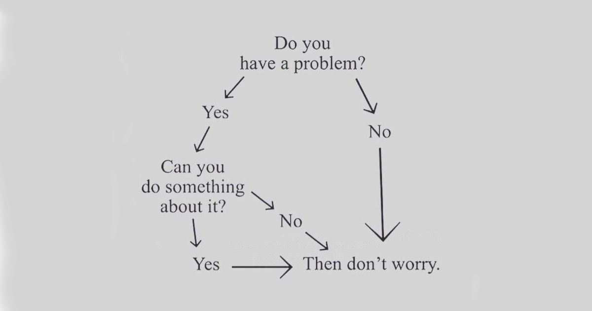

Luin eilen [Ylen artikkelin](https://yle.fi/a/74-20083890), jossa käytiin läpi itsekuria ja "ryhdistäytymistä". Aihe on itseäni lähellä, sillä tämä surullisenkuuluisa ryhdistäytyminen on ollut yksi niistä voimista, joilla olen kulkenut elämän vastoinkäymisiä läpi. Se ei ehkä kuitenkaan ole ihan sellaista ryhdistäytymistä, miten monet sen käsittävät.

<!--more-->

### Mikä ihmeen ryhdistäytyminen?

Ylen artikkeli ei ole ensimmäinen laatuaan, eikä varmasti viimeinen. Olen lukenut läjäpäin self-help -kirjoja, jotka toitottavat, että kaikki on mahdollista kun vaan uskot itseesi. Samaan aikaan vastaan tulee ihmisiä, jotka ovat vakaasti sitä mieltä, että itseensä uskominen, yrittäminen ja ryhdistäytyminen on vain hyväosaisten puhetta, joka ei ole tuonut mitään hyvää heidän omaan elämäänsä. Päinvastoin, se voi olla jopa haitaksi - etenkin jos toiset kannustavat siihen.

Itse näen keskustelussa ongelman, joka tuntuu tulevan nykyään toistuvasti vastaan: asiat ovat mustavalkoisia eikä harmaan sävyjä ole.

Myönnän itse olevani ryhdistäytymisen puolestapuhuja. Käytän ryhdistäydy-sanaa nyt hivenen kieli poskessa, sillä en allekirjoita self-help -kirjojen ajatusta. Minulle ryhdistäytyminen tarkoittaa sitä, että ottaa vetovastuun omasta elämästään.

Sen sijaan, että kulkee sen läpi jonkinlaisena passiivisena matkustajana, ottaa siihen itse osaa. Osallistuu päätöksentekoon, priorisointiin ja tekee valintoja. Minulla ryhdistäytyminen voi olla myös sellaista, joka ei näy ulkopuolisille mitenkään. Palaan tähän hieman myöhemmin.

En muista mistä se on tarttunut mieleeni, mutta tämä toteamus on jo pitkään puhutellut minua: "Parempia aikoja odotellessa asioille voi yrittää tehdä itse jotain."

Mikään tässä ei tarkoita sitä, että kaikki elämän onnistumiset ja epäonnistumiset olisivat vain omasta tekemisestä kiinni. Se ei tarkoita sitä, ettei yhteiskunnalla ja ympäristöllä olisi mitään vastuuta mistään. Se ei tarkoita, että kaikki ponnistaisivat samalta viivalta - niin ei ole. Se ei myöskään tarkoita, että jokainen ryhdistäytyminen johtaisi onnistumiseen. Epäonnistumisia tulee, ehkä jopa enemmän kuin onnistumisia. 

Miksi sitten ajattelen, että ryhdistäytyminen olisi parempi kuin se, ettei ryhdistäytyisi? Syy ei luultavasti yllätä: omat kokemukset.

### Ensimmäinen ryhdistäytyminen

Yritin miettiä, että mikä olisi varhaisin muisto, jossa koin ottaneeni selkeää vetovastuuta elämästäni. Mieleeni tuli aika, jolloin päätin peruskoulun.

Peruskoulussa en ollut erityisen hyvä missään, ainakaan koulujärjestelmän mittapuulla.  Se näkyi päättötodistuksen keskiarvossa. En halunnut lukioon sillä koin, ettei se olisi minua varten. Kaikki kaverini tähtäsivät sinne ja ainakin siihen aikaan ammattikoulusta puhuttiin häviäjien paikkana. Sinne menivät lähinnä ne, joilla ei ollut päätä ja todistusta parempaan - eli lukioon. Koin häpeää ja tunsin itseni huonoksi. Olin vihainen myös koko järjestelmälle, osin myös kavereilleni.

Päädyin joka tapauksessa ammattikouluun. En siksi, että olisin itse aktiivisesti tehnyt asian eteen kauheasti, vaan siksi, etten tehnyt oikeastaan mitään. Toki pistin pakolliset hakupaperit menemään, mutta se oli enemmän aivotonta suorittamista, jota teki koska käskettiin.

Pääsin kouluun ja halusin opiskella tietotekniikkaa. Ikävä kyllä se oli erikoistuminen, jonne pääsi vasta puolen vuoden perusjakson jälkeen. Tämä jakso koostui sähkö-, metalli- ja autopuolen koulutuksesta[^1]. Näiden keskiarvojen perusteella opiskelijat laitettiin järjestykseen ja parhaimmat pääsivät mihin halusivat, loput minne mahtuivat. En päässyt opiskelemaan tietotekniikkaa vaan päädyin sähköpuolelle.

Tämä on se kohta, jossa muistan ottaneeni ohjat elämästäni. Omat vanhempani koittivat kannustaa minua ja lohduttaa, että kyllä minusta hyvä sähköasentaja tulee. He tarkoittivat hyvää ja olisin tietenkin voinut jatkaa kellumista elämäni kyydissä. Valitsin kuitenkin toisin. Ilmoitin vanhemmilleni, että keskeytän opintoni. Mitään suunnitelmaa minulla ei ollut ja tunsin tuhlanneeni yli puoli vuotta koulussa ja opintoni viivästyisivät ainakin vuodella. Tässä kohtaa elämää se tuntui pitkältä ajalta.

Hain toiseen kouluun, joka oli eri kaupungissa, mutta en antanut sen häiritä. Pääsin sinne, muutin pysyvästi vanhempieni luota pois, ja nyt opiskelin alalla, joka kiinnosti minua. Valmistuin koulusta loistavilla arvosanoilla. Siinä kohtaa minua ei harmittanut yhtään, että olin tuhlannut vuoden elämästäni.

Tässä ei ole tietenkään mitään ihmeellistä tai ainutlaatuista. Ihmiset keskeyttävät ja vaihtavat kouluaan koko ajan. Tämä oli vain ensimmäinen muistamani esimerkki siitä, että käänsin oman elämäni suunnan omalla aktiivisella päätöksenteolla. Vaihtoehtoisesti olisin voinut jäädä märehtimään asiaa, syyttää surkeaa valintaprosessia ja jatkaa muuttamatta mitään. Saattaisin olla nyt ihan onnellinen sähköasentaja, mutta juuri siinä hetkessä en olisi tehnyt sitä mitä aidosti halusin.

Lienee jonkinlaista kohtalon ivaa, että jouduin tekemään saman kun jatkoin opiskelua ammattikorkeakoulussa. Minusta piti tulla insinööri, mutta keskeytin opintoni, koska suunta ei tuntunut oikealta. Taas vaihdoin kaupunkia ja tässä kohtaa olin oppinut unohtamaan maantieteelliset rajoitukset.

### Epäonnistumisesta toiseen

On helppo korostaa sitä viimeistä yritystä, joka tuotti halutun lopputuloksen. Ehkä oleellisempaa on muistaa, että niitä edelsi useampi epäonnistuminen. Jokainen yritys ei tuottanut haluttua lopputulosta, vaikka miten uskoin itseeni.

Huomasin jo opiskeluaikoina, että epäonnistumiset eivät häirinneet minua erityisen paljon, koska tiesin kulkevani omia haluja kohti. Kun elämä alkoi mennä kohti ojaa, ohjasin sen takaisin tielle, vaikken aina tiennyt mihin se tie johtaa. Se tuntui enemmän lähinnä uuden taidon harjoittelulta. Nyt harjoittelin vaan elämää. Siinä oli jotain rauhoittavaa.

Tämä rauha katosi siinä kohtaa, kun irtisanouduin elämäni ensimmäisestä oikeasta työpaikasta, en pystynyt maksamaan vuokraani tai laskujani, ja menetin asuntoni. Takuuvuokra oli ainut syy, jonka takia selvisin maksuhäiriömerkinnästä. Olin yht'äkkiä koditon. Kela ei antanut minulle tukia, koska heidän mielestään olin työtön työnhakija. Työkkäri ei antanut minulle tukia, koska olin irtisanonut itseni. Ansaitsin rangaistukseni.

Miksi olin irtisanonut itseni? Siksi, että yritys huijasi asiakkaita ja toimitusjohtaja pisti työntekijät kantamaan vastuun valehtelusta. Se oli vastoin arvojani. Yrityksessä kaikki oli päin persettä. Tein yöt ja päivät töitä, että pystyisin kantamaan kaiken sen kuorman harteillani. Yritys viivästytti myös palkkojen maksua. Lopulta irtisanouduin ja kostoksi toimitusjohtaja ilmoitti, että turha odottaa rästissä olevia palkkoja. Säästöjä minulla ei ollut, joten tilanteesta seurasi välitön talouden romahtaminen ja sen myötä kodin menetys.

Tämä on se kohta elämässäni, jolloin tajusin, että ryhdistäytyminen ei ole vain valintojen tekemistä. Nyt se oli selviämistä. Ongelmia oli useita ja olin väsynyt sekä epätoivoinen. Muistin kuitenkin, että **parempia aikoja odotellessa asioille voi tehdä itse jotain**. Olisin voinut keskittyä säälimään itseäni, surkuttelemaan ja kiroamaan Suomen tukijärjestelmää, joka oli pettänyt minut. Totta puhuen teinkin tätä aika paljon, mutta keskityin ensisijaisesti siihen, että selvittäisin yhden ongelman kerrallaan.

Aloin juosta sosiaalitoimiston luukulla päivästä toiseen. Sain toistuvasti hylätyn päätöksen. Lopulta löysin sosiaalityöntekijän, jolla oli halu auttaa. Varsinaista toimeentulotukea on koskaan saanut. He maksoivat laskuni ja antoivat rahaa, jolla pääsin alkuun. Tämä raha oli kuitenkin laina. Minun oli maksettava se takaisin kun palkkaturva maksaisi saamatta jääneet palkat. Tartuin siihen silti. Se kannatti.

Jouduin taas vaihtamaan kaupunkia, mutta sain katon pään päälle. Haistatin pitkät työelämälle ja hain takaisin opiskelemaan. Koska insinööriopinnot eivät ottaneet onnistuakseen, päätin lähteä opiskelemaan ammattikorkeakouluun viestintää - ja vaihdoin taas kaupunkia.

### Kun ei ole kapasiteettia ryhdistäytyä

Opintojen jälkeen aloin etsiä töitä. Se vaati yli 40 hakemusta, mutta lopulta tärppäsi.

Sen jälkeen elämä muuttui täysin: sairastuin masennukseen. En mene sen enempää sitä edeltäneisiin tapahtumiin, mutta kerron, että yhdessä masennuksen kanssa menetin myös asuntoni - jälleen kerran. Lisäksi menetin lähes koko kaveripiirini. Kaikilla meillä on oma kantokykymme ja omani tuli tässä kohtaa vastaan. Nyt keskityin vain siihen, että selviäisin seuraavaan päivään ja ettei ahdistuskohtaukset veisivät minua mukanaan.

Tänä aikana elämääni ohjasi pääni sisällä myrskyävä masennus ja se piti huolen siitä, etten onnistuisi missään. Se varmisti, ettei minulla ollut energiaa tai keskittymistä ratkoa mitään todellisen maailman ongelmia. Nyt minulla oli vähän säästöjä, mutta se ei muuttanut mitään. Olin täysin halvaantunut.

Joku ulkopuolinen voisi sanoa, etten tehnyt mitään. Hän olisi nähnyt minut vain sängyssä makaavana tyhjäntoimittajana, joka on jäänyt rypemään itsesääliinsä. Todellisuudessa tein kovemmin töitä kuin ehkä koskaan aikaisemmin. Ryhdistäydyin, mutta se kaikki tapahtui pääni sisällä. 

Minun onni oli, että elämässäni oli puolituttu, joka näki möröt, joiden kanssa taistelin. Hän sanoi suoraan, että tarvitsen apua ja kirjaimellisesti raahasi minut hoitoon. Olisinko selvinnyt tilanteesta yksin? Ehkä. Ehkä en. Sitä en saa koskaan tietää.

Vaikka siinä hetkessä se ei siltä tuntunut, näin jälkeenpäin voin sanoa, että ohjasin elämääni pääni sisällä. Hoin koko ajan itselleni, että minun on pidettävä kiinni. Yritin löytää tapoja avata niitä solmuja. Lopulta se kuitenkin onnistui vain ammattiavun tuella.

Ihmiset ja heidän elämänsä ovat yksilöllisiä. Oma näkemykseni on silti se, että harva masennuksen tai muun vakavan mielenterveysongelman kanssa taisteleva on tyhjäntoimittaja. He ryhdistäytyvät ja käyvät päänsä sisällä taistelua, jota harva kykenee ymmärtämään. Ikävä kyllä, kuten kaikessa ryhdistäytymisessä, se ei aina riitä.

Heti kun päästäni vapautui kapasiteettia, aloin hoitaa itseni lisäksi todellisen maailman ongelmia kuntoon. Koin, että siinä hetkessä se oli minun työtä ja minun velvollisuus. Sain apua, mutta minun oli ryhdistäydyttävä ja tartuttava auttavaan käteen, otettava siitä kaikki hyöty irti. Ja niin minä tein!

Olen tämän jälkeen käynyt elämässäni läpi kaksi muutakin masennusjaksoa läpi. Iso ero oli kuitenkin se, että ensimmäisen jälkeen tiesin mitä minun piti tehdä. Pään sisällä riehuva myrsky teki kaikkensa, jotta halvaantuisin. Mutta nyt kun minulla oli kokemuksen tuoma tieto, minulla oli jotain mihin tarttua. Toimin sen mukaan mitä *tiesin*, en sen mukaan mitä tunsin.

Nämä kokemukset ovat opettaneet, että aina ryhdistäytyminen ei ole näkyvää. Aina se ei riitä ja silloin ihminen tarvitsee tuttavien, kavereiden tai yhteiskunnan apua. Jos päätyy vain ajelehtimaan, eikä aktiivisesti tartu tarjottuun apuun, se saattaa jäädä tulematta. Minä olin ensimmäisellä kerralla onnekas, että joku tuli hakemaan minua kotona. Usein niin ei käy.

Annettu apu ei välttämättä ole niin hyvää kuin toivoit. Se ei todennäköisesti ole sellaista kuin halusit. Mutta jos vaihtoehtona on tarttua siihen tai mennä sen ohi, pyrin valitsemaan aina ensimmäisen. Sitä suosittelen muillekin.

### Modernin elämän sietämätön keveys

Nämä ovat vain muutamia esimerkkejä siitä, kuinka oma aktiivinen toiminta on edesauttanut sitä, että elämäni ohjautuu haluamaani suuntaan. Mitä vanhemmaksi olen tullut, sitä vakuuttuneempi olen siitä, että valitsemani tapa on oikea. Samaan aikaan ymmärrän, että koko elämää ei voi suunnitella. Siihen kuuluu niin paljon asioita, jotka eivät ole omissa käsissä. Ne pitävät huolen siitä, että kuljettu matka tarjoaa yllätyksiä. Useimmiten ne eivät kuitenkaan ole mutkia, vaan risteyksiä, jossa voit itse vaikuttaa siihen, mihin suuntaan matka jatkuu.

Tämä aktiivisen toimimisen malli on tuonut itselleni tietynlaista tyyneyttä. Minä en jaksa stressata asioista, koska tiedän, että vastoinkäymisissäkin minulla on usein suuri mahdollisuus vaikuttaa lopputulokseen. Se ei tietenkään tee immuuniksi vastoinkäymisille. Tarkoitus on ohjata, ei kontrolloida kaikkea.

Välillä turhaudun siihen, kuinka modernin maailman hyväosaiset ihmiset, joilla on "kaikki kunnossa", tyytyvät leijailemaan oman elämänsä kyydissä. Kaikki on aina jonkun muun syytä. Jos ei kenenkään muun, niin yhteiskunnan. Hetkittäin se tuntuu lapselliselta. Etenkin Suomessa, johon syntyessään saa monella mittarilla hyväosaisen leiman otsaansa. Halutaan kivat asiat ilman henkilökohtaista vastuuta. On paljon helpompaa tyytyä syyttelemään muita, kuin tehdä asioille itse jotain.

Aina välillä olen törmännyt[^2] jos-sitten -ajatteluun: "*jos* minulla olisi enemmän rahaa, *sitten* minun olisi helpompi etsiä uusi asunto" tai "*jos* en olisi masentunut, *sitten* minulla olisi energiaa työnhakuun".

Vaikka ajatus onkin ihan oikea, koen sen usein täysin hyödyttömäksi. Se estää toimimasta, koska sitä päätyy odottamaan jotain ulkopuolista voimaa, joka korjaa olosuhteet. Yhteiskunnassa on niin paljon ongelmia, että usein sille korjaamiselle olisi todellinen tarve, mutta harvemmin se korjattavissa juuri siinä hetkessä.

Siksi pyrin korvaamaan tuon haitallisen ajatuksen nyt-kun-mitä -kysymyksellä: "*Nyt kun* kehossani on tämä vaiva, *mitä* minä voin tehdä elämäni parantamiseksi?" Vastaus ei ole aina erityisen helppo tai mukava, mutta se voi johtaa toimintaa - ryhdistäytymiseen.

### "Ryhdistäydy!"

Olen itse kiitollinen kaikille ihmisille, jotka ovat elämäni aikana sanoneet minulle, että pystyn asioihin kun vain ryhdistäydyn. Sen kuuleminen ei joka hetki kuulosta kivalta, mutta uskon, että jokainen tarkoittaa sillä hyvää. Se olisi helppo ottaa loukkauksena, mutta en tiedä kuinka minun loukkaantumiseni parantaisi elämääni.

Iso osa meistä ei tiedä toisten ihmisten taisteluja. Me emme näe näkymätöntä kuormaa, joka kuluttaa heitä kaiken aikaa. Kun kannustan jotain toimintaan tai muuttamaan toimintamallejaan, se ei ole signaali siitä, että he eivät olisi tehneet mitään tai että he olisivat laiskoja ja saamattomia. Se on kannustus ja muistutus. Se on ystävällinen tökkäys, jonka avulla ihmisen toivotaan löytävän tarvittavan ripauksen sisäisiä voimavaroja. Se ei ole ylimielinen toteamus siitä, että näin helppoa se on "kunhan vaan ryhdistäydyt".

Ensi kerralla, kun kannustus ryhdistäytymiseen alkaa ärsyttää, ehkä ärsyyntymisen sijaan voitkin vastata: "Tiedän, mutta en tiedä mitä pitäisi tehdä. Apu olisi tarpeen."

### Elämän ei kuulu olla taistelua, mutta haasteet opettavat

Ylen artikkeli puhuu ihmisistä, jotka ajattelevat, että jatkuva taisteleminen, itsekuri ja ryhdistäytymistä vaativa yhteiskunta on jonkinlainen tavoiteltava tila. Olen eri mieltä.

Elämässä tulee haasteita ja vastoinkäymisiä ilman, että niitä pitää keinotekoisesti yhteiskunnan rakentaa. Jatkuva taisteleminen ja itsekurin kanssa painiminen on uuvuttavaa. Yhteiskunnan pitäisi kannustaa siihen, että ihmiset ohjaisivat reippaalla kädellä omaa elämäänsä. Sitten kun he epäonnistuvat, yhteiskunnan pitäisi ottaa koppi, suojella ja auttaa. Mitä vähemmän sinulla on resursseja, sitä enemmän yhteiskunnan pitäisi auttaa. Sen ei pitäisi tehdä asioita vaikeammaksi.

Samaan aikaan näen myös sen, kuinka oman elämän ohjaaminen ja vastuun kantaminen osaa olla palkitsevaa. Se tuo ainakin itselleni tietynlaista varmuutta ja hyvää mieltä. Voitot tuntuvat paljon makeammilta, kun näkee, että edes osa siitä tuli oman toiminnan seurauksena. Samasta syystä häviöt eivät tunnut niin ikäviltä, koska olet kuitenkin yrittänyt parhaasi.

Lisäksi vastoinkäymiset opettavat hurjasti! Tietenkin olisi suotavaa, että suurin osa elämän opeista tulisi muuten, kuin ottamalla turpaan. Silti näen ryhdistäytymistä vaativissa tilanteissa paljon positiivista. Se positiivisuus ei näyttäydy välttämättä siinä hetkessä, mutta se palkitsee myöhemmin. Kuten Ylen artikkelissakin sanotaan, kysymys on taidosta. Itsekontrolli (ja ryhdistäytyminen) ovat taitoja, joita voi harjoitella. Tekemällä oppii.

Emme kaikki lähde samoista lähtökohdista, mutta kannustan silti ihmisiä hyppäämään pilootin paikalle omien mahdollisuuksien rajoissa. Se ei yksin määrää elämän suuntaa, mutta ainakin olet mukana tekemässä päätöksiä. 

[^1]: Vielä tänäkin päivänä mietin, että tämän typerämpää ja epäreilumpaa valintaprosessia ei ole vastaan tullut
[^2]: Teen tätä toistuvasti itsekin. Tämä on myös minun ongelma.
