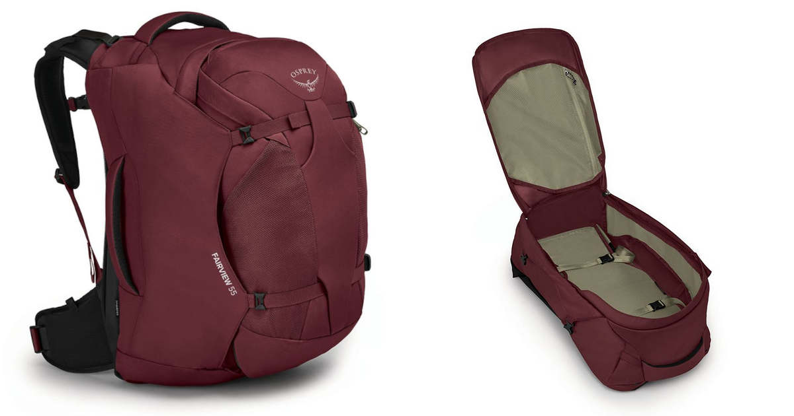

Olemme kuluneiden viikkojen aikana metsästäneet tulevalle [interrail-matkalle]() sopivia rinkkoja. Arpominen loppui tänään, sillä kävimme hakemassa uudet reput sekä minulle, että puolisolle.

<!--more-->

Olen tehnyt lähes kaikki aikaisemmat matkani rinkka selässä, mutta nykyinen retkeilyrinkkani on tarpeettoman suuri tulevalle matkalle. Olen muutenkin halunnut pienentää mukana kulkevien matkatavaroiden määrää ja pienempi rinkka pakottaa siihen mukavasti.

Meiltä löytyy ennestään myös pienemmät lentoreput. Ne ovat käytännössä lentokoneen käsimatkatavarana menevät reput, joita käytetään kuten matkalaukkua, eli ne aukeavat kokonaan auki. Reput olivat virheostos, sillä kumpikaan ei lopulta tykännyt kantaa tai käyttää niitä. Tämän siitä saa kun tilaa rojua netistä kokeilematta.

Kun aloimme selvitellä parempien matkailurinkkojen tarjontaa, törmäsimme YouTubessa [Laura Gracen videoon](https://www.youtube.com/watch?v=xww47QsTbTE), jossa hän esitteli oman interrail-matkansa matkatavaroita ja siinä sivussa reppuaan. Hänellä käytti Ospreyn 40-litraista Fairview-reppua, joka näytti kaikin puolin asialliselta vaihtoehdolta.

Viikkojen aikana katselimme muitakin vaihtoehtoja ja kävimme myös kokeilemassa muutamia reppuja kivijalkaliikkeissä. Harmillisesti tämän kategorian ja kokoluokan reppuja on yllättävän vähän tarjolla ja vielä vähemmän testailtavana. Kaiken kokeilun jälkeen päädyimme kuitenkin hankkimaan Ospreyn [Fairview 55L](https://www.osprey.com/eu/osprey-fairview-55-f22) ja [Farpoint 55L ](https://www.osprey.com/eu/osprey-farpoint-55-f22) rinkat. Rinkat ovat käytännössä identtiset, mutta Farpoint on mitoitettu miehille.

55 litran mallimerkintä on sekin hieman hämäävä, sillä todellisuudessa rinkat on 40-litraisia[^1]. Niiden mukana tulee erillinen 15 litran päiväreppu, jonka saa kätevästi kiinni rinkkaan. Vaihtoehtoisesti reppua voi kuljettaa myös kropan etupuolella.

Meidän kummankin mielestä nämä reput olivat kaikista mukavimpia kantaa. Ne on rakennettu niin, että reppujen hihnat ja soljet saa tarvittaessa kokonaan piiloon, mikä on hyvä jos niitä joutuu joskus kuljettamaan matkatavaratilassa tai liukuhihnoilla. Myös nämä reput ovat matkalaukkumalliset ja aukeavat kokonaan. Ison sisätilan lisäksi yhdessä sivuseinässä on pieni verkkotasku. Rinkan rakenne on jämäkkä, joten se on yllättävän mukava kantaa tyhjänäkin.

Mukana tuleva päiväreppu tuntui sekin hyvältä. Jos päiväreppua kantaa rintapuolella yhtä aikaa ison rinkan kanssa, repun voi kytkeä soljilla isoon rinkkaan. Ratkaisu on nerokas ja tekee molempien reppujen kantamisesta vaivatonta ja miellyttävää. Repun etupuolelta löytyy pienemmät taskut, jossa voi kuljettaa passeja, kännykkää ja muuta sellaista sälää, jota voi yllättäen tarvita tien päällä.

Vaikka rinkat tuntuivat meidän tarpeeseen lähes täydellisiltä, niissä on pari pientä puutetta. Suurin on se, ettei isossa rinkassa ole lainkaan ulkopuolisia taskuja. Ilman päiväreppua kaikki olisi aina kaiveltava rinkan sisältä, mikä on kömpelöä. Lisäksi rinkat eivät mukavan jäykästä rakenteessa huolimatta pysy itsestään pystyssä. Pikkuvika, mutta osaa välillä olla rasittavaa.

Mielenkiinnolla odotan, kuinka rinkat tulevat palvelemaan meitä reissussa! Luulen, että 40 litraa voi olla omiin tarpeisiin liian suuri, mutta enköhän minä sen kanssa pärjäile. Ostin rinkan kaveriksi myös muutaman pakkauskuutio helpottamaan tavaroiden organisointia. Ensimmäistä oikeaa käyttöä saamme odotella vielä muutaman kuukauden, ellemme sitten keksi matkustaa kotimaassa sitä ennen.

Vanhoille matkailurinkoille ei ole enää käyttöä, joten koetan noudattaa minimalistiperiaatettani: uuden tuotteen saa ostaa vain jos vähintään yhdestä tuotteesta hankkiutuu eroon. Niinpä napsin samoin tein valokuvat vanhoista matkailurinkoista ja sen lisäksi yhdestä läppäri- ja kamerarepusta. Kaikki on tarkoitus laittaa Toriin myyntiin, jotta ehjät ja käyttökelpoiset tuotteet löytäisivät uudet omistajat. Mikäli niille ei löydy ostajaa, annamme ne lahjoitukseen.

[^1]: Jotta asia ei ole liian helppoa, Osprey myy myös Fairview/Fairpoint 40L -rinkkaa, joka ei kuitenkaa ole täysin samanlainen kuin 55L, vaikka onkin saman kokoinen.