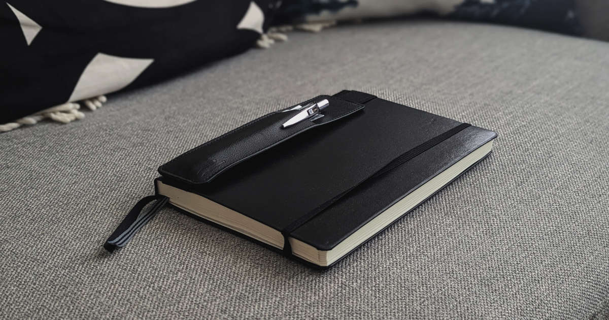

Havahduin toissa iltana siihen, että päiväkirjassani on enää 41 tyhjää sivua. Mihin ihmeeseen aika oikein menee? Vastahan minä ostin uuden päiväkirjan!

<!--more-->

Päiväkirjan kirjoittaminen on nykyään iltarutiini. Teen sen lähes aina sängyssä ennen kuin alan lukea kirjaa ja lopulta nukkumaan. Tyhjennän päiväkirjaan päivän tapahtumat ja päässä pyörivät ajatukset, jotta ne eivät häiritse nukahtamista.

Päiväkirjan kirjoittamisessa on aina ollut jotain kiehtovaa. Ajatus oman elämän, ajatuksien ja muutosten dokumentointi vain itseä varten on tuntunut sellaiselta, jota haluaisin tehdä. Osittain kysymys lienee siitä, että pystyisi palaamaan tapahtumiin ja hetkiin, jotka muuten pyyhkiytyisivät mielestä. Toisaalta niistä näkisi myös helposti, kuinka on itse muuttunut vuosien aikana.

Vaikka päiväkirjan kirjoittaminen on ajatuksena kiinnostanut, en vuosien yrittämisen jälkeen saanut rakennettua siitä itselleni kunnollista rutiinia. Paras onnistuminen taisi olla 20 vuotta sitten, jolloin pidin online-päiväkirjaa. Se ei ollut varsinaisesti julkinen, mutta ei se ollut myöskään salainen. Pyrin silti kirjoittamaan sinne niin kuin se olisi vain minun silmille. Se oli luonnollisesti virhe ja kostautui. Se opetti minulle, että jotkut ajatukset on vain parempi pitää omana tietonaan. Se jäi minun ensimmäiseksi ja viimeiseksi julkiseksi päiväkirjaksi.

Sen jälkeen olen yrittänyt huonolla menestyksellä ylläpitää erilaisia digitaalisia päiväkirjoja. Jostain syystä juuri digitaalisuus tuntui parhaimmalta, koska pystyisin kirjoittamaan paljon nopeammin ja lisäksi päiväkirja voisi sisältää linkkejä, kuvia tai mitä ikinä keksisinkään. Voisin kirjoittaa sitä eri laitteilla - myös kännykällä. Kaikista näistä eduista huolimatta se ei vaan toiminut. Lisäksi näppäimistöllä - kännykästä puhumattakaan - kirjoittaminen ei tuntunut merkitykselliseltä.

Lopulta päätin unohtaa digitaalisen kikkailun ja ostin perinteisen paperisen muistikirjan. Alku oli todella vaikeaa. Kirjoittaminen tuntui hitaalta ja kömpelöltä. Jostain syystä en tiennyt mitä minun kuuluisi[^1] kirjan sivuille kirjoittaa. Varsin nopeasti palaset alkoivat kuitenkin loksahdella paikoilleen.

Tajusin, että kynän ja paperin käyttäminen tekee kirjoittamisesta paljon syvemmän kokemuksen. Koska kirjoittaminen on hitaampaa, mietin asioita paljon tarkemmin ja harkitummin. Käytän kirjoittamiseen aikaa, jolloin asiat jäävät paljon paremmin mieleeni. Toisaalta ajatukset, jotka haluan ennen nukahtamista päästäni pois, tarttuvat päiväkirjan sivuille paljon paremmin.

Toistaiseksi olen pitänyt vanhat päiväkirjat tallessa, mutta en ole varma, että teen niin loputtomiin. Tästä syystä olen ensimmäisestä päivästä lähtien ottanut jokaisesta päiväkirjan sivusta kuvan. Tämä kuva päätyy osaksi minun digitaalista päiväkirjaa, jota ylläpidän [Obsidianissa](https://obsidian.md/). Minulla siis on myös digitaalinen päiväkirja, mutta en juuri koskaan kirjoita sinne mitään. Se on enemmän paperisen päiväkirjan varmuuskopio.

Nyt sivuja on jäljellä alle 40. Täytynee suunnistaa lähipäivinä kirjakauppaan ja ostaa uusi muistikirja. Leuchttrum1917:n pistesivuja sisältävistä [muistikirjoista](https://www.leuchtturm1917.com/notebook-medium-a5-hardcover-251-numbered-pages-black-dotted.html) on tullut oma suosikkini. Kirjoittamiseen käytän EnerGelin uudelleentäytettävää [geelikynää](https://www.pentel.com/products/energel-rtx-gel-pen). Lisäksi minulla on kirjan kanteen kiinnitettävä kynätasku, jonne mahtuu kynän lisäksi myös ylimääräinen mustepatruuna.

[^1]: Päiväkirjan kirjoittamiseen ei ole yhtä oikeaa tapaa. Se on sinun päiväkirjasi. Kirjoita sinne mitä haluat. Ylläpidä sitä juuri niin kuin haluat.