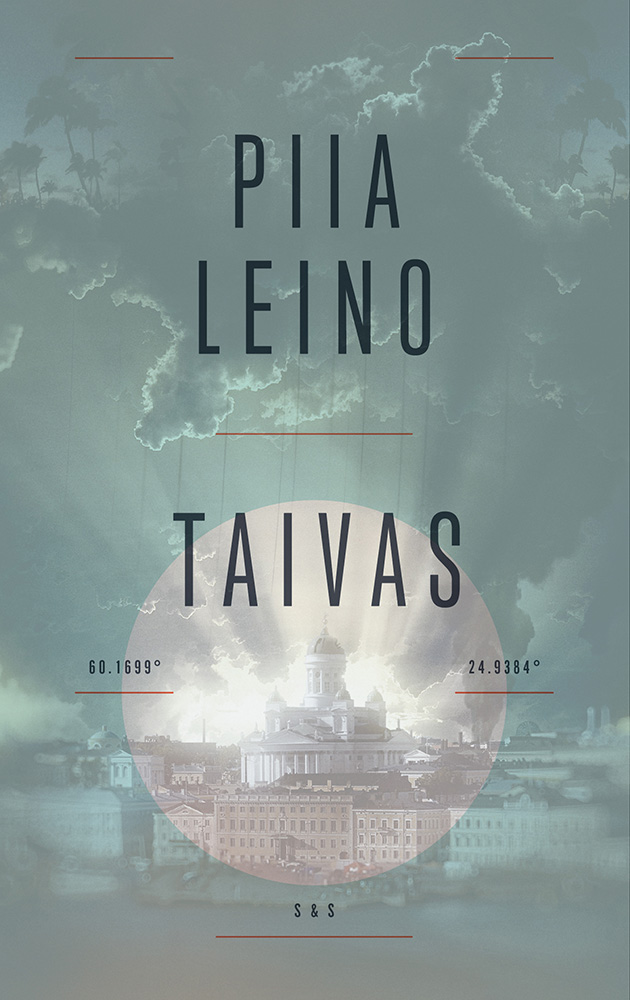

Aloitin viikko sitten lukemaan Piia Leinon vuonna 2018 julkaistua kirjaa Taivas. Eilen luin sen loppuun. On harvinaista, että ahmin kirjan läpi viikossa. Se kertoo siitä, kuinka paljon pidin kirjasta.

<!--more-->

### Tarina
Tervetuloa Helsinkiin. Vuosi on 2058. Suomi on sisällissodan runtelema ja jakautunut kahtia. Helsingissä on jäljellä kaikki tutut paikat, mutta sen kaduilla ei juurikaan näe ihmisiä. Luonto ja eläimet ottavat hiljalleen autioituneita katuja ja rapistuneita rakennuksia haltuunsa. Maamerkit ovat paikoillaan, mutta niillä ei ole enää merkitystä. Linnanmäki on kaukana näkyvä silhuetti ja siellä kuulunut lasten riemu on vain kaukainen muisto. Meren rannassa haisee mädäntynyt kala.

Torilla voi nähdä apaattisia kerjäläisiä, jotka joutuvat katsomaan maailmaa sellaisena kuin se on. He yrittävät selvitä päivästä toiseen myymällä kaduilta ja autioituneista taloista löytynyttä tavaraa, jota kukaan ei enää halua tai tarvitse. Osa myy ruokaa, joka on useimmiten sirkoista tehtyä töhnää. Lähes tyhjiä katuja vahtivat vartijat, jotka ovat yhtä eleettömiä kuin ihmiset, joita he vartioivat.

Lapsia ei enää synny. Ihmiset eivät enää muista, kuinka toisten ihmisten kanssa toimitaan. Hyvä, jos osaavat puhua toisilleen. Heidän ei tarvitse. Heidän ei tarvitse miettiä tai ajatella. Heidän apunaan on Taivas.

Se on virtuaalimaailma, jossa kaikki on hyvin. Se tarjoaa mukavia aistielämyksiä, joita todellinen maailma ei ole pystynyt tarjoamaan enää vuosiin. Se vie kaiken ahdistuksen ja pahan olon pois. Se ei kuitenkaan ruoki kehoa. Ihmisten on edelleen syötävä, juotava ja nukuttava todellisessa maailmassa. Siksi hyväosaisimmatkaan eivät voi olla Taivaassa pysyvästi, vaikka haluaisivat.

**Akseli** on yksi hyväosaisista, sillä hän työskentelee tutkijana yliopistolla ja on sitä kautta saanut laajat käyttöoikeudet Taivaaseen. Hän voi viettää siellä tuntikausia joka päivä, toisin kuin useimmat muut.

Akseli tutkii vuosikymmenien takaisia tallenteita: mainoksia, pornoa ja sen sellaista. Hän ei kykene ymmärtämän niiden merkitystä. Hän yrittää saada otetta ihmisten vanhasta elämästä, siinä onnistumatta. Kaikki tuntuu vieraalta. Se ei haittaa. Hän ei välitä. Hän voi keksiä merkitykset itse. Nykyään tutkimuksien tarkoitus ei ole tuottaa tietoa ja ymmärrystä. Ei kukaan lopulta välitä. Ei ketään kiinnosta.

Eräänä päivänä Akseli törmää Taivaassa **Iinaan**. Myös Iina on hyväosainen, sillä hän elää yhdessä elättäjämiehensä kanssa. Koska mies on yksi Taivaan suunnittelijoista, myös Iinalla on laaja pääsyoikeus Taivaaseen. Vaikka he ovat eläneet saman katon alla useita vuosia, samassa tilassa oleminen on vaivaannuttavaa. Ikään kuin he olisivat toisilleen tuntemattomia.

Kun Akseli tapaa Iinan, hänessä on jotain, mitä Akseli ei ymmärrä. Se jokin saa hänet etsimään naisen uudelleen käsiinsä. Kömpelöstä ja päämäärättömästä tapaamisesta huolimatta he sopivat, että tapaisivat oikeassa maailmassa. Kumpikaan ei oikeastaan tarkkaan tiedä, että miksi. Kumpikaan ei tiedä, mihin se johtaisi tai mitä se tarkoittaisi. Se on kuitenkin päätös, joka muuttaa heidän maailmansa. Eikä aina tavalla, jota he ehkä odottivat.

### Henkilöt
Kirja pyörii lähes yksinomaan Akselin ja Iinan ympärillä. Kumpikin hahmoista on loistavasti kirjoitettu. He ovat erilaisia, mutta helposti samaistuttavia. Kirjailija käyttää erinomaisella tavalla ympäröivää maailmaa taustana, joka antaa kummallekin päähenkilölle heidän motiivinsa toimia.

Akseli on utelias, mutta varautunut. Hän ajattelee paljon, ehkä jopa liikaa. Epäröinnistä huolimatta hän yrittää parhaansa, joskin lopputulos päätyy usein olemaan laskelmoitua ja jäykkää. Akseli on on ristiriitainen hahmo. Hän on hyväntahtoinen hölmö, jota käy usein sääliksi. Samaan aikaan hän ei kuitenkaan näyttäydy erityisen mukavana tai hyvänä ihmisenä. Huomasin lukiessa, että yhtenä hetkenä seisoin hänen puolellaan ja toivon hänen onnistuvan, toisena inhosin häntä yli kaiken.

Iina on huoleton liihottelija, joka toimii ensin ja miettii vasta sitten. Samaan aikaan hän on hyvin määrätietoinen ja seisoo jämäkästi arvojensa takana. Iina on monella tapaa ihana. Hän ei aina osaa avata itseään, eivätkä hänen tekonsa ole aina niin mukavia. Hän osaa olla todella itsekäs. Kaikesta huolimatta hänestä on silti helppo pitää.

Sekä Aleksi, että Iina haluavat hyvää, mutta molemmat kompuroivat tavoitellessaan sitä. He ovat hyvin ristiriitaisia, mutta ehkä juuri se tekee heistä todella inhimillistä.

### Rumankaunis maailma
Leino on rakentanut Helsingistä uskottavan tapahtumapaikan. Koko tarina tapahtuu pienellä alueella, eikä se tarvitse ympärilleen suurempaa maailmaa. Maailma on synkkä, ja kaikessa ankeudessaan se saa usein miettimään sitä, mitä meillä on tällä hetkellä. Tai mihin olemme menossa.

Kirjailija on onnistunut upealla tavalla yhdistämään ahdistavan maailman kahteen erilaiseen ihmiseen. Kirjassa ei lopulta tapahdu ihan kauheasti, mutta se ei tarvitse suurta toimintaa. Leino keskittyy kertomaan tarinan kahden ihmisen sekä ruman maailman välisestä suhteesta. [Edellinen lukemani kirja]() kuvasi itseään rakkaustarinana, jossa ei koskaan käytetä sanaa rakkaus. Minusta kuvaus sopii tähän kirjaan lähes täydellisesti.

Se on surullinen ja haikea, mutta samaan aikaan toivoa täynnä. Se ei yritä leikkiä monimutkaisella juonella tai yllättää lukijaansa yllättävillä juonenkäänteillä. Sen ei tarvitse. Olin ensimmäisistä sivuista lähtien haltioissani siitä maailmasta, jota Leino kuvailee. Toivoin koko ajan, että kaikki menisi hyvin, kääntyisi parempaan, ja että päähenkilöiden elämä jatkuisi onnellisesti.

Leinolla on mielenkiintonen tyyli kirjoittaa. Tavassa, jolla hän kuvaa ihmisten tunteita, havaintoja sekä ympäröivää maailmaa, on paikoin jotain runollista. Hän leikkii hienosti kielellä kuvatessaan nykymaailman asioita tulevaisuuden ihmisten silmin. Hän poimii yksityiskohtia nykymaailman ilmiöistä, ja välillä kuvaukset olivat kaikessa älyttömyydessään niin osuvia, että ne saivat minut nauramaan. Lisäksi hän onnistuu aivan huikealla tavalla rakentamaan keskustelua, jota kanssakäymisen taidon unohtaneet ihmiset voisivat käydä.

Kirjassa oli hyvin vähän mistä en pitänyt. Jos jotain pitäisi nostaa esiin, niin se oli välillä ärsyttävän alleviivaava.

Illuusio rumankauniista tulevaisuudesta rikkoutuu hetkittäin, sillä Leino nostaa pintaan nykymaailman polttavia keskustelunaiheita, ongelmia ja politiikkaa tavalla, joka ei mielestäni sopinut tarinaan. Joidenkin kappaleiden kohdalla tunsin lukevan kirjailijan avautumista asioista, joista hän ei pidä tai joita hän vihaa. Taivas ei ole poliittista paatosta, mutta se valitsee puolensa ja alleviivaa sitä hetkittäin enemmän, kuin olisi ehkä tarpeen. Sen varsin runollinen ja hienovarainen tyyli kertoa asioista kärsii tästä suorasukaisuudesta.

Tapa, jolla päähenkilöiden pahuutta käsiteltiin, tuntui välillä hyvin sukupuolittuneelta. Kirjassa on hetkiä, jossa sekä Akseli, että Iina toimivat hyvin itsekkäästi ja vain omia päämääriä ajaakseen. He käyttävät toisiaan hyväksi. Mutta jostain syystä teot näyttäytyivät pahana vain kun tekijänä on mies. En ole varma, että oliko tämä kirjailijalta tarkoituksellista vai ei. Se kuitenkin söi ainakin minun päässäni muuten niin hyvin kirjoitetun ristiriitaisuuden ja moraalikysymysten tehoa. Yksi kirjan vahvuus on siinä, ettei se saarnaa, vaan antaa lukijan löytää oma vastaukset näihin kysymyksiin. Turhan alleviivaavat hetket kuitenkin syövät tätä vapautta.

Epäkohdat ovat Taivaassa hyvin pienessä roolissa. Kokonaisuudessaan pidin kirjasta todella paljon. Se taistelee vuoden tähän astisen parhaimman kirjan tittelistä. Luin eilen kirjaa useamman tunnin, koska en vaan pystynyt laskemaan sitä käsistäni. Se ei johtunut siitä, että minua olisi jännittänyt, kuinka tarina päättyy. Se johtui siitä, että minua aidosti kiinnosti, mikä päähenkilöiden kohtalo on. Minulle hyvät tarinat rakentuvat ihmisten ympärille, ja Taivas on malliesimerkki siitä.

Teos onnistui kaivamaan minusta katkeransuloisia tunteita. Se on surullinen tarina, jossa on paljon iloa. Siinä on iloa, joka saa samalla haikeaksi. Se saa vihaiseksi ja samalla toiveikkaaksi. Se saa inhoamaan ihmisiä ja samalla välittämään heistä.

Ehdottomasti lukemisen arvoinen tarina!