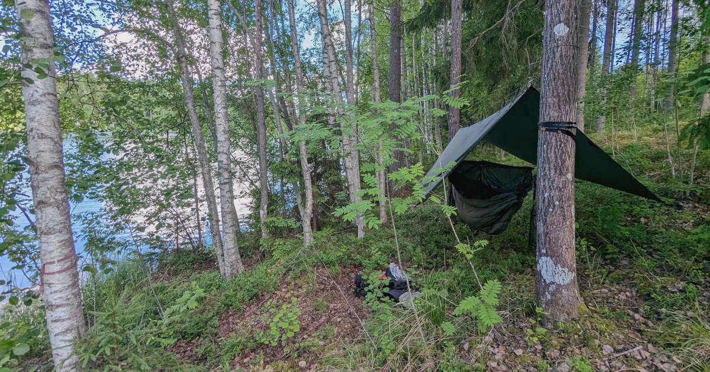
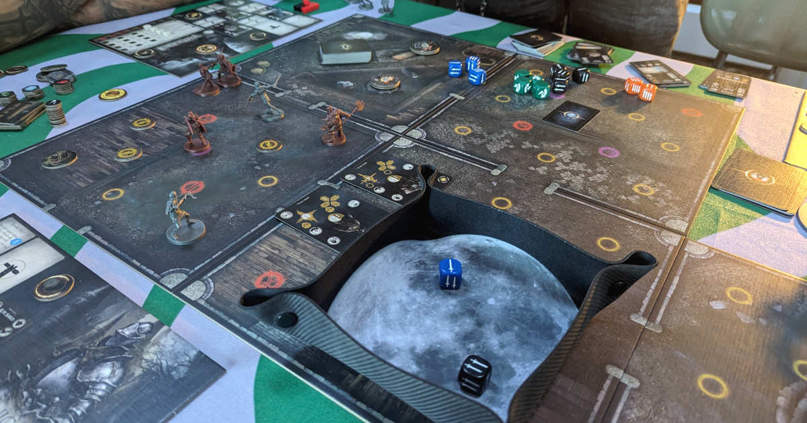
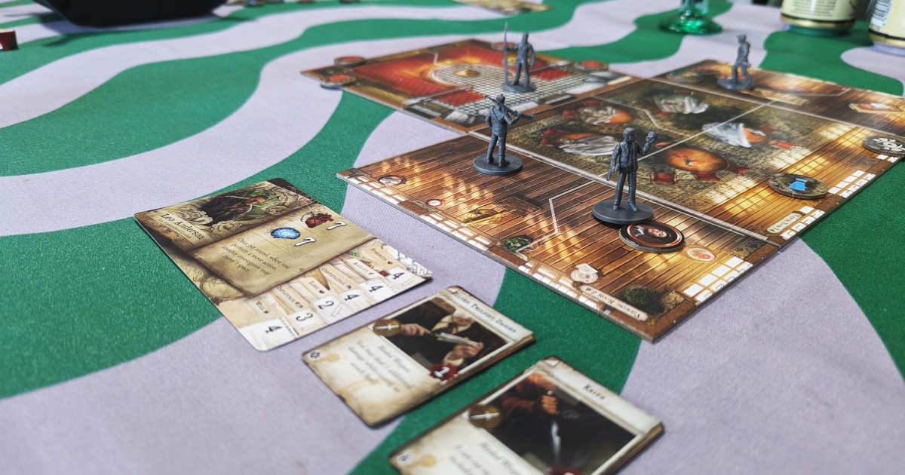
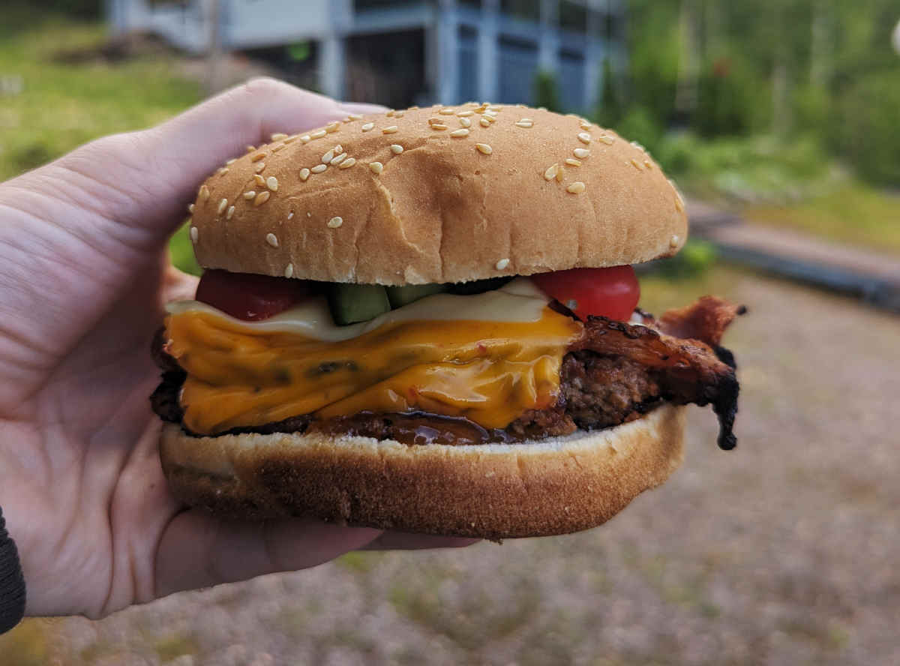
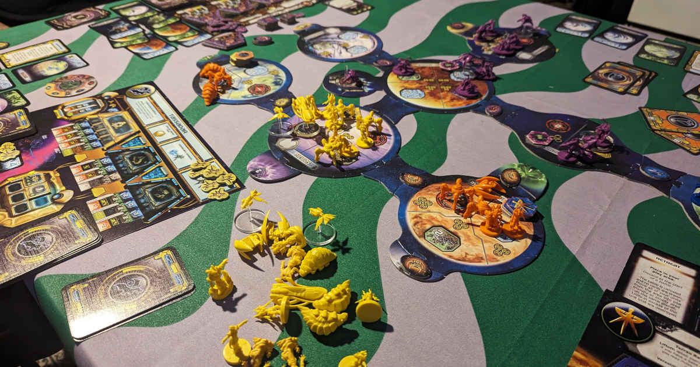

Viikonloppuna sain unohtaa arkielämän ja siirtyä omaan kuplaani. Alun perin tarkoitus oli pelata pöytäroolipeliä, mutta koska meidän dungeon master ei päässytkään mukaan, järjestimme kolmen muun kaverin kanssa vuokramökillä lautapeliviikonlopun.

<!--more-->

### Perjantai
Kaverit tulivat hakemaan minua perjantaina kolmen aikoihin. Teimme pienen lenkin Karkkilassa ja haimme sieltä samalla viikonlopun ruoat, juomat ja herkut.

Jokainen meistä halusi pois arkisista askareista ja luonnon rauhaan, joten olimme vuokranneet *Nummipusulasta* mökin. Mökki oli juuri sellainen kuin toivoimmekin: saunallinen pienehkö hönnä, joka oli järven rannalla. Sähköt löytyi, mutta vesijohtoverkkoon sitä ei oltu kytketty. Pesuvedet saimme pumpulla järvestä, mutta juomavedet piti tuoda mukana.

Tiedostan oman herkkäunisuuteni, joten en hetkeäkään ajatellut nukkuvani mökissä kolmen kuorsaavan äijän kanssa. Eikä siellä olisi ollutkaan tilaa neljälle. Niinpä kannoin mukanani riippumaton ja virittelin sen heti saavuttuamme pihan laidalla oleviin puihin. Sääennuste lupaili viikonlopulle vesisateita, joten laitoin riipparin suojaksi tarpin. Samalla se tarjosi pientä suojaa valoisalta kesäyöltä.

Viikonloppu oli varsin viileä. Yöllä lämpötilat laskivat vain muutamaan asteeseen, mutta sepä ei minun unia häirinnyt lainkaan. Päinvastoin, makuupussissa oli oikein mukava köllötellä.

Kun olimme asettuneet mökkiin, kokkailimme ensimmäisenä tortilloja. Mahat täynnä oli hyvä aloittaa ensimmäinen peli, joka oli [Dark Souls](https://boardgamegeek.com/boardgame/197831/dark-souls-the-board-game). En ollut aikaisemmin peliä pelannut, joten oli mielenkiintoista nähdä, kuinka varsin brutaali Dark Souls oli saatu käännettyä lautapeliversioksi.

Pidin pelistä kovasti! Kyseessä on yhteistyöpeli, joten taistelimme vihollisia vastaan ryhmässä. Pelimekaniikka oli nopea oppia, mutta otti aikansa, ennen kuin aloimme oikeasti pärjäämään pelissä. Kuten arvata saattaa, Dark Souls ei ole helppo. Pelasimme peliä useamman tunnin, mutta emme onnistuneet pääsemään kuin ensimmäiselle minibossille. Ainakin vaikeus ja epätoivoinen tunnelma on onnistuttu hyvin siirtämään alkuperäisestä pelistä.

Mietimme, että jos olisimme pelanneet uuden session, olisimme saattaneet pärjätä paremmin. Siirtojen suunnitteleminen vaatii oikeasti ajattelua ja ymmärrystä kokonaistilanteesta, eikä se ollut meille ensikertalaisille niin selvää. Lisäksi emme ymmärtäneet hyödyntää eri hahmoluokkien vahvuuksia parhaalla mahdollisella tavalla.

Uusi sessio sai kuitenkin jäädä toiseen kertaan, sillä pelin päättyessä kello oli vaille kolme aamuyöllä ja oli aika mennä nukkumaan.

### Lauantai
Yöunet jäivät vähäiseksi, sillä heräilin uuteen aamuun jo joskus vaille kahdeksan. Fiilistelin riippumatossa hetken luonnon äänimaisemaa ja kampesin lopulta mökkiin juomaan aamukahvia. Kaikki muut nukkuivat ja kun avasin mökin oven, kiitin itseäni siitä, että olin ymmärtänyt ottaa riippumaton mukaan. Kuorsaaminen repi tärykalvoja!

Kun lopulta sain potkittua muut ylös ja aamupalaa naamariin, kävimme tekemässä pienen ruokatäydennyksen lähimmässä kaupasta ja sen jälkeen laitoimme puusaunan lämpiämään. Sitä odotellessa virittelimme valmiiksi viikonlopun toisen pelin, joka oli [Mansions of Madness: Second Edition](https://boardgamegeek.com/boardgame/205059/mansions-of-madness-second-edition). Peliin oli lisäksi useita lisäosia. Dark Soulsin tapaan tämäkin peli oli minulle uusi tuttavuus.

Valmistelu veikin yllättävän paljon aikaa, sillä pelissä on aivan hirvittävä läjä kortteja. Jouhevaan pelisessioon auttaa se, että kortit ovat aakkosjärjestyksessä, joten niitäpä siinä sitten järjesteltiin. Ehdittiin valita jokaiselle pelaajalle hahmot, mutta itse peliä emme aloittaneet ennen saunaa.

Puusaunan löylyt tulivat tarpeeseen. En pidä kylmästä, enkä varsinkaan kylmästä vedestä, mutta saunan päälle uskaltauduin vihdoinkin heittämään järvessä talviturkin pois. Veden lämpötila oli noin +20°C, joka on minulle aivan liian kylmää. Hyytävän kastautumisen jälkeen pystyin kuitenkin olemaan vedessä jonkin aikaa ja kokemus muuttui ihan mukavaksi. Etenkin saunan jälkeen olo oli todella virkistäytynyt!

Saunan päälle laiteltiin vielä rannassa oleva grilli tulille ja askarreltiin porukalla hampurilaiset. En ole erityinen hampurilaisten ystävä, ja lihaiset täytteet poikkesivat aika rajusti omasta ruokavaliosta, mutta ihan hyviä ne olivat. Pienessä ähkyssä oli hyvä siirtyä takaisin pelipöydän ääreen.

Mansions of Madness on mobiilisovelluksen ohjaama yhteistyöpeli. Sovellus kertoo ja muokkaa tarinaa pelaajien valintojen pohjalta. Se myös varioi taisteluja niin, etteivät samat asiat toistu koko ajan. Tämä oli pelin suurin vahvuus ja heikkous. Jos tarinavetoiset lautapelit uppoavat, Mansions of Madness on aivan täydellinen. Mobiilisovelluksen tarinankerronta on tyylikästä ja sovelluksen tarjoama musiikki luo pelaamiseen hyvän tunnelman. Se on kuin seuraisi interaktiivista elokuvaa.

Juuri tästä syystä pelistä ei tullut omaa suosikkiani. Sen pelilliset elementit jäivät aika vähäiseksi. Liikuttelimme hahmoja ja teimme valintoja, mutta valinnoilla ei tuntunut olevan juurikaan vaikutusta lopputulokseen. Pelin alkuosa oli päätöntä haahuilua, joka kesti tarpeettoman pitkään. Yhtä äkkiä peli muuttui pelkäksi taisteluksi ja tuntui, että pelin alkuvaiheen valinnoilla ollut juurikaan vaikutusta mihinkään. Peli oli erittäin hieno ja tunnelmallinen, mutta olisin kaivannut vahvempaa tunnetta siitä, että valinnoilla on merkitystä.

Kello oli tässä kohtaa yli kuusi. Siivosimme edellisen pelin pois ja aloimme levitellä viikonlopun kolmatta peliä, jonka oli minun oma [StarCraft](https://boardgamegeek.com/boardgame/22827/starcraft-the-board-game). Mukana oli myös sen lisäosa [Brood War](https://boardgamegeek.com/boardgameexpansion/38796/starcraft-the-board-game-brood-war-expansion).

Yhteystyö ei tähän peliin kuulunut ja nyt pelasimme toisimme vastaan. Peli on edelleen yksi suosikeistani ja se onnistuu hienolla tavalla tuomaan esikuvansa keskeiset jutut mukaan. Kolme tuttua rotua ovat mukana ja ne eroavat toisistaan tavalla, jonka peliä pelanneet tunnistavat: zergit ovat halpaa tykinruokaa, jotka luottavat suuren massaan, protossit ovat kehittynyt ja kestävä teknologiarotu ja terrainit näiden väliin istuva ihmisrotu.

Eroistaan huolimatta rodut ovat tasaväkisiä. Yksikään ei ole toista parempi, mutta rotujen ominaispiirteet ohjaavat hieman erilaiseen pelityyliin.

Pelaajien on pidettävä huolta resursseista, rakennettava yksiköitä, laajennettava tukikohtaa, päivitettävä teknologiaa, vallattava alueita ja tietenkin yritettävä tuhota vastustajat. Yhteen asiaan keskittyminen harvemmin tuottaa hyvää lopputulosta.

Peli on käytännössä täysin oman taktikoinnin varassa. Noppia siinä ei ole ja ainut satunnaisuus tulee taisteluissa käytettävistä korteista, mutta niihinkin voi aika paljon itse vaikuttaa. Pelissä on mukava kaaoksen tuntu, kun pelaajat koettavat vesittää vihollisen suunnitelmat ja saada samalla omansa onnistumaan.

Pelisessio jatkui kahteen asti yöllä. Oma pelini oli aivan surkeaa rääppimistä ja päädyinkin olemaan kaikista huonoin. Sen jälkeen oli taas aika viheltää päivä poikki ja painua riippumattoon köllöttelemään.



### Sunnuntai

Sunnuntaina emme sitten ehtineetkään enää pelata, sillä mökistä piti lähteä jo puolen päivän aikaan. Keräsimme kaikki romut läjään, siivosimme mökin ja lähdimme ajelemaan kotia kohti.

Viikonloppu tuli todella tarpeeseen! Oli mahtavaa vaipua omaan pieneen kuplaan muutaman päivän ajaksi. Ei tarvinnut miettiä arkisia asioita ja pystyi tekemään porukalla jotain, mistä kaikki tykkäävät. Oman bonuksen toi riippumattoilu. En ole sitten viime kesän käynyt retkeilemässä, joten luonnossa nukkuminen toi mukavaa mielenrauhaa, vaikka yöunet jäivätkin määrällisesti turhan vähäiseksi.

Samalla viikonloppu muistutti siitä, että vaikka tekeminen olikin tosi kivaa, tällaiset sosiaaliset hetket vaativat silti minulta yllättävän paljon energiaa. Sunnuntaina en enää jaksanut olla erityisen sosiaalinen ja oli mukava päästä oman kodin rauhaan ja hiljaisuuteen, jossa ei tarvitse koko ajan puhua jollekin tai kuunnella heidän juttujaan.

Kaikesta huolimatta alamme suunnitella seuraavaa pelireissua. Toivottavasti seuraavalla kerralla dungeon master -kaverini pääsee mukaan ja pääsen kokeilemaan [pöytäroolipelejä]()!