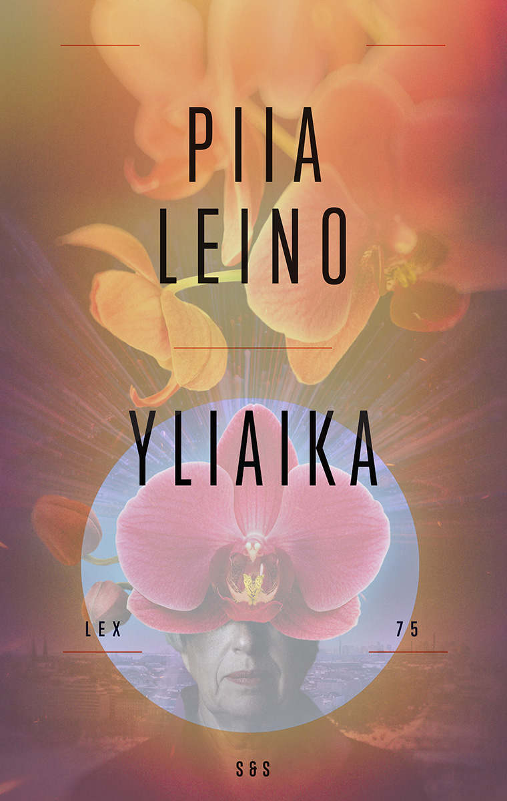

Luin eilen loppuun vuoden kahdeksannen suomalaisen kirjan, Piia Leinon Yliajan. Tämä oli toinen lukemani Leinon kirja, joka pisti ajattelemaan elämää, tätä hetkeä ja tulevaisuutta.

<!--more-->

### Tarina
Vuosi on 2052. Suomessa ei enää näe todella vanhoja ihmisiä, sillä elinaika on rajattu. Henkilön täyttäessä 75 vuotta, hän menettää kansalaisuutensa ja hänen omaisuutensa siirretään valtiolle. Mikäli ihminen elää 76-vuotiaaksi, omaisuus jää pysyvästi valtiolle eikä perillisille jää mitään. Välttääkseen tämän, henkilö voi järjestää exituksen. Hautajaiset, jossa kuoleva on itse mukana. Se on viimeinen hetki juhlia elettyä elämää yhdessä läheisten kanssa. Sen jälkeen vanhus voi päättää elämänsä valtion hyväksymällä tavalla.

74-vuotias **Annastiina** on valmistautumassa omaan exitukseensa. Hän on entinen toimittaja, joka siirtyi nuorella iällä politiikkaan ja päätyi lopulta ministeriksi. Hän on aina saanut haluamansa ja voi nyt nauttia työnsä tuloksista. Menestystä täynnä ollut poliittinen uransa on aina pohjautunut siihen, että hän tietää kuinka ihmisiä ja mediaa hallitaan. Hän nauttii siitä, että saa olla ihmisten ja kameroiden edessä.

Annastiina haluaa, että myös hänen exitus on täydellinen. Toimittajat on kutsuttu paikalle, shampanjat on valittu ja asunto on sisustettu kattokruunuja myöten juuri kuten hän haluaa. Ainoastaan viimeiset sanat ovat miettimättä. Vai onko jotain muutakin unohtunut? Onko jotain unohtunut tehdä? Onko hän tehnyt elämässään kaiken mitä halusi? Annastiina on aina hallinnut elämäänsä, mutta nyt kontrolli tuntuu katoavan hänen käsistään. Paniikki laskeutuu päälle. Exitus on huomenna, mutta entä jos hän ei haluakaan kuolla?

### Henkilöt
Tarinan päähenkilö Annastiina on mielenkiintoinen ja moniulotteinen. Hän kohtelee ihmisiä usein varsin tylysti ja on elänyt elämää, jonka keskipisteessä on ollut työ sekä henkilökohtaisen menestyksen metsästäminen. Hän ei ole erityisen pidettävä hahmo, mutta hän ei kuitenkaan ole paha ihminen. Hän on pyrkyri, jonka tie on päällystetty hyvillä aikeilla.

Annastiina on läpi kirjan hyvin ristiriitainen hahmo. Kirjailija on tehnyt erinomaista työtä luodessaan henkilöhahmon, jota pystyy yhdessä hetkessä vihaamaan ja toisessa säälimään. Annastiina tuntuu samaan aikaan tarinan sankarilta ja pahikselta. Ärsyttävää persoonallisuutta tasapainottaa suorasukainen tapa toimia ja puhua, sillä se päätyy usein olemaan varsin hauskaa. Huomasin usein nauravani Annastiinan toiminnalle ja Leino onnistuu upealla tavalla pitämään huolen siitä, ettei sen enempää päähenkilö kuin tarinakaan muutu liian synkäksi.

Annastiinan kaverina kulkee virtuaalinen seuralainen **Heath**. Hän on hologrammi, joka kulkee läpi tarinan Annastiinan mukana ja tarjoaa tälle seuraa sekä apua. Heath on monella tapaa Annastiinan vastakohta. Hän on avulias, ystävällinen ja kohtelee Annastiinaa aina suurella kunnioituksella. Hän tekee kaikkensa, jotta voisi palvella ja miellyttää Annastiinaa mahdollisimman hyvin. Silti hän on vain tekoälyn ohjaama sovellus ja se tulee toistuvasti näkyviin.  Hän ei kovinkaan usein tunnu ihmiseltä, mutta Annastiinan rinnalla hänessä tuntuu usein olevan enemmän inhimillisiä piirteitä kuin Annastiinassa.

Tarinassa on muitakin sivuhahmoja, jotka tulevat ja menevät. Osalla heistä, kuten Annastiinan edesmenneellä miehellä **Ristolla**, on suurempi rooli, mutta sivuhahmot eivät koskaan varasta tarinaa. Toisaalta ne eivät myöskään ole merkityksettömiä. Lukija kulkee isolta osin Annastiinan ja Heathin mukana, mutta Leinolla tuntuu olevan kyky tehdä vähäpätöisistäkin sivuhahmoista kiinnostavia. Jokainen tuo tarinaan jotain pientä eikä yksikään henkilö tunnu turhalta. Heidän merkityksensä syntyy usein siitä mitä he ovat, ei siitä mitä he tekevät.

### Oletko aina elänyt väärin?
Kirja pakottaa ajattelemaan. Jos tietäisit kuolinpäiväsi, muuttaisiko se sitä, kuinka elät juuri nyt? Miksi sillä olisi niin suuri vaikutus? Kirja laittaa pohtimaan sitä, millainen on hyvä elämä, ja mitkä asiat tekevät siitä merkityksellistä. Se käsittelee katumusta, pettymystä ja virheitä. Se koskettaa ystävyyttä, perhettä ja sitä, mikä merkitys muilla ihmisillä on elämässä.

Tarina pohtii menestystä ja se loikkii välillä myös poliittisiin aiheisiin. Kuinka pitkälle ihmiset ovat valmiita menemään vain siksi, että asiat tuntuvat oikealta heidän omassa päässään ja arvomaailmassaan? Aivan kuten edellisessä [Taivas]()-kirjassa, Leino haluaa selvästi kritisoida joitakin nykyhetken ilmiöitä. Hän osaa tulevaisuuden kautta näyttää, kuinka typeriä ja naurettavia ne voivat olla. Hän tekee sen kaiken kuitenkin tavalla, joka ei ole paasaava, synkkä tai ahdistava.

Yliaika kulkee kahdessa ajassa ja kertoo 2050-luvun lisäksi Annastiinan menneisyydestä aina 2020-luvulta alkaen. Annastiinan historia tekee hänestä erityisen kiinnostavan hahmon, mutta en mene yksityiskohtiin sen enempää, jotta en paljasta tarinaa. Erityisesti kirjan alussa Leino onnistuu rakentamaan mahtavan ristiriidan, joka haastaa paitsi Annastiinan, niin myös lukijan.

Harmillisesti tämä ristiriita ei kuitenkaan kanna kirjan loppuun asti. Alun jännitys ja Annastiinaan rakennettu terävä reuna tylsyy, ja tarinasta tulee vaisumpi. Se ei missään tapauksessa muutu tylsäksi, mutta kirjan sanoma olisi voinut olla paljon vahvempi ja Annastiinan elämänkaari vaikuttavampi, jos Leino olisi tarttunut suureen ristiriitaan vieläkin rohkeammin.

Totean saman kuin Leinon edellisestä kirjasta: tässä oli hyvin vähän mistä en pitänyt. Leino onnistuu käsittelemään poliittisia aiheita tavalla, joka ei ole paasaava. Yliaika tekee sen vieläkin paremmin kuin Taivas. Se käsittelee vaikeita aiheita, kuten kuolemaa, hyvin leppoisalla tavalla.

Kirja ei kiirehdi tarinan kanssa, mutta loppu tuntui aavistuksen hätäiseltä. Siinä oli elementtejä, joita olisi voinut pohjustaa hieman paremmin, jolloin se olisi tuntunut vieläkin uskottavammalta ja ymmärrettävältä. Nyt se tuntui jossain määrin pakotetulta ja päälle liimatulta. Se on silti ihan tyydyttävä loppu, mutta se olisi voinut olla paljon parempikin.

Yliaika on tulevaisuuteen sijoittuva tieteiskirja, jossa ei ole juuri mitään perinteisen tieteiskirjan piirteitä. Tulevaisuus ja sen mahdollistama teknologia on vain tapa kertoa mielenkiintoinen tarina. Se ei kikkaile näillä elementeillä yhtään enempää kuin on tarve. Yliaika kertoo hyvin inhimillisen tarinan, joka voisi tapahtua missä tahansa ajassa. Kerronta on napakkaa eikä tarinassa ole hetkiä, jotka olisivat tuntuneet minusta turhalta täytteeltä.

Leinosta on näiden kahden kirjan pohjalta tulossa yksi suosikkikirjailijoistani. Pidän hänen tavastaan kertoa mielikuvituksellisia tarinoita, joissa on yhteys tähän päivään. Hän kritisoi maailmaa ja koskettaa poliittisia aiheita, mutta ei koskaan unohda, että kirjan pitää kertoa hyvä tarina, olla viihdyttävä ja tarjota myös pakopaikka todellisuudesta. Hän osaa olla vakava, mutta samaan aikaan hauska. Mutta mikä parasta, hän tuntuu osaavan luoda henkilöhahmoja, joihin on helppo samaistua ja joista välitän - jopa silloin kun en pidä heistä.

Yliaika saa minun suosituksen!
