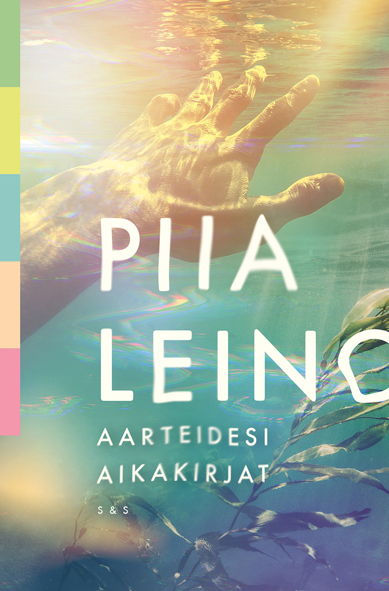

Sain luettua eilen loppuun neljännen Piia Leinon kirjan. Aarteidesi aikakirjat poikkesi kolmesta aikaisemmasta mielenkiintoisella tavalla.

<!--more-->

### Tarina

Eletään 2100-luvun alkupuoliskoa. Ihmiskunta sai kokea ihmisen aiheuttaman ilmastonmuutoksen seuraukset, mutta se otti niistä myös opikseen. Sen sijaan, että ihmiskunta kohtelisi ympäristöä loputtomana resurssina, se on oppinut elämään yhdenvertaisena sen rinnalla. Ihmiset eivät ajattele enää olevansa kaiken muun yläpuolella, niin kuin 2000-luvun alussa. Toisaalta tämä uusi maailma on monella tapaa kylmempi. Ihmiset eivät enää samalla tavalla ole sosiaalisia tai inhimillisiä.

Ihmiset asuvat yhteisöissä, jotka tuntuvat keinotekoisesti rakennetuilta. Kevytyhteisöissä kaikki on hyvin pelkistettyä ja elämä tuntuu monessa mielessä lähinnä välttämättömien tarpeiden täyttämiseltä. Se ei ole kärsimystä, mutta se ei ole myöskään kovin tyydyttävää. Syväyhteisöt voivat tarjota ihmisille paljon enemmän, mutta niihin pääseminen vaatii rahaa. Lisäksi asukkaiden on täytettävä syväyhteisön tarkat laatuvaatimukset.

2000-luvun alkupuolella osa rikkaista ihmisistä päätti jäädyttää kehonsa siinä toivossa, että he voisivat voittaa kuoleman ja palata elävien kirjoihin tulevaisuudessa. Kukaan ei kuitenkaan osaa vielä 2100-luvullakaan herättää jäädytettyjä ihmisiä henkiin. Päinvastoin, on alettu ymmärtää, ettei se taida olla edes mahdollista. Heidän pitäminen kuolleena on myös hyvä tapa tehdä rahaa.

Kryoria on yksi alan suurimmista yrityksistä. Henkiin herättämisen sijaan se on onnistunut kehittämään tekniikan, jolla jäädytetyistä aivoista voidaan kerätä ihmisten muistot ja kokemukset talteen. Joskus ajateltiin, että aivot tallentavat vain pienen osan tapahtumista, mutta tekniikan myötä tämä todettiin vääräksi. Aivot tallentavat kaiken informaation ja näihin raakamuistoihin Kryorialla on nyt pääsy. Se ei kuitenkaan ole löytänyt tapaa jäsennellä muistoja tai laittaa niitä järjestykseen. Muistojen selaaminen on täysin sattumanvaraista loikkimista hetkestä toiseen.

**Oula** on 27-vuotias louhija. Louhijat penkovat kuolleiden ihmisten muistoja. Joillekin se on elämys, matka toisen ihmisen kokemuksiin ja tunteisiin. Oulalle se on aarteen etsintää. Vaikka louhiminen on kallista, hän toivoo löytävänsä aarteen, joka kuittaisi menetetyt rahat ja takaisi hänelle pääsyn syväyhteisöön.

Oula louhii 2000-luvun alkupuolella kuolleen **Raphaelin** muistoja. Tiedetään, että Raphael piilotti henkiin heräämistään varten jotain todella arvokasta. Kukaan ei kuitenkaan tiedä minne. Kukaan ei myöskään tiedä, onko aarre vuosikymmenten jälkeen tallessa. Oula toivoo ratkaisun löytyvän Raphaelin muistoista. Hän ei ole kuitenkaan ainut louhija, joka penkoo Raphaelin muistoja sama tavoite mielessään.

Viikkoja kestävän louhinnan aikana Oula pääsee elämään Raphaelin elämää ja kokemaan hänen ilot sekä surut. Oula oppii samalla 1900-luvun puolella syntyneen Raphaelin maailmasta, joka on hänelle historiaa, jota hän ei ole koskaan kokenut. Monet sen maailman asiat tuntuvat hänestä vierailta, oudoilta ja järjettömiltä, mutta joitakin asioita hän myös kadehtii. Samalla hän oppii paljon itsestään ja alkaa nähdä ympäristönsä, oman aikansa, elämänsä ja louhinnan hyvin erilaisessa valossa.

### Henkilöt

Leino on jälleen kerran onnistunut rakentamaan tarinan, joka ei tarvitse lukuisia henkilöitä ollakseen toimiva. Kirjassa on käytännössä kaksi päähenkilöä: Oula ja Raphael. Leino on upealla tavalla tehnyt kahdesta päähenkilöstä kuin toistensa vastakohdat. He edustavat aivan erilaista maailmaa ja ovat kirjaimellisesti eri ajasta. Tarinassa on toki muitakin henkilöitä, mutta he ovat lopulta niin pienessä roolissa, etten käytä niihin tässä aikaa.

Oula on tulevaisuuden kasvatti, jolle 2000-luvun maailma on omituinen pala menneisyyttä. Kirja käyttää todella vähän aikaa Oulan erilliseen kuvailuun. Hahmo syntyy hiljalleen Oulan ajatusten ja toiminnan kautta. Hänen silmillään lukija pääsee katsomaan nykymaailmaa ulkopuolisen silmin. Näkemään sen järjettömyyden, mutta myös joitain kauniita asioita.

Oula on sosiaalisesti kömpelö, mutta toisaalta niin ovat lähes kaikki sen ajan ihmiset. Se tekee muiden ihmisten kohtaamisista välillä vaivaannuttavia, mutta hauskoja - raja on hyvin häilyvä.

Oula on hyvä ihminen, joka ei halua kenellekään pahaa, mutta silti hänen tekonsa eivät joka hetki ole kovin hyviä. Leino on onnistunut rakentamaan Oulasta kiinnostavalla tavalla omituisen hahmon, joka aiheuttaa välillä ristiriitaisia tunteita, jotka pakottavat ajattelemaan. Hän ei ole välttämättä erityisen kiinnostava sellaisenaan, mutta se ei haittaa, sillä Oula toimii oppaana kiinnostavaan maailmaan.

Raphael on puolestaan nykyajan rikas, keski-iän ylittänyt seurapiiriherra, joka saa rahoillaan ja vaikutusvallaan suunnilleen kaiken minkä haluaa. Tämän kuvauksen perusteella hänen voisi helposti ajatella olevan itsekäs kusipää, joka hyväksikäyttää muita, mutta näin ei ole. Oulan tapaan hänkään ei ole paha ihminen, vaikka jokainen teko ei olekaan erityisen hyvä.

Itse koin Raphaelin kiinnostavaksi osin siksi, että hän on kuollut. Hän on pelkkä muisto. Oulan syntymän ja Raphaelin välillä on vuosikymmeniä, joten lukijalle käy heti alussa selväksi, että he eivät tule koskaan kohtaamaan samassa ajassa, eivätkä voi vaikuttaa toistensa tekemisiin.

Kirja viettää ison osan ajasta pomppien Raphaelin muistoissa, joten lukija pääsee tutustumaan häneen elämän eri vaiheissa. Se tekee hänestä ainakin itselleni kirjan kiinnostavimman hahmon. Välillä hän on nuori, välillä vanha. Lukijalle selviää heti alussa, millaisena ihmisenä Raphael kuolee. Kiinnostavaa onkin se, kuinka nuoresta Raphaelista tuli vanha Raphael. Jos Oulan muutos ihmisenä on lineaarinen, Raphaelin kohdalla näin ei ole.

Kiinnostavaa on myös se, kuinka näiden kahden eri ajassa elävän ihmisen maailmat sitoutuvat yhteen.

### Matka muistoihin on matka nykyajan ilmiöihin

Aarteidesi aikakirjat oli positiivisella tavalla hämmentävä lukukokemus. Kirjan alku tuntui jopa tylsältä, mutta näin jälkeenpäin katsottuna se ei sitä ollut. Se voi kuitenkin tuntua hieman sekavalta, sillä lukija pudotetaan maailmaan ja tilanteeseen, jonka todellinen luonne selviää vasta pienen lukemisen jälkeen. Ei siis kannata luovuttaa ensimmäisten sivujen aikana.

Olen jokaisessa Leinon kirjan arvostelussa maininnut sen, kuinka hän onnistuu tuomaan omat arvonsa ja maailmankuvansa kirjaan tavalla, joka ei tunnu alleviivaavalta tai paasaavalta. Aarteidesi aikakirjat ei ole tästä poikkeus. Pidin todella paljon siitä, kuinka hän käyttää Oulaa ulkopuolisena linssinä, jonka kautta nykyistä maailmaa voi katsoa. Hän tekee mielenkiintoisia havaintoja tekniikasta, tekoälystä, luonnosta, taloudesta, kulutuksesta ja ihmisyydestä.

Leinon kirjoissa tuntuu toistuvan tietynlainen minimalismin teema. Se näkyy paitsi tarinoissa niin myös tavassa, jolla on hän kirjoittaa. Hän ei tarvitse hyvän tarinan kertomiseen useita hahmoja tai monimutkaisia juonikuvioita. Ehkä tämä on juuri se syy, miksi pidän niin paljon hänen tavastaan kirjoittaa. Se haastaa lukijan ajattelemaan, mutta se ei tee sitä tarpeettomalla monimutkaisuudella.

Sekä Oula, että Raphael ovat samaistuttavia hahmoja. Heissä on piirteitä, joita inhosin, mutta heidän toimintansa kävi järkeen ja sitä oli helppo ymmärtää. Leinolla on uskomaton kyky kirjoittaa hahmoja, joista ainakin minä tykkään. Hänen tarinansa tuntuvat hyvin inhimillisiltä.

Aarteidesi aikakirjat on selkeästi kolmesta muusta kirjasta poikkeava teos. Se ei ole varsinaista dystopiaa ja sen tarina tuntui ohuimmalta. Tämä ei kuitenkaan ole huono asia, sillä en kokenut, että kirja olisi tarvinnut yhtään sen enempää. Se on erikoinen seikkailu kahden ihmisen mieleen ja kahteen erilaiseen aikaan. Vaikka se tarjoaakin omia vastauksia, se jättää mukavalla tavalla tilaa lukijan omalle ajattelulle.

Kun pääsin kirjan loppuun, minulle ei tullut olo, että olisin lukenut loppuun tarinan. Minulle tuli olo, että olin pyörähtänyt vieraassa maailmassa ja saanut paljon uutta ajateltavaa. Kirja vie kyllä ohuen tarinansa loppuun, mutta ei välttämättä tee sitä erityisen tyydyttävällä tavalla. Tämän kirjan kohdalla koin kuitenkin, että matka oli paljon määränpäätä tärkeämpi.

Hieno ja kaunis teos, joka saa minun suosituksen!

