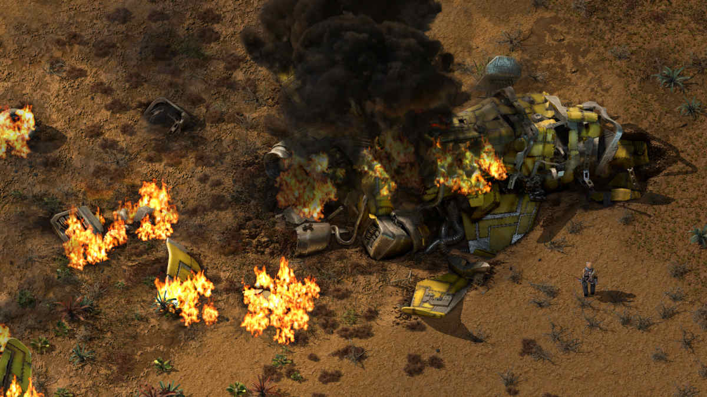
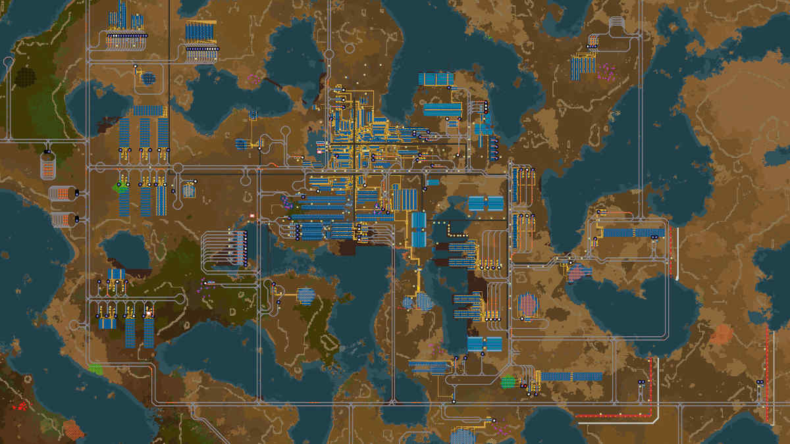

Olen pelannut [Factoriota](https://factorio.com/) jo yli kahden vuoden ajan. Se on saamassa lokakuussa uuden lisäosan, joten sitä odotellessa päätin kirjoittaa pelistä arvostelun.

<!--more-->



### Tarina

Factorion "tarina" on helppo tiivistää ja vaikea spoilata. Olet vieraalle planeetalle rysähtäneen avaruusaluksen ainut selviytyjä. Käsissäsi on läjä avaruusaluksen raadosta saatavia materiaaleja, pieni hakku, pistooli, sekä ympärillä oleva planeetta. Tavoitteenasi on rakentaa näistä lähtökohdista uusi avaruusraketti. Siinä se.

Factorio on nimensä mukaisesti tehdassimulaattori. Tiedän, tiedän, se ei kuulosta erityisen hauskalta, mutta se todella on sitä. Pelaajan tehtävä alkaa sillä, että hän joutuu louhimaan ympäristöstään materiaaleja. Niistä hän voi rakentaa uuneja, joissa materiaalit voi jalostaa paremmiksi. Niitä taas käytetään parempien uunien, porien ja erilaisten automaatiohärveleiden rakentamiseen.

### Tehtaan suunnittelua ja puolustamista

Varsin nopeasti pelaajalle käy selväksi, että materiaalien tarve kasvaa niin suureksi, ettei käsin louhiminen ole järkevää. Niinpä pelaajan on automatisoitava se. Näin syntyy ensimmäinen linjasto, joka tekee louhimisen pelaajan puolesta ja kuljettaa materiaalit oikeisiin paikkoihin liukuhihnojen avulla. Pelaaja voi keskittyä tarpeellisten asioiden valmistukseen hakun heiluttelun sijaan.

Pian tämäkään ei ole kestävää. Erilaisia rakennuskomponentteja tarvitaan niin paljon, että myös rakentaminen on automatisoitava. Porien, liukuhihnojen ja niiden päältä tavaraa poimivien kourien avulla pelaajan tehtävänä on luoda järkeviä tuotantoketjuja, jotka mahdollistavat koko ajan suuremman tuotannon. Mitä kehittyneempää teknologiaa valmistetaan, sitä enemmän materiaalia on louhittava. Samalla tuotantoketjut monimutkaistuvat.

Vaikka pelin alussa pelaaja saakin puuhastella rauhassa, sitä onnea ei jatku loputtomiin. Tehdaslaitteet saastuttavat. Hiljalleen saastepilvet leviävät kauemmaksi ja tavoittavat planeetan paikalliset hyönteisasukkaat. Ne eivät luonnollisesti arvosta saastuttavaa vierailijaa ja alkavat hyökätä pelaajan kimppuun. Mitä enemmän pelaaja saastuttaa, sitä enemmän hän saa vihollisia kimppuunsa. Jotta vihollisten määrä ei räjähdä käsiin, pelaajan on käytävä tuhoamassa niiden pesiä.

Pelaajan on siis tehtaan rakentamisen lisäksi myös puolustettava sitä ja kehitettävä teknologiaa, joka auttaa tehtävässä. Sitä on myös parannettava, sillä viholliset mutatoituvat koko ajan vahvemmaksi.

Tehdas ja sen puolustus ei toimi pyhällä hengellä vaan vaatii energiaa. Niinpä pelaajan on pidettävä huoli siitä, että sähköä on tarpeeksi saatavilla. Peli alkaa vaatimattomilla höyrymoottoreilla, mutta pelin loppupuolella käytössä ovat massiiviset ydinvoimalat. Sähkön loppuminen voi olla kohtalokasta, sillä sen myötä koko tehtaan puolustus voi sammua ja tuotanto pysähtyä.

Pelin hauskuus ja haaste syntyvät erityisesti järkevien tuotantoketjujen suunnittelemisesta. Ketjut ovat aluksi yksinkertaisia, mutta ne muuttuvat yllättävän nopeasti paljon monimutkaisemmaksi. Pullonkaulojen selvittäminen onkin yksi ensimmäisen pelikerran hauskimmista haasteista. Resurssejakaan ei ole rajattomasti, joten pelaajan on tutkittava planeettaa ja etsittävä uusia mineraali- ja öljykenttiä.

Alussa varsin vaatimaton liukuhihnojen sekasotku saattaa pelin loppuvaiheessa olla massiivinen tehdas, jota pyöritetään kauempana olevien erillisten alatehtaiden ja louhimoiden avulla. Materiaaleja kuskataan kymmenillä junilla pitkiä välimatkoja. Massiivisten rakennelmien tekeminenkin on niin työlästä, että sekin on pakko automatisoida robottien avulla. Kaiken aikaa on pidettävä huoli siitä, etteivät ötökät pääse tuhoamaan rakennelmia.

Se ei ole helppoa. Factorion ensimmäinen pelikerta onkin monien pelaajien muistoissa ainutlaatuinen, sillä se on ainut kerta, jolloin sinulla ei ole ymmärrystä siitä, kuinka tehtaita kannattaa rakentaa. Opit tekemällä. Suosittelenkin, että pelaat ensimmäisen pelin ilman, että katsot netistä apua tai käytät online-työkaluja. Ensimmäinen pelikerta on ainutlaatuinen joten hyödynnä se. Et saa siihen toista mahdollisuutta.

Vaikka pelissä on hirvittävä määrä rakennettavaa, pelimekaniikka varmistaa sen, että uusia asioita tulee pelaajan eteen hiljalleen. Lisäksi peliin sisään rakennettu opas esittelee pelaajalle kaikki uudet asiat aina kun niitä avautuu. Vaikka peliä ei ole erityisen helppo ensikertalaisen päihittää, siihen on todella helppo päästä sisään.

### Toinen kierros ja uudet tavoitteet

Monille pelaajille käy niin, että kun he pääsevät pelin ensimmäisen kerran läpi, he aloittavat välittömästi uuden. Uuden pelin tavoite on sama kuin aikaisemminkin, mutta nyt kaikki tehdään paremmin ja selkeämmin. Ei samanlaista spagettisotkua kuin ensimmäisellä pelikerralla. Toisella kerralla hauskuus ei synny tuotantoketjujen yllätyksellisyydestä tai avaruusraketin rakentamisesta vaan siitä, että saat tehtyä mahdollisimman toimivan tehtaan.

Factorio ei lopu siihen kun pelaaja saa ensimmäisen raketin avaruuteen. Pelaaja voi jatkaa tehtaan kasvattamista. Seuraava tavoite voikin olla vielä massiivisemman tehtaan rakentaminen. Pelaajien keskuudessa tästä käytetään usein termiä **megabase**. Pelissä teknologian kehittäminen vaatii ns. science packien valmistamista. Näitä on useita erilaisia ja usein megabasen määritelmänä pidetään sitä, että tehdas kykenee valmistamaan jokaista science packia *1000* kappaletta minuutissa.

Pelin mittakaavan hahmottamista voi auttaa seuraava nippelitieto. Jos pelin alkuvaiheessa rakennat yksinkertaisia poria yhden minuutissa, se vaatii, että keräät *23* rautaa ja *4,5* kuparia minuutissa. 1000 science packin valmistaminen vaatii *162 868* rautaa ja *272 241* kuparia minuutissa. Ja sen päälle massiivisen tuotantoketjun, jotta kaikki välivaiheiden komponentit saadaan valmistettua.

Netistä löytyy useita aputyökaluja näiden massiivisten tehdaskompleksien rakentamiseen, mutta suosittelen välttelemään niitä ensimmäisellä pelikerralla.

### Grafiikka, musiikki ja moninpeli

Factorio on erittäin laadukkaasti rakennettu peli. Sitä kehitetään aktiivisesti ja siinä on olematon määrä bugeja. Itse en ole kahden vuoden aikana törmännyt yhteenkään.

Kuvaruutukaappausten perusteella voisi kuvitella, että peli olisi 2000-luvun alkupuolelta, mutta sen ei kannata antaa hämätä. Vuonna 2020 julkaistu Factorion visuaalinen tyyli on harkittu. Isometrinen 2D-grafiikka tekee isojen tehtaiden hahmottamisesta helppoa ja peli pyörii sujuvasti varsin vaatimattomallakin koneella - joskin megabase-projektit alkavat vaatia jonkin verran enemmän laskentatehoa.

Musiikki on hyvin sävellettyä syntikkasaundeilla höystettyä ambientia, joka on varsin huomaamatonta eikä käy ärsyttämään pidemmänkään pelisession aikana. Se istuu hienosti pelin avaruusteemaan. Pelin äänimaisema koostuu lähinnä tehtaassa olevien laitteiden kilkatuksista sekä rutinoista ja hyökkäävien ötököiden huudoista.

Factoriota on mahdollista pelata moninpelinä, jolloin useampi pelaaja rakentaa samaa tehdasta. Peliin on lisäksi tarjolla läjäpäin modeja, jotka tuovat kokonaan uusia pelimoodeja, haasteita, teknologioita ja elämää helpottavia parannuksia. Suosittelen, että pelaat ainakin ensimmäisen pelikierroksen läpi ilman modeja. Erikseen ladattavien karttojen avulla pelaajat voivat pelata myös toisiaan vastaan.

### Yhteenveto

Factorio kuuluu oman pelihistoriani parhaimpiin peleihin. Jos pidät logiikkapähkinöistä tai erilaisista rakentelupeleistä, suosittelen ehdottomasti kokeilemaan. Tekijöiden mukaan Factorio ei ole koskaan ollut alennuksessa, eikä se tule koskaan olemaan, joten niitä ei kannata odottaa. Paras aika aloittaa on juuri nyt.

Peli on saatavana Windowsille, Macille ja Linuxille. Siitä on ladattavissa ilmainen demo. Täysi peli maksaa *32 euroa*. Sen voi ostaa Factorion [omilta sivuilta](https://factorio.com/buy), [Steamista](https://store.steampowered.com/app/427520/Factorio/), [Humblesta](https://www.humblebundle.com/store/factorio) sekä [Gogista](https://www.gog.com/game/factorio).

Tuleva lisäosa [Factorio: Space Age](https://factorio.com/blog/post/fff-418) julkaistaan *21.10.2024* ja sillä on hintaa *35 dollaria*. Se tuo peliin hirvittävän läjän muutoksia ja parannuksia. Lisäksi se jatkaa siitä mihin peruspeli päättyy ja vie tehtaan rakentamisen avaruuteen sekä eri planeetoille.

