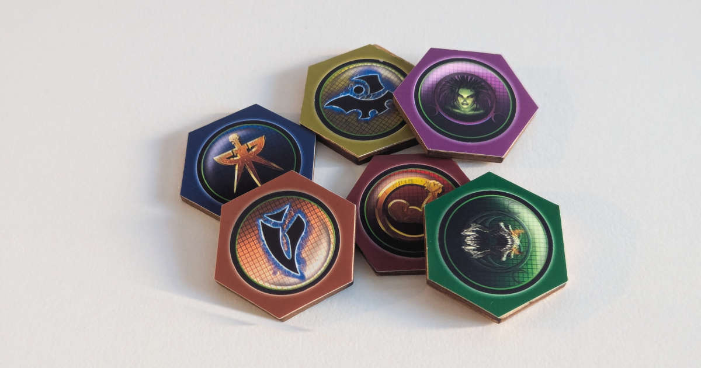

Kulunut reilu viikko on mennyt henkisen hyvinvoinnin kanssa taistellessa. Tämä ei ole ensimmäinen kerta kun näin käy ja kokemus onkin opettanut, mitä näissä tilanteissa kannattaa tehdä.

<!--more-->

Vaikka mielenterveysongelmiin on omat sisäiset syyt, usein huonot kaudet käynnistyvät ulkopuolisista ärsykkeistä. Niitä voivat olla elämässä vastaan tulevat haasteet ja kolhut. Todelliset haasteet ovat kuitenkin harvinaisia. Paljon useammin huomaan voivani huonosti, vaikka elämässäni on kaikki hyvin. Nykyään huonot kaudet käynnistävät lähes aina online-maailmasta ja uutisista.

Ärsytys, ahdistus, kiukku, paha olo, voimattomuus ja epätoivo ovat tunteita, jotka myyvät netissä. Niillä saa klikkejä. Silloinkin kun kaupallisuus ei aja sisältöä, ihmiset tarttuvat näihin tunteisiin helposti. Käy katsomassa kaupallisuudesta ja algoritmeista vapaan Mastodonin suosituimpia postauksia. Tuntuva osa siitä sisällöstä on asioita, jotka ovat huonosti, ja joita ohjaa negatiiviset tunteet.

Vilkaise ampparit.comista [luetuimmat](https://www.ampparit.com/luetuimmat) uutiset. Tätä kirjoittaessa 10 luetuimmasta artikkelista 3 kertoo sodasta ja niiden lisäksi kerrotaan raiskauksesta, työntekijöiden huonovointisuudesta, pulassa olevista astronauteista sekä talousrikoksesta. Voisi melkein sanoa, että jos juttu ei ole jotain negatiivista, se kertoo seksikkäästi pukeutuneesta naisesta tai tisseistä.

Kun tajuan voivani huonosti, lähes aina parasta mitä voin tehdä, on keskittyä todelliseen maailmaan ja omaan elämään. Käyn juoksemassa tai salilla. Keskityn pelaamaan pelejä, lukemaan kirjoja tai tekemään jotain omaa projektia, kuten viime viikkojen valokuvien siivoaminen.

Sillä on iso positiivinen vaikutus, jos voin tehdä jotain, joka vaatii keskittymistä ja ohjaa minua olemaan läsnä juuri siinä hetkessä. Tällä viikolla olen edistänyt pientä askarteluprojektiani, jossa korvaan [StarCraft-lautapelin](https://boardgamegeek.com/boardgame/22827/starcraft-the-board-game) kuluneet pahvinappulat puisilla. Sen lisäksi olen suunnitellut tulevia käsityöprojekteja.

Lopetin aktiivisen uutisten seuraamisen jo vuosia sitten. Tajusin, että uutisten seuraaminen tuotti minulle uskomattoman määrän ahdistusta antamatta mitään oikeasti hyödyllistä takaisin. En ole katunut päätöstäni enkä koe, että olisin koskaan ohittanut tärkeitä tapahtumia sen takia. 

Online-maailma ja sosiaalinen media ovat haastavampia. Ne ovat monella tapaa haitallisia ja usein tuntuu, että Internet on ihmiskunnan likakaivo, jonne kaikki paha olo valuu. Toisin kuin uutiset, Internet pystyy kuitenkin antamaan myös jotain hyvää ja hyödyllistä. Negatiivisuuden tulva vaan vaatii käyttäjältä tarkkaavaisuutta, aktiivisuutta ja harkintaa.

Kuluneen viikon parhaimmat hetket ovat olleet niitä, kun olen saanut keskittyä omaan puuhasteluun ja unohtaa kaiken sen pahan olon, jota ihmiset levittävät. On vain minä ja minun projektini. Kun olen pyörähtänyt sosiaalisessa mediassa, huono oloni pahenee välittömästi. Olen koettanut keskittyä positiiviseen, mutta se on todella vaikeaa. Negatiivisuus imee mukaansa. Kun poistun somesta ja suljen silmäni Internet-kuonalta, voin heti paljon paremmin.

Olen kiitollinen siitä, että olen elänyt aikana ennen Internetiä. En ole unohtanut sitä, miltä tuntui, kun ei tarvinnut olla kaiken aikaa ajan tasalla maailman tapahtumista, tai yhteydessä tuntemattomiin ihmisiin. Sai vaan elää omaa elämäänsä ja keskittyä sen pieniin projekteihin. Siinä maailmassa ainakin minun on paljon helpompi voida paremmin.

Ajattelenkin, että ensimmäinen lääke huonoon oloon on siirtyä offline-maailmaan. Keskity itseesi. Näe kavereitasi. Liiku ja lue. Tee elämäsi projekteja.

