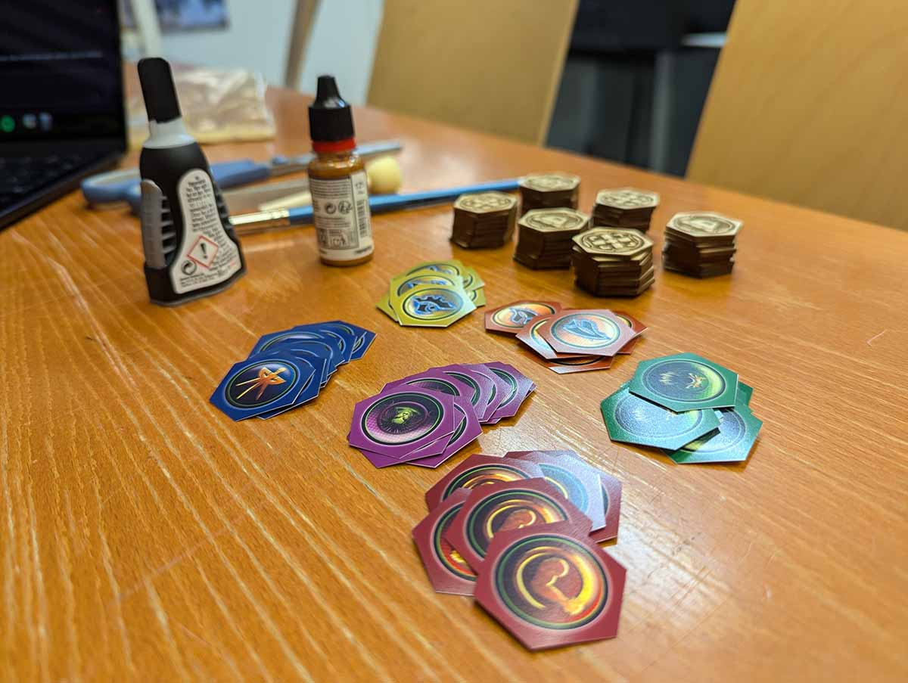

Sain vihdoinkin valmiiksi oman projektini: StarCraft-lautapelin uudet nappulat. Pitkään siinä meni, vaikka lopputulos ei ole järin suuri.

<!--more-->

Vuonna **2007** julkaistu [StarCraft: The Board Game](https://boardgamegeek.com/boardgame/22827/starcraft-the-board-game) ei ole enää mikään aivan tuore peli. Tykkään itse pelata yhteistyöpelejä, mutta silloin kun haluaa puukottaa kavereita selkään, StarCraft on näiden vuosien jälkeenkin yksi suosikeistani.

Sen parissa on tullut vietettyä tuntikausia ja se näkyy pelin nappuloissa. Erityisesti pahviset komentonappulat ovat ehtineet nähdä elämää niin paljon, että niiden pinta ja kuviointi alkoi olla varsin kulunut. Tämä ei olisi sellaisenaan ongelma, mutta StarCraftin pelimekaniikka vaatii, että nappuloita ei pitäisi pysyä tunnistamaan niiden selkäpuolelta.

Pelaajat näkevät toistensa komennoista ainoastaan sen, kuka komennot on laittanut ja mille pelialueelle ne on laitettu, mutta ei sitä, mitä pelaaja kyseisellä alueella aikoo tehdä. Tämä luo kierroksen suunnitteluvaiheessa mielenkiintoisia uhkakuvia, joista monet toteutuvat, mutta jotka voivat olla myös puhdasta bluffia, joiden ainut tarkoitus on sitoa kilpakumppanin yksiköt alueelle, jossa ei tapahdu mitään.

Kulumat ovat synnyttäneet pahvisten nappuloiden selkäpuolelle erittäin tunnistettavia merkkejä. Toki nappuloita on pelissä lähemmäksi 60, mutta jo muutaman nappulan tunnistaminen vie ison siivon pelin hienoudesta. Ongelma kaipasi ratkaisua.

### Ensimmäiset ideat

Ensimmäisenä tutkin, että onko peliin saatavana varaosia. Ei niin yllättäen 17 vuotta vanhaan, erittäin suosittuun peliin niitä ei löytynyt. Itse asiassa ehjän pelin löytäminen oli yllättävän vaikeaa. Käytetyistä peleistä sai maksaa sievoisen summan rahaa. Ei kiitos.

Ajattelin, etten voi olla ainut, joka kärsii kuluneista nappuloista. Niinpä aloin tutkia kuinka muut pelaajat ovat korvanneet hajonneita pelinappuloita.

Yksi lupaavista vaihtoehtoista oli nappuloiden 3D-tulostus. Se tuntui verrattain helpolta, mutta nappulat eivät olleet mielestäni erityisen kivan näköisiä, eikä eri komentoja ollut helppo erottaa toisistaan. Yksiväriset nappulat olivat tylsiä, vaikka sen olisi tietenkin voinut korjata maalilla. Suurimpana jarruna oli kuitenkin se, ettei minulla ole 3D-tulostinta. Kirjastoista niitä toki löytää, mutta ajatus siitä, että päivystän kirjastossa 3D-tulostinta seuraten usean illan ajan ei varsinaisesti houkutellut.

Minulla on jo pidempään ollut halu tehdä käsitöitä. Olin ehtinyt katsoa vuokrattavia työtiloja ja harkinnut erilaisten laitteiden hankintaa, mutta idea tuntui aivan tarpeettoman kalliilta kun ottaa huomioon, etten ole erityisen hyvä tekemään mitään käsilläni. Minun ei kuitenkaan tarvinnut pohtia tätä vaihtoehtoa pitkään, sillä minua muistutettiin siitä, että vain pienen pyöräilymatkan päässä sijaitsee [Helsinki Hacklab](https://helsinki.hacklab.fi/).

Kävin tutustumassa paikkaan ja tunsin välittömästi, että se on minun juttu. Liityin samoin tein jäseneksi. Labilla isompien laitteiden käyttäminen vaatii perehdytyksen, joten osallistuin koulutuksiin sitä mukaa kun niitä tuli. Ensimmäinen koulutus oli laserleikkuriin. Kun tajusin, että leikkurilla voi myös kaivertaa, idea alkoi hahmottua: rakentaisin uudet nappulat puusta ja tekisin eri komentojen symbolit kaivertamalla.

### Lasernappulat

Niin kivalta kun ajatus päässäni näyttikin, minulla ei ollut hajuakaan, miten sen toteuttaisin. Tai olisiko se edes toteuttamiskelpoinen. Totesin, että paras tapa oppia on tehdä.

Minulle kerrottiin, että laserleikkuri kykenee käsittelemään harmaasävykuvia. Mitä tummempi sävy on, sitä syvemmälle laserleikkuri kaivertaa. Otin kokeeksi valokuvan yhdestä nappulasta ja tein siitä Photoshopissa yksinkertaistetun harmaasävykuvan. Olin saanut käsiini 2 mm paksua vaneria, joten aloin tehdä siihen koeajoja. 

Ensimmäiset yritykset olivat hiiltyneitä reikiä. Koneen tehoa säätämällä sain tilannetta paremmaksi, mutta lopputulos olisi silti melkoinen kötöstys. Totesin, ettei harmaasävykuvien käyttäminen olisi oikea tapa. Minun olisi suunniteltava uudet nappulat vektorigrafiikkana.

En ole graafikko ja kokemukseni vektorigrafiikan tekemisestä on lähellä nollaa. Latasin avoimen lähdekoodin [Inkscape](https://inkscape.org/)-sovelluksen ja aloin opetella sen käyttöä. Käytin aikaisemmin ottamiani valokuvia pohjana ja askartelin kuvan, joka muistutti mahdollisimman hyvin alkuperäistä. Olin varsin tyytyväinen lopputulokseen.

laserleikkuria ohjataan [LightBurn](https://lightburnsoftware.com/)-sovelluksella. Tässä kohtaa opin, etteivät Inkscapen vektorikuvat hyppää toiseen sovellukseen ihan heittämällä. Eli taas opeteltiin, säädettiin ja opeteltiin vähän lisää. Lopulta kuitenkin onnistuin ja minulla oli kuva, jossa eri tasoilla oli eri syvyiset kaiverrukset sekä varsinainen leikkausreuna.

Laser hurisemaan ja tulos oli... välttävä. Kuvassani oli aivan liian paljon yksityiskohtia sekä eri syvyisiä kaiverruksia. Laser kykenee varsin tarkkaan jälkeen, mutta se ei vaan toiminut noin pienissä kappaleissa. Eli takaisin suunnittelupöydän ääreen. Yksinkertaistin piirustuksiani ja pidin huolen, että kaiverrettavien osien välillä oli riittävästi tyhjää. Liian kapeat välit kun eivät näyttäneet puussa hyvältä. Samalla poistin eri kaiverrussyvyydet. Nyt nappulassa oli joko kaiverrettavia osia tai sitten ei mitään.

Seuraavalla laserointikerralla lopputulos alkoi näyttää varsin hyvältä. Ongelmana oli se, että jälki ei vieläkään ollut niin siistiä kuin olisin halunnut. Laser leikkaa polttamalla ja sen seurauksena leikattava kappale mustuu. Jouduin tekemään kymmeniä kokeiluja, ennen kuin sain säädettyä laserin sellaiselle nopeudelle ja teholle, että kappale ei mustu, mutta ettei kaivertamisessa menisi pientä ikuisuutta. Siinä säätäessä kuulin vinkin, että peittämällä puu maskausteipillä, voisin välttää osan palojäljistä, sillä ne päätyisivät teipin pintaan. Tätä neuvoa noudatin.

Testasin nappuloiden tekemistä muihinkin materiaaleihin, kuten akryyliin sekä kaiverruslevyyn, mutta pidin edelleen puuta parhaimpana vaihtoehtona. Se antoi arvokkaan fiiliksen ja lisäksi pidin puun tuoksusta.

### Nappuloiden taustat

Nyt kun kaiverrettavien komentojen symbolien tekeminen näytti mahdolliselta, aloin ratkomaan ongelman toista puolta - kirjaimellisesti. Minun pitäisi jollain tavalla toteuttaa nappuloiden takapuolet. Vaatimuksia oli kolme:
1) Niiden olisi väreiltään vastattava pelin kuuden eri ryhmän värejä
2) Niiden olisi oltava niin identtisiä, etteivät pelaajat voisi tunnistaa nappuloita toisistaan
3) Niiden olisi oltava kivan näköisiä

Toinen vaatimus tarkoitti sitä, että mikään käsin tehtävä töherrys ei tulisi kysymykseen. Yksinkertainen ratkaisu olisi maalata nappulat oikeilla väreillä, mutta se ei täyttäisi kolmatta kohtaa. Alkuperäisissä nappuloissa jokaisella ryhmällä on myös oma logo, joka löytyy jokaisen nappulan takaa. Halusin jotain samanlaista. 

Harkitsin hetken, että tekisin nämäkin logot kaivertamalla. Hylkäsin sen ajatuksen, koska vanerin luontainen tekstuuri voisi liian helposti tehdä nappuloista tunnistettavia. Enkä uskonut, että laserin tarkkuus (vanerissa) tai minun vektorigrafiikkakyvyt olisivat riittäneet tyydyttävään lopputulokseen. Päätin, että ainut vaihtoehto olisi logojen tulostaminen.

Koetin etsiä alkuperäisten nappuloiden logoja netistä siinä onnistumatta. Niinpä kuvasin nappulat kameralla ja aloin siistiä niiden kuluneita taustoja Photoshopissa. Vaikka minulla on vuosien kokemus kuvankäsittelystä, nappuloiden siistiminen ei ollut mitenkään helppo tehtävä. Nappulat olivat yksinkertaisesti niin kuluneita, että jouduin itse piirtämään osan puuttuvista yksityiskohdista. Iso haaste syntyi siitä, että pahvisten nappuloiden printissä oli rasterikuvio, joka teki niiden siivoamisesta painajaismaista. Parin illan säätämisen jälkeen pääsin kuitenkin jonkinlaiseen lopputulokseen, joskaan en ollut siihen ihan hirvittävän tyytyväinen. Parempaakaan en pystynyt.

Tässä kohtaa pengoin pelin laatikosta jotain ja otin käsiini pelaajille jaettavat pahviset tukikohtalevyt. Huomasin, että jokaisen levyn kulmassa on kyseisen ryhmän logo. Sen lisäksi, että ne olivat aivan timanttisessa kunnossa, ne olivat myös monta kertaa suurempia ja yksityiskohtaisempia, kuin nappuloiden takana olevat. Hyvä tajuta se tässä kohtaa kun oli ehtinyt tuhlata pari iltaa Photoshop-sekoiluun...

Hylkäsin Photoshop-kötöstykseni ja skannasin siistit logot ihan oikealla skannerilla. Sen jälkeen minun ei tarvinnut tehdä Photoshopissa muuta kuin leikellä ne ja asetella ne oikeaan mittasuhteeseen tehdyn hexagonin sisään. Lopuksi jokaiselle hexalle piti valita sopiva väri ja pam, homma oli valmis.

En kuitenkaan tiennyt, että millaiselle materiaalille kuvat pitäisi tulostaa, jotta ne olisivat kestäviä eivätkä näyttäisi ihan surkeilta. En ollut myöskään varma, että miten ne kannattaisi kiinnittää vanerinappuloihin.

Tässä kohtaa tajusin, että labilla on [sublimaatiotekniikkaan](https://en.wikipedia.org/wiki/Dye-sublimation_printing) perustuva valokuvatulostin. En tiennyt tulostimesta mitään, mutta pidin siitä, että kuvat tulostuivat jäykälle, lähes muoviselle ja osittain mattapintaiselle materiaalille. Idea, jota oli syytä kokeilla. 

Ensimmäinen tulostus varmisti, että olin oikeilla jäljillä. Jälki oli aivan järkyttävän hyvää ja pidin paperin laadusta. Koska paperi muistutti enemmän muovia, päätin kokeilla kiinnittämistä ihan vaan pikaliimalla. Onneksi minulla oli niin paljon epäonnistuneita vanerinappuloita, että koekappaleista ei ollut pulaa. Idea tuntui toimivan!

### Kultaiset komennot

Nappuloissa on vielä yksi yksityiskohta: osa komennoista on erikoiskomentoja, jotka tunnistaa alkuperäisissä nappuloissa niiden kultaisesta (= keltaisesta) sävystä. Koska nappuloiden komentopuoli ei sisällä mitään salaista, päätin hoitaa asian yksinkertaisesti maalaamalla. Kysymys kuuluikin, että millä värillä?

Harkitsin ensin keltaista, mutta koin, ettei se erotu riittävästi puun sävystä. Mietin myös punaista, joka erottuisi varmasti, mutta hylkäsin senkin, koska se voisi vilahtaa liian helposti muille pelaajille ja paljastaa, että pelaaja käyttää erikoiskomentoa.

Lopulta vastaus paljasti itse itsensä käsityöliikkeessä: myytävänä oli pienessä pullossa kultamaalia. Tietenkin kultaisten komentojen pitää olla kultaisia!

### Viimeistely

Olin jo aikaisemmin tehnyt vanerenappulat valmiiksi. Tänään varmistelin, että kuvat tulostuvat varmasti oikeassa koossa ja että niissä olisi riittävästi reunoilla tyhjää, jotta niiden asettelu nappuloiden taakse ei olisi mikrometripeliä. Tulostin kuvat ja leikkasin kaikki 54 logoa irti toisistaan.

Sen jälkeen alkoi kuvien liimaaminen nappuloihin. Muutaman testin jälkeen opin, että kuvaa ei kannattanut liimata nappulaan, vaan nappula kannatti liimata kuvaan. Laitoin kuvan ylösalaisin pöydälle, liimaa nappulan pohjaan ja sen jälkeen painoin nappulan kiinni kuvaan. Toisin päin tehtynä joka paikka oli liimassa ja meinasin liimata sormeni yhteen.

Sen jälkeen leikkelin kuvista nappulan yli tulevat osat pois. Lopuksi otin siveltimen käteen ja maalasin 18 nappulan komentosymbolit kultaiseksi.



Aika näyttää kuinka hyvin nappulat kestävät käyttöä, mutta olen itse varsin tyytyväinen lopputulokseen. Uusien nappuloiden taustat ovat paljon alkuperäisempiä yksityiskohtaisemmat ja niissä logo on paljon suuremmassa roolissa. Komentopuolen kaiverrettu symboli tekee nappulasta mukavan kolmiulotteisen ja lisää niiden pyörittelyyn taktiilin tuntemuksen. Puiset nappulat tuntuvat mukavan jämäkiltä ja niissä on tietenkin mukana myös se ujo puun tuoksu.

Täytynee järjestää peli-ilta ja katsoa, että kuinka uudet nappulat toimivat!

**Muokkaus 11.8.2024**: kirjoitukseen on lisätty uusia kuvia.