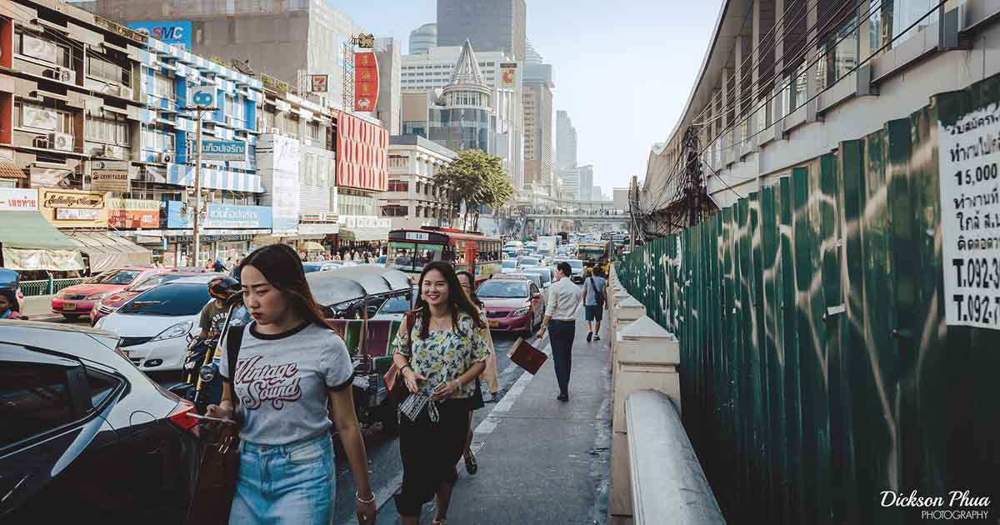

Minulta kysyttiin, että miksi vihaan autoja niin paljon. Kun mietin vastausta, tajusin, ettei siihen voi vastata kovin lyhyesti. On muutenkin kyseenalaista, että onko viha edes oikea sana kuvaamaan suhtautumistani autoihin ja autoiluun.

<!--more-->
Jos käytetään viha-sanaa, on hyvä ymmärtää, että vihaan niitä samalla tavalla kuin vihaan moottorisahoja tai vaikkapa imureita.

Moottorisahoissa ei ole sellaisenaan mitään vikaa ja tietyissä tehtävissä ne ovat hyödyllisiä, mutta jos naapurisi huudattaa sellaista ison osan hereilläoloajastasi, jokainen meistä alkaa vihata moottorisahoja. Autot laitteena eivät aiheuta minussa erityisiä tunteita. Ne ovat vain laitteita. Ongelma on siinä, kuinka käytämme niitä ja mitä siitä seuraa.



### Kaupunki- ja liikennesuunnittelu

Iso osa autovastaisuudestani kumpuaa autolähtöisestä kaupunki- ja liikennesuunnittelusta. Tällä tarkoitetaan asutun ympäristön suunnittelua, jossa autoilijoiden nopeus, kätevyys ja helppous laitetaan kaikkien muiden liikkumismuotojen sekä tavoitteiden edelle.

Autolähtöinen suunnittelu on globaali ilmiö, joka sai alkunsa USA:ssa 1900-luvun alkupuolella ja käynnistyi Euroopassa kunnolla 2. maailmansodan jälkeen. Se oli tietoinen valinta, jota on aktiivisesti lobattu auto- ja öljyteollisuuden toimesta yli sadan vuoden ajan. Nykyiset tiet ja kaupungit eivät ole pudonneet taivaalta, eivätkä ne ole jonkinlainen universaali totuus, vaan kyse on ihmisten tekemistä valinnoista ja päätöksistä.

Yksi autolähtöisen suunnittelun piirteistä on se, että se synnyttää autoriippuvuutta. Ilmiö, joka on Suomessa hyvin tyypillinen, vaikka ei aina kovinkaan perusteltu. Kun autoilulle ei ole järkeviä vaihtoehtoja, autosta tulee välttämättömyys elämiselle. Käytännössä tämä tarkoittaa sitä, että elämiselle on asetettu tuhansien eurojen maksumuuri.

Autoriippuvuus ja sen aiheuttama maksumuuri elämälle ovat kuitenkin vain pieni osa autolähtöisen suunnittelun synnyttämistä lukuisista ongelmista. Pureudutaanpa syvemmälle "autovihani" syihin.

### Autot lisäävät epätasa-arvoisuutta

Autot eivät ole yhteensopivia muiden kulkumuotojen kanssa, sillä ne ovat isoja, kömpelöitä ja vaarallisia. Juuri tästä syystä autolähtöinen suunnittelu tarkoittaa usein sitä, että autojen priorisointi tehdään kaikkien muiden kulkumuotojen kustannuksella. Tyypillistä suomalaista katukuvaa katsoessa asia on helppo nähdä.

Harvoja poikkeuksia lukuun ottamatta auto on ainut kulkumuoto, joka on saanut kokonaan omat kaistansa, ja niiden vaatima tila on moninkertainen kaikkeen muuhun liikenteeseen nähden. Tämä asettaa liikkujat hyvin epätasa-arvoiseen asemaan.

Ennen autolähtöistä suunnittelua kadut olivat leveitä ja kaikkien käytössä. Suomi apinoi Ruotsissa 1960-luvulla kehitetyn SCAFT-mallin, ja alkoi kutsua sitä *kevyeksi liikenteeksi*[^1]. Sen avulla ei-autoilevat saatiin pois autoilijoiden tieltä ja työnnettiin omille kapeille kaistoille. Vielä tänäkin päivänä tilanne on se, että kapean tilan jakavat jalankulkijat, pyöräilijät, pyörätuolia tai rollaattoria käyttävät, rullaluistelijat, skuutit, toimitusrobotit ja välillä jopa mopot.

Autoilun sujuvuutta on vuosien aikana parannettu heikentämällä muiden kulkumuotojen sujuvuutta. Hyvä esimerkki tästä ovat liikennevalot ja niiden kylkeen liitetyt anelunapit. Autoilijat tunnistetaan antureilla, muiden on pysähdyttävä risteyksiin ja aneltava tien käyttöoikeutta. Monissa risteyksissä 90 asteen käännös tarkoittaa muille liikkujille kahden ajoradan ylitystä ja näin ollen kaksien liikennevalojen odottelua. Mikäli ajoratoja on useita, jalankulkijat voivat joutua odottamaan myös kaistojen välissä.

Iso osa nykyisestä liikenneinfrasta on autoiluinfraa, jota ei tarvittaisi ilman autoja. Suojatiet, liikennevalot ja muut tutut elementit eivät ole muita liikkujia varten, vaikka ne usein myydäänkin sillä ajatuksella. Ilman autoja niitä ei tarvittaisi.

Eri liikkumismuotojen priorisoinnissa kannattaa tuijottaa talvikunnossapitoa. Se paljastaa näkyvällä tavalla, minkä liikenteen sujuvuuteen kaupungit käyttävät rahaa ja resursseja. Kun autoilijat ajavat ympäri vuoden paljaalla asfaltilla, muut saavat rämpiä sohjossa ja liukastella jäällä[^2].

Autoilu on tutkitusti miesten juttu. Jos perheessä on vain yksi auto, sitä ajaa useimmiten mies. Tämä luo sukupuolten välillä selkeän epätasapainon, sillä nimenomaan naiset joutuvat kärsimään autolähtöisestä suunnittelusta. Siitä kärsivät lisäksi kaikki alle 18-vuotiaat, jotka eivät voi ajaa autoa, mutta myös kaikki ihmiset, jotka ovat liian vanhoja toimimaan auton ratissa. Kärsijöiden joukossa ovat myös kaikki sokeat ja liikuntarajoitteiset, jotka eivät pysty ajamaan autoa, sekä kaikki ne, joilla ei ole varaa autoon.

Vuosien aikana autoiluinfraa on usein rakennettu heikompiosaisten kustannuksella. Vaikka Suomessa ollaankin vältetty pahimmilta ylilyönneiltä, maailmalla ei ole mitenkään epätavallista, että heikompiosaisten asuinalueita on lanattu matalaksi, jotta parempiosaiset pääsisivät liikkumaan sujuvammin.

### Autot ovat vaarallisia

Autot ovat maailman laajuisesti uskomaton tappaja. Ne ovat olleet sitä aina ja nykyään ne ovat yksi suurimmista lasten ja nuorten aikuisten kuolinsyistä. Kun katsoo liikenteessä kuolleita ja vammautuneita ihmisiä, autot ovat likipitäen aina osallisena näissä tapahtumissa. Jaksamme kauhistella yksittäistä pudonnutta lentokonetta, mutta unohdamme sen, että autot tappavat **joka päivä** lentokoneellisen verran ihmisiä pelkästään USA:ssa.

Kuolemat ja vakavat loukkaantumiset luokitellaan usein hyväksyttäväksi hinnaksi, jotta autoilu saataisiin pitää sujuvana. Autoilun aiheuttamaan kärsimykseen suhtaudutaan hyvin poikkeuksellisella tavalla, välinpitämättömästi ja vähättelevästi. Ihmisen tappaminen autolla nähdäänkin usein onnettomuutena[^3]. Se näkyy myös rangaistuksissa. Onkin sanottu, että jos haluat tappaa ihmisen, se kannattaa tehdä autolla. Auto on vapaudut vankilasta -kortti.

Tämä kaikki näkyy kaupunkisuunnittelussa, jossa turvallisuus on monesti ulkoistettu auton ulkopuolisille tien käyttäjille. On heidän vastuullaan odotella valoissa, katsella molempiin suuntiin, pukeutua huomioliiveihin, heijastimiin ja niin edelleen. Jos erehdyt vaipumaan ajatuksiisi ja rikkomaan autoilun ehdoilla rakennettuja sääntöjä, päädyt usein olemaan syyllinen. Uutiset raportoivat siitä, mitä suojavarusteita sinulla ei ollut päällä. Tämä siitäkin huolimatta, että sinä et kuljeta ajoneuvoa, joka synnyttää todellisen vaaran.

Uhrien syyllistäminen on juurtunut sitkeästi kieleemme. Kun kaksi autoilijaa kolaroi, kuljettajan osallisuus häivytetään otsikoista: "Henkilöauto ja pakettiauto kolaroivat". Kun mukana on muita liikkujia, ne muistetaan henkilöidä ja usein uhrista tehdään aktiivinen osapuoli: "Pyöräilijä jäi auton alle", ikään kuin pyöräilijä olisi odottanut tilaisuuttaan hypätä auton alle. Lähes aina kyse on siitä, että autoilija ajoi jalankulkijan tai pyöräilijän päälle.

### Autot kuihduttavat ympäristön

Suomalaisia kaupunkeja ei ole vuosikymmeniin rakennettu ihmisille. Ne on rakennettu autoille. Joka paikka lanataan harmaalle asfaltille autojen liikuttamista, parkkipaikkoja sekä parkkihalleja varten. Nykyiset säännökset sanelevat, että rakennuksista tai niiden pihoista on löydyttävä tietty minimimäärä autojen lepopaikkoja. Kun parkkihalleja rakennetaan, niitä kutsutaan autohalleiksi - niissä ei saa pysäköidä muita kulkuvälineitä.

Suomessa 50-60 -luvulla rantautui ajatus siitä, että autolla on päästävä kaikkialta kaikkialle. Sen seurauksen asuttu ympäristö on muuttunut autoviemäreitä ja parkkipaikkoja täynnä olevaksi ankeudeksi. Samalla se on johtanut välimatkojen pitenemiseen. Tiiviitä keskustoja on lähes mahdotonta rakentaa, kun iso siivu pinta-alasta menee tilarohmun ajoneuvon liikuttamiseen ja seisottamiseen.

Mikäli kaupunkisuunnittelun synkkä historia kiinnostaa, suosittelen tutustumaan 1962 julkaistuun Olavi Laisaaren kirjaan **Tehokas kaupunki**. Kirja on polttoainetta painajaisille, mutta kertoo samalla siitä ajattelusta, jonka seurausta nykyiset asutut ympäristöt isolta osin ovat.

Tilan rohmuaminen ja vaatimus asfalttipelloille ei ole kuitenkaan ainut tapa, jolla autot kuihduttavat ympäristöä, sillä...

### Autot saastuttavat

Autojen renkaat ovat yksi suurimmista mereen kertyvän mikromuovin lähteistä, autot tuottavat runsaasti pienhiukkasia ja ovat kaupunkien ylivoimaisesti suurin melusaasteen aiheuttaja. Joka keväinen katupöly? Isolta osin autojen tuottamaa.

Mikromuovit ja pienhiukkaset saattavat olla näkymätön ongelma, mutta autojen melua kukaan ei pääse karkuun. Nykyään automelua on lähes mahdotonta paeta. Moottori- ja ohiajoteitä on kylvetty joka paikkaan ja niiden jatkuva kohina kantautuu kilometrien päähän, myrkyttäen myös monet luontokohteet. Ei ole mitenkään epätavallista, että päästäksesi automelua karkuun, sinulla on oltava auto.

Koska iso osa asuinalueista on rakennettu hyvin autolähtöisesti, monissa kodeissa hiljaisuutta ei pysty enää kokemaan - ei edes öisin. Joissain kaupungeissa kerrostaloja on rakennettu jopa äänimuuriksi, jotta parempiosaiset niiden takana saisivat etäisyyttä liikennemeluun.

Tämä liittyy vahvasti autoilun tasa-arvo-ongelmaan. Autoilun haittavaikutuksista kärsivät tyypillisesti valmiiksi heikommassa asemassa olevat.

Erityisen ärsyttävää autojen aiheuttamissa saasteissa on se, että monet autoilijoista tulevat kaupunkien ulkopuolelta, koska heidän mielestään "kaupungit ovat liian meluisia". He siis tulevat pilaamaan kaupunkiympäristön autoillaan, ja pakenevat sitä sitten rauhalliseen omakotitalolähiöönsä, jossa autoviemäreiden rakentaminen on kielletty.

### Autoilu on kallista

Autoilu maksaa yhteiskunnalle käsittämättömän paljon. Autoilijoiden suusta kuulee usein, että autoilijat maksavat paitsi omat, niin myös muiden tienkäyttäjien kulut. Tämä ei voisi olla kauempana totuudesta, vaikka autoalan järjestöt muuta koettavatkin toistuvasti väittää. Autoilu on naurettavuuksiin asti subventoitua toimintaa.

Autoilusta kerättävät verotulot eivät riitä kattamaan edes nykyisen autoiluinfran ylläpitokuluja. Tämä on hyvin pitkälti globaali ilmiö, sillä autoilun vaatima infra on uskomattoman kallista. Autoiluinfran rakentamiskulut ovat yleensä pieni taloudellinen ongelma, sillä se on kertaluontoinen kulu. Ongelmat syntyvät siinä kohtaa, kun rakennettua ja jatkuvasti kasvavaa infraa pitäisi ylläpitää, mutta halukkaita maksajia ei löydy.

Infra on kuitenkin vain pieni osa autoilun aiheuttamista kuluista. Autoilu maksaa suorina ja epäsuorina kustannuksina yhteiskunnalle miljardeja joka vuosi. Muita kuluja synnyttävät muun muassa autojen aiheuttamat kuolemat ja loukkaantumiset, päästöistä ja melusta syntyvät terveyshaitat, erilaiset autoiluun suunnatut tuet sekä asfalttiaavikoiden pahentamat tulvat. Tämän lisäksi on autolähtöisestä suunnittelusta seuranneen liikkumattomuuden aiheuttamat kulut.

Menetetty potentiaali on toinen asia, johon harvoin kiinnitetään huomiota. Kun kaupunkikeskustojen arvokkainta maapinta-alaa varataan autojen seisottamiseen, se on aina pois joltain tuottavalta ja hyödylliseltä toiminnalta.

Kuka tämän kaiken sitten maksaa? Maksutalkoisiin osallistuvat paitsi autoilijat, niin myös kaikki ne ihmiset, jotka eivät autoile.

Sama ilmiö toteutuu myös paikallisemmin. Vuosikymmenten aikana monien taloyhtiöiden yhteyteen on rakennettu parkkihalleja. Koska autoilijat eivät ole lähtökohtaisesti halukkaita maksamaan pysäköinnin todellista hintaa, hallien rakennuskustannukset on lisätty asuntojen hintoihin. Päädyt siis maksamaan pysäköintihallista, vaikka sinulla ei olisi autoa. Kun näitä halleja pitäisi sitten vuosikymmenten jälkeen korjata, uusia maksajia ei löydy.

Tämä onkin tyypillistä autoilulle: se odottaa aina, että löytyy se joku muu, joka maksaa kulut ja kärsii autoilun aiheuttamat haitat. Puhumme usein ilmaisesta pysäköinnistä, mutta sellaista ei ole olemassakaan. On ainoastaan jonkun muun maksamaa pysäköintiä.

Samaan aikaan autoilijat itkevät, että autoilu on liian kallista. Ei, se on liian halpaa. Jos autoilijat joutuisivat maksamaan autoilun todelliset kustannukset, juuri kukaan ei autoilisi.

### Autoilukulttuuri on mätä

Autoilu tekee ihmisistä epäinhimillisempiä. Syitä tähän on useita. Tehtiinpä selvityksiä missä päin maailmaa tahansa, tuntuva enemmistö kuvittelee olevansa keskimääräistä parempia kuljettajia. Vika on aina niissä muissa kuljettajissa ja tien käyttäjissä.

Autoilukulttuuria leimaa vahva itsekkyys ja tunne etuoikeudesta. Ympäristö ja tiet kuuluvat minulle. Minulle on kiire, muut menkää pois edestä hidastamasta. "Jos ei askel pitene niin elämä lyhenee". Tappamisella uhkaileminen onkin hyvin normaali osa suomalaista autoilukulttuuria.

Yksi osa sitä on myös jalkakäytäväpysäköinti. Vaikka kaikille ei-autoileville varattu tila on jo nyt todella vähäinen, todella usein siellä on myös autoja. Pitääkö sinun jättää joku kyydistä? Aja jalkakäytävälle. Pitääkö sinun siirtää kuormaa? Jalkakäytävälle vaan. Ei siis riitä, että autoilu on tuhonnut kaikkien muiden kulkumuotojen toimivuuden, se pilaa myös sitä pientä siivua, joka muille kulkumuodoille on jätetty.

Yksi autoilukulttuuria leimaava piirre on matkustusmukavuus, joka nähdään autoilijoiden yksinoikeutena. Kun koko autoiluinfrastruktuuri on rakennettu siihen, että ihmiset voivat istua vierekkäin ja olla sosiaalisia, rinnakkain ajavat pyöräilijät nähdään laittomina rikollisina. Kun autoilijat istuvat mukavasti äänieristetyissä laatikoissaan, kaikki autojen ulkopuolella saavat sietää autojen melua. Kun autoilijat fiilistelevät matkaansa liikkuvissa olohuoneissaan musiikkia kuunnellen, vastamelukuulokkeet päässä kulkevaa jalankulkijaa pidetään idioottina.

Suomalaisessa autoilukulttuurissa on paljon mätää, jonka näkee kunnolla vasta kun elää autotonta elämää. Usein puhutaan "vaarallisista" pyöräilijöistä tai ärsyttävistä skuuteista, mutta mikään muu ei tuota kitkaa autottoman ihmisen elämään niin paljon kuin autot ja sen ympärille rakennettu maailma.

### Autot ovat yhdentekeviä

Kuten alussa kirjoitin, minulla ei ole mitään erityistä syytä vihata autoja koneina. Ne ovat monella tapaa äärimmäisen typerä keksintö, mutta ei niissä ole mitään vihattavaa. Imuri on hyvä pitämään kodin pölyt kurissa, mutta samaan aikaan se on raivostuttavan kovaääninen laite. Olen iloinen joka kerta kun laite sammuu ja laite katoaa silmistäni. Vihaan autoja kuten imureita.

Tunnistan, että autot ratkaisevat joitakin ongelmia. Monet ongelmista voitaisiin ratkaista paljon paremmin, kestävämmin ja miellyttävämmin, kun autonormaalista luovuttaisiin. Autojen kuviteltu erinomaisuus on usein seurausta lähinnä siitä, että autoilun sujuvuuteen on panostettu vuosikymmenten ajan ja muut vaihtoehdot on aktiivisesti tapettu pois. Voi vaan kuvitella, millaisessa maailmassa eläisimme, jos yksityisautoiluun vuosikymmenten aikana upotettu raha, aika ja resurssit olisi käytetty jalankulun, pyöräilyn ja julkisen liikenteen kehittämiseen.

Olen ajanut autoa enemmän kuin ilkeän tunnustaa. Olen ajanut autoa jopa elantoni eteen, joten ratin takana on tullut vietettyä aikaa. Nykyäänkin joudun satunnaisesti hyppäämään auton rattiin. En haluaisi, mutta vaihtoehtojen puuttuessa se jää joskus ainoaksi tavaksi selviytyä arjesta. Inhoan autolla ajamista. Se on tylsää, stressaavaa ja hukkaan heitettyä aikaa. Vihaan sitä, kuinka auto muuttaa minut itsekkääksi kusipääksi.

Joku voi ajatella, että keskityn aktiivisesti vihaamaan autoja, mutta ei se niin ole. Keskityn siihen, että erityisesti kaupungeista saataisiin inhimillisempiä, mukavampia, viihtyisämpiä ja vihreämpiä. Haluan ympäristöjä, jossa kenenkään ei tarvitse päästä maksumuurin yli elääkseen laadukasta ja vapaata elämää.

Keskeinen osa siitä on ongelmakohtien tekeminen näkyväksi. Autot ovat iso ongelma. Todella iso.

Sitä voi kutsua autovihaksi jos niin haluaa. Lopulta kysymys on kuitenkin halusta rakentaa parempaa, kestävämpää, terveellisempää ja ihmisystävällisempää asuttua ympäristöä - luontoarvoja kunnioittaen.

[^1]: Muistutus, että kevyen liikenteen väyliä ei ole enää olemassa. On vain jalkakäytäviä, pyöräteitä tai näiden yhdistelmiä. Koko kevyt liikenne -termistä pitäisi luopua, sillä sen perusajatus kumpuaa autolähtöisestä ajattelusta. Se on salonkikelpoinen synonyymi vähemmän tärkeälle liikenteelle, ja sitä se ei ole.
[^2]: Liukastelun hintalappu yhteiskunnalle on [1,4 miljardia euroa](https://yle.fi/a/74-20076488) vuodessa.
[^3]: Useimmat onnettomuudet eivät ole onnettomuuksia, vaan täysin odotettuja ja ennakoitavia lopputuloksia. Aiheesta lisää kirjassa [There Are No Accidents](https://jessiesinger.com/book.html).