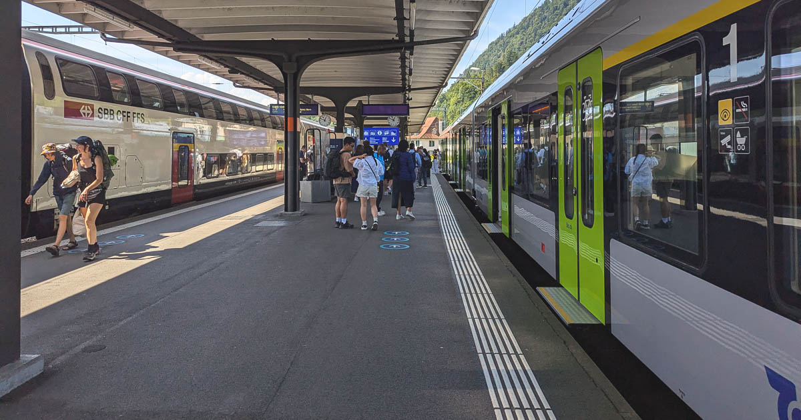
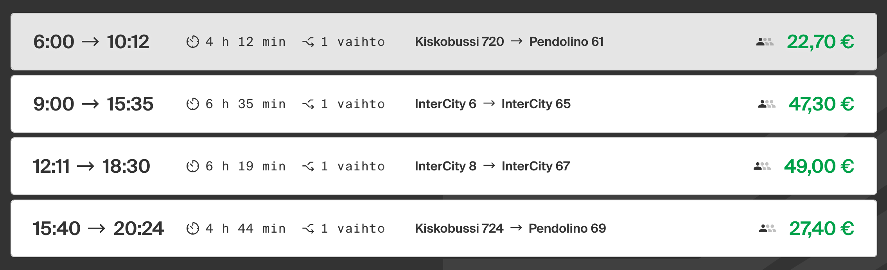

Usein kuulee, että Alankomaat saa ihmiset näkemään pyöräilyn aivan uudessa valossa. Minusta tuntuu, että Sveitsi tekee saman junamatkailulle. Se teki sen ainakin minulle.

<!--more-->



Sveitsissä junalla matkustaminen on mielen räjäyttävä kokemus, koska siellä junaliikenne on mietitty loppuun niin monella eri tasolla. Usein sanotaan, että liikenteessä iso osa ihmisistä haluaa vain päästä A:sta B:een ja he haluavat tehdä sen mahdollisimman helposti, mukavasti ja nopeasti. Sveitsi on pitänyt huolen siitä, että nämä kolme vaatimusta täyttyvät junalla liikkuessa.

Sveitsin juniin astuessa heti ensimmäinen silmiin pistävä huomio on se, että ne ovat pullollaan töitä tekeviä ihmisiä. Käytännössä jokaisessa junassa, jossa matkustin, oli suuri määrä läppärit edessä työskenteleviä tietotyöläisiä puvut päällään. Sveitsissä junat eivät ole jonkinlainen B- tai C-vaihtoehto, johon tartutaan kun rahat eivät parempaan riitä. Se on monessa paikassa tehokkain tapa liikkua paikasta toiseen.

Toisena huomio kiinnittyy todennäköisesti siihen, että Sveitsi on täynnä vuoria. Kun puhe tulee rautateiden rakentamisesta, yleensä jossain kohtaa alkaa sössötys vaikeista olosuhteista. Sveitsi on esimerkki siitä, että junaliikennettä on mahdollista toteuttaa hyvin vaikeisiin olosuhteisiin. Kuten niin kovin usein, kysymys on priorisoinnista. Mutta mitkä asiat lopulta tekevät Sveitsin rautateistä niin mukavat käyttää? Mitä siellä on sellaista, jota muualla ei ole?

### Täsmällisyys

Jos Suomessa ja monessa muussa maassa junaliikenne yhdistetään myöhästymisiin, Sveitsissä näin ei ole. SBB luokittelussa juna on myöhässä, mikäli se saapuu asemalle yli **kolme minuuttia** aikataulusta jäljessä. Tämä määritelmä kertoo paljon siitä, kuinka Sveitsin valtion rautatieyhtiö *SBB* suhtautuu junien täsmällisyyteen. Todellisuus on kuitenkin vielä ihmeellisempää, sillä vuonna 2023 matkustajajunista **92,5 %** saavutti tämän vaatimuksen. Pitkän matkan liikenteessä **90,1 %** oli ajallaan ja seutujunista **93,0 %**. Tämä tekee junista luotettavan ja ennakoitavan tavan matkustaa.



Täsmällisyys ei kuitenkaan rajoitu yksittäisiin juniin. Aikataulussa pysyvät junat mahdollistavat sujuvat vaihtoyhteydet. Sveitsin junien vaihtoyhteyksistä **98,7 %** toteutui onnistuneesti. Harvassa maassa pystyisi suosittelemaan vaihtoyhteydellistä reittiä, mikäli vaihtoaikaa olisi kuusi minuuttia tai reittiin kuuluisi 3-4 vaihtoa. Sveitsissä tämä ei ole ongelma.

Kun saavuimme Sveitsiin, ensimmäinen junamatkamme oli rajakaupunki *Baselista* Genevenjärven rannalla sijaitsevaan *Veveyhin*. Jouduimme kulkemaan kolmella junalla eli tekemään kaksi vaihtoa.

Ensimmäinen vaihto oli Bielissä, jonne juna saapui 17:10. Jatkoyhteys lähti 17:16, eli **kuusi minuuttia** myöhemmin. Seuraava vaihto tapahtui Morgesissa, jonne juna saapui 18:16. Jatkoyhteys lähti 18:25, eli ruhtinaalliset **yhdeksän minuuttia** myöhemmin.

Tämä reitti ei ollut meidän sooloilema uhkarohkea yritys, vaan SBB:n tarjoama valmis vaihtoyhteys. He tietävät, että kuusi minuuttia riittää. Jos minun pitäisi Suomessa vaihtaa junasta toiseen, varaisin siihen vähintään 30 minuuttia. Sveitsissä 30 minuuttia ja sitä pidempiä välejä ei edes luokitella vaihtoyhteydeksi.

### Lähtöjen tiheys
Tehdäänpä pieni ajatusleikki. Kuvittele, että pitäisit autoa tallissa, mutta tallin ovi aukeaisi kerran tunnissa. Oven aukeamisessa olisi kuitenkin hieman hajontaa. Se saattaisi aueta 5 minuuttia etuajassa tai 10 minuuttia myöhässä. Kun se aukeaa, sinulla on 30 sekuntia aikaa rynnätä sisään ja ottaa auto ulos. Jos et satu olemaan sopivaan aikaan paikalla, joudut odottamaan seuraavan tunnin. Kokisitko, että tällaisessa järjestelyssä auto olisi näppärä kulkuväline? Tämä on monessa maassa todellisuutta junien suhteen ja tunnin vuorovälit ovat monin paikoin pelkkää haaveilua.

Sveitsissä tilanne on toinen. Baseliin saavuttua meidän oli hankittava prepaid-liittymät. Emme tienneet mistä niitä sai tai miten kauaa niiden hankkiminen kestää, mutta sillä ei ollut mitään väliä. Tiesimme, että Veveyhin lähtee junia niin usein, ettei meidän tarvitse miettiä asiaa. Parhaimmillaan lähtöjä on neljä tunnissa. Se ei ehkä kuulosta paljolta, mutta on hyvä muistaa, että kysymys on yli 200 kilometrin matkasta, joka tehdään 2-3 vaihdolla. Suoremmilla yhteyksillä lähtöjä on helposti enemmän. Esimerkiksi Bernistä Bieliin lähtöjä olisi viiden aikaan kuusi tunnissa, ja pahimmassa tilanteessa joutuisit odottamaan 12 minuuttia.

Lähtöjen tiheydellä on iso vaikutus sujuvuuteen. Useimmille pienet myöhästymiset tai hieman hitaampi matka-aika ei merkitse niin paljon kuin tiheä vuoroväli. Se mahdollistaa sen, ettei junaan menemistä tarvitse erikseen miettiä. Voit vaan kävellä asemalle ja luottaa siihen, että kohta sieltä lähtee sopiva juna. Tiheä vuoroväli kompensoi hyvin myös myöhästymisiä. Jos missaat vaihtoyhteyden, se ei ole niin vaarallista, koska kohta sieltä tulee toinen.

Sveitsissä monia junia ajetaan puolityhjänä, sillä siellä on panostettu tiheään vuoroväliin. Junia ei ajeta pelkästään aamu- ja iltapäiväruuhkan aikoihin, vaan kaiken aikaa, jotta junat olisivat oikeasti hyvä tapa liikkua paikasta toiseen.

### Vaihtamisen helppous
Junien täsmällisyys on merkittävä osa vaihtoyhteyksien sujuvuutta, mutta ei suinkaan ainut. Sujuvuuteen vaikuttaa myös se, kuinka helppoa junasta toiseen siirtyminen on ja kuinka paljon se vie aikaa. Jos matkustaja saapuu raiteelle yksi ja vaihtoyhteys lähtee 800 metrin kävelymatkan päässä raiteelta 28, kuuden minuutin vaihtoajat ovat täysi mahdottomuus. Sen lisäksi, että tällaiset vaihdot ovat hitaita, ne ovat usein myös äärimmäisen raskaita ja niihin liittyy paljon esteettömyysongelmia.

En tarkalleen ottaen tiedä kuinka Sveitsi on onnistunut asian ratkaisemaan niin hyvin, mutta siellä vaihtoyhteydet lähtevät lähes aina samalta tai vierekkäiseltä laiturilta. Olin lukenut tästä etukäteen, mutta uskoin sen vasta, kun koin sen itse.

Tämä selittää osaltaan myös sen, miksi junavaihtojen onnistumisprosentti on 98,7 %. Vaihdot onnistuvat, koska junasta toiseen siirtyminen vie vain sekunteja. Silloinkin, kun seuraava juna ei lähtenyt samalta laiturilta, se oli aina viereinen. Laiturilta lähti useita portaita maan alle ja vaihtaminen onnistui sitä kautta. Meidän ei koskaan tarvinnut kävellä satoja metrejä eikä kulkea asemarakennusten kautta.

Tämän suunnittelun tulos näkyy myös aikaisemmassa kuvassa. Juna saapuu Bielissä raiteelle 4 ja jatkoyhteys lähtee raiteelta 5. Kun toinen juna saapuu Morgesiin raiteelle 2, seuraava juna lähtee raiteelta 3.

### Matkustusmukavuus
Sveitsin vaunut olivat uskomattoman siistejä ja hiljaisia. Olipa kyse seutujunista tai pitkän matkan junista, niissä oli aina mukavat ja tilavat penkit. Vaikka me emme polkupyöriä junissa kuljettaneetkaan, se näytti olevan mahdollista likipitäen kaikissa junissa tiettyjä erikoisreittejä lukuun ottamatta. Pidemmän matkan junissa oli myös laadukas ravintolavaunu.

Esteettömyyttäkin on mietitty. Oman muistini mukaan jokainen meidän käyttämä juna oli samalla tasolla kuin laituri, joten niihin pääsi helposti myös pyörätuolilla. Portaita ei tarvitse kiivetä. 

Suomessa on totuttu siihen, että junassa on turha haaveilla toimivasta nettiyhteyksistä. Välillä tuntuu, että raiteet suorastaan väistelevät kaikki mastot. Sveitsissä junat tarjoavat langattoman verkon, joka toimii erittäin luotettavasti ja on lisäksi nopea. He ovat onnistuneet siinä, vaikka Sveitsin junat kiemurtelevat vuoristojen välissä ja pitkissä tunneleissa.

Onhan se myös tunnustettava, että ympäröivällä vuoristomaisemalla on iso vaikutus myös matkustusmukavuuteen.

### Rataverkon laajuus
Sveitsi on tunnettu kattavasta rataverkostaan. Maan pienehkö koko auttaa asiassa, mutta kääntöpuolena iso osa sen pinta-alasta on vuoristoa. Jos katsotaan puhtaasti rataverkon pituutta, Suomessa sitä on vajaat 900 km enemmän, mutta matkustuskokemuksesta sitä oon vaikea uskoa, sillä raiteet yhdistävät niin harvoja paikkoja. Monet Suomen rataosuuksista ovat lisäksi pelkästään tavaraliikenteen käytössä ja osa on kokonaan poissa käytössä.

Sveitsissä matkustaessa oli hurjaa huomata, kuinka pienimmistäkin kylistä löytyi rautatieasema. Meidänkin reitille sattui alueita, joissa asuu vain 2000 asukasta ja silti niiltä löytyi useampi asema. Rataverkosto ei siis keskity pelkästään suurimpiin kaupunkeihin.

Lisäksi monet Sveitsin rataosuuksista ovat kaksi- tai useampiraiteisia, mikä mahdollistaa suuremmat liikennemäärät sekä nopeammat yhteydet. Kun suunnittelimme matkan aikana seuraavaa kohdetta, tuntui, että olisimme voineet mennä junalla ihan mihin tahansa.

Suomessa tilanne voisi olla ihan toinen, ellei rautateiden kehittymistä olisi hylätty 1960-luvun autohuumassa. Jotain kertoo se, että 1900-luvun ensimmäisellä puoliskolla Suomeen rataverkko laajeni 2757 km ja jälkimmäisellä puoliskolla vain muutama sata kilometriä. Meillä ei ole kunnollisia junayhteyksiä edes kaikkien suurimpien kaupunkien välillä.

Esimerkiksi Joensuun ja Kuopion välillä ei ole suoraa rataa matkustajaliikenteelle. Lähtöjä on tarjolla vain neljä *vuorokaudessa*. Niistä kaksi kiertää Kouvolan kautta ja matka-aika on noin 6,5 tuntia. Kaksi muuta vaihtoehtoa kiertää Pieksämäen kautta [kiskobussilla](https://www.vr.fi/junat/kiskobussit) ja matka-aika on noin 4,5 tuntia. Ei kovin houkutteleva vaihtoehto, kun autolla voi kulkea saman välin suoraan ja matka-aika on alle kaksi tuntia.

### Helppokäyttöisyys

[SBB:n sovellus](https://www.sbb.ch/en) oli ainakin interrail-matkaajan näkökulmasta todella hyvin suunniteltu. Se on selkeä käyttää ja tarjosi uskomattoman määrän hyödyllistä tietoa tiiviissä paketissa.

Hakutulokset kertovat suoraan, kuinka ruuhkaisia yhteydet ovat ja tarvitseeko pyörälle hankkia erillinen paikkavaraus. Yksittäisen linjan näkymä näyttää kuvakkeilla jokaisen junan kaikki palvelut sekä laiturit, josta ne lähtevät ja jonne ne saapuvat.

Linjan tiedoista pääsee karttanäkymään, joka näyttää paitsi koko reitin tiedot, niin myös yksittäisten vaihtojen sekä asemien tiedot. Asemista on tarjolla selkeät kartat, jotka näyttävät laiturien sijainnit. Myös muut asemien palvelut on usein kuvattu.

SBB:n reittihaussa on hyödyllisiä filttereitä, joiden avulla voit hakea reittejä, joissa pyörän kuljettaminen on vaivatonta tai jotka ovat erityisen esteettömiä. Voit suunnitella reittejä eri välipisteiden kautta tai vältellä yhteyksiä, jotka tiedetään ruuhkaiseksi.

Hienoa on myös se, että palvelun käyttäminen ei vaadi kirjautumista tai tunnuksia. Mobiilisovellus toimi meidän kokemuksen mukaan identtisesti web-version kanssa. Kokonaisuudessaan SBB:n reitti- ja lippusovelluksesta tuli fiilis, että se on aidosti suunniteltu sellaisten ihmisten toimesta, jotka ymmärtävät junalla matkustavien tarpeet.

### Mielikuva junamatkailusta muuttui

Kuten alussa kirjoitin, Sveitsi muutti mielikuvaani junamatkailusta. Tämä ei ollut pelkästään hyvä kokemus. Se lisäsi ymmärrystäni siitä, mitä junat voivat parhaimmillaan tarjota. Tämän kokemuksen myötä en voi enää koskaan nähdä junamatkailua samalla tavalla.

Samalla se muuttaa suhtautumistani eri matkustusmuotojen ympärillä käytävään keskusteluun. En ole tähänkään asti jaksanut kauheasti välittää Suomen junaliikenteen ympärillä pyörivästä keskustelusta, mutta Sveitsin jälkeen se tuntuu vielä enemmän naurettavalta näpertelyltä. Kynnys typerien vasta-argumenttien sietämiselle aleni entisestään.

Tämän kokemuksen myötä voin helposti todeta, että junaliikenne on erittäin kilpailukykyinen vaihtoehto sekä autoilulle että lentämiselle, ja ohittaa ne useilla eri osa-alueilla, kun se on toteutettu hyvin.

Sveitsin junaliikenne ei ole tietenkään täysin ongelmaton eikä maa ole jonkinlainen junamatkaajan utopia, vaikka se interrail-lipulla matkaavalle siltä ehkä tuntuukin.

Yksi isoista ongelmista on se, että junalla matkustaminen on kallista. Sveitsi on muutenkin kallis maa, mutta jopa heidän mittapuulla junalla liikkuminen ei onnistu pikkurahalla. Usein paikasta toiseen siirtyminen on edelleen halvinta henkilöautolla, vaikka liikkuisit yksin[^1]. Tämä on järjetöntä ja ongelma, johon Sveitsin pitäisi tarttua.

On jotenkin ironista, että kun monessa muussa maassa junamatkailu luokitellaan köyhien ja huono-osaisten jutuksi, Sveitsissä tilanne tuntuu olevan juuri päinvastoin. Esimerkiksi kuukausittain laskutettava 2. luokan GA Travelcard maksaa 355 CHF kuukaudessa, eli noin **377 euroa**. Melko suolainen kuukausihinta.

Toisaalta monet yritykset tukevat työntekijöidensä junamatkailua, mikä osaltaan selittää sitä, miksi niin monet matkustavat junalla. Tämä on kuitenkin omiaan vahvistamaan ajatusta siitä, että huono-osaisilla ei ole varaa liikkua junalla.

Interrail-passilla tätä ongelmaa ei juurikaan näe. Pois lukien tietyt erikoisjunat, paikkavarauksia ei tarvitse tehdä, mikä tekee junien käyttämisestä käytännössä ilmaista. Voit siis vaan hypätä junaan ja matkustaa ympäri maata niin paljon kuin haluat passin antamissa rajoissa.

Olen sanonut aikaisemmin, että jokaisen ihmisen pitäisi käydä Alankomaissa ja kokea, miltä hyvä pyöräilyinfra näyttää ja tuntuu. Nyt voin lisätä, että jokaisen ihmisen pitäisi käydä Sveitsissä ja kokea, miltä hyvä rautatieinfra näyttää ja tuntuu. Se on aivan mahtava kokemus!

[^1]: Tämä väite ei välttämättä pidä aina paikkaansa. Kun ihmiset puhuvat matkan hinnasta, he eivät usein laske mukaan auton omistamiseen liittyviä kuluja.