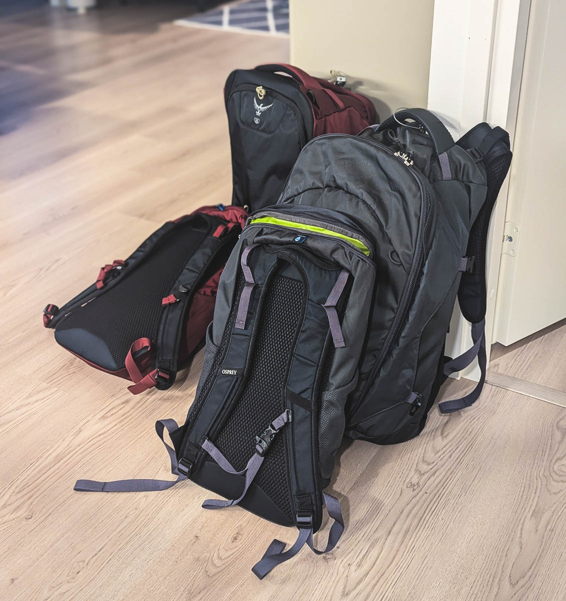

Interrail-matka oli itselleni samalla pieni kokeilu. Halusin testata, miltä pienemmällä matkatavaramäärällä matkustaminen tuntuu. Kokeilu oli menestys!

<!--more-->

### Pienempi rinkka

Ostin alkukesästä uuden kaupunkirinkan. Pitkän arpomisen ja testailun jälkeen päädyin [Osprayn 55 litran Farpoint -rinkkaan]()[^1]. Nyt matkan päätyttyä voin todeta, että rinkka oli aivan mahtava ostos!

Tykästyin Farpointiin, koska se on mukava kantaa, helppo käyttää ja sen mukana tulee pieni päiväreppu, jota voi kuljettaa kehon etupuolella. Päiväreppu tekee mallimerkinnästä hieman hämäävän, sillä rinkka itsessään vetää vain 40 litraa. 15 litraa tilavuudesta tulee päivärepusta.

Rinkassa ei ole lukuisia pikkutaskuja, mutta itse luokittelen tämän hyväksi ominaisuudeksi. Se aukeaa kokonaan matkalaukun tyylisesti, eli ei ole ylä- tai alapuolelta täytettävä. Pelkäsin ennen hankintaa, että tämä olisi ongelma, mutta se ei sitä ollut. Itse asiassa se päätyi olemaan yksi rinkan parhaita puolia. Palaan tähän hieman myöhemmin.

Osprayn järjestelmässä on sellainenkin hienous, että päivärepun voi kiinnittää klipseillä rinkan hihnoihin. Jos tiedossa oli vähän pidempi siirtymä, napsautin päivärepun hihnoihin kiinni, jolloin se pysyi tukevasti mukana ja oli helppo kantaa. Lyhyemmillä siirtymillä pidin päivärepun pelkästään hartioilla, jolloin se oli nopea laskea alas.

Pienen rinkan hienous on siinä, että se pakottaa pakkaamaan kevyesti. Sinun on pakko miettiä, mitä **oikeasti** tarvitset. Sen kanssa on helppo liikkua eri kulkuvälineissä, mutta yhtä lailla pidempiä siirtymiä voi tehdä myös kävellen uuvuttamatta itseään. Pienen kokonsa takia se kulkee esimerkiksi junien matkatavarahyllyllä[^2]. Meidän ei reissun aikana tarvinnut jättää rinkkoja erillisiin matkatavaralokerikkoihin yhtään kertaa. Ne olivat aina silmiemme alla.

Itse pidän rinkkoja ylipäätään matkalaukkuja parempana vaihtoehtoina siksi, että niitä käyttäessä sinulla on molemmat kädet vapaana. Lisäksi niiden kanssa pystyy liikkumaan vaivattomasti myös vaikeammassa maastossa.

Näin matkan jälkeen voin todeta, että jos olisin matkustanut yksin ja täysin omalla tavallani, olisin todennäköisesti pärjännyt paljon pienemmällä rinkalla. Luultavasti 30 litrainen rinkka olisi ollut riittävä, enkä olisi tarvinnut sen kaveriksi edes päiväreppua.

Matkatavaroiden ja rinkan minimointi ei kuitenkaan ole itselleni jonkinlainen itseisarvo. Vaikka pärjäisinkin pienemmällä tavaramäärällä ja rinkalla, joutuisin samalla luopumaan joistakin elämää helpottavista asioista, joita hieman suurempi rinkka tai erillinen päiväreppu mahdollistaa.

Kuinka sitten pakkasin rinkkani ja millaisia tavaroita kannoin mukanani?

### Pakkaaminen

Pidän rinkoista, jotka eivät ole täynnä erilaisia pikkutaskuja. Haluan päättää itse kuinka järjestelen matkatavarani ja siksi yksi suuri tila sopii minulle paljon paremmin.

Aikaisemmin käytin tavaroiden organisointiin minigrip-pusseja. Niillä on joitain hyviä ominaisuuksia. Ensinnäkin ne ovat ilmatiiviitä, joten esimerkiksi vaatteet menevät todella pieneen tilaan kun pussista puristaa ilmat pois. Sen lisäksi ne ovat vesitiiviitä, jolloin ne suojaavat tavaroita kosteudelta tai vuotaneilta nesteiltä. Usein ne ovat myös läpinäkyviä, jolloin on helppo erottaa, mitä missäkin pussissa on.

Minigrip-pusseilla on kuitenkin yksi iso heikkous, jonka takia en ole niitä muutamaan vuoteen käyttänyt: ne ovat todella heikkotekoisia. Useimmilla matkoilla pusseihin on tullut reikiä ja niiden sulkumekanismi on hajonnut. Tämän jälkeen ne eivät tietenkään ole sen enempää ilmatiiviitä kuin vedenpitäviäkään.

Tästä syystä käytän nykyään pakkauskuutioita. Ostin tätä matkaa varten [Osprayn pakkauskuutiosetin](https://varuste.net/p104346/osprey-ultralight-packing-cube-set), jossa on kolme eri kokoista pakkauskuutiota. Sen lisäksi hankin erillisen [kokoon puristuvan pakkauskuution](https://varuste.net/p132261/cocoon-squeezer-compression-packing-cube). Aikaisemmilta reissuilta mukaan lähti pieni kylpyhuonepussukka hygieniatarvikkeille. Mujilta saa [taiteltavia kylpyhuonepusseja](https://www.muji.eu/products/hanging-case-with-small-item-pockets-9764), joita itse käytän johtojen ja muun pikkusälän säilyttämiseen.

Kaikki vaatteeni menivät kolmeen pakkauskuutioon. Kokoon puristuva kuutio on tarkoitettu pyykeille. Olen testannut erilaisia tapoja pakata vaatteet ja todennut, että rullaaminen on se, josta pidän itse eniten. Rullaamalla vaatteet menevät aivan käsittämättömän pieneen tilaan. Kääntöpuolena tietynlaiset vaatteet voivat rypistyä, mutta itselleni tämä ei ole ongelma.

Pakkauskuutioiden myötä rinkan kokonaan avautuva etuläppä pääsi oikeuksiinsa. Ensinnäkin rinkka oli naurettavan helppo pakata, koska kuutiot ja pussukat pystyi asettelemaan rinkkaan sellaisenaan, eikä niitä tarvinnut survoa pienen ja pimeän suuaukon kautta. Toisaalta, kun tarvitsin rinkasta jotain, pystyin nostamaan sen suoraan pois. Minun ei ensiksi tarvinnut tyhjentää puolta rinkkaa, jotta saisin pohjalla olevat asiat käsiini.

Kokonaan avautuvasta etuläpästä huolimatta rinkkaa pystyi silti käyttämään yläosasta pakattavan rinkan tavoin. Pakkasin välillä joitakin asioita, kuten sadetakin, tarkoituksella rinkan yläosaan. Näin saisin sen sieltä nopeasti avaamalla etuläpän vetoketjua vain vähän, eikä koko rinkkaa tarvitsisi levittää auki.

### Matkatavarat
En ymmärrä ihmisiä, jotka pakkaavat kahden viikon matkalle viisi matkalaukullista tavaraa. Oma periaatteeni matkatavaroihin on se, että pakkaan mukaan vain välttämättömimmät ja muutan omaa toimintaani niin, että pärjään niillä. Välttämättömyys on tietenkin hyvin subjektiivista. Itselleni tämä on ollut vuosien prosessi, jonka aikana matkatavaroiden määrä on koko ajan vähentynyt.

Mitä sitten pakkasin mukaan? Interrail 2024 -sivulta löytyy [tarkka matkatavaralista](), mutta avaan joitakin periaatteitani matkatavaroiden valintaan.

Mukanani kulkee yhdet vähän siistimmät vaatteet ja loput ovat tavallisia arkivaatteita. Siistit vaatteet tarkoittavat ihan tavallisia perussiistejä vaatteita, joilla kehtaa mennä esimerkiksi vähän siistimpään ravintolaan. Pukuja tai juhlavaatteita en kuljeta mukana.

Tavalliset vaatteet noudattavat samaa linjaa kuin vaatekaappini: kaiken on käytävä yhteen. Käytännössä minulla on läjä hyvin samansävyisiä ja samannäköisiä vaatteita. En harrasta eri asukokonaisuuksia enkä välitä siitä, että pukeudun tänään samalla tavalla kuin eilen. Pyrin valitsemaan vaatekaappiini sellaisia vaatteita, jotka eivät rypisty helposti. Tästä syystä vaatteiden rullaaminenkaan ei ole iso ongelma.

Lämpimiin maihin matkustaessa pääsee helpolla, koska matkalla pärjää shortseilla ja muutamalla t-paidalla. Interrail-matkalla oli valmistauduttava myös viileämpään vuoristoilmaan sekä syksyn koleuteen. En pakannut mukaan erillisiä syksyvaatteita, vaan luotin kerrospukeutumiseen. Kesävaatteiden lisäksi mukana oli kahdet ohuet pitkät housut sekä huppari. Tämän lisäksi otin mukaan sadetakin. Laittamalla kaikki päälle yhtä aikaa olisin pärjännyt helposti nollakeleissä, joita ei koskaan onneksi tullut. 

Määristä voi päätellä, ettei noilla vaateilla pärjää koko reissua ellei niitä välillä pese. Edellisellä matkalla kahdesta hotellista löytyi pyykinpesukone sekä kuivausrumpu. Meillä oli mukana myös pieni purkki pyykinpesuainetta, joten pystyimme nyrkkipyykkäämään vaatteita hotellin kylpyhuoneessa. Riippumatta siitä montako viikkoa olen reissussa, pärjään oikein hyvin viidellä kappaleella paitoja ja alusvaatteita.

Hygieniatarvikkeissa luotin siihen, että perusasiat löytyvät hotelleista: pyyhkeet, saippuat, shampoot sekä hiustenkuivain. Otin kuitenkin pieniin Mujin pulloihin pienet määrät saippuaa, shampoota ja hoitoainetta. Jos hiustenkuivaajaa ei olisi ollut ja sen seurauksena olisin kokenut, että tiedossa on paha bad hair day, mukana oli buffi jonka olisin voinut vetää päähäni. En siis kantanut mukana hiustenkuivaajaa[^3] ja olin valmis siihen, että joinain päivinä kuljen huivi päässä.

Suurin muutos aikaisempaan oli tekniikan ja kuvauskaluston vähyys. Alun perin suunnittelin lähteväni matkaan ilman kannettavaa, mutta koska vaihdoin kesällä ikivanhan pöytäkoneeni pieneen ja todella kevyeen [MacBook Air M3:een](https://www.apple.com/shop/buy-mac/macbook-air/13-inch-m3), päätin kuitenkin ottaa sen mukaan. Olisinko pärjännyt ilman? Olisin. Minun on kuitenkin tunnustettava, että läppäri tekee nykyään monesta asiasta todella paljon helpompaa ja mahdollistaa vaivattoman valokuvien varmuuskopioinnin. Lisäksi käytin junamatkat tarinan kirjoittamiseen, joten siitä oli sekin hyöty.

Kuvauskalustoa on joskus ollut mukana niin paljon, että niille on ollut oma reppu. Kännyköiden hyvien kameroiden myötä minun on vaikea perustella erillisen kameran roudaamista pelkkien lomaräpsyjen takia. Järjestelmäkamera oli mukana puhtaasti oman harrastuksen takia ja olisin ihan hyvin voinut jättää sen myös kotiin. Minulla on kameraan useampi linssi ja ennen matkaa suunnittelin ottavani mukaan erittäin pienen kiinteäpolttovälisen linssin. Kun tajusin, että olemme menossa Sveitsin vuorille, päätin vaihtaa linssin suurempaan ja painavampaan zoom-linssiin - päätös, jota en katunut hetkeäkään.

Mukana kulki myös irtokovalevy. Sen oli tarkoitus olla varmuuskopioita varten, mutta se pysyi koko matkan rinkassa. Kaikki reissun valokuvat mahtuivat muistikortille ja siirtelin ne iltaisin läppärin levylle. Minulla oli siis kahdet kopiot ja se riitti.

Merkkasin [matkatavaralistaan]() tavarat, joita en käyttänyt matkan aikana. Niistä suurimmat olivat juoksutarvikkeet sekä mikrokuitupyyhe. Luonnollisesti juoksutarvikkeet eivät olleet mukana pakon takia vaan siksi, että halusin päästä juoksemaan Sveitsin upeissa vuoristomaisemissa. Ne kuitenkin jäivät käyttämättä sairastumisen takia. Olen kuljettanut omaa pyyhettä aikaisemmilla sukellusreissuilla, jotta en sotke majapaikan pyyhkeitä suolaveteen. Mukana kulkenut mikrokuitupyyhe oli kevyt ja vei vähän tilaa, mutta se oli silti täysin turha tälle reissulle.

### Kevyt on vaivaton
Rinkka, päiväreppu ja kaikki matkatavarat painoivat yhteensä **yhdeksän** kiloa. Näin kevyellä kantamuksella oli ilo matkustaa. Säälin välillä ihmisiä, jotka raahasivat raskaita matkalaukkujaan hikikarpalot valuen pitkin junien kapeita käytäviä, mukulakivikatuja, hietikoita ja portaita.

Ospray Farpointin erillinen päiväreppu on aivan timanttinen keksintö. Kuljetin repussa tavaroita, jotka olivat arvokkaampia tai joita saattaisin tarvita junamatkan aikana: passi, lompakko, läppäri, kännykkä, kamera sekä mahdolliset matkaeväät. Kaikki muu oli pakattu rinkkaan, jonka pystyin heittämään oman istuimen yläpuolelle matkatavarahyllylle. Kun poistuimme ravintolavaunuun, rinkan uskalsi jättää hyllylle, sillä siellä ei ollut mitään erityisen arvokasta tai tärkeää. Hotelleissa rinkka pysyi aina hotellilla. Kaikki päiväretket teimme pienen päivärepun kanssa.

Jotkut ihmiset ajattelevat, että matka on helpointa silloin, kun kaikki tarpeellinen on mukana ja jokaiseen asiaan on valmistauduttu. Itse ajattelen, että matka on helpointa silloin, kun mukana on mahdollisimman vähän kannettavaa. Jos tarkoitus on vain löhöillä kolme viikkoa altaan reunalla, silloin sillä ei liene väliä. Mutta jos kyse on aktiivisesta lomasta, loman nautinto syntyy liikkumisesta ja silloin sillä on väliä, kuinka suurta kuormaa kannat selässäsi.

Nyt kun sain matkustaa kolme viikkoa alle kymmenen kilon tavaramäärällä, minun on vaikea kuvitella palaavani takaisin yhtään suurempaan. Suosittelen lämpimästi sekä Ospreyn rinkkaa että kevyesti matkustamista!

[^1]: Saman rinkan naisten malli on nimeltään Fairview.
[^2]: Farpoint 55:sta markkinoidaan lentolaukkuna, joten sen pitäisi kulkea lentokoneissa käsimatkatavarana.
[^3]: Puolisoni sen sijaan kantoi, koska ei halunnut lähteä matkaan ilman. Luonnollisesti hyödynsin hiustenkuivaajaa itsekin silloin kun hotelli ei sitä tarjonnut.
