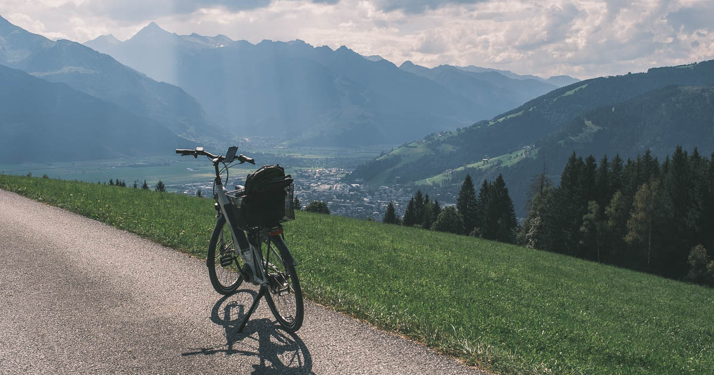

Käytin joskus [Lonely Planetin](https://www.lonelyplanet.com/) matkaoppaita seikkailujen suunnitteluun. Huomasin kuitenkin, että nojaamalla turhan paljon kirjoihin, seikkailu ei enää tuntunutkaan omalta. Tuore interrail-matka sai pohtimaan, että miksi annamme toisen mielipiteille ja suosituksille niin paljon painoarvoa?

<!--more-->



### Matkaoppaat ohjaavat turisteja ja palveluiden menestystä

Kun tein ensimmäisiä matkoja, iso osa suunnitelmista pohjautui Lonely Planetin matkaoppaisiin. Reissun päällä törmäsin useita kertoja muihin matkaajiin, joilla oli tismalleen sama reitti, tai ainakin samoja kohteita suunnitelmissaan. Kun vietin aikaani majapaikan hengailutilassa, tajusin, että kaikki siellä selailivat Lonely Planetin matkaopasta. Sitä samaa, jota minäkin kannoin rinkassani. Seurauksena oli se, että vaikka olin toisella puolen maapalloa, törmäsin samoihin naamoihin uudelleen ja uudelleen.

En ole erityinen getaway-paikkojen metsästäjä, mutta minulle löytämisen riemu, yllätykset ja epäonnistumiset ovat tärkeitä. Tykkään eksyä turvallisesti. Haluan, että seikkailuni on minun näköinen ja tuntuu omalta. Seuraamalla orjallisesti yksittäistä matkaopasta, nämä elementit jäävät helposti puuttumaan. Sitä päätyy paikkoihin, jota kirja suosittelee, ja välttelee kohteita, joita kirja vähättelee. Kansien välistä puuttuvia paikkoja ei voi edes harkita, sillä niistä ei ole tietoinen.

Vuosia sitten majapaikalle ja ravintolalle oli pieni lottovoitto saada maininta matkaoppaaseen, sillä se saattoi moninkertaistaa kävijämäärät. Ikävä kyllä nämä matkaajat saattoivat olla pois muilta majapaikoilta, jotka olivat ihan yhtä hyviä, mutta jotka eivät sattuneet oppaan kirjoittajan reitille. Matkaoppailla oli uskomaton voima ohjata matkustajavirtoja.

Vaikka Lonely Planetin matkaoppaat taitavat edelleen olla verrattain suosittuja, niiden rinnalle on tullut palveluita, joilla on vieläkin voimakkaampi vaikutus. Arvostelu- ja varauspalvelut, sosiaalisen median ryhmät, sekä erilaiset foorumit tarjoavat huiman määrän suosituksia siihen, mihin kannattaa mennä, mitä kannattaa tehdä, missä kannattaa syödä ja millä kannattaa matkustaa.

### Muiden mielipiteille annetaan suuri painoarvo

Nykyään ei ole mitenkään epätavallista, että edes kotimassa mihinkään uuteen ravintolaan ei mennä katsomatta nettiarvosteluja. Löytämisen ja kokeilun riemu on unohdettu ja tilalla on pelko epäonnistumisesta tai huonosta kokemuksesta.

Kun mietimme puolisoni kanssa interrail-matkan aikana seuraavia askelmerkkejä, turvallisuushakuisena hän turvautui toistuvasti arvosteluihin. Hän oli myös innokas kyselemään samoissa paikoissa käyneiltä tuttavilta suosituksia. Se sai minut miettimään sitä, kuinka paljon annamme valtaa muiden, usein täysin tuntemattomien ihmisten mielipiteille. Miksi me pelkäämme niin paljon niin sanottuja huonoja kokemuksia?

En ole itsekään tälle immuuni. Kun katselin hotelleja, hylkäsin toistuvasti kelvollisia arvosanoja saaneita majapaikkoja, koska joukossa oli yksittäisiä huonoja arvosteluita, jotka syystä tai toisesta puhuttelivat minua. Pari huonoa arvostelua kykeni mitätöimään sata hyvää. Huomasin myös toistuvasti tarkastavani ne muutamat yhden tähden arvostelut, jotta tietäisin, missä majapaikka oli epäonnistunut.

Typerää. Vaikka muiden arvosteluja lukemalla voikin välttää ilmiselvät huonot kokemukset, minusta tuntuu, että meistä on jossain määrin tullut muiden mielipiteiden orjia.

### Pienemmät kärsivät, kun suosituista tulee vieläkin suositumpia

Mielipiteitä ja arvosteluja tarjoavat palvelut ovat kuin matkaoppaat steroideissa. Kun mukaan lisätään suosittelualgoritmit, tilanne pahenee entisestään. Suosituista paikoista tulee entistä suosituimpia ja heikommin menestyvät katoavat unholaan.

Yritysten on taisteltava saadakseen näkyvyyttä. Niiden on taisteltava sekä asiakkaiden, että algoritmien suosiosta. Tämä lienee yksi syy sille, miksi niin moni paikka anelee arvosteluita asiakkailtaan. Etenkin, jos yritys on uusi. Pienillä paikoilla, joissa käy vain muutama asiakas silloin tällöin, ei ole mitään mahdollisuutta pärjätä tällaisessa ympäristössä. Se on sääli.

Arvosteluihin nojaaminen ja niiden kerjääminen synnyttää myös toisen ongelman: vaihtoehtojen vähenemisen. 20 vuotta sitten oli helppo löytää majapaikkoja, jotka olivat hieman nuhjuisia. Niissä oli silti kaikki, mitä tarvitsin, ja lisäksi ne olivat todella edullisia. Nykyään tällaisia vaihtoehtoja näkee paljon vähemmän.

Nuhjuiset paikat tuppaavat keräämään heikompia arvosteluja. Liian monet matkaajat arvioivat paikkoja omiin odotuksiin nojaten, eikä vaatimattomammat paikat voi näitä odotuksia lunastaa. Kaikki majapaikat arvostellaan samalla 1-10 asteikolla riippumatta siitä, onko kyseessä kymmenen euron bungalow vai 800 euron huippuhotelli. Siksi erityisesti majapaikkojen on siksi panostettava säihkyvään siisteyteen, laajaan varustelutasoon sekä timanttiseen palveluun. Se taas nostaa hintoja. Halvat, nuhjuiset vaihtoehdot kuihtuvat pois.

Huonoin tilanne on paikoilla, jotka eivät ole lainkaan Booking.comin, TripAdvisorin ja Hostelworldin kaltaisten palveluiden listoilla. Vaikka niillä olisi omat kotisivut, niiden löytäminen on lähes mahdotonta, sillä myös hakukoneet priorisoivat suuria palveluita, sekä tunnettuja hotelliketjuja.

### Joitakin ratkaisuja

Mistä ja miten näitä piilotettuja helmiä ja nuhjuisia timantteja sitten löytää? Itse olen löytänyt kiinnostavia kohteita, majapaikkoja sekä ravintoloita juttelemalla paikallisten kanssa. Toki silloinkin nojaa muiden mielipiteisiin, mutta usein heillä on sellaista paikallistuntemusta, jota Internetistä on vaikea löytää. He saattavat tietää myös paikkoja, jotka on suunnattu enemmän paikallisille kuin turisteille. Niissä ei välttämättä ole tyypillistä turisti-infrastruktuuria, mutta saatat saada tilalle jotain vielä parempaa.

Sitten on tietenkin se vaihtoehto, että lähdet vain matkaan ja katsot, että mitä tulee vastaan. Erityisesti ravintoloiden kohdalla tämä hyvä vaihtoehto, mutta paikasta riippuen se toimii hienosti myös majapaikkoja etsiessä. Itse olen harrastanut myös sitä, että vuokraan polkupyörän tai mopon, ja lähden ajelemaan johonkin suuntaan tietämättä, mitä siellä on vastassa. Vaikka päätyisin jonnekin, missä on miljoona muutakin ihmistä, se tuntuu silti omalta löydöltä ja yllätykseltä.

Tein itselleni pienen sovelluksen, jolla voin hakea [OpenStreetMapsista](https://www.openstreetmap.org) erilaisia paikkoja ravintoloista ja hotelleista lähtien aina lääkäreihin, pyörävuokraamoihin ja viinitarhoihin. Sen hyvä puoli on siinä, että se näyttää minulle mitä alueella on, mutta ei listaa niitä missään järjestyksessä. Useimmiten OSM-data sisältää myös kohteen yhteystiedot sekä mahdolliset kotisivut, joten pystyn olemaan yhteydessä heihin ilman, että toimintaani ohjaa muiden arvostelut tai algoritmit.

Tärkeintä on kuitenkin se, että lakkaat toteuttamasta muiden seikkailua. Unohda muiden mielipiteet. Sinun ei tarvitse aina tarkastaa netistä arvosanoja ja muiden kommentteja. Jos et tiedä mitä tekisit, älä kysele muilta vaan mene ulos ja katso mitä on tarjolla. Kyllä, vastaan saattaa välillä tulla huonojakin kokemuksia, mutta mieleen saattaa jäädä silti hieno tarina ja muisto, jota kertoo uudelleen vielä vuosienkin päästä.

Muiden ihmisten ja suosittujen kohteiden välttäminen ei ole tietenkään mikään itseisarvo. Jos haluat ottaa rennosti, päästä helpolla ja varmistaa onnistumisen, silloin  muiden kuunteleminen on järkevää. Monet kohteet ovat suosittuja siksi, että ne ovat oikeasti hyviä! Mutta jos kaipaat seikkailuja, yllätyksiä ja löytämisen riemua, muiden mielipiteille ei kannata antaa niin suurta painoarvoa. Toteuta omaa matkaasi.