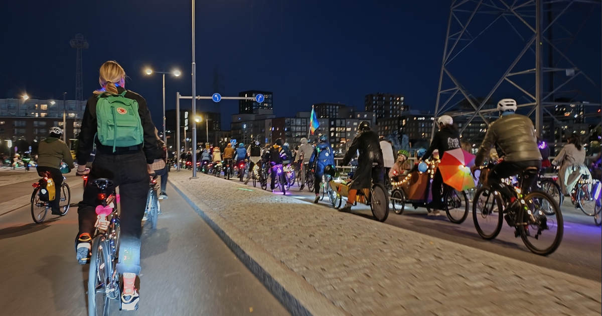
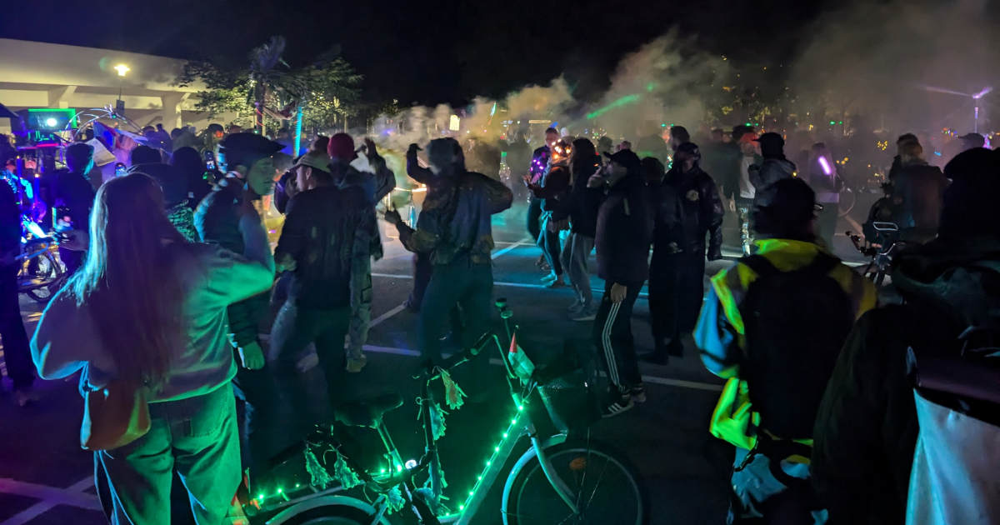

Lauantaina Helsingissä järjestettiin Freaky Bike Parade. Olin odottanut värikästä pyöräkulkuetta innolla, eikä se pettänyt tänäkään vuonna.

<!--more-->

Freaky Bike Parade on paraati, mutta siinä on myös ripaus mielenilmausta. Tapahtuman kuvauksesta:

> "Kaupungin muuttuessa vapaita kulttuuritiloja ja joutomaata katoaa muuhun käyttöön, ja samalla keskustan sisäänajoa helpotetaan suurilla liikennemuutoksilla. Pyörät, samoin kuin omaehtoinen kaupunkikulttuuri kuuluu kaupunkiin, isoille väylille, näkyville ja kuuluville. Lähdetään yhdessä suurella massalla äänekkäälle matkalle kaupungin kaduille - sinne, minne kulttuuri kuuluu, sinne, missä pyörien kuuluu kulkea ilman pelkoa autoilijoiden kiireestä."

Tapahtuman keskiössä on värikäs polkupyörien letka, räyhäkkä konemusiikki sekä rakennuksiin ja puihin projisoidut visuaalit. Ihmisiä kannustettiin koristelemaan polkupyöränsä valoilla ja se näkyi. Osallistujien tarkkaa lukumäärää on vaikea arvioida, mutta puhutaan sadoista pyöräilijöistä, ellei sitten jopa yli tuhannesta. Vilkkuva massa otti kaupunkitilaa autoilun ylivallalta, ja siirsi sen hetkeksi aikaa takaisin ihmisille ja hauskanpitoon.

Osallistuin paraatiin puolisoni kanssa, mutta mukana meillä oli vain yksi pyörä, sillä hän matkusti koko kulkueen ajan kuormapyörän boksissa makuupussiin kääriytyneenä. Hän oli myös käynyt ostamassa reilut kahdeksan metriä pitkän talvivalonauhan, jonka kieputimme etulaatikon ympärille. Minä puolestani etsin käsiini kännykällä ohjattavan, erilaisia efektejä välkyttelevän ledinauhan, jonka virittelimme ohjaustankoon.



Kulkueen kokoontuminen alkoi kello 18:00, mutta saavuin itse paikalle vasta seitsemän tienoilla. Paikalla oli jo silloin jonkin verran ihmisiä, mutta suurin osa saapui vasta hieman ennen kahdeksaa, jolloin kulkueen oli määrä lähteä liikkeelle. Poliisikin saapui alueelle hyvissä ajoin ja arvostan sitä, että he käyttivät liikenteen ohjaamiseen moottoripyöriä sekä mönkijöitä. Ja olihan siellä toki jokunen maijakin.

Lähtöpaikalla Suvilahdessa seinään heijastettiin paraatin pelisäännöt: tilaa oli annettava muille osallistujille, pyöräiltävä varovasti, pyörien oli oltava valaistuja, hälytysajoneuvoille annettava tietä, roskata ei saanut, kelloa sai soittaa ja tietenkin kaikkien piti olla iloisia ja kunnioittavia muita kohtaan. Kulkue saatiin hiljalleen liikkeelle ajamalla ympyrää lähtöpaikalla, ja kun kaikki olivat vauhdissa, lähdettiin poliisien saattamana matkaan.

Paraati konkretisoi upealla tavalla yhden pyörien hienoista piirteistä: ne vievät uskomattoman vähän tilaa. Oli mielenkiintoista kuvitella, millainen kaaos siitä olisi syntynyt, jos jokainen osallistuja olisikin ollut liikkeellä pyörien sijaan autolla. Nyt sadat ihmiset kykenivät liikkumaan törmäilemättä jopa yksittäisillä autokaistoilla. Kun kaistoja oli useampi, meno oli suorastaan väljää! Kaikesta huolimatta paraati pakkautui melko tiiviiksi etenkin reitin alkupuoliskolla, jossa jouduimme kulkemaan paikoin tietöiden kaventamia katuja. Se ei hauskanpitoa haitannut.

Tämä oli itselleni toinen kerta kun osallistuin Freaky Bike Paradeen ja oli huippua nähdä, että ohikulkijoiden reaktiot kulkueeseen olivat tälläkin kertaa käytännössä yksinomaan positiivisia. Ihmiset hymyilivät, vilkuttelivat, näyttivät peukkua ja ottivat valokuvia sekä kuvasivat videota. Monet alueiden asukkaat tulivat katselemaan valokulkuetta ikkunoista. Osa risteyksissä odottelevista autoilijoistakin hyppäsi pihalle kuvaamaan värikästä pyöräletkaa.

Paraatin reittiin kuului kaksi pysähdystä. Ensimmäinen oli Verkatehtaanpuistossa Annalassa ja toinen velodromin viereisellä parkkipaikalla Itä-Pasilassa. Pysähdysten aikana kaikki äänentoistosta, savuista ja visuaaleista vastaavat kuormapyörät ajettiin yhteen läjään ja niiden eteen syntyi tanssilattia. DJ:t soittivat teknoa ja joukossa oli myös jonglöörejä, jotka temppuilivat valaistuilla palloilla, kepeillä ja muilla kilkkeillä. Ennen kuin paraati jatkoi matkaansa, muistutettiin roskien keräämisestä ja sitten mentiin.

Reitin toisella osuudella näin kulkueen ainoan ikävän tapahtuman, jossa olisi saattanut käydä todella huonosti. Kaikissa risteyksissä liikennettä ei ohjannut poliisi, vaan tapahtuman vapaaehtoiset. He ajoivat pyöränsä ajoratojen eteen ja avasivat näin tilan kulkueelle. Yhden pakettiauton kuljettaja nähtävästi ajatteli, että hän on maailman tärkein ihminen, eikä hänen tarvitse tällaisista välittää. Kuljettaja päätti lähteä ohittamaan kulkuetta jalkakäytävää pitkin. Ajotavasta pystyi näkemään, että rattiraivo oli vahvana läsnä, sillä vauhtia oli aivan käsittämättömän paljon - etenkin kun ottaa huomioon, että ympärillä oli satoja ihmisiä, ja hän kulki pimeää jalkakäytävää pitkin.

Osa ihmisistä alkoi huudella varoituksia jalkakäytävällä kulkeville ihmisille ja hetken aikaa ehdin ajatella, että kohta rysähtää. Kuljettajan epäonneksi hän ei tuntunut näkevän, että kulkuetta ohjasi poliisi. Yksi mönkijäpoliiseista huomasikin autoilukulttuurin sankarin, kurvasi kulkueen läpi ja pysäytti autoilijan. Paraati antoi poliisille välittömästi suuret aplodit. Toivottavasti itsekäs kusipää sai muiden ihmisten vaarantamisesta sakot.

Velodromilla tehdyn toisen pysähdyksen jälkeen kello alkoi olla sen verran paljon, että me lähdimme ajelemaan takaisin kotiin.  Viimeinen etappi ja jälkibileet jäivät meiltä siis näkemättä. Odotan jo nyt ensi vuotta! Silloin täytyy panostaa pyörän koristeluun vielä nykyistä enemmän. Tällaisia tapahtumia olisi hauska nähdä paljon useammin, eikä haittaisi, että niitä järjestettäisiin myös muissa kaupungeissa.

Tapahtumaa ei rummuteta julkisesti ihan kauheasti, mutta se järjestetään suunnilleen samaan aikaan joka vuosi. Mikäli haluat osallistua ensi vuoden paraatiin, suosittelen seuraamaan tapahtuman [Facebook-sivuja](https://www.facebook.com/people/Freaky-Bike-Parade/61564230090643/) sekä [Instagram-tiliä](https://www.instagram.com/freakybikeparade/).
