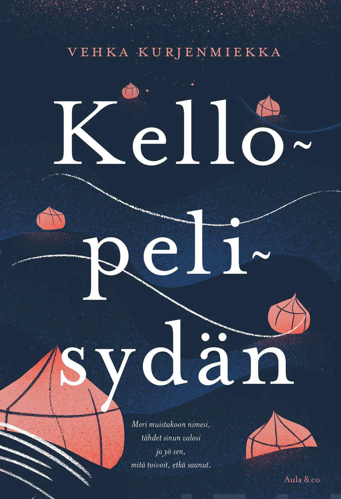

Luin eilen loppuun Vehka Kurjenmiekan kirjoittaman Kellopelisydämen. Kutkuttavasta takakansitekstistä huolimatta minun on myönnettävä, että kirja ei ollut ihan minua varten.

<!--more-->

### Tarina
Tapahtumat sijoittuvat kuvitteelliseen Merenkehrän maailmaan, paikkaan nimeltä Karunka. Karunkassa elää joukko salamurhaajia, joiden rinnassa tikittää mekaaninen kellopelisydän. Kun murhaaja kuolee, sydän siirtyy uudelle henkilölle, josta tulee uusi salamurhaaja. Salamurhaajat eivät ole kuitenkaan pahantahtoisia ihmisiä, ei ainakaan suurin osa. He murhaavat, koska sydän vaatii sitä. Heidän on murhattava kerran vuodessa, tai sydän lakkaa tikittämästä ja he kuolevat itse.

Murhaajat asuvat suuressa kellotornissa, jonka huipulla jyskyttää mekaaninen kello, jonka mekaniikka muistuttaa sydäntä. Heidän elämäänsä kuuluu nimihautajaiseksi kutsuttu rituaali. Kun henkilö on saanut uuden sydämen, hänen on valittava itselleen uusi nimi ja kerrottava se kellolle. Rituaalin myötä tuore murhaaja unohtaa isolta osin vanhan minänsä ja elämänsä. Rituaalin myötä hänestä tulee uusi ihminen, oikea murhaaja.

Karunkan Akatemia on koulu, jossa opetellaan kutomaan harhoja, käskyttämään taikuutta ja käyttämään rohtoja. Koulun rauhaa on vuosikausien ajan rikkonut oppilaiden satunnaiset kuolemat. Vaikka ihmiset tietävät, että kuolemien takana ovat mystiset salamurhaajat, heidän löytämistään pidetään käytännössä mahdottomana heidän käyttämän taikuuden takia. Mikäli kuolema näyttää salamurhaajan tekosilta, sitä ei juurikaan tutkita. Mikäli työntää nokkansa liian syvälle salamurhaajien maailmaan, saattaa itse päätyä seuraavaksi uhriksi.

Tilanne muuttuu, kun tuore kellopelisydämen haltija **Adele** päätyy murhaamaan ensimmäisen uhrinsa, joka sattuu olemaan yksi Akatemian oppilaista, **Seleste**. Selesten lähimmät ystävät eivät halua jättää kuolemaa selvittämättä. Samaan aikaan Adele kipuilee uuden elämänsä kanssa, sillä hän pitää murhaamista vääränä, eikä haluaisi oikeasti tehdä sitä. Mutta hänen on pakko, jos hän haluaa elää.

### Taitavaa sanojen kudontaa
Kurjenmiekka on osannut rakentaa upean fantasiamaailman ja käyttää sen kuvailuun suomenkieltä uskomattoman taitavasti. Kielellä leikittely tuo itselleni mieleen aikaisemmin tänä vuonna lukemani Emmi Itärannan [Teemestarin kirjan]().

Kellopelisydämessä on mukava tunnelma. Kurinkasta ja sen asukkaiden elämästä tuli itselleni mieleen Taru sormusten herrasta -maailman hobitit. Heidän elämänsä pyörii luonnon ja neljän vuodenajan ympärillä. Heillä on paljon kauniita rituaaleja, eikä maailmaa ympäröi teknologiset härvelit. Siinä on jotain todella rauhoittavaa ja maailma vie lukijan kauaksi todellisesta maailmasta. Ei kuitenkaan niin kauaksi, että se tuntuisi täysin vieraalta.

Monella tapaa Karunka, sitä ympäröivä meri ja kaukana merellä sijaitsevat mystiset paikat toimivat yhtenä tarinan päähenkilöistä. Maailma on yksi suurimmista voimista, joka sanelee, mitä henkilöt tekevät ja voivat tehdä. Kun luin kirjaa, mietin toistuvasti, että se olisi loistava lähtökohta kiinnostavalle roolipelille.

Kirjan tarina - niiltä osin kuin sitä ymmärsin - sisältää monia jännittäviä elementtejä. Murhaajien ja Akatemian oppilaiden välinen mysteeri itsessään on kiinnostava, mutta pidin kaikista eniten siitä maailmasta, jossa murhaajat elävät.

Suurin osa heistä ei lopulta halua murhata ketään, mutta heidän on opeteltava siihen. Tämä synnyttää mielenkiintoisia sisäisiä konflikteja. Se luo myös haasteita ihmissuhteille, sillä murhaajana toimiminen vaatii tietynlaista kylmäsydämisyyttä, johon syvät parisuhteet istuvat huonosti.

Ikävä kyllä kirja toteuttaa kaksi asiaa, jotka ovat minun yksinkertaisille aivoille liian vaikeita käsitellä.

### Aikahaaste
Ensimmäinen on ajasta toiseen pomppiminen. Kun luku alkaa päivämäärällä, minä annan sille aina suuren arvon. Oletan, että päivämäärä ja ajan kuluminen ovat tarinan kannalta todella tärkeää.

Ongelma on siinä, että kirjan lukeminen muuttuu päivämäärien muisteluksi. Kun uusi luku alkaa, minun on mietittävä, että kuinka paljon aikaa on kulunut edellisestä kappaleesta. Mikä ylipäätään oli edellisen kappaleen päivämäärä? Minun on todella vaikea pitää mielessä tällaisia asioita, jos haluan aidosti uppoutua tarinaan. En osaa tehdä molempia yhtä aikaa.

Kellopelisydän vie ongelman toiselle tasolle, sillä se on kehittänyt kokonaan oman konseptin ajan laskemiselle. Kun luku alkaa, otsikon alla saattaa lukea "18. hehkukuuta, Lauhasateiden vuosi". Ymmärrän, että kirjailija on halunnut rakentaa päivämäärillä fantasiamaailmaa, mutta minut se sotki ihan täysin. Kun kuukausi vaihtuu, en tiennyt, että liikuttiinko ajassa eteenpäin vai taaksepäin.

Se on kuitenkin sanottava, että Kurjenmiekka on keksinyt kuukausille aivan mahtavia nimiä. Ne tuntuivat monella tapaa paremmilta kuin oikeat kuukausien nimet.

### Henkilöhaaste
Toinen - ja suurempi - ongelma on henkilöhahmojen määrä. Niitä on aivan hillitön määrä. Minulla meni todella pitkään tajuta, että ketkä henkilöistä ovat murhaajia ja ketkä Akatemian oppilaita. Otti myös aikansa tajuta, että ketkä ovat päähahmoja ja ketkä pelkkiä sivuhahmoja.

Henkilöhahmot ovat mielestäni kirjan suurin epäonnistuminen, sillä ne eivät ole tarpeeksi erilaisia. Kaikki on kääritty niin suureen mysteeriin, ettei henkilöiden taustoista kerrota oikein mitään. Kun henkilöitä ei tunne eikä heidän persoonallisuutensa erotu muusta massasta, heihin ja heidän päätöksiin on vaikea samaistua.

Suurta hahmojen määrää vaikeuttaa se, että kirja kerrotaan ensimmäisessä persoonassa. Sinun on siis lukijana osattava hypätä joka luvussa ei hahmon saappaisiin ja ajatusmaailmaan. Sinun on myös muistettava, mitä he tietävät ja mitä he eivät tiedä. Tämä toimii, jos hahmoja olisi pari, mutta näin ei ole. Pelkästään 15 ensimmäisen luvun aikana tarinaa katsotaan viiden eri hahmon silmin. Kirjan loppupuolella on myös lukuja, jossa näkökulma muuttuu useita kertoja yhden luvun aikana.

Sen lisäksi, että monet hahmot jäävät turhan ohuiksi, heitä on vaikea erottaa toisistaan. Kurjenmiekka on tehnyt hahmoista lähes sukupuolettomia. Jokaisen ulkonäköä kuvaillaan vähän ja itselleni jäi olo, että kaikki muistuttavat Sormusten herran Legolasta, tai jonkinlaista Vogue-lehden androgyynistä mallia. Tätä korosti se, että iso osa hahmojen nimistä ovat ainakin suomalaisittain sukupuolettomia: Eeben, Seleste, Helios, Marras, Tiima, Haave, Viita, Sääntö, Lohtu ja niin edelleen.

Jotta asia ei olisi näinkään yksinkertainen, kirjan ajatus nimihautajaisista sotkee tilannetta lisää. Sen myötä osalla hahmoista on kaksi eri nimeä. Kirjailija myös käyttää näitä eri nimiä sen mukaan, missä kohtaa tarinassa ollaan tai kenen näkökulmasta tarinaa kerrotaan.

Parhaiten mieleeni jäivät **Adele** ja **Marras**. Heidän kanssaan vietetään eniten aikaa ja ehkä juuri siksi he ovat kirjan parhaiten kirjoitetut henkilöt. En tiedä voiko sanoa, että he ovat kirjan päähenkilöitä, mutta itse ainakin pidin heitä sellaisina. Myös heidän välinen suhde ja sen haasteet jäivät mieleen ja tuntuivat eräänlaiselta liimalta, joka piti tarinaa koossa.

### Harmillinen pettymys
Kellopelisydän on Kurjenmiekan 12 vuoden työn tulos ja se näkyy. Kirjailija on selvästi laittanut sydämensä peliin tätä kirjoittaessaan. Tällainen maailma ja tarina ei synny hetkessä.

Ikävä kyllä kirjan monimutkaisuus vei minulta lukemisen nautinnon pois. Kun en pysynyt henkilöiden perässä, en ymmärtänyt myöskään tarinaa kunnolla. Kellopelisydän on kirja, joka aukeaisi luultavasti paljon paremmin toisella lukukerralla. Tästä syystä en halua kommentoida tarinaa ihan kauheasti.

Sen kuitenkin sanon, että se oli mielestäni liian pitkä. Varsinainen tarina tuntuu pääsevän kunnolla vauhtiin vasta puolen välin tienoilla. Alussa aikaa käytetään tarpeettoman paljon maailman rakenteluun, jolla ei tuntunut olevan lopulta mitään merkitystä tarinan kannalta.

Tästä huolimatta en ollut erityisen ilahtunut tavasta, jolla kirja päättyi. Se ei tuntunut tyydyttävältä. Se vaikutti kiirehdityltä ja jäävän kesken. Tuntui, niin kuin olisin lukenut kertojan ääntä, joka selitti, miten asiat tapahtuvat. Ehkä voisi siis ajatella, että kirja ei lopulta ollutkaan liian pitkä, mutta alkupuoliskon sivut olisi voinut siirtää loppuun, jotta siitä olisi saanut tyydyttävämmän.

Kirjassa oli niin paljon hyvää, että halusin pitää siitä. Kellopelisydämien mysteeri ja kahden Karunkan väen konflikti oli oikeasti jotain, mitä odotin innolla. Harmillisesti kirja päätyi kuitenkin olemaan pettymys. Suurin syy sille on luultavasti se, ettei se ollut vaan minua varten. Se oli minun yksinkertaisille aivoille aivan liian monimutkainen, enkä ole erityinen fantasian ystävä.

Mikäli pidät fantasiamaailmoista, taikuudesta, mysteereistä ja hieman haastavammasta luettavasta, voin suositella Kellopelisydäntä. Jos kaipaat jotain maanläheisempää ja helpompaa, kannattaa ehkä valita joku toinen kirja.

