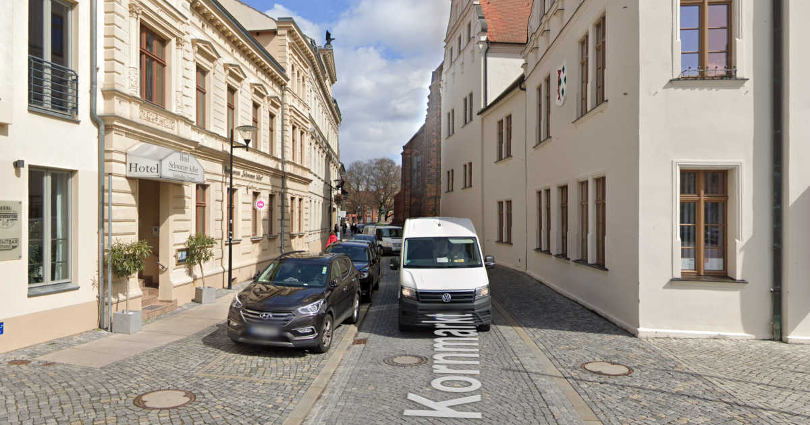
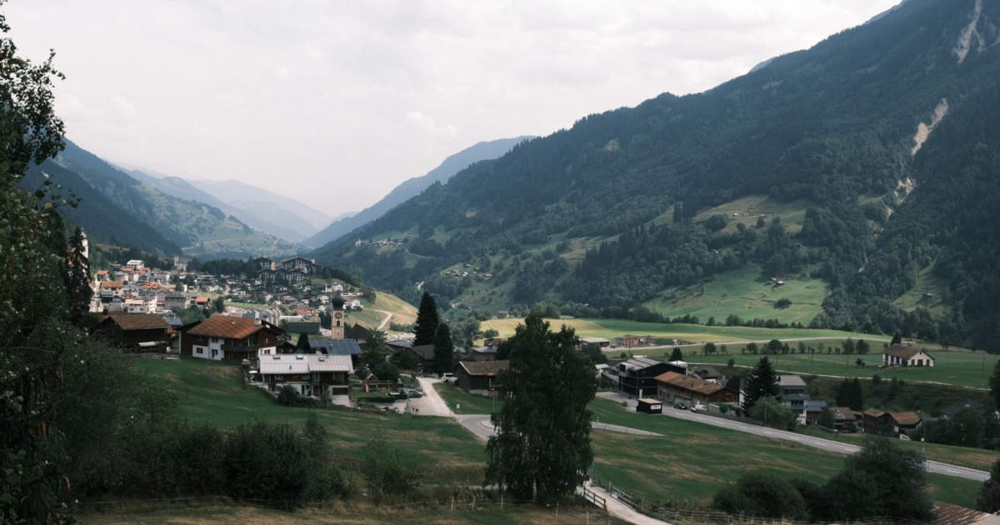

Melusaaste on asia, johon kiinnitän nykyään paljon huomiota. Se on läsnä lähes kaikkialla. Matka tarjosi itselle tuttuun ongelmaan joitakin uusia näkökulmia.

<!--more-->

Yövyimme interrail-matkan aikana Tanskassa, Saksassa, Sveitsissä, Itävallassa sekä Tšekeissä. Meillä oli etukäteen varattuna majoitus ainoastaan reissun ensimmäisille ja viimeisille öille. Kaikki muut majapaikat varasimme reissun aikana. Koska meillä ei ollut minkäänlaista matkasuunnitelmaa mietittynä, tulin käyttäneeksi hyvän määrän aikaa eri kohteiden sekä niiden majoitusvaihtoehtojen tutkimiseen.

Ääniherkälle meluisien ympäristöjen määrä voi sanella sen, onko matka onnistunut vai ei. Toinen ryhmä ovat herkkäuniset, joille yöllinen liikennemelu voi tarkoittaa valvottuja öitä ja sen myötä jatkuvassa väsymyksessä vietettyä matkaa. Vaikka [edellisessä kirjoituksessa]() kyseenalaistin nettiarvosteluihin nojaamista, niiden avulla on mahdollista selvittää ympäristön meluisuus.

### Hiljaisten majapaikkojen metsästys

Olipa kyseessä Saksassa sijaitsevat vanha kylä, Sveitsin järvenrantakaupunki, Itävallan vuoristokylä tai pääkaupungit Praha sekä Kööpenhamina, niitä kaikkia yhdisti yksi asia: majapaikkojen arvosteluissa harmiteltiin toistuvasti melua.

Ylivoimaisesti yleisin meluun liittyvä valituksen aihe oli liikennemelu. Koska kuluneet vuosikymmenet kaupunkien ja kylien kehitys on nojannut siihen, että autolla pitää päästä joka paikkaan, iso osa majapaikoista sijaitsee autoteiden vieressä. Monia alueita leimaa myös niitä halkaiseva läpiajotie, joka houkuttelee suuren määrä autoliikennettä. Usein tällaisilla läpiajoteillä nopeusrajoituksetkin ovat suuremmat, jolloin melun määrä kasvaa.

Koska itse olen sekä ääniherkkä, että kevyt nukkuja, yritimme löytää paikkoja, jossa mahdollisimman harva valittaisi melusta. Tämä osoittautui yllättävän haastavaksi. Autojen aiheuttama melu on niin laajalle levinnyt ongelma, että meillä oli vaikeuksia löytää majoitusta, jossa ongelmaa ei olisi nostettu esiin. Tämä on jälleen yksi osoitus siitä, kuinka autoilun kätevyys ajaa kaiken muun hyvinvoinnin ohi.

Joissakin kohteissa meidän oli yksinkertaisesti tyydyttävä sietämään melua, koska vaihtoehtoja ei ollut. Itselleni yksi mieleen painuvimmista majapaikoista melun suhteen oli Stendalissa, Saksassa.

Yövyimme [Hotel Schwarzer Adlerissa](https://www.adler-stendal.de/), joka sijaitsee aivan kaupungin torin laidalla, vain korttelin päästä kävelykadusta. Hotellin vieressä kohosi komea pyhän Marian kirkko. Ympäristön yleisilmeestä mukulakivikatuineen voisi kuvitella, että paikka olisi hiljainen, mutta todellisuus on ihan toinen.

Stendalissa kaikki pienimmätkin kadut on pyhitetty autoilulle ja läpiajoliikenteelle, joten hotellihuoneen äänimaisema koostui lähes täysin mukulakiviä rummuttavasta autometelistä. Melu jatkui hyvän matkaa puolille öin ja alkoi uudelleen heti neljän aikaan aamulla.

### Pärinää vuoristossa
Sveitsissä ollessa kävimme tekemässä vaelluksen [Schynige Plattella](https://www.myswitzerland.com/en-us/experiences/schynige-platte/). Noin 2000 metrin korkeudessa sijaitsevalle alueelle pääsee kätevästi hammasratasjunalla. Vuoristoon ei pääse autolla ja lähimmät autotiet kulkevat vuorten juurella yli kahden kilometrin etäisyydellä, joten kuvittelin pääseväni nauttimaan luonnon rauhasta ja vuoristojen hiljaisuudesta.

Kiinnitin huipulla huomiota helikopteriin, joka pörräsi meidän yläpuolella. Ajattelin aluksi, että se olisi jonkinlainen pelastus-, lääkintä- tai tutkimuskopteri. Mielikuva rapistui kuitenkin hiljalleen, kun huomasin kopterin sahaavan edestakaisin huippujen ja alapuolella olevan kaupungin väliä. Tätä jatkui kaikki ne tunnit, mitä alueella vietimme.

Kun selvittelin asiaa, kävi ilmi, että kyseessä on laskuvarjohyppääjien helikopteri. Kyseessä oli siis hyvin pieni joukko ihmisiä, jotka myrkyttivät omalla toiminnallaan kaikki ympäröivät vuoristoalueet. Kopterin melu kantautui kilometrejä joka suuntaan. Kaipaamaani vuoristojen hiljaisuutta ja luonnon rauhaa ei ollut.



Toinen mieleen painunut kohde oli myös Sveitsissä sijaitseva Disentis/Mustér. Se on pieni kylä, joka lienee talvella jonkinlainen laskettelukohde, mutta kesäisin hyvin kuolleen oloinen pieni kylä, jossa ei ole varsinaisesti mitään erityistä tekemistä. Sinne pääsee kuitenkin kätevästi junalla, joten ajattelimme, että se olisi hyvä ja rauhallinen kohde levätä ja olla tekemättä mitään erityistä.

Kylässä ei montaa majoitusvaihtoehtoa ole. Päädyimme [Hotel Alpsuun](https://www.hotelalpsu.ch/), jonka arvosteluissa suositeltiin rakennuksen takana olevia huoneita. Syynä oli hotellin edestä kulkeva kylän päätie. Osasimme siis varautua tietynlaiseen liikennemeluun, mutta emme siihen, mitä siellä oli lopulta tarjolla.

Ihmettelimme kylään saavuttuamme useaa "bikers welcome"-kylttiä, mutta myöhemmin opimme, että kylän läpi kulkeva tie on osa moottoripyöräilijöiden suosimaa reittiä. Vaikka autot ovatkin äänekkäitä, ne jäävät kauaksi moottoripyöristä. Kylän läpi rälläsi aamusta iltaan aivan järkyttävän kovaäänisiä moottoripyöriä. Kovaäänisimmät pitivät niin kovaa ääntä, että se aiheutti kipua. Oli vaikea käsittää, että tämä touhu toivotettiin tervetulleeksi erillisin kyltein.

Motoristien aiheuttama melu ei kuitenkaan rajoittunut pelkästään siihen, että ne tärvelivät kaikkien majapaikkojen, ravintoloiden ja koko kylän hiljaisuuden. Kävimme tekemässä pienen vaelluksen myös täällä, ja luonnon keskellä huomasi, kuinka kauaksi moottoripyörien pärinä kuuluu. Yksittäisen moottoripyöräilijän kuuli helposti minuuttien ajan, vaikka motoristi oli ehtinyt ajaa kilometrien päähän kylästä. Pahimpia olivat 10-20 motoristin letkat. Asetelma oli tuttu: pieni määrä ihmisiä myrkyttää metelillään koko ympäristön kilometrejä joka suuntaan.

Nämä ovat vain pari esimerkkejä, mutta vastaavia tuli vastaan myös muualla, kuten Saksan viinialueille sekä Itävallan vuoristossa.

Kokonaan oma lukunsa oli Skandinavian pyöräilypääkaupunki Kööpenhamina. Upeasta pyöräilyinfrastruktuuristaan huolimatta kaupunki on täysin autojen valtaama. Köpis on tehnyt mahtavaa työtä pyöräilyn edistämiseksi ja siellä pyöräileminen on helppoa ja verrattain vaivatonta. Samaan aikaan se on myös äärimmäisen epämukavaa, sillä pyörällä on liikuttava korvia kivistävän automelun keskellä. Ainoastaan puistoalueet tuntuivat olevan tältä suojassa, mutta sielläkin ilman täytti sivummalla kulkevien autoteiden kohina.

Kun melulla on niin suora vaikutus omaan hyvinvointiin, hiljaisten paikkojen etsiminen on matkailuun liittyvä pakollinen paha. Sen kautta on kuitenkin tullut huomattua, kuinka laajalle levinnyt ongelma melusaaste on.

Olemme tehneet 100 vuoden aikana paljon ilmansaasteiden eteen, mutta ongelmat melusaasteen suhteen ovat vain pahentuneet. Nykyään liikennemelusta vapaita majoituksia on todella vaikea löytää. Edes luontokohteet eivät ole turvassa. Jos niitä ei pilaa kauas kantautuva automelu, ne myrkytetään ilmasta käsin helikopterien ja lentokoneiden avulla. Varakkaille tarkoitettu helikopterilennätys on viihdettä, jota tarjotaan yllättävän monessa paikassa.
