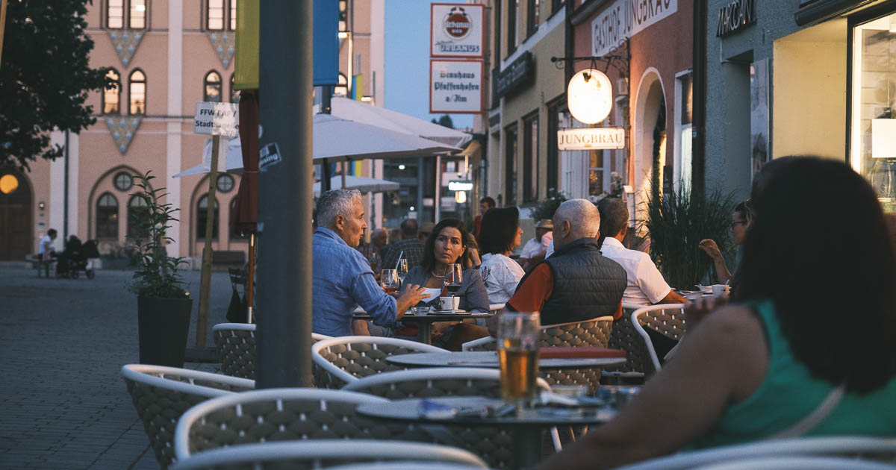
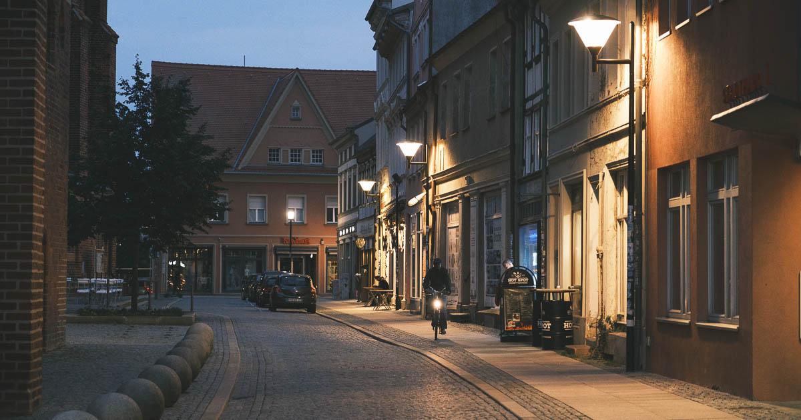

Yksi interrail-matkan hauskimpia uusia löytöjä olivat pienet kylät ja kaupungit. Niiden hidas elämä, seisahtunut tunnelma sekä ihmisen kokoinen arkkitehtuuri puhuttelivat minua tavalla, jota en osannut odottaa.

<!--more-->

En ole erityisen kokenut Euroopan matkaaja. Aikaisemmat matkani ovat kohdistuneet ensisijaisesti suurempiin kaupunkeihin ja tunnettuihin kohteisiin. Pienempiä paikkoja en ole kolunnut läpi, koska olen aina ajatellut, että niihin pääseminen on liian työlästä siihen verrattuna, kuinka paljon niistä saa irti. Tietyllä tavalla ajatuksessa on perää, mutta interrail-matka muutti tilanteen täysin.

Matkustaessa junalla pienemmät kaupungit ja kylät eivät ole ylimääräisen vaivan takana, sillä monet junareitit kiemurtelevat useiden pikkupaikkojen läpi. Kysymys on lähinnä siitä, että päätätkö pysähtyä niissä. Me päätimme.

Matkan varrelle sattui kolme sympaattista pikkupaikkaa. Näistä ensimmäinen oli Sveitsin itäosassa sijaitseva, reilun 2000 asukkaan [Disentis/Mustér](https://fi.wikipedia.org/wiki/Disentis/Must%C3%A9r). Seuraava oli noin 27 000 asukkaan [Pfaffenhofen an der Ilm](https://fi.wikipedia.org/wiki/Pfaffenhofen_an_der_Ilm) sekä noin 39 000 asukkaan [Stendal](https://fi.wikipedia.org/wiki/Stendal), jotka molemmat sijaitsevat Saksassa.

Näiden lisäksi vietimme pari yötä myös Saksan viinialueilla sijaitsevissa [Rüdesheim am Rheinissä](https://fi.wikipedia.org/wiki/R%C3%BCdesheim_am_Rhein) ja [Bacharachissa](https://fi.wikipedia.org/wiki/Bacharach), sekä Itävallan [Zell am Seessä](https://fi.wikipedia.org/wiki/Zell_am_See). Kaikki ovat kyllä kokonsa puolesta pieniä, mutta ne ovat myös hyvin turistisia. Jätän ne tästä syystä tämän kirjoituksen ulkopuolelle, vaikka olivatkin omalla tavallaan hyvin sympaattisia paikkoja.



Siitä huolimatta, että kolme muuta paikkaa ovatkin asukasmäärältään erilaisia, niiden keskustoissa oli monella tapaa hyvin samankaltainen tunnelma. Niissä saattoi nähdä jonkun yksittäisen turistin, mutta kylien pöhinä tuntui muodostuvan lähes yksinomaan paikallisten ihmisten arjesta: ihmisiä vaihtamassa kuulumisia, istuskelemassa terasseilla, pikniköimässä nurmikolla ja niin edelleen.

Kaikki kolme paikkaa ovat miellyttävän rauhallisia ja hiljaisia[^1]. Kadut ovat verrattain kapeita ja ne mutkittelevat orgaanisesti ympäri keskustaa. Useat kadut ovat lisäksi kauniisti koristeltu puilla, istutuksilla ja pienillä viheralueilla.

Torialueet ja kävelykadut ovat luonnollisesti niitä paikkoja, jossa näkee parhaiten paikallista elämää. Elämä ei kuitenkaan vaikuta kiireiseltä. Tuntuu, niin kuin aika etenisi hidastettuna. Se säteili myös itseeni ja sai aikaan rauhallisen fiiliksen.

Pienemmissä kylissä ihmiset tuntuvat paljon sosiaalisemmilta. Niissä vaikuttaa edelleen olevan kulttuuri, jossa ihmiset tuntevat toisensa ja pitävät toisistaan huolta. Törmäsin kävelyretkilläni toistuvasti ihmisiin, jotka olivat pysähtyneet kadulle vaihtamaan kuulumisia. Vaikka en itse ole erityisen sosiaalinen ihminen, tällainen ympäristö tuntui silti kotoisalta.

En ole itse kovin innokas nähtävyyksien kiertelijä. En kaipaa reissuilla museoita, kirkkoja tai muita erityisiä kohteita. Pidän siitä, että voin vaan kierrellä katuja ja antaa kaupungin paljastaa itsensä. Tällaiseen hortoiluun pienet kylät ovat ihanteellisia. Kaunis ja ihmisen kokoinen arkkitehtuuri, kaduille levittäytyvät terassit, sekä pienet putiikit ja ravintolat tekevät ympäristöstä viihtyisän ja turvallisen tuntuisen. Ne ovat myös huikeita paikkoja valokuvaamiseen.

Minulle paras aika kylien kiertelyyn ovat hämärtyvät illat. Ihmiset ovat päässeet töistä, ravintolat ja terassit ovat vilkkaimmillaan ja kadut ovat lämminsävyisten katuvalojen valaisemia. En tiedä voiko sanoa, että paikoilla on sielu, mutta jos on, niin se tuntuu tulevan parhaiten näkyviin juuri iltaisin.

Kotiin palattuani aloin miettiä näitä kyliä ja tajusin, etteivät havaintoni ole vain Keski-Euroopan yksinoikeus.

Muistin taannoisen seikkailun, jossa pyöräilin Hangosta Jäämerelle. Reitti kulki pieniä teitä pitkin ja kiemurteli usean pienen suomalaiskylän läpi. Ehkä suomalaiset kylät eivät välttämättä näyttäydy arkkitehtuuriltaan erityisen kiinnostavilta, mutta niissä oli silti jotain kotoisaa. Ihmiset olivat hurjan ystävällisiä, kiireettömiä, avuliaita ja välittömiä. Jos kaupungissa kaikki tuntuvat kulkevan aina kiireellä eteenpäin, kylissä ihmiset osasivat olla paikoillaan.

Kun seuraavan kerran lähden kiertelemään Eurooppaa junalla, aion pitää huolen siitä, että näitä pieniä kyliä sattuu matkan varrelle enemmän. Niistä ei välttämättä jää muistoksi päräyttäviä tarinoita tai eeppisiä elämyksiä, mutta ne toimivat mukavina rauhoittumispaikkoina reissun aikana.

[^1]: Kaikissa kolmessa paikassa hiljaisuuden pilasi autoliikenne, mutta unohdan sen nyt tässä kirjoituksessa, sillä sama ongelma on käytännössä kaikkialla ja käsittelin ongelmaa [edellisessä kirjoituksessa]().
