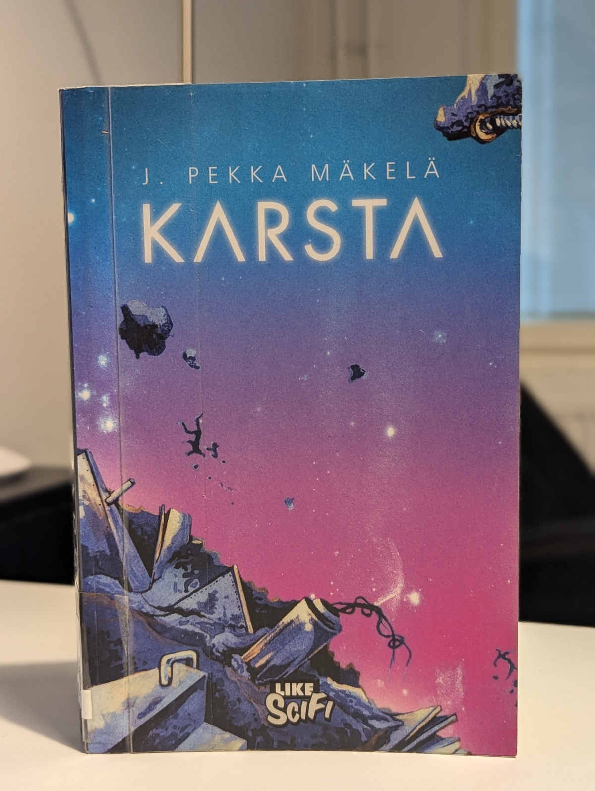

Vaihdoin e-kirjat välillä fyysisiin kirjoihin ja hain kirjastosta J. Pekka Mäkelän Karstan. Hieman luotaantyöntävän nimen takaa paljastui oikein maistuva ja ihmisläheinen scifiteos!

<!--more-->

### Tarina
Eletään tulevaisuudessa, jossa ihmiskunta imi maapallon kuiviin resursseista. Se levittäytyi aurinkokunnan muille planeetoille kuin syöpä, ja alkoi louhia myös niitä omaan käyttöönsä.

Samaan aikaan opimme, ettemme ole galaksissa yksin. Arrherdikahit, kahandtit ja lehadinit ovat kolme tunnettua lajia, joiden kanssa jaamme avaruuden. Heiltä opimme nopealento- sekä keinopainovoimatekniikat, jotka mullistivat avaruusmatkailun. Niiden avulla ihmiset kykenivät louhimaan muita planeettoja vieläkin tehokkaammin.

Arrherdikahit sekä kahandtit, galaksin suurimmat kulttuurit, eivät erityisemmin arvostaneet sitä, että ihmiset kuvittelivat omistavansa kaiken mihin kykenivät koskemaan. Pienet protestit muuttuivat lopulta täysimittaiseksi avaruussodaksi.

Sodan syttymisessä keskeisessä roolissa oli maassa vaikutusvaltaa saanut Ihmiskuntaliike. Avoimen muukalaisvihainen poliittinen ryhmittymä sai maapallolla hallitsevan aseman, eikä katsonut toisinajattelijoita hyvällä. He onnistuivat liittoutumaan galaksin suurimpana sotamahtina tunnettujen lehadinien kanssa. Heidän koreista sotakoneista ei kuitenkaan lopulta ollut mitään hyötyä muiden kulttuurien muodostamaa liittoumaa vastaan. Ihmiskunta hävisi sodan. Rauhanehdot kielsivät ihmisiltä nopealentotekniikan ja joukkotuhoaseet.

Heinrich Kramer on yksi lukuisista entisistä sota-aluksista, joka on riisuttu aseista ja modernista tekniikasta. Se toimii nykyään siivousaluksena, joka ryömii hitaasti pitkin avaruutta puhdistamassa vanhojen sota-alusten raatoja. Aluksen tuorein tehtävä on tarkastaa Jupiterin kiertoradalla olevat kaksi hylkyä. Miehistön on poimittava aluksista löytyvät ruumiit sekä epätodennäköiset eloon jääneet, ja tuhottava sen jälkeen hylyt.

Toivo eloonjääneistä on pieni, sillä sodan päättymisestä on jo viisi vuotta. Aluksia ei alunperinkään suunniteltu niin pitkään yhtäjaksoiseen toimintaan, mutta sen lisäksi ne ovat pahasti vaurioituneet. Lämmitys-, paineistus-, ilma- ja painovoimajärjestelmät ovat todennäköisesti tuhoutuneet.

Vaikka alukset tarjoaisivatkin elinkelpoiset olosuhteet, niissä olevat ihmiset ovat olleet eristyksissä muusta maailmasta. Yhteydet aluksiin katkesivat jo sodan aikana, eikä alusten miehistöllä ole käsitystä siitä, tuleeko heitä kukaan pelastamaan, vai ovatko he hylkyjen vankeina lyhyen elämänsä loppuun asti. Mitä se tekee mielenterveydelle? Lisäksi viisi vuotta ilman painovoimaa tuhoaa ihmiskehon, ellei sitä ylläpidetä päivittäisellä kuntoutuksella, eivätkä alukset tarjoa tähän juurikaan puitteita.

Avaruus on vihamielinen ympäristö toimia. Mitä tahansa kahdesta aluksesta löytyykään, Heinrich Kramerin miehistön on kyettävä toimivaan yhteistyössä selvitäkseen tehtävästä. Sodan jättämät arvet eivät auta tehtävässä. 

### Henkilöt
Tarinan päähenkilö on **Tria**, siivousaluksella toimivan vahtivuoron johtaja. Hän on keski-ikäinen ja läskistynyt, eikä hänen itsevarmuutensa ole kovin korkealla. Hän on sota-ajan hylkiö, mutta toisaalta niin on oikeastaan koko aluksen miehistö. He eivät ole edes erityisen koulutettuja avaruustehtäviin, mutta jonkun on siivottava sankarien jäljet.

Tria on monella tapaa hyvin tavallinen ihminen. Hänellä on vilpitön halu toimia oikein, mutta hän ei läheskään aina tiedä, miten se tapahtuu. Hän ottaa tukea tiimistään ja osaa luovia erilaisten persoonien kanssa. Hänellä on paljon heikkouksia ja eikä juurikaan vahvuuksia, mutta hän paikkaa näitä puutteita suurella sydämellä.

Minun oli alusta asti helppo samaistua Triaan. Hänelle on rakennettu ensimmäisistä sivuista alkaen mukava taustatarina. Ehkä juuri siksi, että hän on niin tavallinen ja heikkouksia täynnä, hänestä on helppo pitää. Olin läpi kirjan hänen puolellaan ja toivon kaiken aikaa, että hän onnistuu tekemisissään. Mäkelä on kirjoittanut ehjän ja loogisen hahmon, jonka toimintaa, ajattelua ja päätöksiä on helppo ymmärtää.

Sivuhahmot eivät ole saaneet aivan samanlaista kohtelua. Joidenkin taustat jäävät niin ohueksi, että ainakin minulle ne jäivät pelkiksi nimiksi paperilla. Onneksi joukossa on muutama poikkeus.

Pidin kovasti **Khanista**, joka on yksi Trian vahtivuoron jäsenistä. Nuorempana varakasta seurapiirielämää viettänyt nainen päätyi rikkaan sukunsa hylkäämäksi, putosi yhteiskunnan pohjasakaksi ja muuttui ihmisten halveksimaksi. Kyyninen, kiukkuinen ja pahasuinen Khan ei tunnu välittävän kenestäkään ja kohtelee muita kuin roskaa. Häntä on helppo vihata, mutta siitä huolimatta hän päätyy olemaan yksi kirjan kiinnostavimpia hahmoja.

Aluksen kapteeni **Elvire** on erikoinen, kylmä ja etäinen hahmo. Hän hoitaa kapteenin tehtäviään lähes robottimaisella määrätietoisuudella, eikä mikään tunnu järkyttävän häntä. Elvire pakeni sotaa arrherdikahien joukkoon ja sai myös näiden kansalaisuuden. Monet pitäisivät häntä jonkinlaisena maanpetturina, eikä ole edelleenkään täysin selvää, mitä lajia hän lopulta edustaa, vaikka onkin ihminen. Kiinnostavan taustan lisäksi Elvire tekee tarinassa päätöksiä, joita näkee yllättävän harvoin tarinoissa.

Aluksen lääkäri **Theodora** on tarinan hyväsydämisyyttä ja lämpöä säteilevä äitihahmo. Sen lisäksi, että hän hoitaa aluksen miehistöä, hän tuntuu ymmärtävän kaikkia ja saavan jokaisen parhaat puolet esiin. Hän on myös ainut henkilö, johon Tria pystyy luottamaan lähes täydellisesti. Theodoran taustoja ei liiemmin avata eikä hän ole juurikaan toiminnassa mukana, mutta Mäkelä on tehnyt hänestä lempeän äänen, joka onnistuu puhumaan Trian henkisiä lukkoja auki. Hän tuntuu juuri sellaiselta ihmiseltä, jollaisen jokainen tarvitsisi elämäänsä.

Kaiken kaikkiaan kaikki keskeiset henkilöt ovat mukavalla tavalla erilaisia ja riittävän kiinnostavia.

### Hetki avaruudessa
Karsta ei kerro eeppistä avaruustarinaa. Se on hyvin ihmisläheinen ja todellisuuteen vahvasti sidottu tarina, joka ottaa oman aikansa eikä kiirehdi. Olin lukenut ensimmäisen kolmanneksen kun tajusin, ettei kirjassa ole tapahtunut oikeastaan yhtään mitään. Tapahtumapaikkojakin on vain yksi: avaruusalus Heinrich Kramer.

Mäkelä keskittyy kuvailemaan avaruusaluksen sekä sen kirjavan miehistön arkea, ja tekee sen tyylikkäästi. Karsta ei ole jatkuvaa jännitystä tai toimintaa. Se on erilaisten ihmisten kanssa pärjäämistä ja tylsyyttä vastaan taistelemista. Voisi kuvitella, että tuloksena syntyisi tylsä tarina, mutta se oli kaikkea muuta.

Mäkelä onnistui rakentamaan minun päässä elävän ja värikkään kuvan siitä, millaista elämä sodan jälkeisessä siivousaluksessa on. Uppouduin maailmaan hetkessä, enkä halunnut tulla sieltä pois.

Pidin siitä, kuinka kirjan tarina on vain pieni hetki avaruudessa. Se ei ole tajuntaa räjäyttävä seikkailu, jonka alku ja loppu ovat kaukana toisistaan. Heinrich Kramerin tehtävänä on tutkia kaksi toisiaan lähellä olevaa alusta ja kirja todella keskittyy vain tähän pieneen tehtävään. Tarinan henkilöt muuttuvat ja kasvavat hyvin vähän tarinan aikana, mutta se on loogista, sillä ihmiset eivät muutu hetkessä. Tästä huolimatta Mäkelä on kyennyt rakentamaan usealle henkilölle kaaren, joka piti ainakin minut tyytyväisenä.

### Outoudet
Kirjan ensimmäinen luku oli minulle uskomattoman vaikeaa luettavaa. Siinä esiteltiin 11 sivun aikana *kahdeksan* uutta henkilöä, eikä lukija tietenkään siinä kohtaa tiedä, että ketkä heistä ovat merkityksellisiä ja ketkä pelkkiä taustahahmoja. Meinasin turhautua niin, että harkitsin kirjan palauttamista. Onneksi sinnittelin, sillä meno selkiytyy loppua kohti.

Nämä kahdeksan henkilöä eivät kuitenkaan ole kirjan ainoat ja niitä tulee seuraavien lukujen aikana useita lisää. Ylimääräiset hahmot sotkevat turhaan muuten niin hienosti rakennettua tarinaa ja maailmaa. Lisäksi ne syövät tilaa päähahmoilta, joiden rakentamiseen olisi voinut käyttää vieläkin enemmän aikaa.

Mielestäni Karsta ei tarvinnut näin suurta hahmokatrasta ja monet henkilöistä olisi voinut pudottaa kokonaan pois. Osan olisi voinut jättää nimettömiksi. Nyt joutavat nimetyt sivuhahmot söivät turhaa tilaa ja tekivät lukemisesta vaikeampaa.

Toinen omituisuus Karstassa oli se, kuinka suuren numeron se teki Trian sukupuolesta - tai sen puutteesta. Jostain syystä heti ensimmäisestä luvusta lähtien se tekee selväksi, että Tria ei tunne itseään mieheksi tai naiseksi. Hän kykenee tuntemaan vetovoimaa molempia sukupuolia kohtaan.

Tämä piirre teki joistakin Trian havainnoista ja ajatuksista kiinnostavia. Ongelmana on kuitenkin se, että vaikka Mäkelä nostaa asiaa toistuvasti esiin, hän ei tee sillä mitään.

Se ei vaikuta Trian ihmissuhteisiin tai hänen käyttäytymiseensä. Se ei vaikuta hänen persoonaansa, sillä se hautautuu yleisen epävarmuuden alle. Se ei tunnu vaikuttavan edes muiden ihmisten käyttäytymiseen.

Minulle tuli lukiessa fiilis, että kukaan muu tarinan henkilöistä ei anna ajatustakaan Trian sukupuolelle, paitsi Tria itse. Se tuntui olevan hänen oma pakkomielteensä. Vaikka hän puntaroi ajatuksissaan eri ihmisten viehätysvoimaa, samaan aikaan vaikutti, ettei hän oikeasti tunne vetovoimaa kehenkään. Hän piti itse muut ihmiset etäisenä, mutta syytti samaan aikaan yksinäisyyden ja erilaisuuden tunteesta muita ja omaa "erilaisuuttaan".

Koska asiaa alleviivattiin kirjassa toistuvasti, odotin sen johtavan johonkin. Niin ei kuitenkaan käynyt. Trian sukupuolella ei lopulta ole tarinan kannalta mitään merkitystä. Se olisi voinut olla kiinnostava sivuraide, mutta nyt se jäi yhdentekeväksi yksityiskohdaksi, joka tuotti lähinnä pettymyksen.

Vaikka pidinkin useimmista Karstan hahmoista, joukossa on myös sellaisia, joiden motiivit jäivät itselleni hieman epäselväksi. Osa ihmisten toimista tuntui turhan hätiköidyltä ja olisivat kaivanneet enemmän pohjustusta. Joitakin ei selitetty oikein mitenkään. En kuitenkaan avaa näitä sen enempää, koska sitä olisi vaikea tehdä spoilaamatta tarinaa.

Kirjassa käytetään turhan paljon aikaa avaruusalusten monimutkaisten rakenteiden kuvailuun. Tämä oli alussa kiinnostavaa ja ihan mukavaa maailman rakentelua, mutta aloin väsyä siihen loppua kohti mentäessä.

### Ankea maailma, jossa on pilkahdus toivoa
Kaiken kaikkiaan pidin Karstasta tosi paljon. Arvostan sitä, että Mäkelä keskittyy kertomaan napakan tarinan eikä yritä laajentaa sitä tarpeettoman suureksi. En olisi kuitenkaan yllättynyt, jos sen rauhallinen ja yksinkertainen kerronta näyttäytyy jollekin tylsyytenä.

Itse koin avaruuden siivousryhmän arjen kiehtovaksi. Toiminta on rauhallista ja konfliktit vaihtelevat kivasti sisäisten ja ulkoisten välillä. Vaikka ajatus avaruuden lakaisijoista ei välttämättä kuulosta lähtökohdiltaan jännittävältä, Karstan tarina on parhaimmillaan aivan hyytävän jännittävä. Kahden aluksen siivousoperaatio ei ole läheskään niin yksinkertainen, mihin miehistö on alun perin valmistautunut. Romuna leijuvat aluksetkaan eivät ole aivan sitä, miltä aluksi näyttävät.

Karstan maailma tuntui läpi kirjan uskottavalta. Se on ankea, kylmä ja vaikea. Samaan aikaan se on toivoa täynnä. Pidän juuri tällaisesta scifistä, joka nojaa vahvasti ihmisiin sekä todellisuuteen, eikä lähde leikkimään ajalla ja ulottuvuuksilla. Kirja ei ole välttämättä kaikkia varten, mutta se oli minua varten. Erinomainen lukukokemus!