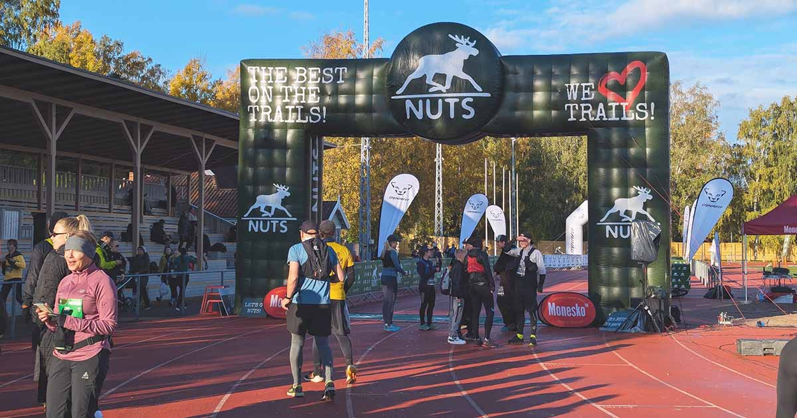

Osallistuin eilen NUTS HEL -polkujuoksutapahtumaan, joka tunnettiin aikaisemmin nimellä Helsinki City Trail. 24 km polkujuoksu Helsingin keskuspuistossa sateisessa säässä tarjosi tuttuja elämyksiä, joskin päädyin itse juoksemaan yli 27 kilometriä.

<!--more-->

[NUTS HEL](https://nutshel.fi/fi/) on yksi lyhyimmistä [Northern Ultra Trail Service](https://nuts.fi/fi/) (NUTS) -organisaation tapahtumista. Tapahtuman kuvauksessa mainitaan reitin olevan 24 km, mutta [virallinen reittikarttakin](https://tracedetrail.fr/en/trace/255674) kertoo sen olevan hieman yli 25 km. Ei siis puhuta ultramatkasta, mutta kokemattomalle polkujuoksijalle tarjolla voi olla yllätyksiä, vaikka taustalla olisi useampi puolimaraton tai maraton.

Helsingin keskuspuisto on yllättävän mäkinen. Mäet eivät ole korkeita, mutta ne ovat jyrkkiä ja niitä on paljon. Kapeilla poluilla kivien, juurakoiden ja lätäköiden väistely tekee juoksemisesta muutenkin raskasta. Oli mielenkiintoista seurata, kuinka ensimmäisen 2-3 kilometrin aikana suuri joukko ihmisiä ohitti minut kovaa vauhtia, mutta samat ihmiset tulivat 5 kilometrin kohdalla takapuoli edellä vastaan puuskuttaen. Muistutti paljon omaa ensimmäistä Helsinki City Trailia, jossa hölmöilin ihan samalla tavalla.

Itselläni ei eilisessä tapahtumassa ollut minkäänlaista aikatavoitetta. Ainut tavoite oli juosta omin jaloin maaliin ja nauttia poluilla juoksemisesta. Nautinto tosin oli hieman koetuksella, sillä ison osan juoksumatkasta satoi vettä. Pahimmillaan sitä tuli ihan kaatamalla. Sen seurauksena vaatteet ja kengät kastuivat ja polut muuttuivat entistä mutaisemmiksi ja liukkaammiksi. Toisaalta minä pidän tämänkaltaisista henkisistä haasteista, joten piiskaava vesisade sopi minulle oikein hyvin. Polkujen kyntäminen piti huolen siitä, ettei kylmä päässyt iskemään.

### Reitin haasteet

Yksi polkujuoksun haasteista on reitillä pysyminen. Tapahtumassa reitti oli merkitty pienillä punaisilla lipuilla ja epäselvissä risteyksissä oli suurempi nuoli opastamassa oikeaan suuntaan. Varsin selkeää, mutta kun itse juokseminen vaatii jatkuvaa jalkojen eteen katsomista, reitin seuraaminen ei ole niin helppoa kuin asfaltilla juostessa. Sitä päätyykin helposti keskittymään seuraavaan askeleeseen ja luottamaan siihen, että edellä olevat menevät oikeaa reittiä.

Noin yhdeksän kilometrin kohdalla tein tämän virheen ja seurasin yli 20 ihmisen laumaa. Tajusin jossain kohtaa, että suunta ei tunnu oikealta, mutta koetin silti miettiä, että oliko reitillä jonkinlainen lenkki, joka selittäisi oudon suunnan. Meidän olisi pitänyt mennä pohjoiseen kohti Vantaata, mutta jostain syystä juoksimme etelään ja takaisin kohti Helsinkiä. En ollut ladannut urheilukelloon reittikarttaa, joten en voinut tarkastaa asiaa mistään. Lisäksi ajattelin, että eihän niin suuri ryhmä voi mennä väärään suuntaan, eihän?

Noh, kyllä voi. Lopulta joukon perällä pari tyyppiä alkoi minun kanssa kyseenalaista reittiä. Päätimme jättää ison joukon ja palata takaisin alkuperäiselle reitille. Tämä maisemareitti tuotti kaksi ylimääräistä kilometriä. Onneksi ei ollut aikatavoitteita. Muu ryhmä jatkoi juoksemista, enkä tiedä, että juoksivatko he aina maaliin asti, vai tajusivatko myöhemmin, että reitti ei ollut oikea.

Muistelin aikaisemmista vuosista, että reitin pohjoisosassa olisimme kiivenneet [Paloheinän huipulle](https://www.openstreetmap.org/#map=17/60.255205/24.912518), mutta nyt reitti kulkikin sen ohi. Ehdin ohittaessa miettiä, että onpas melkoinen helpotus reittiin, sillä Paloheinä on reitin korkein mäki. Takaisin tullessa nämä ajatukset kuitenkin katosivat, sillä paluureitti kulki Paloheinän yli - kahdesti.

Täällä oli myös reitin toinen kohta, jossa olisi ollut helppo eksyä, sillä pienen silmukkalenkin takia risteyksessä reittimerkinnät jatkuivat kahteen suuntaan, mutta nuolta ei ollut. Meitä oli siinä useampi juoksija, joka arveli, että oikea reitti olisi se haastavampi ja nousisi aivan Paloheinän huipulla. Mäinhän se olikin, joten toista eksymistä tai tapahtunut.

### Kehon haasteet

Pidemmillä juoksuilla vatsaongelmat eivät ole erityisen harvinaisia. Yksi syypää on se, että verenkierto heikkenee sisäelimissä sen painottuessa jalkojen suuriin lihaksiin. Yleisimpiä oireita on ruoansulatuksen hidastuminen, jolloin nesteet ja ruoat jäävät hölskymään mahaan, eivätkä imeydy kunnolla.

Itse taistelen ruoansulatusongelmien kanssa myös arjessa. Lieneekö nämä vammat syynä siihen, että itselläni juoksuilla tulevat vatsaongelmat ilmenevät todella kovana kipuna. Pystyn sietämään väsymystä ja erilaisia jalka-, lonkka- ja lihaskipuja, mutta tuo vatsakipu on jotain sellaista, joka tappaa menohalut kuin seinään. Eilen ne alkoivat noin 18 kilometrin ja kahden tunnin jälkeen.

Tilanne oli erityisen tympeä, sillä olin päättänyt olla ärsyttämättä vatsaa. Join pelkkää vettä ja olin siihen mennessä syönyt yhden [vauhtikarkin](https://nosht.fi/products/jollos-energy-chews). En siis edes kokonaista pötköä, vaan yhden pötkössä olevan karkin. Tästä huolimatta kivut tulivat pilaamaan juoksua.

Yksi ratkaisu näihin kipuihin on ollut vauhdin tuntuva hidastaminen. Kun sykkeet laskevat, verenkierto tuntuu palautuvan sisäelimiin ja kipu helpottaa. Näin tapahtui nytkin, mutta koko loppujuoksun sain tasapainotella tämän asian kanssa. Tilanne oli todella turhauttava, sillä jaloissa olisi ollut paukkuja mennä ja olo oli noin muuten varsin energinen, mutta minun piti kävellä pitkiä pätkiä, jotta vatsa ei kipeytyisi.

### Maalissa

Pääsin kuitenkin maaliin ja lopulta kilometrejä kertyi yhteensä 27,39. Aikaa tuhraantui kolme tuntia ja 12 minuuttia. Vertailun vuoksi kisan voittaja juoksi 25,2 km aikaan 1:47:33. Hänen keskitahtinsa oli 4:16/km. Minä en pystyisi ylläpitämään tuollaista vauhtia edes tasaisella. En tiedä minkälaisia gaselleja nämä huippu-urheilijat ovat, kun pysyvät ylipäätään juoksemaan keskuspuiston poluilla tuollaista vauhtia taittamatta nilkkojaan.

Jalat alkoivat jumittua melkein heti kun lopetin juoksemisen, joten koetin pysyä liikkeessä. Edessäni oli vielä 6,5 kilometrin pyörämatka kotiin. Vaihdoin märät vaatteet kuiviin, heitin sadeasun päälle ja lähdin sipottamaan. Kotimatka meni ihan hyvin ja kotona odotti nepalilaiset ruoat, jotka puoliso oli käynyt hakemassa paikallisesta ravintolasta.

Kaiken kaikkiaan tapahtuma oli oikein mukava ja tarjosi kiinnostavan pienen haasteen viikonloppuun. Ainut kritiikki tulee muutamien risteysten epäselvistä reittimerkeistä.

Vatsakivuista luopuisin mielelläni, sillä ne tuntuvat toistuvasti olevan se syy, joka vaikeuttaa pidempien matkojen juoksemista. Vaihtoehtona olisi tietysti lönniä niin hitaasti, ettei sykkeet nousisi missään kohtaa kovin korkealle. Auttaisiko se lopulta? En tiedä, mutta ainakin sitä voisi joskus kokeilla.