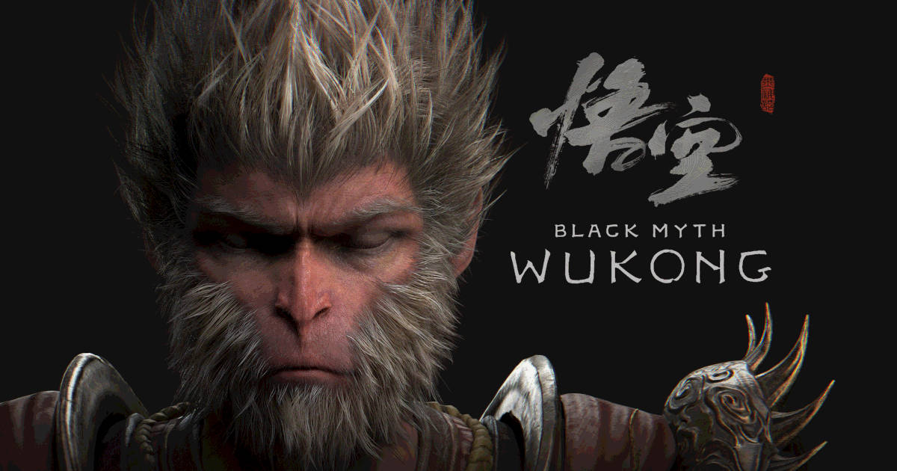
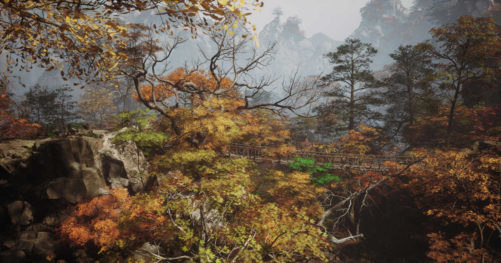
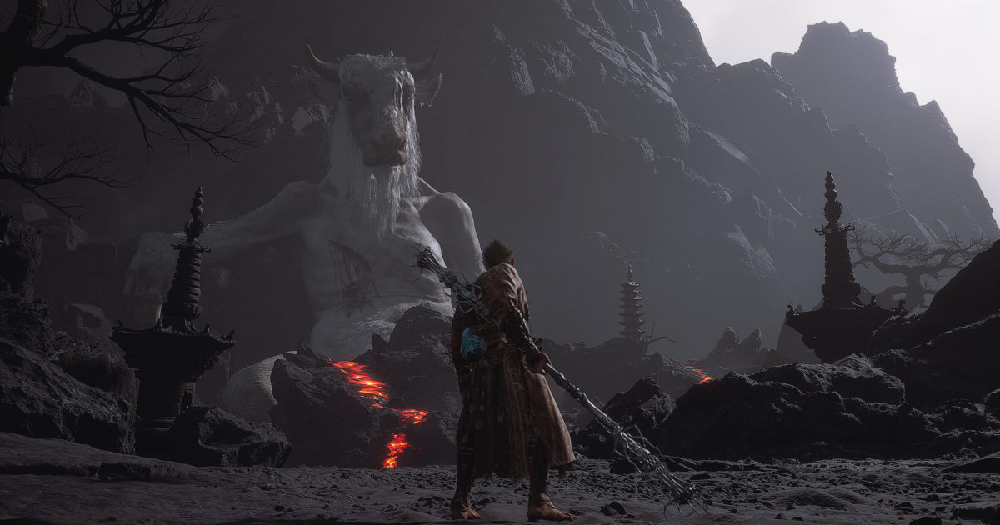
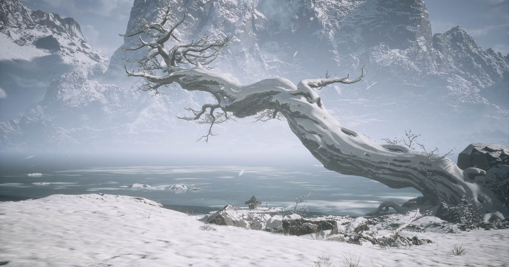
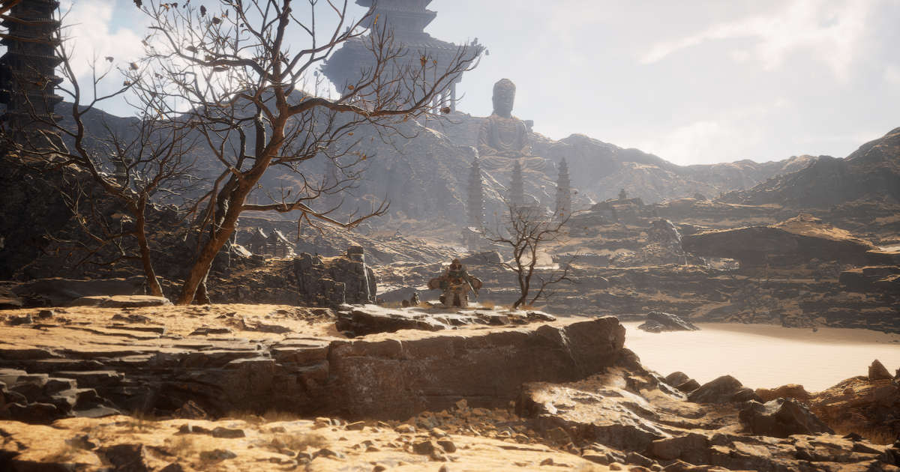

Olin ajatellut, etten kiusaisi itseäni soulslike-peleillä enää tämän vuoden puolella. Sitten tuli Black Myth: Wukong, joka rikkoi myyntiennätyksiä, joten pakkohan minun oli nähdä, että mistä oli kysymys.

<!--more-->

### Soulslike
Black Myth: Wukon (BMW) on [soulslike](https://fi.wikipedia.org/wiki/Soulslike)-peli. Peligenren pelit vaativat aina omanlaisensa asennoitumisen.

Jos et ole aikaisemmin kuullut soulslike-peleistä, kyseessä on varsin korkean vaikeustason toimintapeleistä, joissa tarina on usein synkkä, mystinen ja tapahtuu enemmän ympäristön, kuin selkeän kerronnan kautta. Mukana on roolipelielementtejä hahmonkehityksen muodossa, mutta iso kehitys tapahtuu pelaajassa. Kuolema on osa soulslike-pelejä ja pelit on suunniteltu niin, että *sinä* muutut paremmaksi. Tämä tapahtuu epäonnistumisen ja uudelleen yrittämisen kautta.

Voin kuvitella, että monet, jotka ostivat pelin pelkän suosion ja mediahuuman perusteella, ovat saattaneet kokea karvaan yllätyksen.

### Tarina
Peli pohjautuu kiinalaiseen 1500-luvulla julkaistuun [Journey to the West](https://fi.wikipedia.org/wiki/Xiyouji) -romaaniin (西遊記). Romaani kertoo tarinan buddhalaisen munkin Xuanzangin pyhiinvaellusmatkasta Kiinasta Intiaan. Hänen mukanaan kulkee kolme opetuslasta ja suojelijaa: Zhu Bajie, Sha Wujing sekä Sun Wukong. Näistä viimeisin on pelin tarinan keskiössä, mutta myös Zhu Bajiella on iso rooli.

Peli alkaa Sun Wukongin viimeisistä hetkistä. Kuriton ja rääväsuinen apina on saavuttanut buddhalaisuuden ylimmän tason. Hänelle tarjotaan paikkaa Taivaallisessa tuomioistuimessa, mutta Wukongia ei voisi vähempää kiinnostaa. Hän haluaa elää yksinkertaista elämää vuorella kansansa keskuudessa. Wukong ei ole muutenkaan hyvää pataa jumalten kanssa, sillä he tuntuvat tappavan apinakansaa lähes mielivaltaisesti. Wukong käy aukomassa päätään jumalille ja itsevarmuutta puhkuen uhkaa pistää kaikkia pataan.

Luonnollisesti tuomioistuin ei katsele pullistelua hyvällä ja Wukong saa niskaansa Erlang Shenin johtaman taivaallisen armeijan. Seuraa kaksintaistelu, jonka Wukong häviää. Hänet sinetöidään kallion sisään, mutta ennen tätä Wukong ehtii levittää kuusi olemuksensa palasta ympäri kuolevaisten maailmaa pyhien esineiden muodossa. Satoja vuosia myöhemmin vuorilla asuvan apinaheimon jäsenet koettavat löytää piilotettuja esineitä siinä toivossa, että niiden avulla Sun Wukong voitaisiin tuoda takaisin ja herättää henkiin. Yksi näistä apinoista on pelin päähahmo, **The Destined One**.

Olen suuri tarinavetoisten pelien ystävä. En ole koskaan välittänyt soulslike-pelien kryptisestä tarinankerronnasta, eikä BMW tee siihen poikkeusta. Se on tavallaan sääli, sillä peli ammentaa itseensä melko lennokkaasta tarinasta, jonka päälle olisi voinut varmasti rakentaa varsin huikean tarinan. Ehkä tätä on yritettykin, mutta harmillisesti tarina hukkuu vaikeaselkoisuuden alle.

Minun on myönnettävä suoraan, etten ymmärtänyt juuri lainkaan mitä pelin tarinassa tapahtuu. Se on pilkottu kuuteen lukuun, jotka tuntuvat olevan täysin riippumattomia toisistaan. Totta puhuen en ymmärtänyt oikein edes lukujen sisäistä tarinaa. Kaikki on niin epämääräistä ja hatsaista. Ainut poikkeus tästä on 4. luku, jossa **Zhu Bajie** saa suuremman roolin. Melankolisuudestaan ja surullisuudestaan huolimatta se oli tarinan osalta suosikkini. Zhu Bajie on ylivoimaisesti pelin parhaiten kirjoitettu hahmo.

Vasta tutustuttuani alkuperäisteokseen ja selvitettyäni pelin tarinaa netin avulla, suurempi tarina ja lukujen yksityiskohdat aukesivat minulle kunnolla.

Pelissä on päiväkirja, johon kertyy tarinoita *jokaisesta* vastaan tulevasta vihollisesta ja pomosta. Lueskelin tarinoita ensimmäisen luvun aikana, mutta lopulta oli hyväksyttävä, etten ymmärtänyt niistäkään yhtään mitään. Loppupelin ajan en jaksanut kiinnostua niistä. Ehkä ne aukeavat paremmin, jos on lukenut Journey to the Westin.

Itselleni pelin viehätys ei todellakaan tullut maistuvasta tarinasta, mutta tähän olin osannut varautua peligenren tuntien.

### Upea alku
Minun on erikseen kehuttava tapaa, jolla peli alkaa. Kyseessä on yksi komeimpia introja, joita on tullut pitkään aikaan vastaan.

Heti alussa pelaaja laitetaan Sun Wukongin saappaisiin. Juokset kohti tuntematonta ja näet kaukaisuudessa vuoren kokoiset jumalhahmot, jotka tuijottavat sinua herkeämättä. Kun pääset perille, jumalien edessä levittäytyy Erlang Shening johtama tuhatpäinen armeija. Saat seurata hetken aikaa Sun Wukongin sekä Erlangin sanaharkkaa, ja seuraavaksi oletkin pomotaistelussa.

Tämä ei ole kuitenkaan tyypillinen pomotaistelu, sillä se toimii samalla pelin tutorialina. Juuri näin pelien tutorialit pitää tehdä! Tutorialin ei tarvitse olla tylsä ja pelin päälle liimattu koulutus. Ensimmäisen rähinän aikana opit pelin perusmekaniikat, mutta samalla sinulle käy selväksi, että olet hyppäämässä eeppisen seikkailuun, johon kuuluvat kamppailulajit, taikuus sekä hillittömät kamppailut jumalia ja heidän alaisiaan vastaan. Mikään ei ole liian suurta!

Harva peli on onnistunut imaisemaan minut pelimaailmaan tutorialin aikana niin kuin BMW.

### Maailma
BMW:n maailma on parhaimmillaan uskomattoman kaunis. Ympäristöt vaihtelevat viidakoiden, aavikoiden, lumikinosten, syksyisten lehtimetsien ja tuhkaksi palaneiden kallioiden välillä. Tekijät ovat nähneet uskomattoman paljon vaivaa sen eteen, että maailma näyttää ja tuntuu uskottavalta.

Tämä ei ole kuitenkaan avoimen maailman peli. Käytännössä se sanelee, mihin sinun on mentävä. Osa maailmoista on varsin suoraviivaisia, kun taas osa on hyvinkin sokkeloisia. Jokaisesta luvusta löytyy useita salaisuuksia ja piilotettuja pomoja, joiden löytäminen ei läheskään aina ole mikään päivänselvyys.

Pelin äänimaailma tukee loistavasti visuaalisesti kaunista ympäristöä. Se on varsin minimalistinen, eikä pelissä pauhaa jatkuva taustamusiikki. Tästä olin erityisen ilahtunut, sillä pelissä on useita hetkiä, jossa äänet kertovat paljon enemmän kuin kuva. Tämä ei olisi ollut mahdollista, jos pelin äänimaisema olisi melua täynnä. Kun musiikkia käytetään, se todella tuntuu.

### Viholliset ja taistelut
Pelissä on aivan käsittämätön määrä erilaisia vihollisia. Jokainen luku tarjoaa oman kattauksen ja maailmoissa vastaan tulevat tappelupukarit ovat selvästi toisistaan erilaisia. Osa perusvihollisista on helppoa tykinruokaa, mutta vaikeimmat niistä tuntuvat pieniltä pomotaisteluilta. Vastaan ei tullut yhtään vihollista, joka olisi tuntunut jotenkin halvalta tai epäreilulta. Osa niistä sai kyllä otsasuonen pullistumaan. Toiset taas herättivät kauhua aina kun ne näki edessään.

Oman rajallisen kokemuksen perusteella sanoisin, että BMW on yksi helpoimpia soulslike-pelejä, mitä tulee maailmassa kulkemiseen. Tämä voi olla myös tarkoituksellista, sillä pelin pääpaino on selkeästi pomotaisteluissa.

Erilaisia pomoja on yli 80. Lähes jokainen pomo on upeasti toteutettu ja taistelut tuntuivat aidosti erilaiselta. On jännittävää astua areenalle ensimmäistä kertaa autuaan tietämättömänä siitä, mitä on tulossa. Osa pomoista meni läpi ensimmäisellä yrityksellä. Joidenkin kanssa nyhräsin parhaimmillaan kaksi iltaa.

Minulle soulslike-pelit ovat [gid gud](https://knowyourmeme.com/memes/git-gud) -pelejä. Pidän siitä, että minun on opeteltava vastustajani, jotta voisin pärjätä. Siksi inhoakin hetkiä, jolloin minun on taisteltava useaa vihollista vastaan yhtä aikaa. Ne tuntuvat lähinnä kaaokselta, joissa ei opi mitään. BMW ei tähän ihan juurikaan syyllisty. Silloinkin kun vihollisia on useampi, useimmiten joukossa on yksi selkeä päävihollinen ja sen ympärillä heikompia vihollisia häiritsemässä.

Olin tosi tyytyväinen siitä, että pelin kehittäjät ovat onnistuneet rakentamaan vaikeustason ilman halpoja pelimekaniikkoja. Vain muutamaa poikkeusta lukuun ottamatta jokainen on voitettavissa harjoittelemalla. Niihin ei liity salaisuuksia tai erityistä mekaniikkaa, joka keinotekoisesti tai epäreilulla tavalla tekisi taistelusta vaikeamman. Poikkeuksiakin on, mutta palaan niihin myöhemmin.

BMW ei rankaise kuolemasta niin armottomasti kuin monet muut soulslike-pelit. Kuolema vie sinut takaisin edelliselle checkpointille, mutta et menetä keräämiäsi "sieluja". Lisäksi monet pomot on sijoitettu niin, että niiden läheltä löytyy checkpoint. Kynnys uudelleen yrittämiselle on pieni.

### Mekaniikka
Pelin päähahmo on yllättävän ketterä, mutta BMW noudattaa silti tuttua linjaa, jossa kaikki liikkeet vaativat oman aikansa. Pienet liikkeet ovat nopeita ja helppo saada perille, mutta ne tekevät vähän vahinkoa. Isot liikkeet ovat hitaita, joten pelaaja joutuu aina harkitsemaan tarkasti, milloin niitä uskaltaa käyttää. Taisteluissa väistelyllä ja oikeiden hetkien löytämisellä on iso rooli.

Jokainen liike, väistö ja hyppy syö staminaa, jota on rajallinen määrä. Pelaaja ei voi sinkoilla päättömästi pitkin kenttää, vaan osa taistelua on staminan hallinta. Tälläkään saralla BMW ei ole sieltä vaikeimmasta päästä, mutta osasyy tähän voi olla se, että rakensin omasta hahmosta melkoisen staminahirmun. Aloittelijat tulevat kuitenkin nopeasti oppimaan, että päätön pomppiminen johtaa vain kuolemaan.

Hahmonkehitys on mukavan monipuolinen. Päähahmolla on kolme eri stancea, joita voi vaihdella koska tahansa kesken taistelun. Ne tuovat eri kykyjä käyttöön. Pelissä on lisäksi laaja kykypuu, jolla hahmoa voi parantaa sitä mukaa kun tasot nousevat. Läheskään kaikkea ei saa yhtä aikaa käyttöön, joten pelaajan on tehtävä valintoja oman pelityylinsä mukaan. Aloittelijaystävällisyyttä lisää se, että kykypuun voi koska tahansa resetoida, eikä se maksa mitään. Voit siis optimoida hahmosi vaikka jokaiselle pomolle erikseen, jos niin haluat.

Stancen lisäksi hahmolla on käytössään taikoja neljästä eri ryhmästä. Jokaisesta ryhmästä voi valita yhden taian, eli aktiivisena voi olla neljä taikaa. Yksi ryhmistä on transformations, jonka avulla hahmo voi muuttua hetkeksi toiseksi hahmoksi ja saada sitä kautta uusia kykyjä. Tämä voi olla myös pelastus, sillä muuttuneella hahmolla on kokonaan omat energiat. Kun energiat loppuvat, hahmo palaa takaisin omaan kehoonsa.

Perusliikkeiden ja taikojen lisäksi käytössä on spiritit sekä vesselit. Spiritit kerätään vihollisilta ja jokainen niistä antaa jonkin passiivisen edun. Niitä on kymmeniä. Lisäksi hahmo voi ottaa hetkeksi valitun vihollisen muodon, tehdä sen avulla tehokkaan hyökkäyksen tai saada jonkun muun edun. Osa vesseleistä aukeaa tarinan myötä, toiset on etsittävä itse. Ne ovat tarvikkeita, jotka antavat spiritien tapaan passiivisen edun, mutta tuovat lisäksi jonkin tuntuvan boostin aktivoitaessa. Vesselit kestävät aktiivisena huomattavan pitkään ja ovat lähes välttämättömyys tietyissä taisteluissa.

Kaiken tämän päälle on erilaiset varusteet, joiden erikoiskyvyt muovaavat hahmoa. Vaihtoehtoja siis piisaa. Oma kokemus oli se, että päädyin hyvin nopeasti löytämään oman suosikkiyhdistelmäni ja jyräsin sillä käytännössä koko pelin läpi. Vain parin pomon kohdalla tein suurempia muutoksia. Peli ei siis vaadi mikromanageerausta, jos et sitä halua tehdä, mutta optimoinnista nauttiville sekin vaihtoehto on olemassa. Aloittamalla New Game+:n, pelaajalle aukeaa lisää vaihtoehtoja. En ole aloittanut NG+:aa, mutta oletan, että siellä varusteiden rooli korostuu entisestään.

### Laatu
BMW on todella hiottu peli. Se on raikas tuulahdus maailmassa, jossa keskeneräisen roskan julkaiseminen ja maksavilla asiakkailla testaaminen on enemmän sääntö, kuin poikkeus. Kymmenien tuntien aikana en törmännyt kuin yhteen bugiin, joka johti kuolemaan. Se keskittyy tarjoamaan toimivan yksinpelin, eikä yritä kosiskella pelaajia puolivillaisella moninpelillä tai joutavilla online-ominaisuuksilla.

Toki tässäkin pelissä on asioita, jotka kaipaavat vielä pientä hienosäätöä. Areenoiden nurkissa taisteleminen on välillä riskialtista, sillä kamera saattaa mennä seinien sisään tai kulmiin, jossa et näe sen enempää vihollista kuin oma omaa hahmoasikaan. Välillä automaattinen vihollisen seuranta ei tahdo pysyä perässä. Törmäsin myös muutamaan hauskaan animaatiobugiin, mutta nämä kaikki olivat lähinnä hölmöjä pikkujuttuja, jotka eivät juurikaan rikkoneet pelikokemusta tai tehneet pelistä vaikeampaa.

On mahtavaa nähdä, että maailmasta löytyy pelitaloja, joilla on ammattiylpeyttä rakentaa oikeasti valmista ennen julkaisua!

### Ongelmat ja turhautumiset
Vaikka BMW on monella tapaa todella onnistunut peli, se ei ole täysin ongelmaton. Mukana on myös joitakin turhauttavia piirteitä - tämä ei varmasti yllätä ketään.

Kenties suurin itseäni kohdannut ärsytys on se, että pelin maailma on täynnä näkymättömiä seiniä. Maailma näyttää usein siltä, niin kuin kyseessä olisi avoimen maailman peli. Erityisesti luontoalueet suorastaan kannustavat tutkimiseen. Se ei ole kuitenkaan mahdollista, sillä hahmo törmää toistuvasti näkymättömiin seiniin, jotka estävät putkesta poistumisen. Päädyin joissakin sokkeloisimmissa kentissä kulkemaan reunoja pitkin löytääkseni salaisia paikkoja, koska minun oli lähes mahdotonta erottaa, että minne pystyin menemään ja minne en. Tekijät olisivat voineet suunnitella kentät niin, että kuljettavan alueen rajat olisivat olleet selkeämmin havaittavissa.

Toinen tylsäksi käyvä asia on se, että pelaaja on sataprosenttinen melee-hahmo. Sinulla ei ole minkäänlaista pitkän kantaman asetta, mutta vihollisista useampi voi ampua sinua kaukaa. Tämä teki joistakin kentistä ja pomoista aavistuksen turhauttavia, sillä voit vaan odottaa ja torjua niiden hyökkäykset, mutta et tehdä niihin vahinkoa. Erityisesti toisessa luvussa tällaisia vihollisia riittää. Osa vihollisista on lisäksi sijoitettu niin, ettei pelaaja pääse tappamaan niitä, ellei satu oivaltamaan puoliksi piilotettua ominaisuutta.

Osa pomoista on käytännössä täysin lentäviä. Vaikka taistelut näitä vastaan olivat komeita, ne tuntuivat samaan aikaan pitkästyttäviltä. Päädyit vaan väistelemään vihollisen hyökkäyksiä ja odottelemaan sitä pientä hetkeä, jolloin pomo käy maassa. Ymmärrän, mitä kehittäjät ovat tavoitelleet, mutta ehkä näissä mentiin vähän turhan pitkälle.

Lähes kaikki pomoista ovat vähintään kaksivaiheisia. Kun niiden energiat menevät vähiin, niistä tulee aggressiivisempia ja monet niistä saavat uusia, voimakkaampia hyökkäyksiä käyttöönsä. Ongelmana on, että tämä toteuttamiseen on kaksi eri tapaa. Useimmissa toiseen vaiheeseen menemistä ei näy muusta kuin siitä, että pomolla menee kuppi nurin.

Toinen ja ärsyttävämpi tapa on se, että pomo vaihtaa olomuotoa kun sen energiat menevät nolliin. Sen jälkeen alkaa käytännössä kokonaan uusi taistelu ja pomon energiapalkki on taas täynnä. Sinun energiat sen sijaan eivät palaudu. Jos erehdyit tuhlaamaan kaikki taikasi ensimmäisessä osassa, taistelet toisen ja usein vaikeamman osan ilman niitä. Tätä on kuitenkaan mahdotonta tietää etukäteen.

Etenkin ensimmäisellä kohtaamisella tämä tuntui typerältä pelaajan huijaamiselta. Saman olisi voinut toteuttaa niin, että pomoilla olisi ollut suurempi energiapalkki ja nämä muodonmuutokset tapahtuisivat, kun energiapalkki vajoaa tarpeeksi alas. Näin pelaajalla pysyisi koko ajan käsitys siitä, missä kohtaa taistelua mennään. Osa pomoista vaihtaa muotoaan useamman kuin kaksi kertaa. Eihän sillä lopulta ole vaikutusta myöhempiin yrityksiin, mutta ratkaisu tuntui tarpeettomalta pelaajan pettämiseltä.

Ehkä suurin taisteluihin liittyvä ärsytys oli joidenkin pomojen cutscene-hyökkäykset. Käytännössä nämä ovat näyttäviä erikoishyökkäyksiä, joita tietyt pomot tekevät, kun niiden energiat valuvat tarpeeksi alas. Niitä ei voi väistää eikä estää, ja osa niistä tekee aivan järkyttävää vahinkoa. Jos satut olemaan näillä hetkillä vähillä energioilla, se on välitön kuolema.

Kaikki cutscene-hyökkäykset eivät ole tällaisia. Jotkut voi väistää ja jotkut ovat selkeitä vastahyökkäyksiä. Ne on opeteltavissa ja siksi ihan ok. Ongelmana ovat ne, jotka eivät ole mitenkään riippuvaisia pelaajan omasta toiminnasta, vaan niiden ainut tehtävä on pakottaa pelaaja menettämään energiaa. Tämä tuntui itsestäni aina halvalta tavalta tehdä pelistä vaikeampi, etenkin jos se johtaa välittömään kuolemaan.

Joidenkin isompien pomojen kohdalla oli melkoisia hitbox-ongelmia. Saatoit seistä pomon vieressä, mutta mikään lyönti ei rekisteröitynyt osumaksi. Myös päinvastaista tapahtui. Saatoit olla metrejä pomon yläpuolella, mutta silti alapuolella meuhkaava pomo osui sinuun toistuvasti. Oletan näiden olevan bugeja, jotka korjataan myöhemmin.

Kehuin aikaisemmin sitä, kuinka upeita pelin pomot ovat. Joukossa on kuitenkin muutama, jotka olivat aivan armottoman tylsiä. Pidin itse suuresti pomoista, jotka tulivat aktiivisesti päälle, olivat fyysisiä ja tarjosivat monipuolisia liikkeitä. Ne pakottavat opetteluun ja palkitsevat siitä, kun sinusta tulee parempi.

Sen sijaan pelin surkein pomo seisoo käytännössä paikoillaan ja työntää kentän täyteen roskaa, jolloin koko taistelu on lähinnä yhtä tanssimista. Kun näihin pomoihin yhdistetään pakotettuja cutscene-hyökkäyksiä, niin ainakin oma fiilis on piloilla. Halusin vaan päästä näiden pomojen ohi, eikä minua kiinnostanut lainkaan opetella niitä tai käyttää niihin aikaani.

### Yhteenveto
Vaikka edellinen ongelmalista vaikuttaa pitkältä, todellisuus on, että ne ovat hyvin mitätön osa peliä. BMW on mielestäni hiottu timantti, joka on selvästi tehty rakkaudesta peleihin. Tekijät ovat tienneet, kuinka tehdään kaunis peli, josta pelaajat pitävät. Itse uppouduin pelin maailmaan ja taisteluihin heti introsta lähtien. Odotin koko ajan, mitä seuraava pomo tuo tullessaan ja miltä seuraava maailma näyttää. Peli piti otteessaan loppuun asti, ja vaikka tarina menikin minulta isolta osin ohi, se tarjosi silti ihan tyydyttävän päätöksen.

Pelin vaikeustaso oli minulle juuri sopiva. Se tarjosi hetkittäin otsasuonet pullistavaa haastetta, mutta samaan aikaan pelin vaikeimmat pomot olivat järjestelmällisesti omia suosikkejani.

Jos pitäisi valita pelin suosikkipomo, se olisi ehdottomasti Tiger Vanguard. Pomo tarjosi itselleni haastetta kahdeksi illaksi, mutta samaan aikaan se oli uskomattoman palkitseva ja taitavasti animoitu sekä ääninäytelty. Jos pelaaja väistää yhden pomon hyökkäyksistä, se murjoo nyrkin hirveällä raivolla maahan ja jää sen jälkeen heiluttelemaan kättään, niin kuin siihen sattuisi. Pidän tällaisista yksityiskohdista!

Jos minun pitäisi verrata BMW:ia viimeaikoina pelaamiini soulslike-peleihin, sanoisin, että se on toiseksi paras. Pidin siitä enemmän kuin Elden Ringistä ja Nioh 2:sta, mutta oma suosikkini on edelleen Lies of P. Jos Wukongin tarina olisi selkeämpi, se saattaisi olla yksi suosikkipelejäni.

Jos et ole pelannut soulslike-pelejä, suosittelen kokeilemaan BMW:ia. Se tarjoaa tuntuvaa haastetta olematta yhtä armoton kuin monet muut genren edustajat. Aloittelijoille muistutan, että peli on parhaimmillaan kun opit ja oivallat itse. Älä katso netistä vinkkejä, ennen kuin olet itse hakannut päätä seinään pari iltaa.

Black Myth: Wukong saattaa olla tämän vuoden kovimpia pelejä. Iso suositus minulta!
